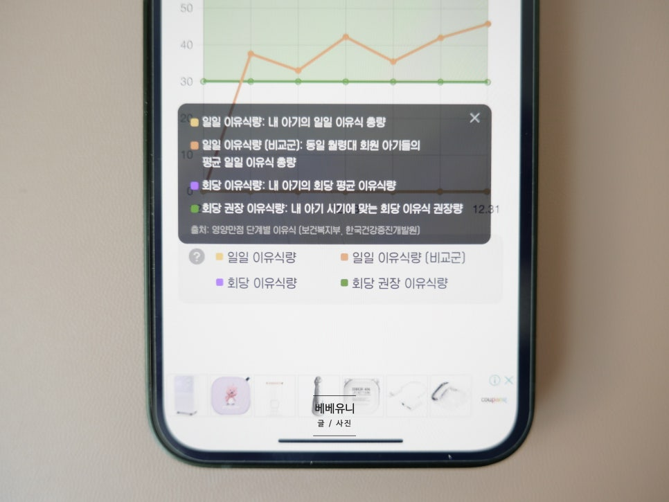
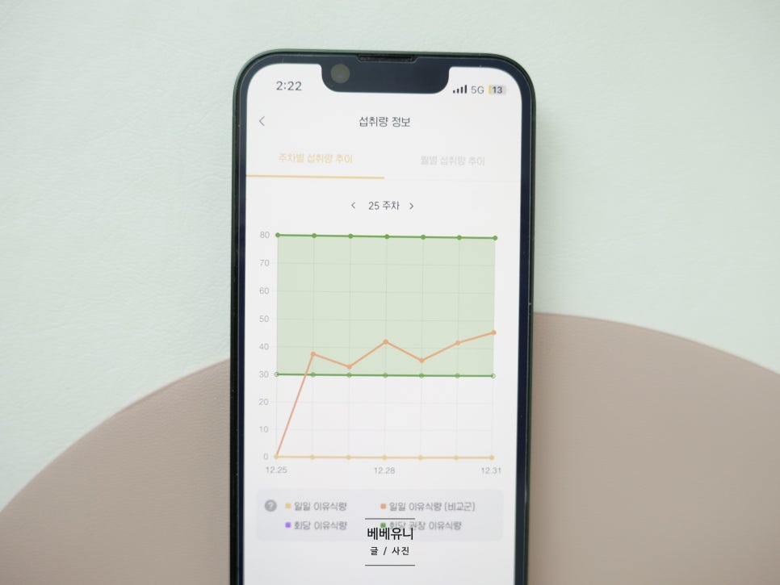
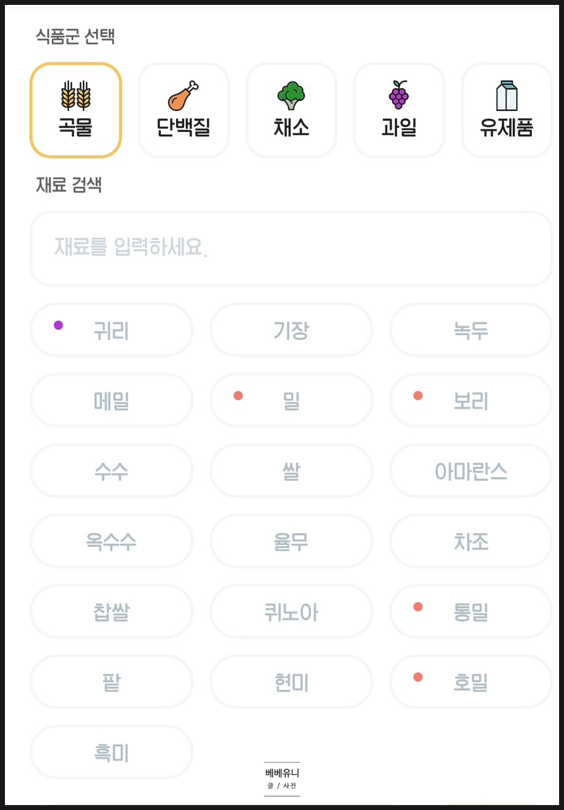
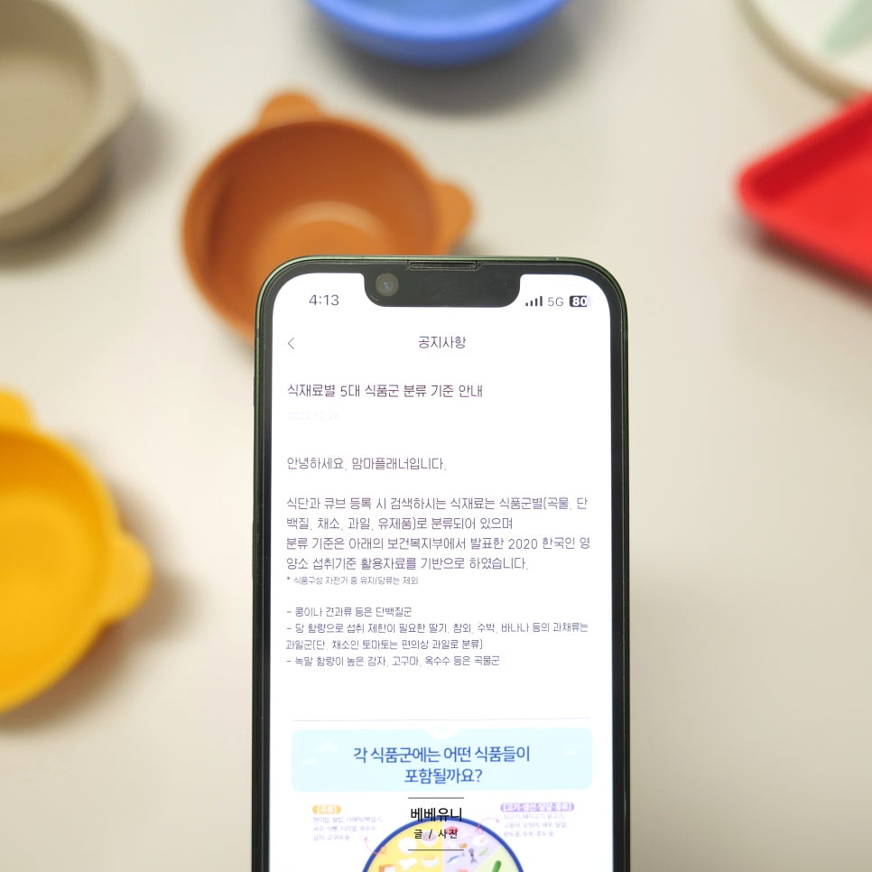

# 간단한 역기획 예시
**Date:** 10시간 전
**Category:** 일기장
**Original URL:** https://blog.naver.com/xpfkwh56/224337000780
---

​

1. 이유식 관리를 한다고 할 때,

관리 라는 것을 분해하면 뭐지?

​

1) 내가 먹이는 양

2) 다른 애들이 먹이는 양

3) 권장으로 먹이는 양

​

이렇게 3개로 구분하네

​

**\* 보건복지부 기준을 그대로 따른 듯**

**​**

내가 먹이는 양은

내가 여태 먹인 양,

​

그리고 지금 먹인 양

이렇게 나눠서

​

과거 대비, **추이**를 보네

​

그럼 이용자가,

​

교과서적 권장값,

대체로 남들이 하는 값,

​

내가 과거에 한 값,

지금 한 값

​

이렇게 4개를 볼 수 있는 구조고,

내가 하는 행위는

​

과거 내 행위, 현재 내 행위로 구분,

​

그리고 앞으로 하게 될 미래 행위는

또래 평균 + 교과서 권장값으로 가네

​

내가 얼만큼 먹이는지 알아야 겠네

그리고 여태 얼만큼 먹이나 알아야겠네

​

2. 근데 **'내가 과거에 먹인 값'** 을

어떻게 기준 삼아서 사용해야 하지?

​

단순평균? 가중평균?

분산은 몰라도 되나?

​

**\* 하루 노이즈가 전체 통계에**

**얼마나 큰 영향을 미치지?**

**​**

나는 **'다른 아이들'** 이 어떻게 먹이나

같은 데이터가 없는데 이건 어떻게 하지?

​

**\* 베이지안 추론을 쓰거나,**

**부트 스트랩을 쓰거나,**

**스모트를 쓰거나, GAN을 쓰거나,**

**표준정규분포를 따르거나,**

**다 섞거나, 일부만 쓰거나 등등**

​

월령마다 이유식 권장량이 당연히 다른데,

월령 분기가 달라질 때, 보정은 어떻게 하지?

​

​

차트에 보조 지표는 몇 개를 넣어야 하지?

같은 문제를 내 상황에 맞게 결정해야 됨

​

저는 차트가 익숙해서, 대부분 차트를 쓸 땐

이평선 같은 HTS 기능을 적극적으로 차용함

​

**\* 5/10/20/60/120 같은 개념도 자주 쓰고**

**​**

​

재료 식품군을 상위 카테고리로 묶어서

5개로 분류했고, 그 하위에 깔아놨는데

​

저 표식 색깔들은 무엇을 의미하는지,

딱 보니까 ㄱㄴㄷㄹ ㅏㅑㅓㅕ

순서로 배치한 것 같은데, 저게 최선인지

​

자주 먹이는 재료 같은 경우는,

분포, 빈도 계산해서 자동으로 위에

나오게 하는 것이 더 편하지 않나?

​

같은 생각을 해볼 수도 있을 것 같고,

​

​

분류 기준을 2020 보건복지부 통계 썼는데,

그게 최신인지, 글로벌 벤치랑 차이가 있는지

​

감자도 다 똑같은 감자가 아닌데,

이런 엣지케이스는 어떻게 다루는지?

​

같은 문제를 볼 것 같음