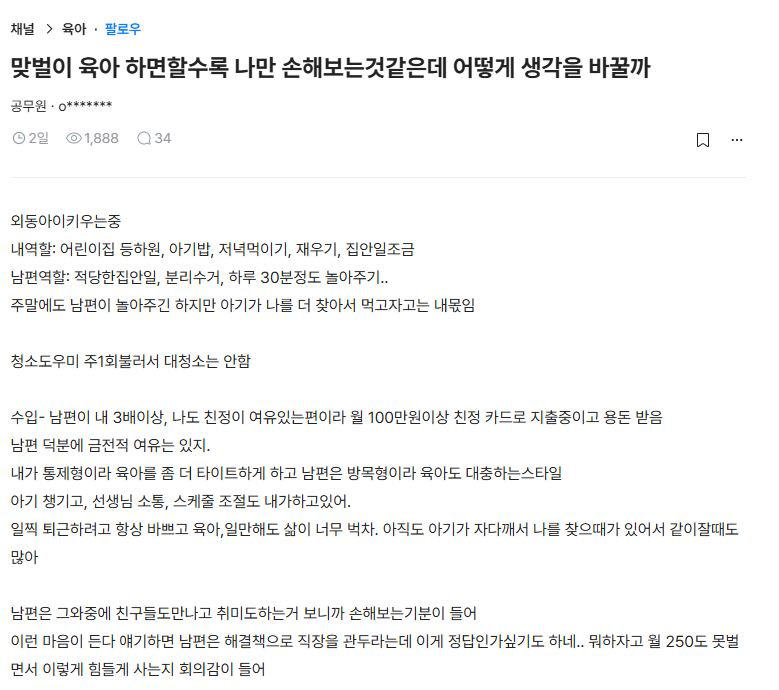
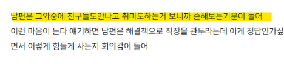

# 남편의 부실한 육아, 양육 참여 대응
**Date:** 10시간 전
**Category:** 다이어리
**Original URL:** https://blog.naver.com/xpfkwh56/224265605777
---

​

1. 본인이 전생에 거북선 조타수가

아니라면 거의 대부분 여자 입장에서

​

**'기준에 맞게 참여하는 남자'** 랑

같이 살게 될 가능성은 극히 희박

​

설거지를 해달라고 맡겨놓으면,

싱크대를 물바다로 만들어놓고

​

화장실 청소를 시켜놓으면

스퀴지 같은 것이 오토로 안 됨

​

**\* 아기를 봐달라고 하면**

**정말 아기를 see 하고 있음**

**​**

**이럴 때, 살의를 참는 것은**

**은근히 어려운 일 이었읍니다**

**​**

만약 하나씩 하나씩 가르치면서

이건 이거다, 저건 저거다 한다면

​

약간 원숭이한테 알파벳을

가르치는 것 같은 느낌을 받음

​

그럼 도달하게 되는 결론이 이거임

**​**

**'아, 이거 다르다**

**그냥 다른 것이다'**

​

통상 여자들이 기대하는

**'라이프스타일 기준값'** 과

​

남자들이 살아가는 기준값이

굉장히 큰 차이가 있다는 것을

​

**인정 하냐, 인정하지 않냐 차이** 가

살아보면 중요한 문제가 되는 듯

​

현실적인 최선은 내가 혼자서

아이를 키우고 있는 미혼모 인데,

​

참 감사하게도 남자 하나가 있어서

그 와중에 **없는 것보다는 낫다** 쯤 임

​

**\* 뭐 다른 집은 모르겠는데,**

**우리 집 같은 경우는 그러함**

​

우리집 남자는 육아 참여가 개판이네,

30분 꼴랑 놀아주고 유세를 떠네 (x)

​

→ 남자는 하고도 욕을 먹으니

할 맛이 안 나고, 악순환 들어감

​

이 남자는 누구길래,

내 아이랑 놀아주지?

​

**참 고마운 사람이다**

**​**

→ 일단, 마이너스가 없음

조금만 해도 다 + 로 인식됨

​

아닐 때보다, 신랑 동기부여에

단 1% 라도 더 도움될 수 있음

​

고쳐 쓸래도 이런 방향으로 고쳐야지

​

너는 오늘부터 주양육자다

페르소나 강제 주입해봤자,

​

주양육자가 뭐임? 먹는 것임?

이라고 반응할 확률이 더 높음

​

**2. 손해 프레임에 대해서**

**​**

일반적으로 저런 글도 그렇고,

나도 살아보니까 느낀 부분인데

​

남자들은 **'거시적'** 으로 바라봄

​

전체 사회환경 내에서 가정의

구성원이 부담하게 되는 크기를

총체적 관점에서 따진단 것임

​

그래서 나는 돈 벌어오잖아,

​

같은 맥락의 발언이 정당화 되고

실제 그 기준에선 그게 맞는 말임

​

근데 여자들은 **'두 사람의 관계적'**

측면에서 계산을 하는 것이 익숙함

​

돈 버는 것은 버는 것이고,

그래서 애는 나 혼자 만듬?

​

**나만 애미임?** 같은 시각이

​

더 마음에는 와닿을 확률이

높다고 해석해야 된단 것임

​

본문 내용대로라면, 저 여자분이

남자분 보다 소득이 3배 많았을 때

​

남자분 전업으로 집에 놔두면

과연 **'성에 차게 일처리를 할까?'**

​

개인적으로는 **무척 회의적** 임

​

돌돌이만 돌려보라고 시켜도,

남자 손이랑 여자 손이 다릅니다

​

문제의식 주체성 자체가 달라서

**'시켜야'** 된다는 것 자체도 문제구요

​

**3. 결론**

​

답은 없고 받아 ,, 들여야 ,, 됨 ,,

​

남자가 나이 먹고 에스트로겐

슬슬 나와야 해결될 문제이므로

​

​

그리고 이 부분은

개선이 필요하다고 생각

​

**\* 맞고 틀리고를 떠나서,**

**두 사람의 관계 측면에서**

**​**

만약 신랑이 나보다 더 고생을 해서

손해 보고 있다는 인지가 들어가면

​

내가 쟤보다 **'이익'** 을 보는

기분이 든다는 아닐 것 아님

​

**\* 그게 건강한 관계도 아니고**

**​**

나는 내가 하는 것이니까 얼마나

힘든지 당연히 잘 아는 것인데,

​

**나는 쟤가 아니니까 쟤가 힘든 것을**

**하나하나 다 헤아릴 수 없다**, 라고

​

생각을 하는 쪽이 **서로에게** 이로움

​

예수님, 부처님, 공자님 생각하면서

꿀 빠는 것 같지만 내가 단지 모를 뿐,

​

**너도 너 나름의 투쟁을 하고 있겠지**

라고 생각하는 쪽이 더 유리할 것임

​

누가 뭘 했네, 누가 손해를 보고 있네,

누가 이익을 누리고 있네, 로 들어가면

공동체를 유지하기 어려울 확률 높음

​

**4. 사족**

​

기혼 기준으로는 이런 이야기를 밖에다

함부로 하지 않는 것이 대개 안전한데,

​

그 이유는

​

1) 가족들한테 이야기하면 더 골치 아파짐

​

2) 남한테 얘기하면 결국 들을 얘기는

너가 참아라, 이혼 해라 둘 밖에 없음