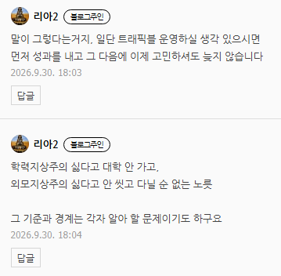
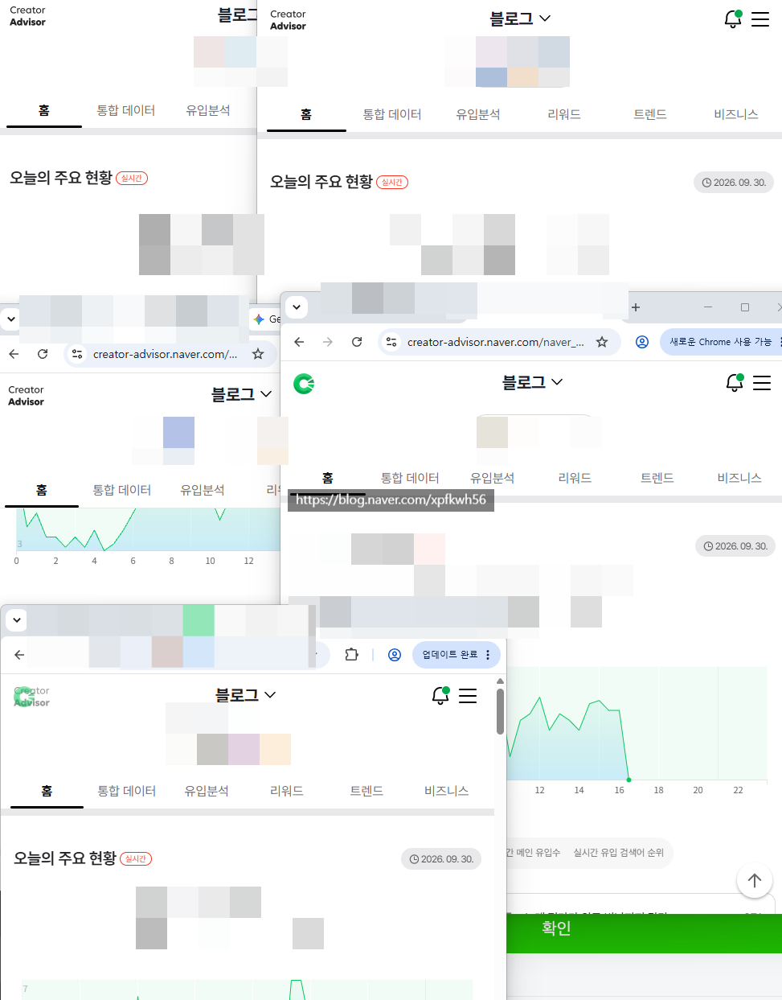

# 네이버가 쓰레기 운영을 하더라도
**Date:** 10시간 전
**Category:** 스냅
**Original URL:** https://blog.naver.com/xpfkwh56/224427337460
---

1. 나는 고고하게 내 소신을 지키겠다

​

행운이 있는가?

재능이 있는가? 판정 해보신 다음에

​

시류를 따르는 것이 더 나은지,

내 곤조 지키는 것이 나은지 보면 됨

​

​

2. 제가 권장하는 운영은,

취미블 본계를 1개 놔두시고

​

**\* 이거 없으면 트래픽 계정**

**운영하다가 정신병 걸릴 확률 ↑**

​

나머지 2개는 그냥 눈 감고

알고리즘만 쫓으세요

​

**방법 없습니다**

​

1) 인간이 죽어도 ai 발행 속도를

따라갈 수가 없구요

​

2) 검색엔진 자체가 ai 글을

확산/노출 시켜줍니다

​

​

**지금 실시간 제 서브 모니터 상태임**

​

다중 브라우저 저렇게 띄워놓고

계속 시장조사 하면서 발행하는데

**​**

**\* ai 가 벤치마크 블로그 찾고,**

**잘 되는 요소 분석하고, 재현하고,**

**테스트 베드 올린 다음 실험하고,**

**원고 퀄리티 합격권 들어오면 올림**

**​**

이걸 **무슨 수로** 사람이 따라잡읍니까?