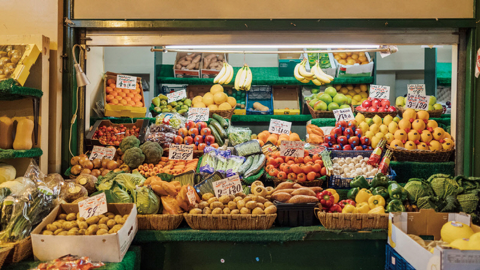

# 법률 작업의 난이도로 알아보는 토큰 논리
**Date:** 10시간 전
**Category:** 일기장
**Original URL:** https://blog.naver.com/xpfkwh56/224321769266
---

1. 법률, 의료 같은 것은 대표적 **'전문'** 작업 임

​

고차원적인 의사 결정 능력이 필요하고,

**'판단'** 을 내리는 역량이 매우 매우 중요

​

좋은 법률가, 좋은 의료인이 육성 되려면

생애 전체에서 **최소 10년** 정도 필요하고,

​

우리가 세상에서 만나는 많은 전문가들은

실제로 그 과정을 전부 **'이수'** 한 사람들임

​

2. 그럼에도 불구하고, 우린 서비스를 쓸 때

만족하는 경우보다 만족하지 않는 경우가 많고,

​

경우에 따라 일부를 **'돌팔이'** 라고 느끼곤 함

​

왜 그런 문제가 생길까?

​

1) 우선적으로 실력을 **'보는 것'** 도 실력 임

​

내가 아는 것이 없으면 저 사람이 일을

제대로 했는지, 대충 뭉갰는지 판단 안 됨

​

2) 여기가 **'진짜'** 인데,

​

**'비싼 작업'** 과 **'싼 작업'** 의 차이가 있음

​

3. 프로페셔널 작업의 단가 차이

​

**형사도, 민사도 아주 엄밀히 들어가면**

**본인 혼자서 수행해도 문제가 안 됨**

​

내가 내 재판을 조력 없이 혼자 하겠다

라고 **'아주 강하게 어필'** 한다면,

​

일부 특수한 경우 제외하고

본인이 혼자 해낼 수 있는데,

​

재판 진행의 심판 역할을 하는 판사가

이거를 **부담스럽게** 느낄 확률이 높음

​

4. 재판에 필요한 이야기를, 상식과

사리에 맞게 정리해서 이해할 수 있게

만들어와야 그걸 읽고 판단을 하는데

​

냅다 던져만 놓고, 알아서 하세요 하면

​

안 읽을 수도 없고, 그렇다고 읽어봤자

요지를 모르겠으니 재판이 늘어지게 됨

​

법률적 이해도가 굉장히 낮은 일반인이

본인 나름대로 어디서 무언가 주워듣고

​

**2천페이지, 4천페이지씩 자료를 던지면?**

​

판사 또한 **'그거만'** 하는 사람이 아니라서,

원활하게 재판을 진행하는 것이 어렵고

​

**\* 심판을 하는데, 옵사이드 휘슬 불었더니**

**옵사이드가 뭔데요? 하면 가슴이 답답해짐**

​

누군가는 이걸 붙어서 **'대신'** 해줘야 함

​

5. 즉, **'전문성의 실력'** 개념이

서로 다르게 적용되는 일이 생김

​

좋은 법률가로 훈련 받는 과정에서,

​

영업이나 클라이언트 대응 능력 등은

상대적으로 큰 비중을 갖지 않게 됨

​

이건 **'하면서 느끼고, 익히는 것'** 임

​

다른 사업이 그렇듯, 100명 고객이 와도

그 100명이 다 '수월한 사람' 이면 쉽고,

​

빌런 5명만 잡혀도, 심지어 1명만 걸려도

그 빌런이 주는 부담의 크기가 **크다면**,

​

**이땐 판사, 검사, 변호사가 그 앞에**

**거의 자기 인생을 바쳐야 될 수 있음**

​

이 작업은 **초단순 노가다** 로

부가가치가 높지도, 경우에 따라서는

​

**사실 법률가가 아니어도 할 수 있는데**

​

또 그렇다고 아예 법률 자체를 모르면

의미 없는 데이터만 가져와버리기 때문에

​

시장에서는 **'미묘한'** 지위를 갖게 됨

​

6. **'증거'** 를 수집하는 단계라고 침

​

증거, 는 **'일반어'** 이기도 하고

**'법률어'** 이기도 함

​

100% 완전한 증거를 싸그리 다 가져와,

완벽한 **'사건의 실체'** 가 보기 좋게 정리돼

​

**'판단'** 만 하면 되는 상황이라고 가정함

​

법률가의 **'실력'** 차이가 있을 수 있을까?

​

상향 평준화가 **'충분한 레벨'** 이기 때문에

누가 해도 거의 비슷한 결과가 나올 확률 큼

​

**'수식'** 만 나오면, **'계산기'** 만 사용해도

객관적인 결과가 나오는 것과 같은 것 임

​

근데 수식은 커녕, **'문제 자체도'**

정확하게 마무리가 안 된 상태라면

​

그걸 **'누군가'** 는 해야 하고,

이건 중요한 일이지만 **값이 쌈**

​

**값은 싼데, 일은 어려우니까 할 사람이 없고**

**비용의 문제와 다른 차원으로 가게 되는 편** 임

​

7. 본인이 경찰서 뛰어들어가서 경찰 팼음

​

이건 김앤장이 들어가든, 지식in 좋문가가 하든

단순히 n월 n일 피고 갑이 피해자 경감 을 을

​

가서 주먹으로 뚜드려 팼다 자체가 안 바뀌면

**'어지간하면'** 결과가 달라질 수가 없는 사건 임

​

알고보니, **가서 팬 적이 없다**

정도로 크게 달라지지 않다면 말임

​

**백개, 천개, 만개, 십만개의 사건으로 보면**

​

또라이 하나가 경찰서 뛰어들어가서

대뜸 경찰을 뚜드려 패는 사건이라 칠 때,

​

그게 **'사실 레벨'** 부터 다시 조사해야 되는

그런 사건이 현실적으로 그리 흔하지 않음

​

그래서 당연히 **'관행'** 을 따르게 됨

​

8. 그럼 **'내'** 사건 이면 어떻게 해야 될까?

​

**'찾아내야 됨'**

​

누가? **'내가'**

​

어떻게? **'법률적 판단을 할 수 있게'**

​

AI 를 사용하는 것도 똑같음

​

아무리 복잡한 계산도 **'식'** 이 같으면

그 결과에는 차이가 있을 확률이 낮음

​

하지만 **'식'** 자체가 달라지는 경우,

​

결과도 당연히 차이가 있기 때문에

토큰을 **'식'** 을 세우는 것에 써야 됨

​

9. 그럼 AI 가 스스로 식을 세울 수 있느냐?

​

**안 됨**

​

1+1=2 는 풀 수 있어도,

사과 1개랑 오렌지 1개 있다

​

과일은 몇 개 인가?

​

수박 2개랑, 오이 1개랑

토마토 5개가 있다

​

과일은 몇 개 인가?

​

같은 것은 **'풀기 아주 어려워'** 함

​

​

위 이미지에서 과일을 찾아라

같은 문제는 특히 **'불가능'** 문제 임

​

이건 **'해봐야'** 아는 것이라 그럼

​

사람이 전처리 과정으로 데이터를 정제하고,

조명을 받아 빛나고 있는 바나나를

​

3개, 5개, 4개, 3개 묶음으로 있다

바나나는 상단 1열에 15개 있다

​

라고 **'정의'** 해줘야 답이 나옴

​

10. 인공지능 문제에서 어려운 것은

​

3+5+4+3 = ?, 이게 아니고

​

**'바나나'** 를 어떤 범주에 묶을 것인가

그리고 어떤 문제를 **'풀어야 되는가'** 임

​

하지만 냅다 사진 던져놓고,

바나나 몇 개?

​

해서 나오는 답을 믿고,

**틀리면 또 돌림**

​

그리고 말함

​

토큰이 많이 필요하다

인공지능 성능이 나쁘다

​

이 바닥에는 미친놈들이 워낙 많아서,

심지어 **'저걸 되게끔 만들기도'** 하는데

​

**\* 특히 중국이 이걸 매우매우 잘 함**

​

기다릴 시간이 없다면 본인이 깎아야 됨