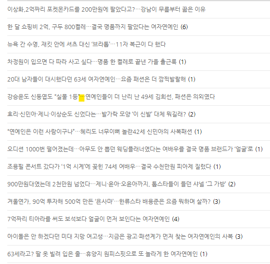

# 벤치마킹
**Date:** 10시간 전
**Category:** 스냅
**Original URL:** https://blog.naver.com/xpfkwh56/224413950293
---

<https://blog.naver.com/indulge72>

[**Madame Riche : 네이버 블로그**

성의 없는 서이추는 거절입니다.

blog.naver.com](https://blog.naver.com/indulge72)

​

강의나, 방법, 이런 것을 배울 것이 아니고

먼저 **'교재'** 로 삼을 수 있는 걸 찾아야 됨

​

그럼 그걸 어떻게 찾느냐?

그냥 블로그를 **'쥰내 열심히 해야 됨'**

​

1) 먼저 해당 카테고리, 소재군에 관해서

대기업 블로그를 **최대한 싹 모니터링** 함

​

특히 주목할 지점이, 공감 찍거나

댓글 달거나 하는 사람들 인데

​

글 안 쓰고 있는 **알계정** 들 있음

​

그 사람들이 구독 하고 있는 이웃을

잘 보면 **'실수요'** 를 볼 수 있음

​

이 과정으로 해당 카테고리 사용자들이

**'어떤 관습'** 으로 콘텐츠를 소비하고 있나,

​

같은 것을 포착하는 것이 가능함

​

2) 대략적으로 고인물 블로그 들이나,

도메인 문법에 대해 알 것 같은 느낌이 들면

**'신규'** 블로그들을 열심히 발굴하면 됨

​

발행한 글이 그렇게 많지 않고,

인플/피드메이커/메이트 도 아닌데

​

트래픽이 높게 형성 되는 곳들은

기본적으로 후보군에 넣어둠을 권함

​

약간 내가 **'캐스팅 디렉터'** 가 된 것처럼

이 블로그는 흥할 것 같은데? 팔릴 듯 한데?

싶은 곳이 있으면 싹 넣어놓고, today 추적

​

**\* 이게 굉장히 어렵습니다**

​

3) 그리고 최근에 갑자기 떠오르기 시작한,

라이징 블라거들이 있으면 그거도 찾아 둬야됨

​

이 작업이 끝나면 여기서 **'성공한 케이스'** 를

분류해서 무엇이 왜 사람들에게 팔렸는가?

​

를 정밀하게 파악하고, 요소 단위로 나눠서

시험 공부할 때, **기출 문제 분석** 하는 것처럼

​

**발문, 지문, 선지, 해설 다 뜯어서 분석을 함**

​

해보기 전까진 아무도 모르니까,

이 작업을 하면 **'가설'** 을 세울 수 있음

​

가설에 맞게 포스팅, 그리고 가설 부합하면

그걸 하나의 **'케이스'** 로 분류하고

​

패킷 단위로 쪼개서 LLM 로 생성할 수 있는지

A/B 테스트 돌리고, 신뢰 범위 내에서 나오면

​

파이프라인에 대입해서 돌리면 됨

​

해당 블로그의 경우, 글이 100개도 안 됨

​

이웃 86에, 오늘 투데이 8천 찍혔는데

8월 계정이고 9월부터 운영하기 시작함

​

​

물론 아닐 수도 있지만, 제목에

AI 의 흔적이 살짝 보임

​

'…' 보다는 ... 이 네이티브 표현이므로

​

그리고 원문 원고에 보면 글자 끝에,

온점 문장 부호를 **기계적으로** 넣고 있고,

​

출처가 들어가있는데, 이미지 밑에

입력 칸에 들어간게 아니라 원문에 빠짐

​

아마? 렌더링 과정에서의 문제로 보임

​

**\* 커서 입력은 어려워서, 이미지 → som**

**같은 매커니즘을 따라야 되는데 꽤 복잡함**

**​**

요약문이랑, 감상이 반복적으로 돌아가는 것도

물론 인간의 습관일 수 있지만 LLM 패턴 중 하나

​

프론티어를 사용해서,

프롬프트로 뽑은 걸로 보임

​

**지피티 초안에 사람 수정** 으로 보이네요

​

키워드 분석을 해보십시다

​

패션, 연예인, 여자, 명품, 샤넬, 가방,

결국, 이번, 대신, 정체, 요즘

​

글자수는 1-2천자, 이미지는 10개 내외

​

통상 2천자 정도 작성하면 3분 전후고,

1천자 작성하면 2분 왔다갔다 나옵니다

​

최초로 터진 글은 9월 3일 기준 글이고,

그 이후로 알고리즘 정렬이 잡혔고

​

전도연, 김준희 글이 견인하고 있네요

​

블로그에 있는 글을, 비로그인 계정으로

싹 클릭하고, 시크릿 크롬에서 모바일 환경에

어떤 알고리즘이 잡히는지 보면

​

이 블로그랑 연관해서 잡히는 모델들 나옴

​

위 방식대로 계-속 노가다 하면서 찾으면 되고,

잉공지능 도움 받으면 조금 더 편하게 갈 수 있음