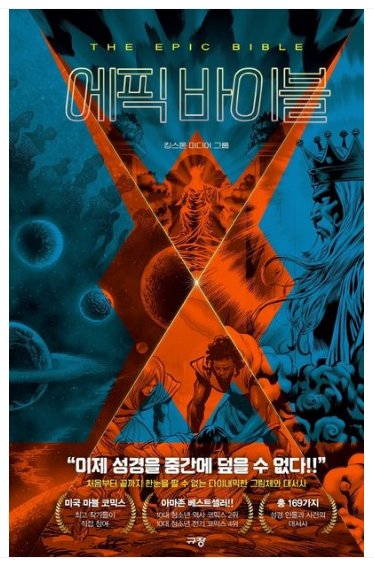
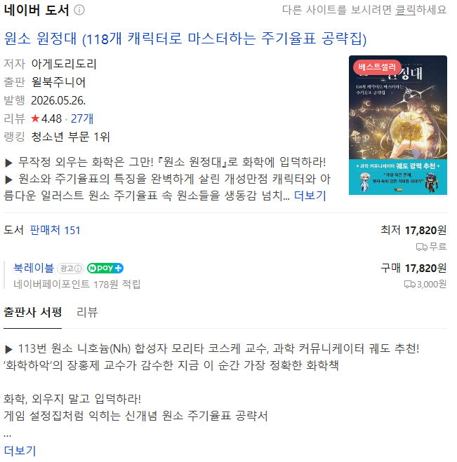

# 유튜브 무료 강의들로 애들 가르치기 좋을 것임
**Date:** 10시간 전
**Category:** 일기장
**Original URL:** https://blog.naver.com/xpfkwh56/224377429349
---

<https://www.youtube.com/watch?v=o-SEPXJZii0&list=PL5jXit9M62myGVrd9ClCHvgJYNwowI4gd>

<https://youtu.be/M8qiXo-Hn08?si=QbE8YVcXexE0pomL>

​

이런 식으로, 비교적 **'긴'** 강의들 있는데

​

**\* 유튜브도 번잡하면 EBS 보면 되고**

**​**

처음부터 끝까지 **'1번'** 은 본 다음에

세부적으로 들어가면 배우기 더 쉬움

​

**\* 교육은 무료 콘텐츠가 상당히 많고,**

**똑같은 범위도 강사마다 설명 방식이나**

**차이가 있어서 보다 보면 더 많이 보임**

**​**

처음부터 강의형으로 가기 딱딱하면,

​

재밌는 유튜브 영상으로 일단 **'바르고'**,

​

김시백 역사 만화나,

​

​

눈에 딱딱 꽂히는 이런 만화,

​

**\* 그리스 로마신화/기독교는**

**서구 문명 이해에 많이 도움 됨**

**​**

​

아예 대놓고 재밌으라고 만든 걸로

**'운'** 을 틔우는 것도 방법일 듯

​

꼭 **'교육'** 이라는 족쇄에 묶일 것 없이,

​

원나블이나, 페이트, 진격거, 귀멸처럼

방대한 세계관을 가진 네러티브 자체가

​

지적 자극에 일정 도움이 될 수도 있음

​

특히, 언어는 문화 콘텐츠로

배우는 것이 왕도 아닐까 싶음 ,,