# 인간의 능력 차이가 정말 존재할까?
**Date:** 10시간 전
**Category:** 다이어리
**Original URL:** https://blog.naver.com/xpfkwh56/224301684926
---

1. 1호기가 점점 걷기 시작하면서

키우던 강아지들을 집에 다시 들였음

​

저는 시츄를 키우고 있고,

추정 지능은 **'2세'** 정도 임

​

본인의 이름을 알고, 대/소변을 가릴 수 있고

먹을 것과 먹으면 안 되는 것을 구분 가능함

​

1호기와 비교하면 **'터무니 없이'** 똑똑함

​

2. 제가 1호기의 **'언어'** 에 목마른 이유는

말을 하고 부터가 **인간** 이라고 생각해서 임

​

언어가 있어야, **'기억'** 을 할 수 있고

**'기억'** 을 바탕으로 **'사고'** 를 할 수 있음

​

즉 러프한 표현이지만

생각을 할 수 있을 때 부터

​

**'인간'** 이라는 것임

​

**3. 사람 능력 다 거기서 거기 라는 이유**

​

제가 여럿 퍼포먼스를 보이거나,

**'제 관점'** 에서 적는 것들을 보면

​

다 신기하고 새롭게 느껴지실 수 있음

​

쟤는 어떻게 저렇지? 라고 여길 수도 있고,

​

심지어는 **'나도 저렇게 되고 싶다'**

라고 생각을 하는 경우도 최소한 제가

댓글로는 꽤 자주 봤던 적이 있음

​

4. 제가 늘 거기에 다는 답변은 똑같음

​

1) 우리가 같은 호모 사피엔스 종이라면

선생님과 저의 능력 차이는 **'거의'** 없다

​

있다고 해도 유의미한 정도가 아닐 것이다

​

2) 누군가가 **'되려고'** 하지 마라

​

**이해** 와 가장 멀리 있는 감정이 **동경** 이다

​

[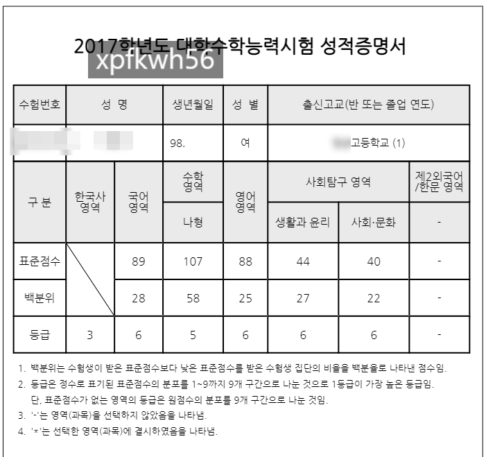](#)

​

5. **제 수능 성적표** 임

​

저에 대한 **'아무런'** 컨텍스트 없이,

딱 저 성적표 들고 학업 능력을 말하라

​

하면 무엇이라고 말씀 하시겠음?

​

국어 6등급 = 얘 글자 읽기가 어렵네

나형 5등급 = 수학 하나도 모르네

영어 6등급 = 알파벳 정도 읽을 수 있네

​

생윤 6등급 = 친구 따라 과목 골랐나 보네

사문 6등급 = 친구 따라 과목 골랐나 보네2

​

한국사 3등급 = 공부 열심히 안 했나보네

​

이게 **'일반적인'** 해석 임

​

[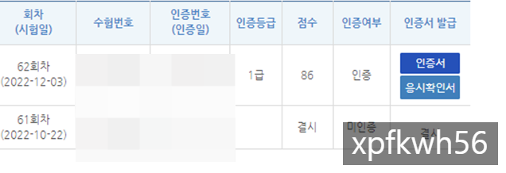](#)

​

이건 제 한국사 능력시험 성적표 임

​

아마 시험을 쳐보신 분들은 아시겠지만,

적어도 62회차 기준 **86점** 나올 시험 아님

​

[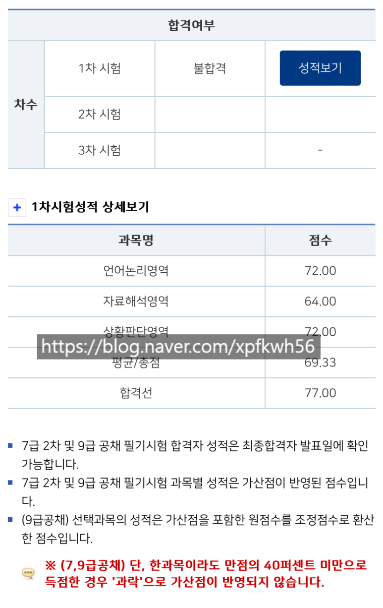](#)

​

이건 제 **피셋 성적표** 고,

​

[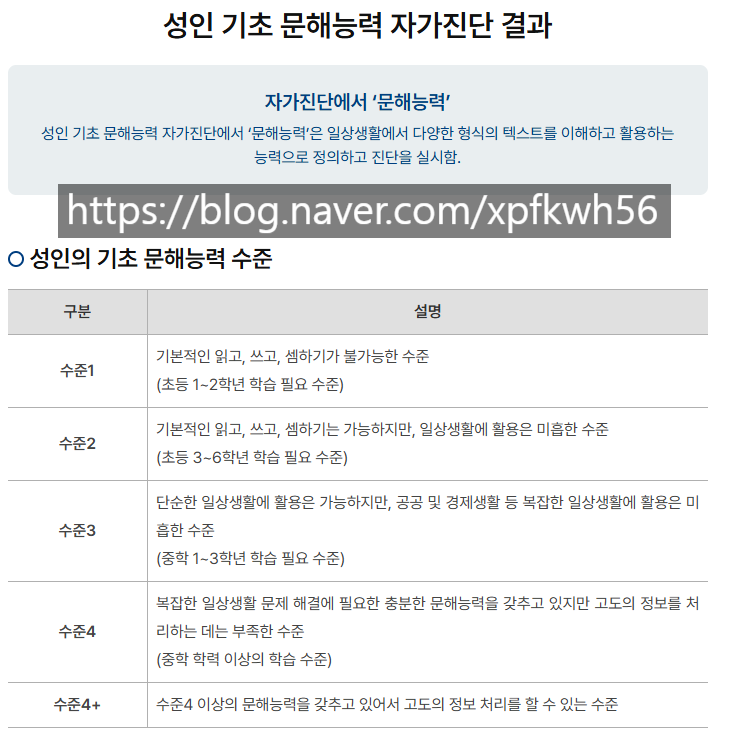](#)

[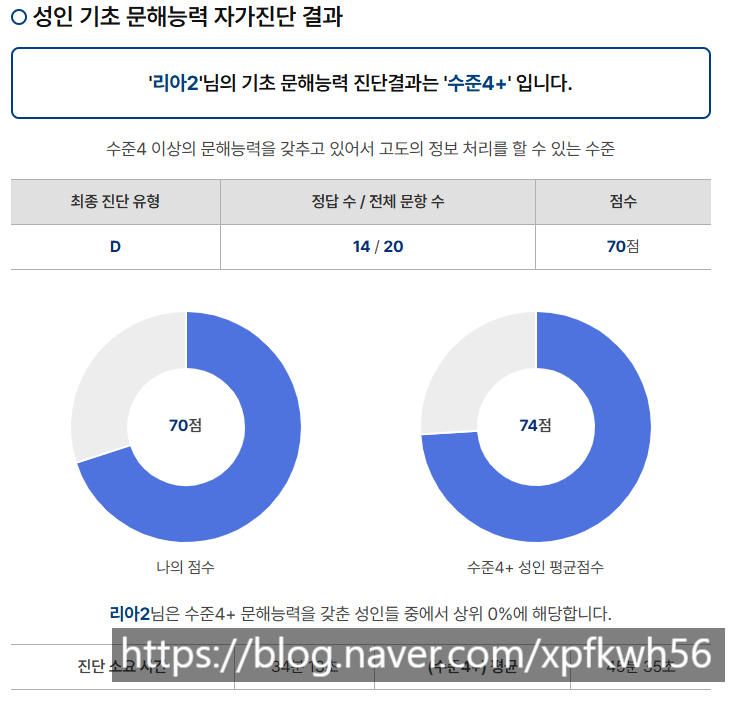](#)

[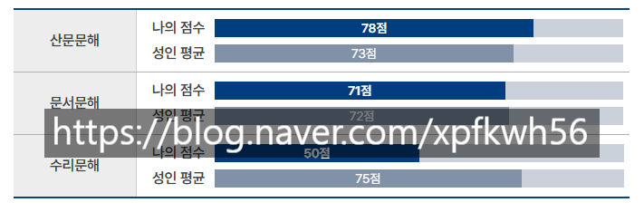](#)

​

이건 제일 최근에 쳤던

**기초 문해능력 진단 결과** 임

​

저는 **'토플'** 은 고득점 이었지만

​

**'토익'** 은 성향이 달라

**'할 맛'** 이 안 났음

​

당장 글을 못 찾겠는데,

​

아마? 토익 준비한다는 글이

잘 찾아보면 있었을 것임

​

[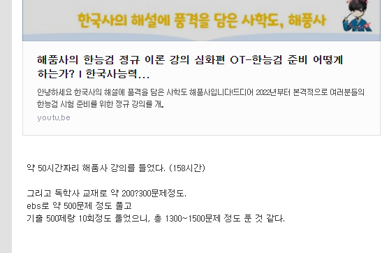](#)

https://blog.naver.com/xpfkwh56/222892928640

​

22년 말에 썼던 일기고,

​

**\* 23년 4월 이전엔**

**비공개로 메모만 했음**

​

[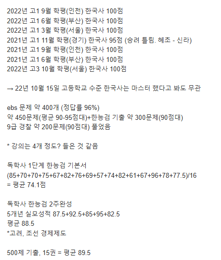](#)

https://blog.naver.com/xpfkwh56/222897008268

​

비슷한 시기에 공부했던 것을 기록한 것 임

​

저러고 시험 가서 86점 맞아왔음

​

피셋도 정확하진 않지만

100강? 정도 들었을 것임

​

문제도 많이 풀었고

​

6. 통상 사람이 머리가 좋다, 라고 할 때

아이큐 라는 지표를 많이 사용한다고 알음

​

근데 저는 아이큐를 **'잴'** 필요도 없었음

​

내가 **'여태 뭘 했나'** 잘 알기 때문 임

​

그리고 높으면 어쩔 것이고,

낮으면 어쩔 것임?

​

피차 모르면 익혀야 하고, 할 수 없었으면

하게 만들어야 된다는 입장은 **'똑같음'**

​

[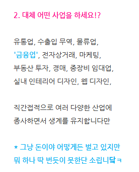](#)

https://blog.naver.com/xpfkwh56/223100551211

​

제가 직/간접적으로 종사했던 **'업종'** 임

​

[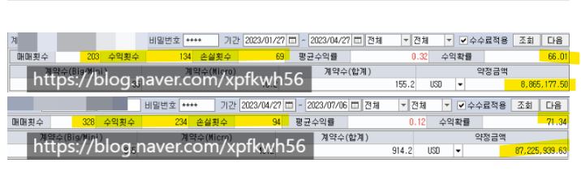](#)

​

**오일 레코드** 임

​

​

몰빵, 고레버, 운 좋게 하루 벌어서

홀딩 잡고 10억 가까이 번 것이 아님

​

**\* 올려치기 좀 해서**

**​**

[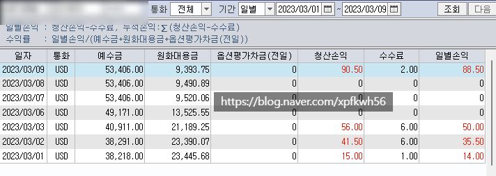](#)

[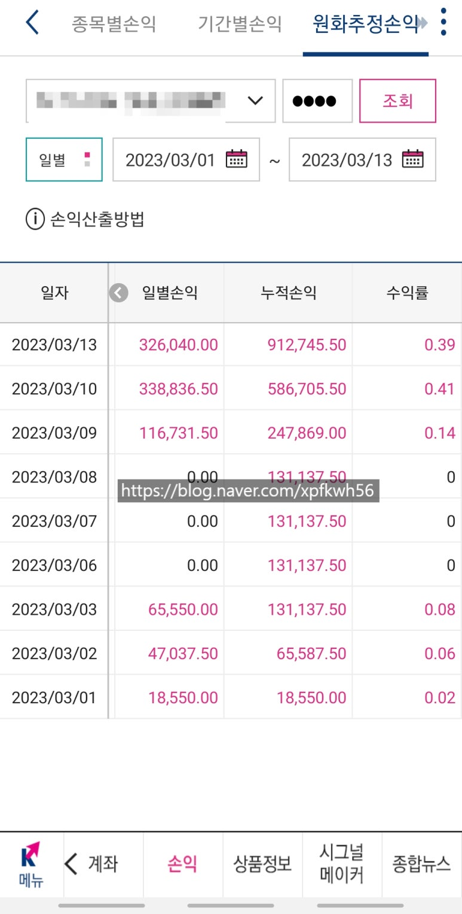](#)

[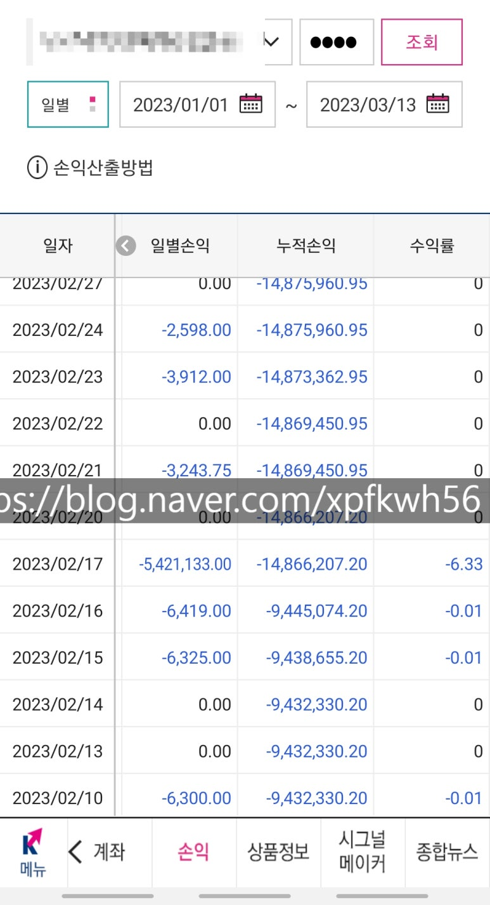](#)

[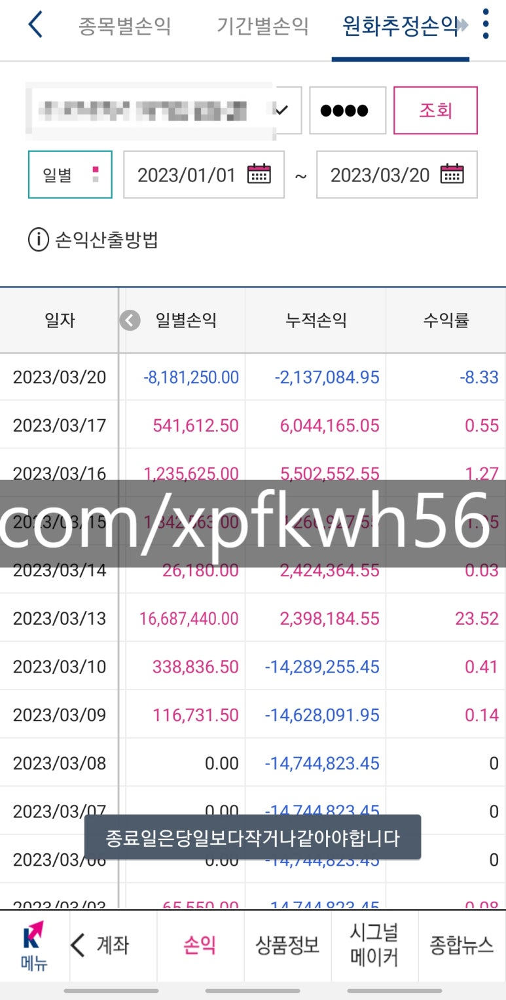](#)

[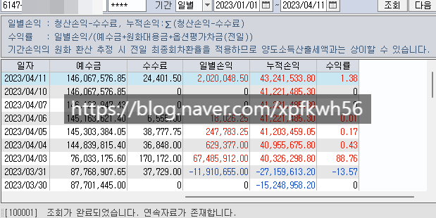](#)

[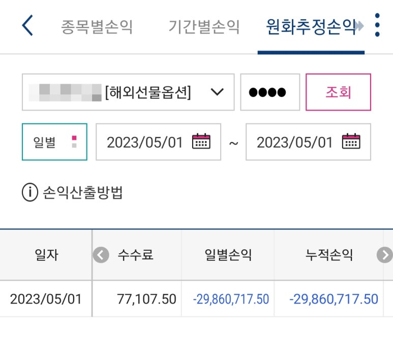](#)

[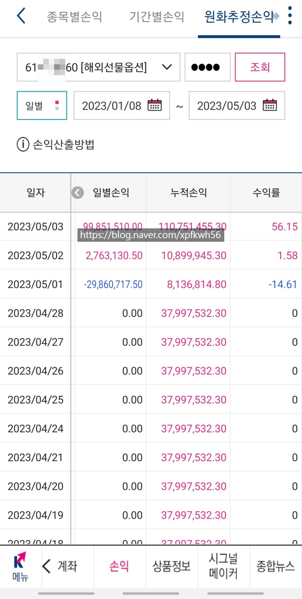](#)

<https://blog.naver.com/xpfkwh56/223119036284>

[**해외선물 평가수익 3천만**

나는 ,, 오늘도 ,, 포토샵을 ,, 한ㄷ ,,

blog.naver.com](https://blog.naver.com/xpfkwh56/223119036284)

[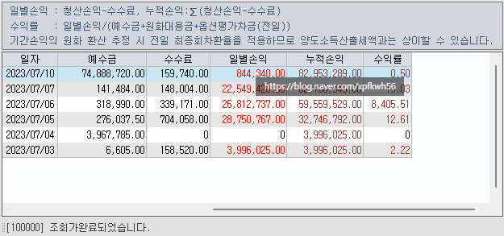](#)

[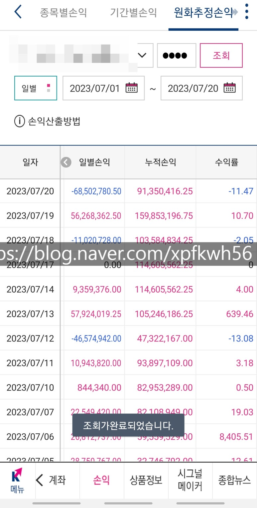](#)

[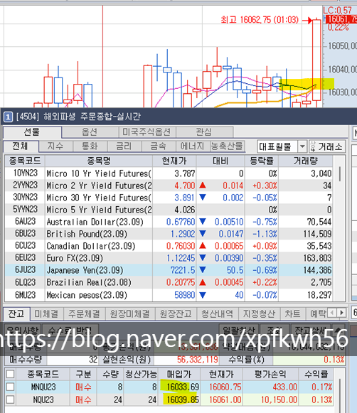](#)

[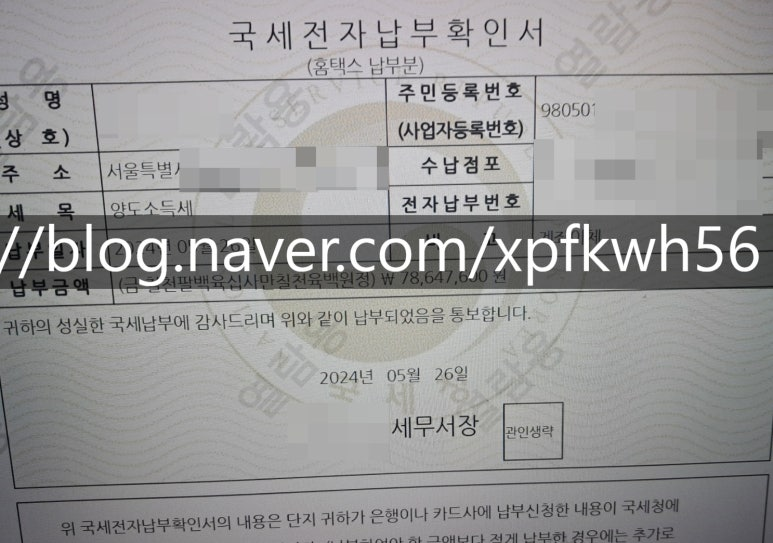](#)

​

7. 사업 성과도 처음부터 잘한 것이 아님

​

비즈니스 시스템 하나가 **안정화** 되려면

아무리 본인이 특출난 재능을 가졌어도,

​

**'최소'** 10개 정도는 기획이 자빠지게 됨

​

당연히 대충 아이디어만 낸 것도 아니고,

​

돈도 들고 시간도 들고, 노-오력도 들고

있는 힘껏 최선을 다 한 것이 10개 정도

​

아무렇지도 않게 자빠져야 1개가

**'간신히'** 될까, 말까 하는 일이 생김

​

**8. 사람마다 본인이 아는 각자 재주가 있음**

​

저는 어떤 분야에 최상위 0.001%

이럴 인간도 아니고, 그릇도 안 됨

​

**그럼 내가 잘 하는 것이 무엇이냐?**

​

저는 상위 20%? 구간 정도를

정말 빠르게 닿는 재주가 있음

**​**

**\* 나랑 잘 맞는 분야 에 한정해서**

​

내가 잘할 수 있을 것 같은 100개를 시도하고,

거기서 **'대략'** 상위 구간에 진입한 다음에

​

메이저 **'각'** 이 나오나, 안 나오나,

이건 내 **'재능'** 으로 되나, 안 되나,

​

세상이 지금 나를 돕고 있나, 안 돕고 있나,

**'행운'** 이 지금 내 편인가? 남의 편인가?

​

판단하고 누울 자리, 뻗을 자리를 보는 것 임

​

요즘 에야 엄마라는 제 신분 이슈도 있고,

노름에 재미가 없어져서 관심이 전혀 없지만

​

블라그 글 잘 찾아보시면,

제가 **'경마장'** 다닌 얘기도 있음

​

[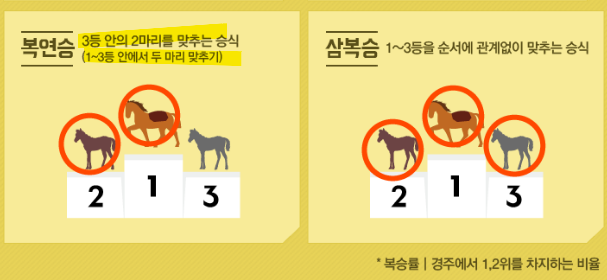](#)

​

경마에는 **'복연승'** 이라는 것이 있는데,

이미지에 보이는 것처럼

​

3등 안에 들어오는 2마리를 맞추는 것 임

​

당연히 1등 1마리 맞추는 것보다

훨씬 **'확률적으로'** 쉽기 때문에,

​

배당이 낮지만 그만큼 **'리스크'** 가 적음

​

> 1등을 맞추기 vs 대충 상위 10% 맞추기

​

어!?

​

[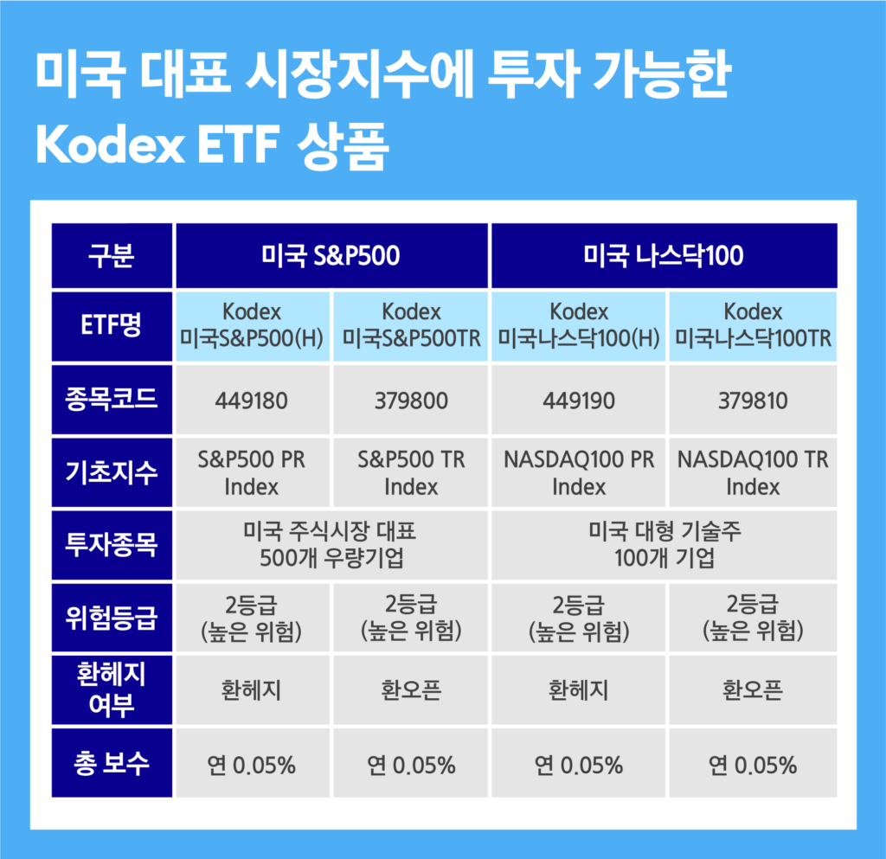](#)

​

개별주 vs 섹터 인덱스

​

**1) 구조가 똑같다?**

**2) 어떤 디테일한 차이가 있지?**

​

로 질문을 **'재정의'** 하고 갈 수 있음

​

9. 저는 **'빨리'** 배우는

재주가 있는 것이 아니고,

​

**'아는 것'** 을 계속 써먹는 쪽 임

​

사과 1개 + 사과 1개 = 사과 2개

오렌지 1개 + 오렌지 1개 = 오렌지 2개

​

사과는 1개씩 더하면 사과 2개가 된다

오렌지는 1개씩 더하면 오렌지 2개가 된다

​

이렇게 외워서는 세상 일이 **끝이 없음**

​

밥그릇은 누구나 공짜로 먹는 것이 아니므로,

분명 각자가 지니고 있는 **'나'** 들이 있으실 것임

​

그걸 꺼내고, **'나'** 로 살면 됨

​

사람이 자기 인생의 주인이 되어버리면

그 고점이 어디까지 갈 줄은 **아무도 모름**

**​**

그럼에도 안타까운 점 하나를 꼽자면

우리가 절대 할 수 없는 일이 있는데,

**​**

**'물리적인 한계'** 는 깰 수가 없음

​

키가 150cm 로 태어났다?

​

그럼 본인이 진짜 **'천재'** 가 아니라면

NBA 1부 선수로 뛰기는 거의 불가능 함

​

나는 태생적으로 신체 어디가 안 좋다?

그럼 그런 제약은 **'어쩔 수가 없는 것'** 임

​

**\* 먹으면 다 토하는 사람이 먹방 못하듯**

​

만약 내가 남자라면 **'어쨌든'** 임신 못 함

만약 내가 여자라면 **'어쨌든'** 임신 못 시킴

​

근데 내가 남자로 태어나서, 임신을 못 하네

여자는 좋겠다, 라는 **'사유'** 속 에서도

​

그럼 **'수태'** 의 근원은 무엇일까? 라고

​

**'물음'** 할 수 있으면 그리고

운이 좋게 그게 나의 **'영역'** 이라면

​

인공 자궁을 만들어보겠다,

같은 열망을 가질 수도 있음

​

인간이 지향하는 지점은 거기 라고 생각함

​

인간의 능력 차이가 정말 존재하는가?

​

있다 (x)

없다 (x)

​

행운과 재능에 달려있다

​

**있다고 아니고, 없다도 아니다**

**​**

신념 이라는 칼이 인간으로 하여금

불가능 을 베어낼 수 있게 만드는 법 임

​

그렇게 믿을 수 있는 본인의 체계를

남이랑 똑같든, 아니든,

​

**내가 나의 주인으로**

꺼낼 수 있어야 된다고

​

저는 **'믿고 사는 사람'** 임

​

**'있다도 아니고, 없다도 아니다'** 가

​

**'내 신념'** 이지 모방의

대상이 아니다 라는 말이자,

​

경우에 따라선 남이 답을 내릴 수 있는

**'기회'** 를 빼앗는 경우도 있다 는

친절한 설명을 드물게 곁들여 봅니다