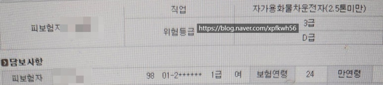
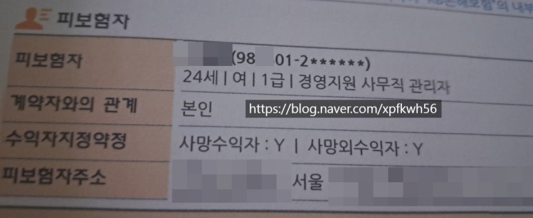

# 취준, 코로나 시절
**Date:** 10시간 전
**Category:** 다이어리
**Original URL:** https://blog.naver.com/xpfkwh56/224272421690
---

1. 코로나 사태로 위축된 소비 활동은

다양한 형태로 나타나기 시작했고,

​

그로 인해, 반사적인 이익을

거두는 시장들이 몇 가지 있었다

​

2. 인테리어 회사 라고 하면,

크게 두 가지 회사로 볼 수 있다

​

하나는 공간 디자인, 그러니까

**'모양'** 을 그려주는 경우가 있고

​

또 하나는 일종의 **턴키** 형태로,

설계부터 시공까지 싸그리 잡아

**​**

**'공간'** 을 만들어주는 경우가 그렇다

​

전자의 경우, **'근사하지만'**

아주 뛰어난 능력자가 아닌 이상

​

디자인 **'만'** 해서 밥 먹고 살기는

현실적으로 많은 어려움이 있어,

​

실상 디자인 회사라고 해도,

​

실무적으로는 시공사와 연결해

협업하는 구조를 갖는 경우가 잦다

​

3. 내가 다녔던 회사도 그랬는데,

​

취업 전, 회사를 연결해주던 선생님이

몇 개 정도의 리스트를 내게 주셨고,

​

당시 나는 내가 일하게 될 회사가

어떻게 돈을 벌고, 어떻게 내게 이제

급여를 주겠다는 것인지 **궁금** 했었다

​

가만히 내 미래를 그려봤다,

**'나는'** 취업을 하면 관둘 생각이 없다

​

하지만 사측에서 문제가 생기거나,

​

혹여 내가 직장을 더 이상 계속해서

다닐 수 없는 상황이 된다면, 추가적으로

근속해서 얻을 수 있는 수당도 못 받고,

​

**'공백기'** 같은 최악의 경우가 나타나면

더 이상 생활을 존속할 수도 없다 여겼다

​

4. 다른 여느 지망생들이 그랬던 것처럼,

나 또한 **'당연히'** 홍대를 지망 했었는데

​

후순위로 원했던 쪽은 ☆ 이라는

특정한 포지션이 있던 ☆ 쪽 이었다

​

고쓰리가 알아봤자, 뭘 얼마나 알겠냐만

​

수험생들이 있는 인터넷 카페나

학교에서 제공하는 한적한 정보들로

​

☆ 미대가 특정 도메인으로 대표되는

브랜드가 있다는 것은 솔깃한 얘기였구,

​

지금 생각하면 순수 예술 자체가, 여유 넘치는

아해가 취집 스펙으로나 갖기 좋은 전공인데

​

☆ 아니면 ☆ 갈 것임

이라는 것이 내 **답정너** 상태였다

​

5. 당시 내게 필요한 것은 허울이 아니라,

실제 내가 거머쥘 수 있는 실익 이었다

​

A 사의 경우, 중소 치고 회사는 컸지만

궤적에서 빗긴 사람이 나만 있는 것은 아닐 터,

하는 일은 근사하지만 실속이 없을 것 같았고,

​

B 사의 경우, 조건만 보면 제일 좋지만

실질적인 업무에서 배제될 확률이 높았다

​

이 경우, 우리는 이런 사람도 뽑아 쓴다

정도로 나를 상징적으로 소비할 것 같았다

​

그렇게 추리다, C 사 정도가 눈에 익혔고

이 회사의 비즈니스에 대해 조사를 했다

​

맥도날드 는 글로벌 프랜차이즈로,

표준화된 메뉴얼에 의거하여 빠르게

고객들에게 패스트 푸드를 판매한다

​

그러나, 그들이 실제로 돈을 버는 방식은

프랜차이즈 **'사업 행위'** 를 통해,

​

사람의 발길을 만들고, 상권을 형성해

부동산 가치를 향상 시키는 것이다

​

마찬가지로, 나는 C 회사의 활동들이

**'인테리어'** 를 파는 것만은 아니라 봤다

​

6. 편의상, 디자인/시공 둘로 나눠보자

​

디자인사는 시공을 하기 싫거나,

할 수 있는 기술이 없는 기업이고

​

시공도 마찬가지로 디자인에 있어

역량이 없거나 하기 싫은 쪽이다

​

이 때, 누가 더 고객을 **'먼저'** 만날까?

​

고객은 그게 단지 정확하지 않을 뿐,

공간에 대한 특정한 **'이미지'** 가 있다

​

그러나 원하는 것만 달랑 들고

​

시공사를 찾아간다 칠 때, 시공사는

**'말'** 이 아닌 **'도면'** 이 더 급할 것이다

​

이조차, 아주 너그러운 해석으로

​

간단히 생각해도 초기에 고객이,

**'시안'** 이 있다는 것 조차 드문 일이다

​

요즘 사람들이 뭐 많이 하나요?

인기 많은 것이 뭔가요? 정도로,

​

보장된 선택지 안에서 적당히

상황에 맞게 고르려고 하지,

​

이미 완성된 결과물을 가진 상태로,

전문가를 찾아 실무만 위탁하는 일은

그리 썩 높은 확률은 아닐 것 같았다

​

그렇다면 시공 쪽은

어찌 밥을 먹고 살까?

​

논리적으로 생각하면 둘 중 하나다,

​

가장 **'범용적인 시안'** 을 하나 깔고,

​

구현 전문성이 없어도 괜찮은

소수를 깊이 있게 가져가거나,

​

**'디자인 회사와 협업하여'**,

일감을 받는 구조를 가지면 된다

​

시공은 아주 쉽게 말하면,

**'노가다'**​ 로 블루 컬러에 가깝다

​

그 기술적 특수성 때문에,

화이트 컬러를 지향하는 디자인사는

​

고객을 모객하여, 초기 작업만 잡고

실무는 **토스하여** 부가가치가 더 높은

​

영리 활동을 하는 것이 가장 최대로

이익을 거둔다는 결론이 나오게 된다

​

즉, **'디자인'** 을 파는 것이 아니고

​

디자인을 매개로, 고객 DB 판매하는

일종의 **마케팅 알선사** 에 가깝다 봤다

​

7. 내 가설을 확인할 필요가 있었고,

​

실제 C 사에서 고객 상담을 어찌 하나,

엄마에게 전화를 해서 녹취해달라 했다

​

미팅이나 계약서 작성까진 안 갔지만,

​

**'얼추'** 이 사람들이 하는 일이 보였고

최대한 실무 포트폴리오들을 수집했다

​

오늘 내가 고객을 받았다고 가정하자,

​

그렇다면 어디에 일을 맡길 때,

가장 단도리가 잘 되고, 위탁이 될까

​

대부분이 비공개 정보였지만,

더듬더듬 찾으면 힌트들이 있었고

​

작업을 처리해줄 수 있는 회사들에

​

내가 실제 맡긴다고 가정하고,

​

단가를 문의하고 약 몇 건 정도의

일을 수행했을 때, 정상적으로

운영될 수 있는 것인지 역산 했다

​

그 과정에서 비슷한 모델로

사업을 하고 있는 경쟁사들도

​

알 수 있었고, 실질적인 관점에서

무엇이 가장 큰 영향 지표가 되는지,

​

같은 것들을 최대한 알아내려고 했다

​

8. 나는 이를 통해, 둘을 해결하고 싶었는데

​

하나는 어떤 형태로든 결국 내게 주는 일은

제일 앞단에 고객이 존재하고 있을 것이므로,

​

그 사람의 니즈를 정확하게 파악하는 것이

지시나 업무를 이해함에 도움될 것 같았다

​

다음은 이 회사가 갖고 있는 경쟁 우위나

경쟁 열위를 판단한 상태로 일을 본다면,

​

무엇이 성과지표인지 파악하는 작업이

아닐 때보다는 용이하니까, 사측에 있어

내 가치를 어필하기 유리할 것으로 봤다

​

경쟁사의 단가가 총체적인 관점에서는

내가 지원하는 기업의 생산성 총량이므로

​

모객하고, 수주하는 입장에서는

여기에 집중한다는 것이 당연했다

​

9. 면접을 무난히 통과하고,

실제 실무에 투입된 시점에도

​

신입이 갈 수 있는 커리어 패스는

크게 둘로 나뉘는 구조 였는데

​

하나는 사무실에서

간판 시안을 짜는 것과

​

하나는 필드에 나가,

​

시공 파트에 대한 경험을

쌓게 하는 쪽이 그랬다

​

당시 C 사는 네이버에 ☆☆ 라는

특정 키워드를 잡고 있었으므로

​

신입에게 시킬 일은 예상하기 쉬웠고,

​

취직 전, n개의 업종별 시안을 이미

들고 간 상태에서 일을 했었기 때문에

나는 투트랙을 다 밟아볼 수 있었다

​

지금이라면 인공지능을 썼겠지만

그 때는 그런 기술을 전혀 몰랐으니까

​

예상 질문지 별로 폴더를 나눠서,

​

A 상황이면 A' 시안,

B 상황이면 B' 시안 이런 식으로

​

내 데이터베이스를 들고 갔었고,

​

이후 아예 출장, 현장만

돌기 시작할 무렵부턴,

​

내가 가져간 시스템을 남들도

그대로 사용해서 업무를 봤었다

​

10. 마침 그 시기, 현장에

투입된 것도 **행운** 이었다

​

C 사는 다양한 영역의 일을 봤는데,

​

유독 마진이 좋았던 것은

**'빠르게'** 숙박 시설을

구성 해내는 것이었고,

​

그 중심에 코로나 특수가 있었다

​

코로나 특수는 **'코로나'** 자체 일까?

​

조달청의 사례로 예를 들어보자,

공무원들은 **말도 안 되는** PC를 쓰는데

​

심지어 요즘 나오는 아이폰도

ram 이 6gb, 8gb 는 넘는다

​

전부는 아니겠지만, 일부 공직자들은

도저히 본인이 불편해서 직접 사비를 들여,

16gb 로 바꾸는 경우들까지 있는데

​

**그 이유는, 현재 B2G 시장이 제도적으로**

**부품 1개만 바꾸는 것이 안 되기 때문이다**

​

**\* 절차도 많이 빡쌤**

**​**

그럼 이런 비대칭 환경에서 실질적으로

이익을 보는 그룹은 어디 위치하게 될까?

​

바로 **'통'** 으로 컴퓨터를 바꾸는 쪽이다

​

풀조립 PC 는 당연히 공임이 발생하게 되고,

바꾸지 않아도 될 것도 팔아먹을 수가 있다

​

공무원은 열심히 사무작업을 하다가

대뜸 컴퓨터가 멈추면 이게 시발 맞나?

라는 생각을 하는 것이 당연할 것이고,

​

그 불편이 쌓이면, 주어진 시스템에 따라

다른 누군가 이득을 보는 지점이 생긴다

​

코로나도 그랬다

​

국내에 들어온 사람들은 이유불문,

일정 시간동안 임시로 체류해야 하는

공간이 필요했는데, 수요에 대비해

​

공급이 턱없이 적어, 1-2주에 싸도 30

비싸면 150만원이 넘는 곳들도 있었고,

​

특히 회사 비용으로 충당할 수 있는 경우,

​

애초에 지방권 공항으로 입국하여

각을 잡고 휴양하는 사람도 많았는데,

​

이 과정에서 숙박업 장사가

어떻게 돌아가는 것 인지도

직접 경험하면서 배울 수 있었다

​

11. D 는 그 무렵 알게 된 사장님으로,

​

본인 주장에 의하면 삼성 경비 업체에서

일을 하다가, 나온 퇴직금으로 모텔, 펜션

관광 호텔 사업에 투자하고 있는 분이셨다

​

내 경험상, 어른들은 의외의 강점을

갖고 계실 때가 많았는데 대표적으로

인적 네트워크 영역이 그러했다

​

젊은 사람들이야 아는 사람이 없고,

믿을 사람이 없으니 따지기 바쁘지만

​

어른들은 시원시원한 영역들이 있고,

​

평판을 바탕으로 **'자기 사람'** 을

배팅하는 것을 선호하는 것 같았다

​

다른 곳도 마찬가지겠지만, 펜션의 경우

구색 은 맞춰놔야 되는 경우들이 꽤 많다

​

특히 복잡한 것이 가전 파트인데,

침구고 뭐고 손으로 처리한다는 것은

​

처음부터 말이 안 되는 일이고,

​

게스트하우스 정도만 된다고 해도,

관리할 사람을 구하기가 쉽지 않아서

​

살림 노동을 최대한 적게 뽑으려면

편리한 장비들을 갖고 있어야 했다

​

돈으로 슥슥 긁으면 쉽게 갈 문제지만,

한 푼이라도 아끼려는 마음은 같아서

​

어떻게든 방법을 찾는 경우가 흔했는데

교통이 수월하다고 해봤자, 지방권에서

​

차가 없으면 방문하기

난해한 곳도 많고

​

이런 경우, 배송비에 묶여

배보다 배꼽이 컸다

​

12. 가전 **'설치'** 라는 것이 마냥

그리 깔끔하게 될 문제도 아니었다

​

건조기를 비롯해, 스타일러스,

4도어 냉장고, 고인치 TV 등등은

​

실내 활동이 촉진되면서

수요가 크게 늘었지만,

​

가격을 법으로 규제하는 택시와 달리,

퀵은 **'싯가'** 로 민간에 맡겨져 있어서

​

단가 자체가 쌩으로 고무줄 이었고,

​

택시야 사람만 옮기면 끝이지만

퀵은 아파트인지, 빌라인지, 오피인지,

단독인지, 복도식인지, 계단식인지,

​

도와주는 사람은 있는지, 없는지,

엘레베이터가 있는지, 없는지

​

창문을 뜯을 수 있는지, 없는지,

스카이차도 불러야 되는지, 아닌지,

공간은 나오는지, 아닌지, 등등

​

거기에 기사가 설치 알긴 아는지,

배상 보험이 있는 것인지, 없는지,

​

뭐 하나도 표준화 된 기준이 없었다

​

올레드 LG TV 같은 경우,

​

60인치대만 찍어도 가격이

당시 기준 천만원이 넘었는데,

​

패널이 씬피자 도우만큼 얇아서

깨지기라도 하면 답이 없었다

​

큰 TV 라도 마찬가지 였는데,

갖다만 놓는다고 끝도 아니거니와

​

뭐든 잡았다 하면 기본 100만원이 넘어,

복잡한 변수들을 대응할 필요가 있었다

​

이런 물건은, 2차 판매사에서는

아예 손도 대지 않는 편이었는데

​

공급 하는 사람이 없다는 것은

공급자 우위 시장으로 형성되기

쉽다는 근거였고, 주로 우리는

이런 쪽으로 접근해 시장을 열었다

​

​

그게 무엇이든 냅다 맡겨서

되는 일은 없다고 생각했다

​

나는 면허를 따고, 후륜구동

미드십 중고차량을 구입하고

​

근력 운동 홈트를 하면서 직접

배송을 다니면서 체계를 잡았다

​

포터는 생계형 차량이기 때문에

소형차처럼 감가율이 높지 않고,

​

모비스에서 부품을 직접 공수해서,

​

조금만 발품을 팔아 수리를 하면

중간 비용을 보전하기 쏠쏠 했었다

​

대형 가전 오다가 없는 날에는

사입 채널을 제끼고 우리가 직접

차로 물건을 가져오기 시작했고,

​

퀵사무실과 유대가 생기면서,

기사 네트워크도 가질 수 있었다

​

이런 물류 업무를 보면서, 다른 회사에

**실제** 들어가는 물건들을 추려볼 수 있었고,

​

뭐를 팔아야 돈을 버는지,

다른 사람들은 **'어떻게'** 장사를 하는지

같은 것들을 관찰할 기회를 얻었다