# 클로드 사용하는 방법
**Date:** 10시간 전
**Category:** 일기장
**Original URL:** https://blog.naver.com/xpfkwh56/224335344489
---

**1. 직접 설계한 아키텍처가 3개 이상이다**

​

Yes → Fable5 사용해도 무관

No → 그냥 없다고 생각할 것

​

**\* 아, 이럴 때 쓰는 거구나 를 알고 써야 됨**

**​**

**2. 이유**

​

클로드의 장점은 프론티어 중에서,

​

그나마 제일 **'당장'** 쓰기 좋단 것이고

단점은 **'말도 안 되게 비싸다는 것'** 임

​

저는 잉공지능 하려는 분들한테 가급적

돈을 안 쓰는 방향으로 하라고 하는데,

​

왜냐면 나중가면 쓸 곳이

지나칠 정도로 많기 때문임

​

**비싸봤자 월 30만원 남짓이고,**

**5만원 정도 결제는 괜찮은데요?**

​

1) 프론티어 의존된 구독 상품은

쓰면 쓸수록 단조성을 갖게 됩니다

​

즉, 구독이 점점 많아지면 많아지지

줄어들 가능성은 **거의** 없다는 것임

​

내가 이거, 저거 하겠다고 결제 뚫으면

어느 시점에 월 50만원, 100만원이

고정비로 너무 간단하게 잡힐 수 있고,

​

**그게 없으면 원래 돌리던 것을 못 돌림**

​

**\* 내년에 엔비디아 신제품 나오고,**

**앞으로 5년 사이에 나올 제품이 많음**

**​**

이미지는 제미나이&지피티 써야 하고,

도메인 모델 1-2개는 있어야 할 것이고,

​

코딩은 GPT&클로드 써야 하고,

​

딥리서치는 퍼블릭시티&마누스

뭐 이런 식으로 골라 쓰게 될 건데,

​

영역별로 그렇게 뚫으면 **답도 없음**

​

그래서 쓰면서 해결하는 것이 아니라

**'덜'** 쓰면서 해결하는 방법으로 가야 됨

​

하드웨어/AI 기술은 계속 발달합니다,

​

그래서 **'미래의 내 구매력'** 을 훼손해서

이용하는 경우 좋을 것이 딱히 없습니다

​

**2) 고성능 모델, 고비용 모델은**

**그 비용에 맞는 난이도가 있습니다**

​

제가 로컬 가급적 경량부터 쓰란 이유가

용도와 목적에 따라서 성능이 천차만별임

​

명세가 약하면 퍼포먼스가 따라올 수 없는데,

좋은 명세를 내는 능력이 **'경험치'** 에서만 옴

​

어제 운전면허증 나왔는데, 페라리 살까요? X

​

첫 차는 중고차로 경차가 낫고, 상황에 따라

크기 맞춰 사는 정도면 충분하다 이런 느낌임

​

중고 모닝, 아반떼, 이렇게 시작을 해야지

그돈씨 그돈씨 하면서 올려봤자 그 자동차의

주행 성능을 다 살릴 수 없는 것과 거의 비슷

​

**3. 목적 컨설팅**

**​**

1) 아이 이유식 계획 도움을 하고 싶다

​

[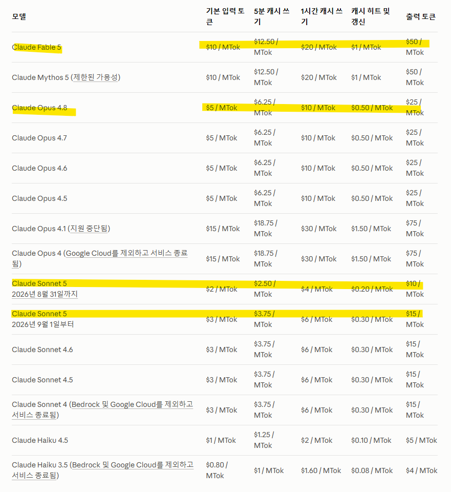](#)

​

이유식 계획표 자체는 소넷으로 **'충분'**

​

토큰 가격은 4종으로 이루어지는데,

구체적으로 하나하나가 뭔진 몰라도

​

여튼, 페이블이 **'쥰내 비싸다'**

라는 것은 딱 봐도 보입니다

​

**\* 오퍼스의 2배, 소넷의 ~5배**

**클로드가 벌써 딥시크 10배 입니다**

​

<https://code.claude.com/docs/ko/quickstart>

[![](https://dthumb-phinf.pstatic.net/?src=%22https%3A%2F%2Fclaude-code.mintlify.app%2F_next%2Fimage%3Furl%3D%252F_mintlify%252Fapi%252Fog%253Fdivision%253D%2525EC%25258B%25259C%2525EC%25259E%252591%2525ED%252595%252598%2525EA%2525B8%2525B0%2526appearance%253Dsystem%2526title%253D%2525EB%2525B9%2525A0%2525EB%2525A5%2525B8%252B%2525EC%25258B%25259C%2525EC%25259E%252591%2526description%253DClaude%252BCode%2525EC%252597%252590%252B%2525EC%252598%2525A4%2525EC%25258B%2525A0%252B%2525EA%2525B2%252583%2525EC%25259D%252584%252B%2525ED%252599%252598%2525EC%252598%252581%2525ED%252595%2525A9%2525EB%25258B%252588%2525EB%25258B%2525A4%252521%2526logoLight%253Dhttps%25253A%25252F%25252Fmintcdn.com%25252Fclaude-code%25252Fc5r9_6tjPMzFdDDT%25252Flogo%25252Flight.svg%25253Ffit%25253Dmax%252526auto%25253Dformat%252526n%25253Dc5r9_6tjPMzFdDDT%252526q%25253D85%252526s%25253D78fd01ff4f4340295a4f66e2ea54903c%2526logoDark%253Dhttps%25253A%25252F%25252Fmintcdn.com%25252Fclaude-code%25252Fc5r9_6tjPMzFdDDT%25252Flogo%25252Fdark.svg%25253Ffit%25253Dmax%252526auto%25253Dformat%252526n%25253Dc5r9_6tjPMzFdDDT%252526q%25253D85%252526s%25253D1298a0c3b3a1da603b190d0de0e31712%2526primaryColor%253D%2525230E0E0E%2526lightColor%253D%252523D4A27F%2526darkColor%253D%2525230E0E0E%2526backgroundLight%253D%252523FDFDF7%2526backgroundDark%253D%25252309090B%26w%3D1200%26q%3D100%22&type=ff500_300)](https://code.claude.com/docs/ko/quickstart)
[**빠른 시작 - Claude Code Docs**

Claude Code에 오신 것을 환영합니다!

code.claude.com](https://code.claude.com/docs/ko/quickstart)

​

웹클로드 말고, **CLI** 설치를 하시고,

/model 에서 소넷을 설정한 이후에

​

이유식 계획에 대해서 편하게 대화하세요

​

**\* 대화 하면서 감을 잡아보세요**

​

그리고 폴더 하나를 만드신 다음에,

그 폴더에 **'이유식 관련'** 데이터를 쌓으세요

​

교과서를 넣어도 좋고, 여기저기 인터넷에서

내가 직접 본 내용을 넣어도 무관합니다

​

그 다음, 내가 넣은 데이터를 기반으로

버베이텀 단위로 원문 인용을 해달라고 하고

​

계획하는 것을 도와달라고 하세요

​

**만약 처음 시작이면 웹서치든, 웹팻치든,**

**클로드 자체의 검색 능력을 써서 얻은**

**정보를 쓰게 하는 것은 추천하지 않습니다**

​

[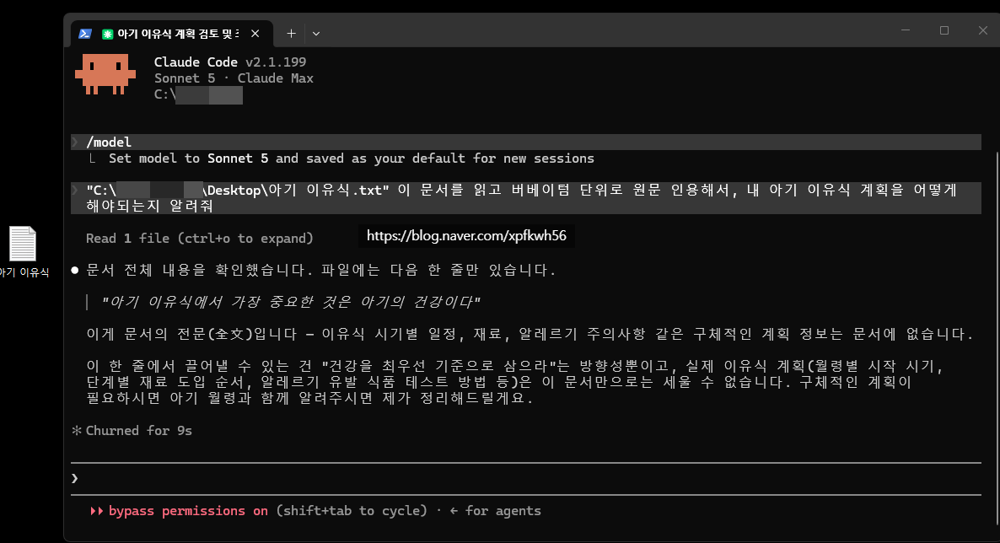](#)

​

예시입니다

​

[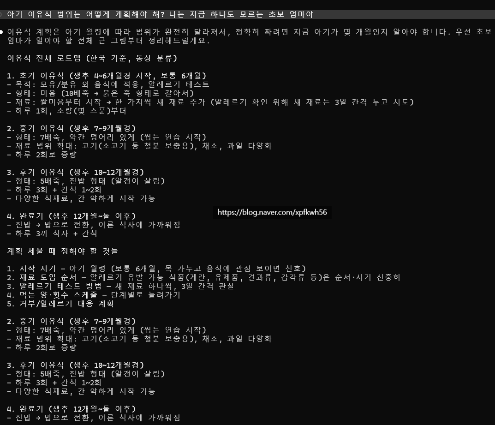](#)

[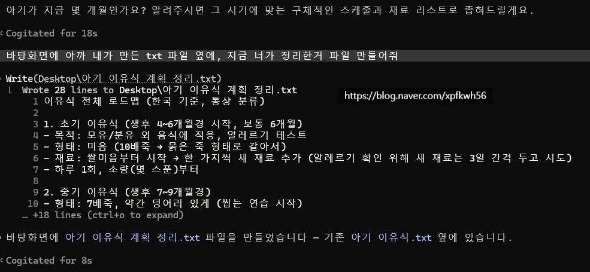](#)

[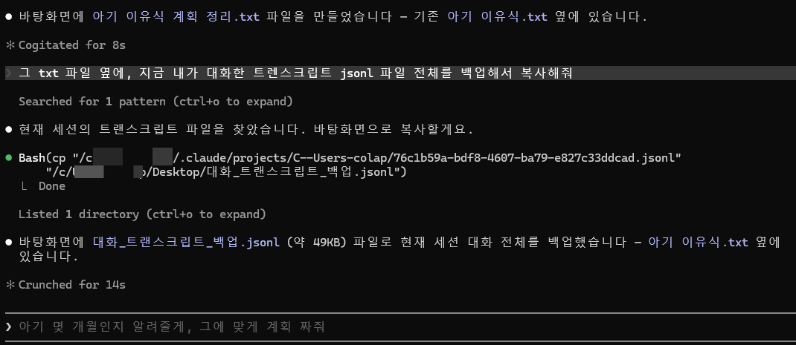](#)

​

파일 3개가 생겼습니다

​

[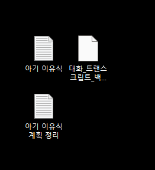](#)

​

아기 이유식 = 내가 만든 txt

아기 이유식 계획 정리 = 소넷이 만든 것

대화\_트랜스크립트 어쩌고 = 전체 대화 백본

​

[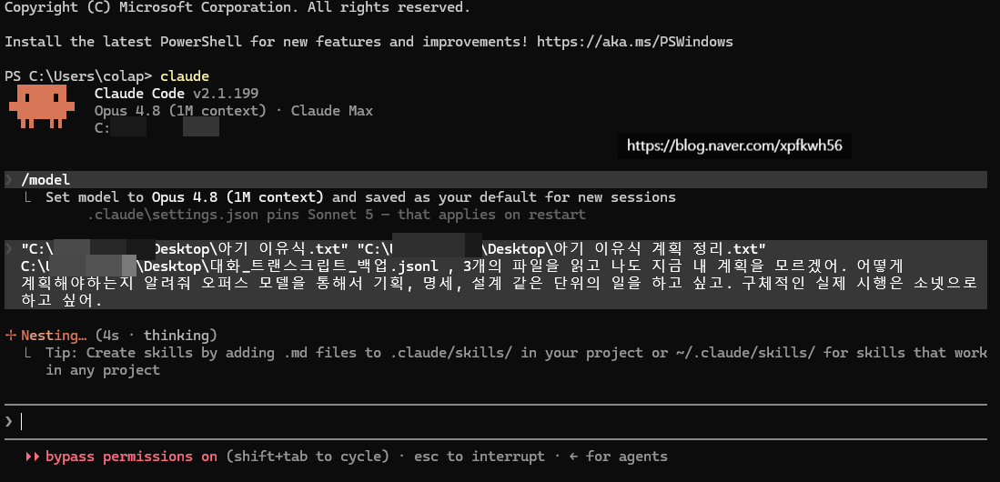](#)

​

소넷 클로드는 놔두고,

이제 오퍼스를 엽니다

​

[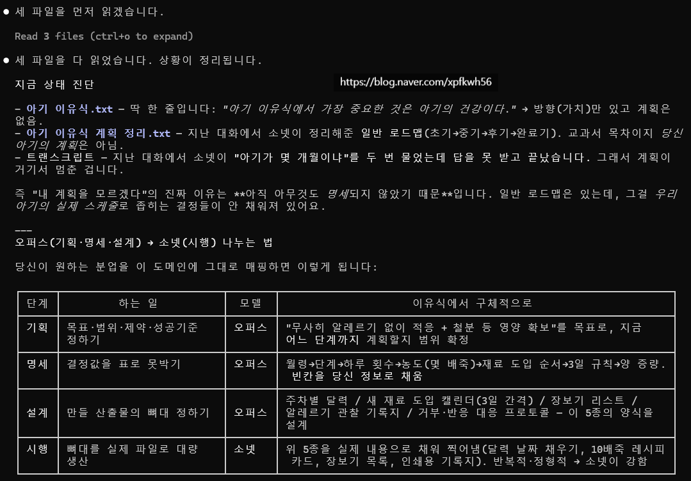](#)

[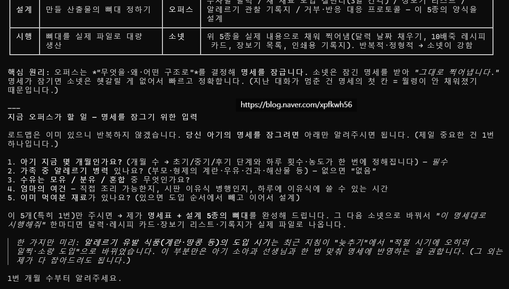](#)

[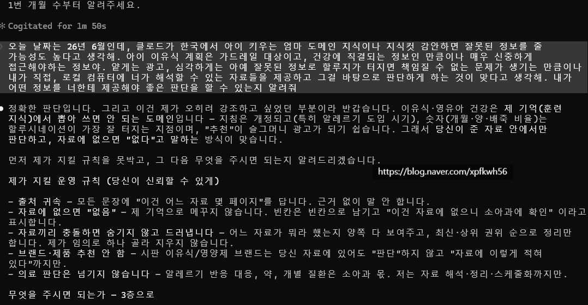](#)

[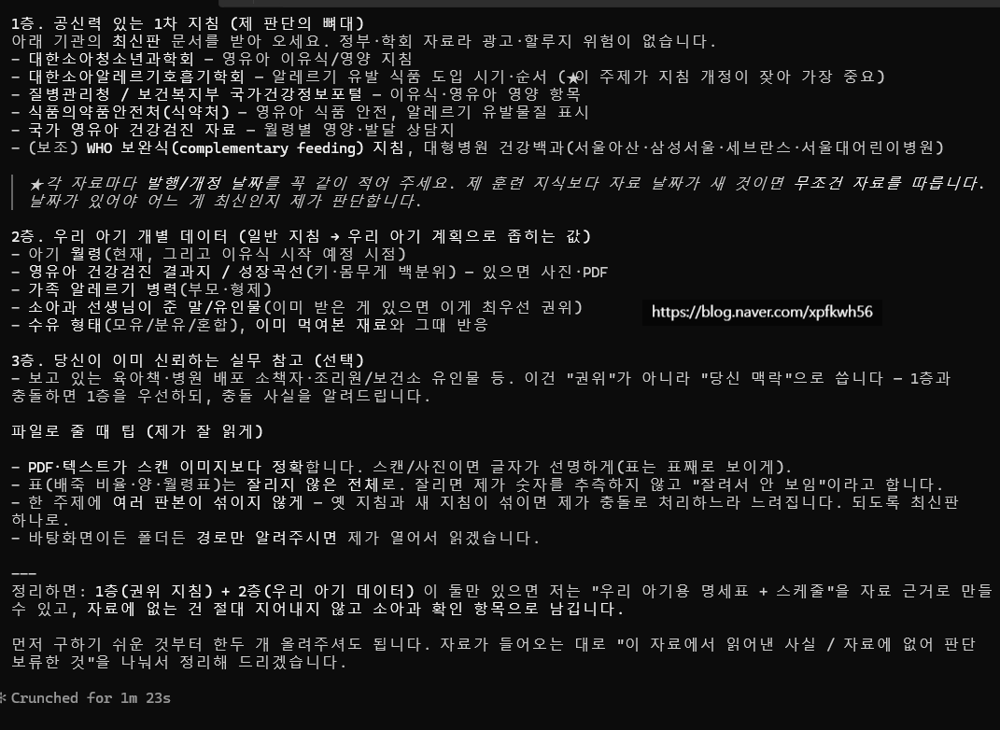](#)

​

이런 식으로 하나씩 내가 필요한 명세를 맞추고,

그 명세 내용을 Txt 로 관리하는 것보다

​

Doc, md 파일로 전환해 옵시디언에 두고 쓰면

토큰 효율이나 관리 용이성이 높기 때문에,

​

하면서 내 손에 맞게끔 맞춰 나가면 됩니다

​

**트렌스크립트 백업은 왜 하나요?**

​

트렌스크립트 백본이 있어야 나중에,

히스토리를 손쉽게 가져올 수 있기 때문

**​**

**서브에이전트 쓰면 되는데, 왜 터미널을**

**나눠서 수동으로 돌려야 되는 건가요?**

​

서브에이전트는 1회성 세션이기 때문에

초기 가동 비용이 30kb~ 정도 됩니다

​

**\* 저 용량만큼 토큰이 다 타고 시작함**

**디폴트 세팅에서 살 더 붙었으면 더 큼**

**​**

영속성이 낮고, 정보의 자산화가 안 됨

​

로컬을 하면 그냥 알게 되는 아이디어인데

각 개별 트렌스크립트 sid를 보유하고,

그걸 기반으로 리콜 하는 것이 좋습니다

​

**정리하면,**

**​**

오퍼스 = 기획, 설계, 같은 화이트 컬러 치고

조금 머리를 굴려야 되는 작업, 답이 없는 문제

​

소넷 = 명확한 명세가 있고, 정답이 있는 문제

​

이렇게 2개로 나눠서 쓰는 것이,

처음에는 시작하기에 가장 좋고

​

헷갈리면 그냥 소넷만 쓰면 됩니다

​

**\* 인간이 직접 판단해야 되는 작업보다**

**1티어 낮은 작업을 다 완비해놓은 다음에,**

**​**

**인간은 1티어 더 높은 작업을 하고,**

**원래 하던 작업은 기계화하는 것 반복**

**​**

내가 경제적인 제약 하나도 없이,

일단 편하게 답을 빨리빨리 얻고 싶다

​

라는 상태라면 오퍼스 원툴도 괜찮은데

이건 이제 **'내 자신감'** 문제로 갑니다

​

**\* 잘 할 수 있으면 오퍼스만 써도 괜찮**

​

**2) 독서 도우미로 사용하기**

**​**

처음부터 웹 파일을 구하거나,

아니면 있는 책을 OCR 이라는

​

프로그램을 사용해서

컴퓨터가 읽을 수 있게 전환해야 됨

​

PDF 파일을 **'이미지'** 상태로

통째로 읽게 하면 토큰 **터집니다**

​

**\* 감당 불가**

**​**

책에 있는 글자의 규격을 읽는, **'파서'**

OCR을 원문 그대로 할 것인지 아니면

LLM 성능을 사용해서 정돈할 것인지,

​

같은 선택을 해야 하고,

​

그게 다 끝나서 일단 **'자료'** 가 준비되면

그 다음에야 같이 읽어나갈 수 있습니다

​

<https://www.gutenberg.org/cache/epub/1513/pg1513-images.html>

[**Romeo and Juliet**

THE TRAGEDY OF ROMEO AND JULIET by William Shakespeare THE PROLOGUE Enter Chorus . CHORUS. Two households, both alike in dignity, In fair Verona, where we lay our scene, From ancient grudge break to new mutiny, Where civil blood makes civil hands unclean. From forth the fatal loins of these two foes...

www.gutenberg.org](https://www.gutenberg.org/cache/epub/1513/pg1513-images.html)

​

제일 추천하는 방식은 여깁니다

​

[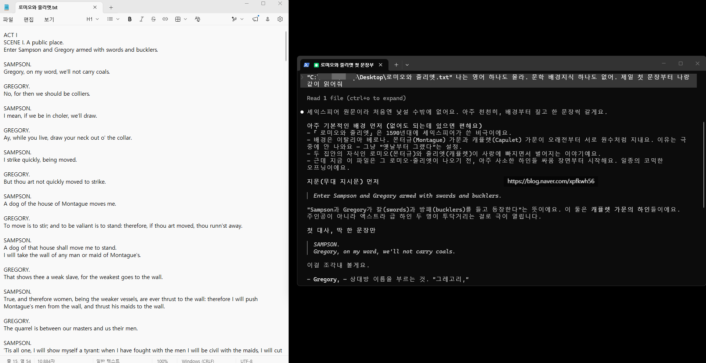](#)

​

로미오와 줄리엣 한 꼭지를 복붙한 다음에,

​

[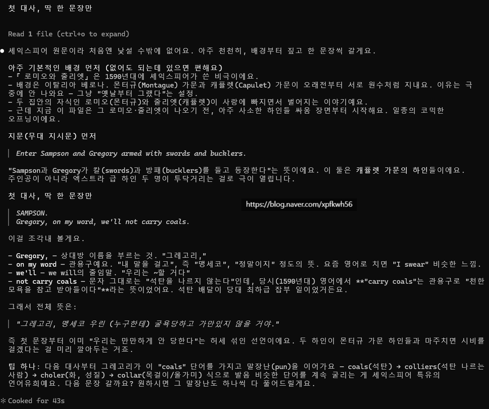](#)

[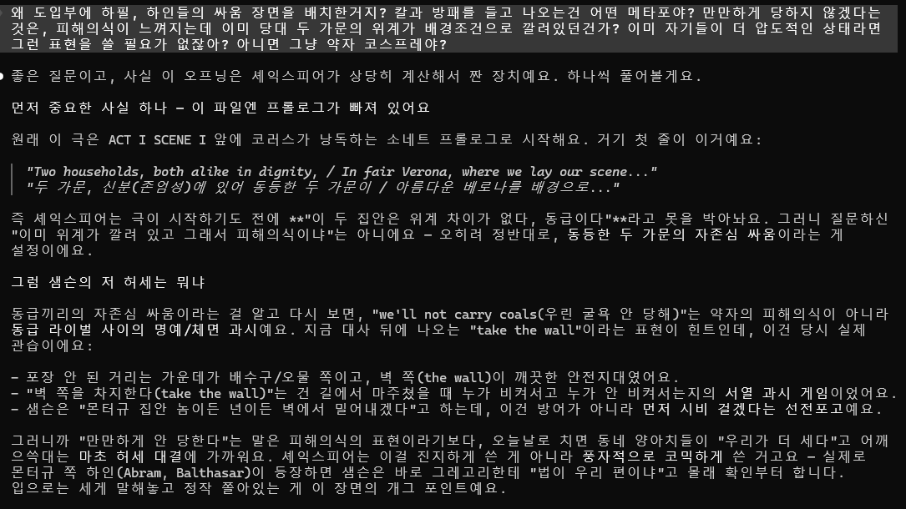](#)

[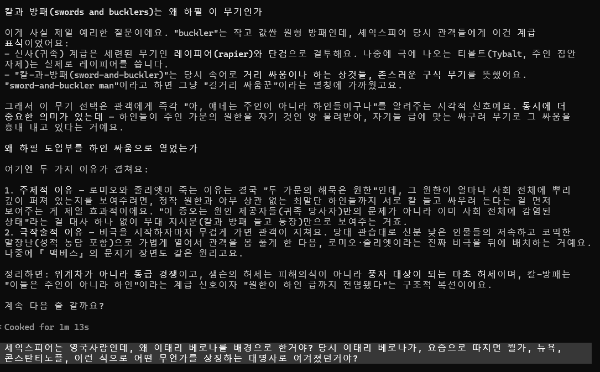](#)

[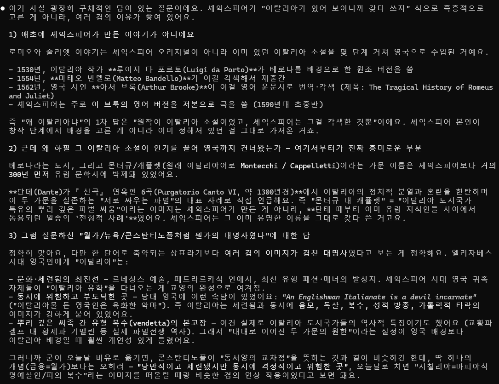](#)

[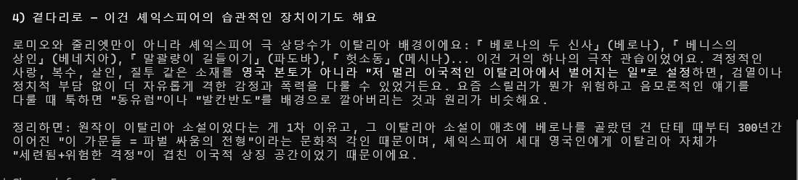](#)

​

이런 식으로 같이 읽어나가면 됩니다

​

**내가 여기서 더 깎아보겠다**

​

클로드를 윈도우 터미널로 연 것인데,

​

리눅스, 또는 Wsl2/도커 같은 걸로 쓰면

보다 더 효율적이게 굴려볼 수 있습니다

​

**왜 why?**

​

윈도우 환경은 클로드가 원래 쓰는 언어를

번역해서 표기하는 것입니다, 모국어가 아님

​

근데 리눅스 환경으로 전환해서 쓰면,

클로드가 자기 모국어로 일할 수 있어요

​

자잘자잘한 충돌을 덜 겪으면서 갈 수 있음

​

저수준 언어로 **가면 갈수록**, 토큰 효율,

작업 속도 효율이 **계속** 증가하게 되는데

​

**\* 하드웨어 지식 필수**

**​**

그 무렵에 닿으면 이제 **기술자**가 된 것임