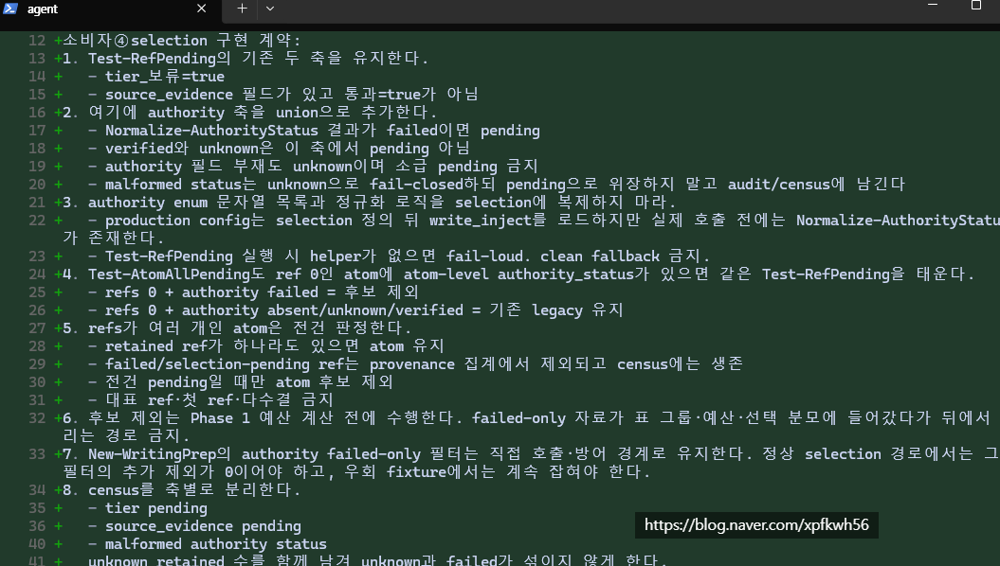
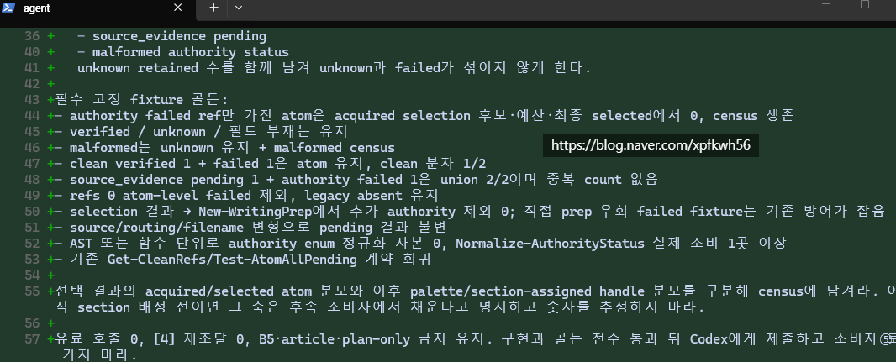

# 프롬프트 엔지니어링
**Date:** 10시간 전
**Category:** 일기장
**Original URL:** https://blog.naver.com/xpfkwh56/224377417494
---

​

1. 자연어 명세

2. 기계어 설계

3. 에이전트 번역

4. 프론티어 검수

**5. 수정 x100**

​

복붙해서 쓰는 프롬프트로는

보통, 출력 보장 잘 안 됩니다

​

**\* 배 보다 배꼽이 더 클 수도 있어요**

**​**

블로그에 글 써주는 건, 알아서 쓰는 거고

​

나온 출력물 보면서 계속

보완할 건 보완하고 있음

​

부족하다? 결함이 있다?

그럼 그건 그거대로 수리하고,

​

고칠 것이 더 이상 없다?

그럼 그걸 이제 어떻게 하면

​

더 싸고, 빠르게 할까 찾아내고

이거를 무한 반복 하는 것이

블라그 자동화 에 가까울 것 임

​

C, C+, C#, 파이썬 튜토리얼 뗀다고

그거 배워서 할 수 있는 건 아닐 것 임

​

이걸 어떻게 보시면 되냐면,

​

제가 특별히 영어 읽는데 불편은 없지만

그렇다고 영어 코미디쇼를 보면서

깔깔대고 웃을 수 없는 것이라 보심 됨

​

언어 배우는 건 언어 배우는 거고,

활용 하고 써먹는 것은 또 그게 별개임

​

정말 특별한 천재가 아닌 이상,

수학과학 개념만 듣고 문제 다 못 풀듯

​

본인이 찾아다니면서 많은 응용 문제를

**'풀어보며'** 쓰임 영역을 찾아내는 것처럼

​

잉공지능도, 코딩도 똑같다고 봄