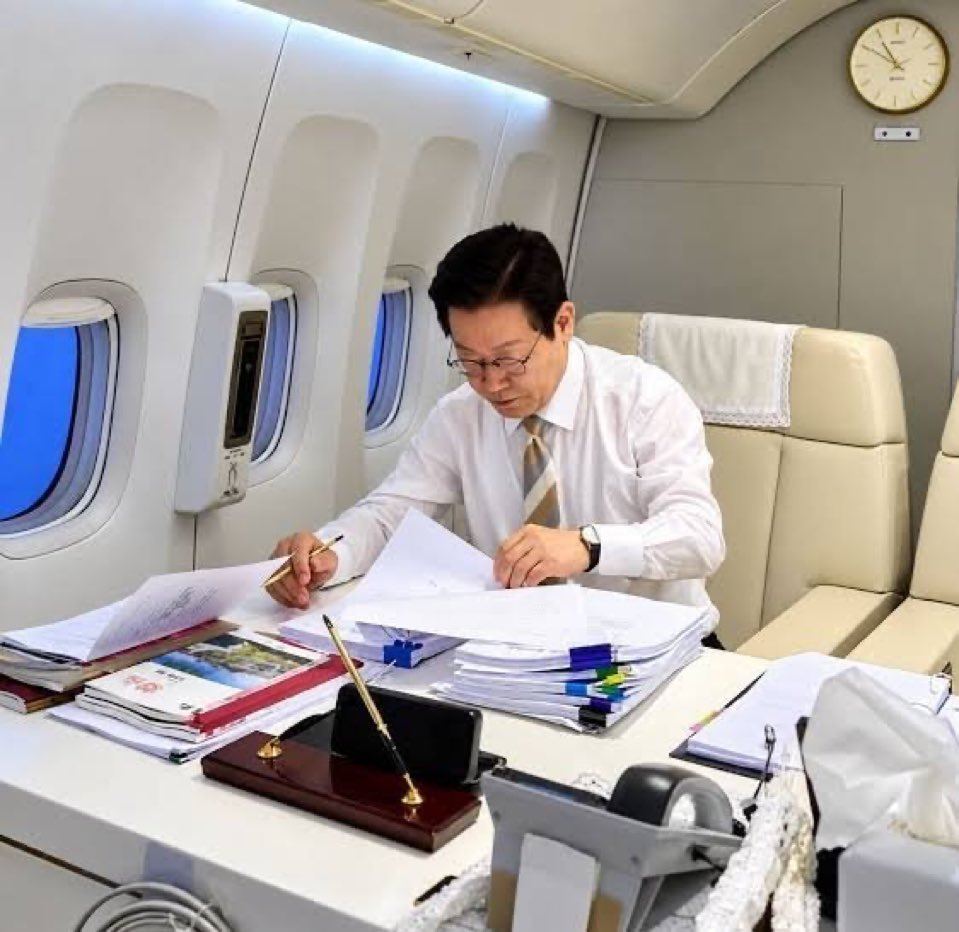

# T 와 F
**Date:** 11시간 전
**Category:** 스냅
**Original URL:** https://blog.naver.com/xpfkwh56/224422516298
---

1. 트래픽 블로그 하니까

스몰톡 능력이 크게 증가함

​

2. 장윤정 엄마는 사건, 사고가 많은 걸로 유명함

얼마 전에 장윤정이 본인 유튜브에 아빠랑 나왔는데

​

딸이 장윤정인데도 평생 어디 가서 먼저

내가 장윤정 아빠 라고 말한 적 없다고 함

​

장윤정이 어릴 때 영재교육 시설에 합격했는데

집안 형편 때문에 보내주지 못했고

​

하고 싶었던 가야금도 못 시켜줬다면서

​

만약 다시 그 시절로 돌아간다면

​

장윤정이 하고 싶고 잘 하는 일에

아낌없는 지원을 해주고 싶다고 함

​

1) 아빠는 인격자인데, 엄마는 왜?

라는 이야기로 수다 떨 수 있음

​

2) 자식덕 보려는 부모랑

장윤정 아빠를 대비 시킬 수 있음

​

3) 1명이라도 제대로 된 부모님을 만나서

참 다행이다, 라는 식의 힐링도 갈 수 있음

​

시계, 각도, 소품, 당연히 전부 계산이 있겠지요?

​

근데, 나는 장윤정이 최근에 모친 이슈로

언론에 자꾸 왔다갔다 하니까 본인 SNS 에

찬물, 더운물 느낌으로 **'연출'** 한 것 아닐까 ,,

​

하는 생각이 먼저 들었음

​

이런 습관이 대중미디어 다루는

포지션일 때는 **매우 불리함**

**​**

3. 따지지 말고 그냥 공감 해야 되는데,

정서의 동기화가 증말증말 쉽지가 않다

​

4. 어쩌면 T 랑 F 의 차이는 각자들에게

익숙한 커뮤니케이션 차이 아닌가 싶기도 함

​

사람이랑 쌍방향 소통 많이 했으면 F

사람 아닌 거랑 소통 더 자주 했으면 T