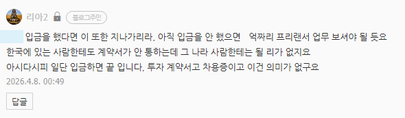
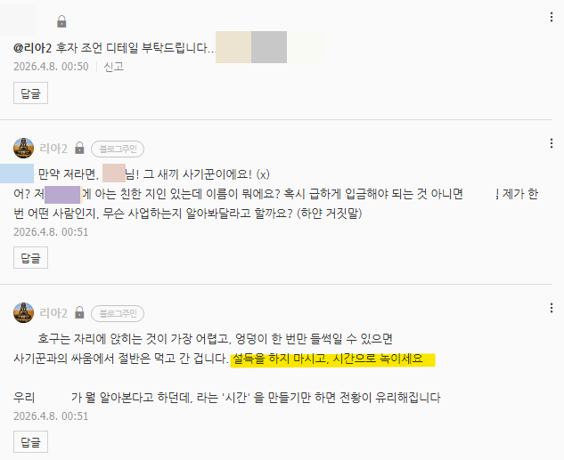
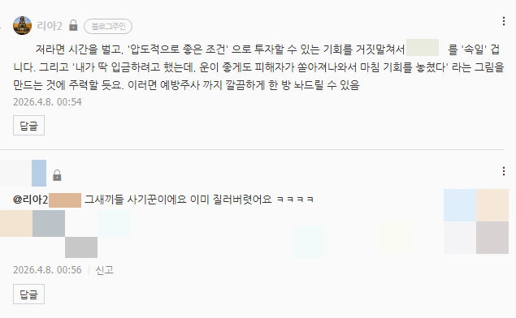
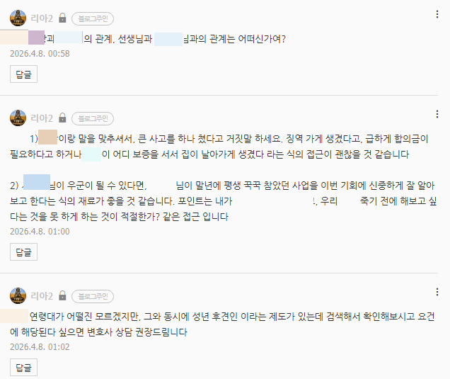
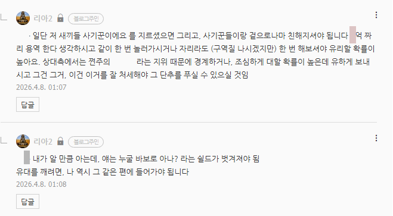

# 가족이 사기꾼에게 닦이고 있을 때, 대응
**Date:** 11시간 전
**Category:** 다이어리
**Original URL:** https://blog.naver.com/xpfkwh56/224245145336
---

​

1. 입금이 발생했으면 **끝** 이다

입금이 아직 안 발생한 상태라면?

​

리프레이밍

​

→ 아휴, 또 사고를 치셨네 (x)

이 사건을 잘 해결하면 n억 번다 (o)

​

공성과 정복이 전쟁이듯,

수성과 내치도 전쟁임

​

사기꾼이 우리 집에서

닦아가려고 하는 것 만큼

​

최소한 나도 그런 **'프로의식'** 을

갖고 자산을 지키려고 해야 됨

​

사기꾼은 이게 **'직업'** 이고,

**'생계'** 인 사람 입니다

​

아예 똑같이 대응할 순 없더라도,

​

상대가 프로 라는 정도는

인식하고 있어야 판세가 보임

​

​

**2. 시간으로 녹여라**

​

대부분의 경솔한 결정은 충동에서 옵니다

​

경솔한 사람이기 때문에 충동적인 것이고,

경솔한 사람이기 때문에 대개, 금방 식습니다

​

약점은 앵글만 조금 바꾸면 강점으로 바뀜

​

**​**

**3. 사기에 당하는 주요 동기**

​

하나는 **두려움** 이요,

하나는 **탐욕** 입니다

​

다만, 이게 일반적인 정서니까

구체적으로 갖고 있는 배경을 갖고,

​

어떤 것이 니즈인지 파악한 이후

그걸 타깃으로 접근하면 더 좋음

​

일단 내용만 봤을 때, 첫 파츠는 깨짐

그럼 다음 플랜으로 넘어갑니다

​

​

**4. 혈연을 이용하는 방법 입니다**

​

남조선은 농업 사회 기반이기 때문에,

​

각 혈연에 지정된 사람들이 갖는

특정한 페르소나, 롤모델이 있음

​

이런 **'클리셰'** 를 쓰면,

효과적으로 설득할 수 있음

​

​

5. 피해를 막고, 돈을 빨리 찾아오자

이건 **'내'** 생각에 불과하기 때문에,

​

상대의 입장에서 파악을 먼저 해야 됨

​

물론 쉽진 않은데, 액수가 크면 해볼 수도

그리고 해봐야 되는 경우도 있긴 하지요