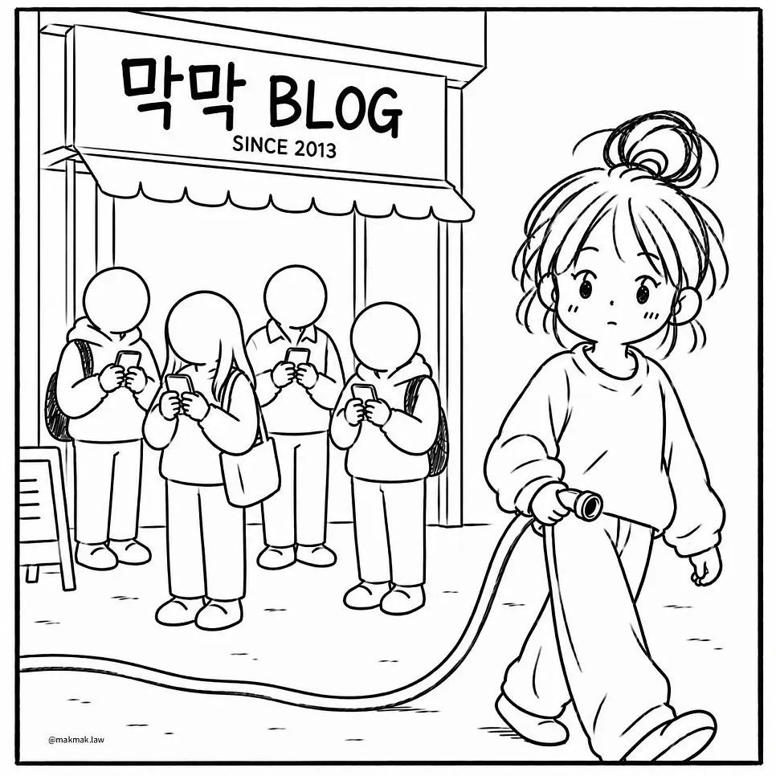
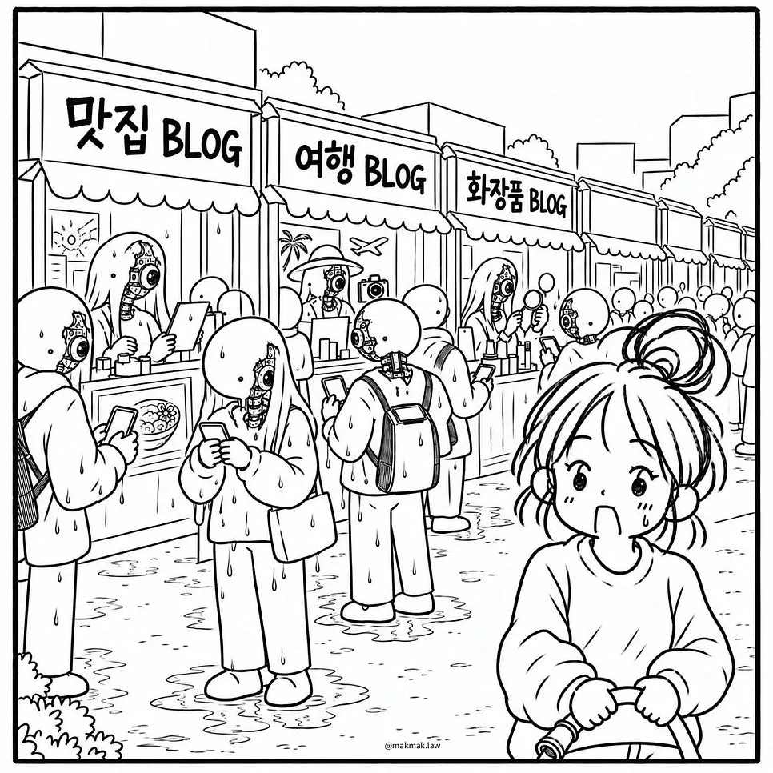

# 네이버 블로그가 망하고 있는 이유
**Date:** 11시간 전
**Category:** 인터넷노점상
**Original URL:** https://blog.naver.com/xpfkwh56/224427313884
---

​

트래픽 블로그 운영하면서 느낀 점은,

**'인간'** 도 **'AI 처럼'** 글을 써야 노출 시켜줌

​

하나 보실래요?

​

​

9월 30일 기준, 오후 6시 무렵에

투데이 4.4만 찍힌 블로그 임

​

진짜 수제 운영을 하시고

계신다고 하면 **너무** 실례지만,

​

홈판식 알고리즘 글쓰기 정석 임