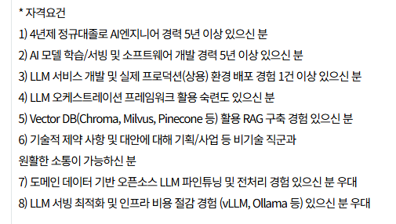
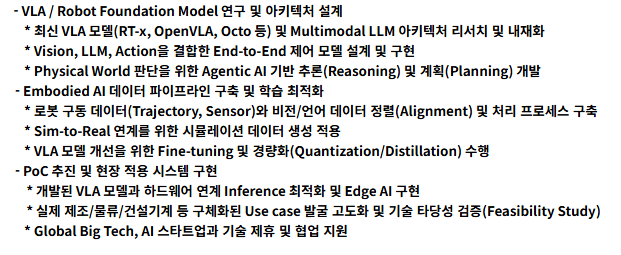
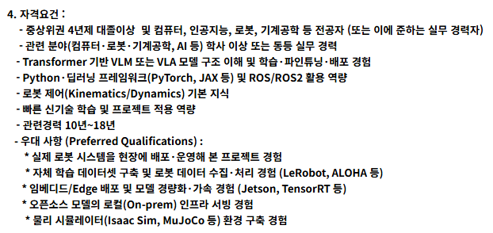

# 로컬 하라는 이유
**Date:** 11시간 전
**Category:** 일기장
**Original URL:** https://blog.naver.com/xpfkwh56/224334161876
---

​

인공지능 업종에서 채용하는

기업들이 올린 공고를 보세요

​

GPT 잘 쓰시는 분,

클로드 써보신 분,

개꿀 프롬프트 많이 아시는 분,

​

**이렇게 구하는 회사**

**단 1개라도 있나요?**

​

본인이 직접 로컬 써본 적 없으면

지원서 자체를 낼 수가 없지 않나요?

​

왜 업종, 장르에 관계 없이

모든 기업들은 전부 로컬 경험자들을

**'최저 채용조건'** 으로 잡을까요?

​

경험치의 폭이 다르기 때문 입니다

​

**\* 비로컬은 산업적으로 못 씁니다**

**​**

블로그 바닥에도, 글쓰기 대행 알바라고 있음

글 1개 쓰면 500원, 많으면 2천원 주고 그럼

​

지원자격, **'글 쓰기 많이 해본 분'** 이라는

키워드로 블라블라 이야기가 아주 많은데,

​

본인이 취미 삼아서

블로그 3년 정도 했고,

​

5천개 넘게 글 써봤으면

​

1) 지원 자격이 무의미 하고,

2) 지원서 낼 생각도 안 합니다

​

똑같은 구조에요