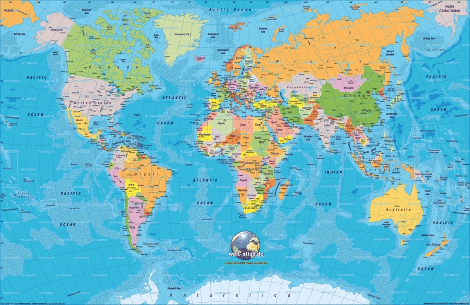

# 사업을 한다, 가치를 만든다, 말만 멋있다
**Date:** 11시간 전
**Category:** 일기장
**Original URL:** https://blog.naver.com/xpfkwh56/224311829508
---

1. 내 기억상, 흔히 사람들은 사업을 한다

​

장사를 한다 라는 이야기를 듣게 된다면

자연스럽게 떠올리는 이미지가 있다

​

탁월한 수완가, 사회에서 성공한 사람,

높은 자리에서 머리를 잘 쓰는 사람, 등

​

온갖 좋은 수식어가 잔뜩 다 앞에 나온다

​

그렇다면 **'실제로'** 그럴까?

​

2. 블로그에서 사업 같은 것을 하지 말라,

​

개업이니, 개원이니, 자영업 같은 것들도

생각도 하지 말라는 말을 100번 이상 했다

​

그 이유는 다음과 같다

​

자기 앞으로 사업자를 낸다는 것은

내가 앞으로 남의 문제를 해결하는

​

**'도구'** 가 된다는 계약이요 승인이다

​

대부분의 사람들이

임금 직장인임을 감안하면

​

**'부리는 위치'** 에 있는 존재가

​

**'수단'** 으로 바뀐다는 것을

이해하기 어려울 것이다

​

하지만 이보다 더 간명한 설명이 없다

​

3. 깔린 판에서 직장인처럼 **'출퇴근'** 하면서,

​

하루에 1-2시간 **'정해진'** 일을 하고,

**'정해진 업무'** 에 맞게 일을 하면서,

​

많은 돈을 버는 것은 **스캠, 불법** 뿐이다

​

출/퇴근? 도구가 출/퇴근이 어딨나?

​

컴퓨터는 전원 들어오면 출근이고,

꺼지면 퇴근이다, 사람도 마찬가지로

​

눈을 뜨고 있으면 존재 자체가 출근이고

**'의식'** 을 잃었을 때가 퇴근 시간이 된다

​

정해진 시간 같은 것도 없다

​

딱 셋이다

​

1) 가능한 싸게

2) 가능한 좋은 것을

3) 가능한 빨리

​

애초에, 셋을 다 이루는 것은

**'불가능'** 하다

​

근데 그걸 **'해야'**

사업이 **'가능'** 하다

​

저렴하지도 않고, 좋지도 않고,

느리다면 시장에서 필망한다

​

하나를 **'확실하게'** 가져가면

그 분야 만큼의 파이를 갖는다

​

물론 그 역시, 파이가 **'잠재된'** 것이지

내가 가져간다는 보장 같은 것은 없다

​

그렇다면 정해진 업무는 어떨까?

​

띵낑을 해보면 쉽다

​

**'공장에서 찍어 나오듯, 누구나 쉽게**

**그 문제를 해결할 수 있으면**

**도대체 왜 내가 존재해야 되는가?'**

​

이게 인공지능 시대에 남은

유일한 **'미지의 영역'** 이다

​

쿠팡에서 버튼 하나만

누르면 최저가가 나온다

​

제일 많이 팔리는 것도 찾아준다

**​**

**문제는?**

​

그렇게 뚝딱 나온 정보가

​

**'내'** 하나 하나의 문제를

해결한다는 법이 없는 것이다

​

​

수요가 폭증하고, 공급이 한정된 시대

​

대우 김우중이 말했던

세계 경영이 통하는 시대가 있다

​

의사가 되면 왜 돈을 많이 벌고,

변호사만 되면 왜 돈을 많이 버냐?

​

전문직, 대기업, 공무원 트로이카가

왜 영원한 제도권의 영역으로 남는가?

​

**'그 자격을 가진 사람이 희소 하니까'**

​

고성장 시대는 **'지난 영광'** 이다

​

세계 지도를 펴놓고, 어디를 어떻게 먹어서

저걸 누구 땅으로 경계를 삼을 것인지 들은

​

**'예전에만 통하던 공식'** 이다

​

게임이 달라졌으면, 다른 게임을 해야 된다

​

표면에 보이는 지도를 돋보기로 확장해,

그 안에 무엇이 들었는가 찾아내야만 하고

​

**보이는 지도로부터, 해저의 존재를**

**지도 밖에 있는 우주를 탐구해야 한다**

​

인간의 힘으로 할 수 없는 **'도구'** 가

인간에게 주어졌을 때, 이제 인간은

​

원래 할 수 없던 것을

**'해낼 수'** 있게 되었다

​

모르면 상관없는 문제다, 수업을 안 들었으니까

​

수업을 들었으면? 머지않은 시점에

곧 배운 것들로 **시험을 본다는 의미** 다

​

4. 구체적으로 어떤 직업군들을 말하진 않겠지만,

무엇만 하면 쉽게 쉽게 간다는 말에 홀리는 사람이

​

**실전 창업 판에는 99.998% 정도 된다**

​

매장을 내면 손님이 알아서 오는 줄 알고,

간판을 올리면 그 날로 장사가 되는 줄 안다

​

실상은, 그 **'1명 1명의 발걸음의 자취를'**

전부 읽어내야 하는 것인데도 말이다

​

남해에는 무인도가 아주 많다고 한다,

거기는 전기도 없고 수도도 없다

​

필요하면, 없으면 내가 해내야 한다

​

없으면? 없는 것이다

​

그냥 없는 것, 못 쓰는 것이다

​

**'분업'** 은 경영이 만든 예술품 이다

​

분업화는 전문화를 낳고,

전문화는 세분화를 낳는다

​

대량생산, 대량 소비의 시대에서

소량생산, 소량 소비의 시대로,

​

그리고 이제 **'1명'** 을 찾는,

심지어 **'1명의 1요소'** 를 찾는,

​

극한의 디테일 게임에서

​

**'전체'** 를 보고 싶은

유혹을 견딜 수 있을까?

​

오케스트라에서, 어떤 연주자는

딱 1번의 음정으로 돈을 벌고,

​

어떤 연주자는 100번의 음정,

1000번의 리듬을 뿌려야 돈을 번다

​

**10만번의 시도에서 고작 1원도**

**벌 수 없는 인간이 백 만은 넘는다**

​

1번의 음정으로 돈을 버는 연주자가

많아지면 많아질수록 수요 공급 그래프가

균형을 향해 치닫기 시작할 것이고,

​

100번의 음정과 1000번의 리듬으로

돈을 벌 수 있다는 정보가 생기면 반드시

​

**'어떤 미친 새끼 하나는 101번, 102번,**

**그럼 나는 500번, 그럼 나는 5000번'**

​

같은 짓을 하게 마련이다, **확신한다**

​

5. 나는 예전에 직장에 소속된 상태였을 때,

하루 8시간을 근무하고, 남은 16시간 동안

​

집에서 유튜브를 보고, 내 취미 활동을 해도

그게 내 **'경력'** 으로 인정받았던 적이 있다

​

1년 중, 내가 실제 **'사용'** 한 시간은

고작 1/3 밖에 안 되고 **'가용'** 한 시간은

그보다 현저히 적은데도 말이다

​

출근 시간 10분 전에 도착해서,

화장실에 들어가 15분 동안 일을 봐도

​

그 **'15분의 임금'** 을 받는다

​

근로 계약을 하면, 이와 같이

똥을 싸면서도 돈을 벌 수 있다

​

**왜 why?**

​

**'거시 계약'** 이니까

​

창업은 **'양자의 세계다'**

​

1초, 1/10초, 1/1000000초,

할 수 있든, 없든 상관없이

​

내가 지금 **'어디에 들어와서'**

무엇을 하고 있는 것인지 **'알아야'**

​

내가 놓인 상황과 입장을

최소한 **'알기는 할 수 있다'**

​

6. 직장에서 도구로 살기 싫기 때문에,

창업으로 타개하겠다는 것은 **모순** 이다

​

도구가 되기 싫어서, 도구적인 도구가

되겠다는 결정을 하는 것이므로 그렇다

​

**도구가 될 준비 여부는 그럼 어떻게?**

​

J.P 모건은 미술품과 사치품을 즐겼다고 한다

​

모건에게는 아주 훌륭한 요트가 있었는데

그에게 어느 누군가 찾아와 이렇게 물었다

​

**" 이런 요트는 얼마 정도 하나요? "**

​

모건은 그 말을 듣고, 이렇게 말했다

​

**" 이 요트의 가격이 궁금하면**

**요트는 당신 것이 아니오 "**