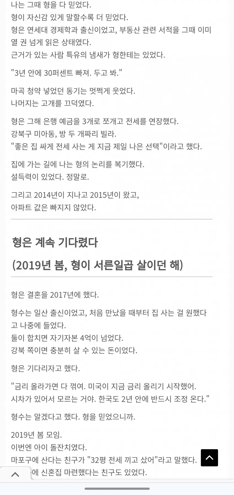
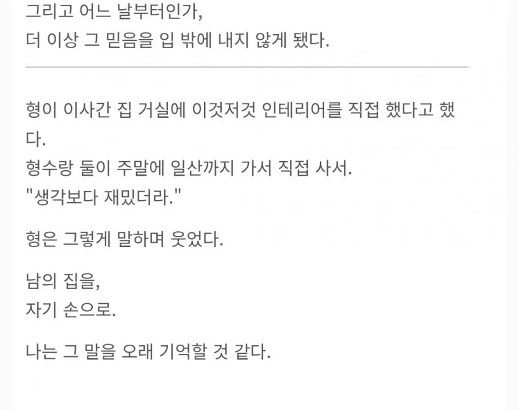

# 서사와 현실
**Date:** 11시간 전
**Category:** 다이어리
**Original URL:** https://blog.naver.com/xpfkwh56/224247657561
---

​

1. 내용만 보면, 연대 나왔다는

저 사람이 등신 판단을 한 것 같지만

​

인생은 절대 **'1번'** 의 결정으로

바뀌는 경우가 없다고 생각함

​

2. 지나고 결론만 보면, 저 시기에

집 잡았으면 **'신의 한수'** 가 맞음

​

1) 계약금만 입금하면 내 집인 시절이고,

2) LTV가 90% 까지 무난히 나왔으니까

​

근데 그 시절에, 저거 집었다고

모두 좋은 결과를 얻은 건 아님

​

**왜 why?**

**​**

변수가 **계속 따라오기** 때문

​

14-16년에는 집을 산다고 하면,

**그돈씨** 가 **당연한 시절** 이었음

​

같은 돈으로 집을 사는 것 보다

대형 프차 차리는 것이 **훨씬** 좋았고

​

그조차도 아니더라면 상가를 알아보건,

다른 대안들을 결정해도 충분했기 때문

​

14년은 차화정 메타가 끝난 직후인데,

​

삼전이 애플한테 밀려서 망했다느니,

옴니아라느니, 같은 이야기들이 돌았음

​

3. 최소한 저 글에서 나오는 사람은,

**'생활'** 이라도 지키고 있는 상태 지만

​

최저임금이 2배가 오르든,

어떤 일이 일어나든 통계적으로

​

남조선 가구당 평균 순자산은

상위 % 만 바뀌고, 중간 지점부터는

아래로 갈수록 **'거의 변화가 없음'**

​

4. 아파트 한 채 등기만 치면 정답이다,

라는 분들은 **'아직 안 쳐봐서'** 하는 소리고

​

등기만 치면 상급지 갈아타기 로 계속

자산을 늘릴 수 있다 역시, 본인이 직접

**'갈아타기'** 를 안 알아봐서 그런 것임

​

총 10번의 베팅을 전부 다 성공적으로

마쳐야 사람들이 **'흔히'** 생각하는

**'평범한 수준'** 성취에 도달할 수 있는데

​

손익비에 따라, 9번 이기고 1번만 크게 져도

그 자리에서 최소 3년, 현실적으로는 5년 정도

인생 그대로 빠꾸하는 일이 **'부지기수'** 임

​

4. 투자 공부를 어떻게 할까요?

뭘 새로 시작하려는데 어떻게 시작을?

​

같은 질문은, 내 생각에는 그 이전에

**'다른 영역'** 에서 **'거리감'** 을

확보하는 것이 차라리 낫다고 봄

​

어떤 영역이든, 장르든 상관없이

내가 딱 10% 경쟁력 정도만 확보해도

​

50%, 30%, 10%, 5%, 1%,

~0.1% 까지의 **'도달값'** 이 보임

​

이게 없으면, **해본 적이 없기 때문에**

거기에 요구되는 것이 뭔지도 모르고,

​

성취가 **'스펙트럼'** 이라는 것을

이해할 수 없을 가능성이 매우 큼

​

답을 맞추고 틀리고가 중요한 것이 아님

​

**'어떻게, 어떤 단서를 수집해서'**,

**'어떤 형태로 수행했느냐?'** 가

​

최종적으로 결국 손에 쥐는 것임

​

**5. 결론**

**​**

허황된 자본가 타령 하지 말고

기술자로 살고자 노-오력을 하자

​

자본가 그거는 하고

싶다고 되는 일도 아니다