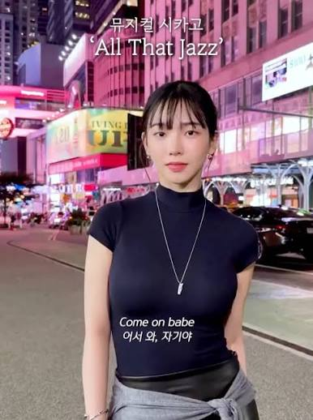
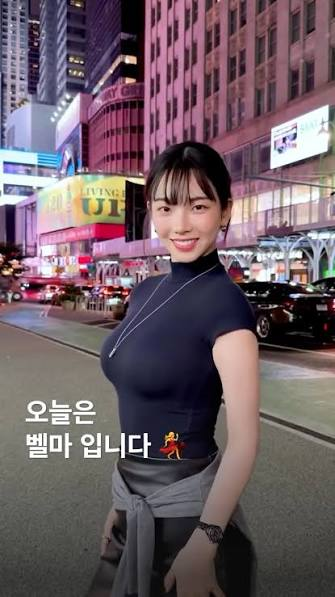

# 연예인, 아이돌 메이크업 해주는 아티스트
**Date:** 11시간 전
**Category:** 인터넷노점상
**Original URL:** https://blog.naver.com/xpfkwh56/224427309858
---

<https://www.instagram.com/biyaaaa/>

[**조은비 | Cho Eun Bee(@biyaaaa) • Instagram 사진 및 동영상**

팔로워 222K명, 팔로잉 2,424명, 게시물 1,018개 - 조은비 | Cho Eun Bee(@biyaaaa)님의 Instagram 사진 및 동영상 보기

www.instagram.com](https://www.instagram.com/biyaaaa/)

​

1. 세상에 안 예쁜 여자는 없음

​

코르셋, 여권 신장운동 같은 말이 아니고

보정/메이크업/다이어트 3신기가 있으면

​

어떤 여자든 예뻐질 수 있다는 것 임

​

​

장카설의 카를 맡고 있는

카리나가 최근에 올린 사진임

​

당연히 탑티어로 예쁜 여자지만,

​

이 사진만 보면 카리나가

**'그정둔가?'** 싶을 수도 있음

​

근데 확실히 **'카리나st'** 를

만드는 어떤 분위기가 있음은 맞고,

​

<https://youtu.be/ijSQcHirQms?si=vS-C0AwblIu-oqNR>

​

거기에 메이크업이 큰 영향을 미침

​

문제는, 이 꾸미는 일이

**쥰내** 귀찮단 것임

​

2. 뷰티에 관심 없으면 유튜브

알고리즘에 걸리지 않는 것은 덤이고

​

하나씩 찾을라고 해도 뭐가 답인지,

그게 나한테 맞는지는 분간하기 어려움

​

그럴 때, 유명 메이크업

아티스트 인스타를 보고,

​

쟤네가 얼굴에 무슨 짓을 하나 보면 됨

​

당연히 **다소** 광고는 있겠지만,

​

그건 이제 본인이 잘,

구분해서 보면 될 일이고

​

디렉션 어떻게 잡나,

**미감이 어떤가?** 참고하기 좋음

​

**3. 내 궁금증**

​

난 사실 외모보다 이런 사람들 처럼

**'덕후'** 가 되는 과정이 몹시 궁금함

​

뭐 어떻게 하다가 청담샵에 들어가서

연예인 얼굴 만지는 직업을 갖게 되었고,

​

어떤 방식으로 컸길래, 저렇게 된걸까?

​

인터뷰 자료를 찾아보니까, 학창 시절

기술 가정 수업 때 **스타일리스트** 라는

직업이 존재한다는 것을 아시게 됐다 함

​

그래서, 아 나는 이런 걸 좋아하는데!

이런 직업으로 먹고 살 수도 있구나,

​

라고 느낀 뒤로, 학원 → 헤어/메이크업 등

여러 진로 기술을 배울 수 있는 경험을 쌓고,

​

내가 배운 어떤 스타일 기술이 **'현실에'**

적용되는 피드백 과정에 흥미를 느낀 뒤,

​

그 길로 이 분야에 들어오게 되셨다고 함

​

여기까진 그냥 무난한 스토리 인데,

​

**'오늘날'** 자기를 여기까지 끌어온 것은

원래 고향 내려가서 일을 하려고 했다가

​

언니 말 듣고 **'서울'** 에서 취업한 거라고 함

​

뷰티, 미용 업계의 메이저가 서울이고,

강남이니 그 영향도 아주 크게 미친 듯함

​

4. 즉,

​

1) 본인의 재능이 향하는 특정한 **'계기'**

2) 그 계기에서 오는 **'외부적 피드백'**

3) 발현될 수 있는 **'메이저한 환경'**

​

3박자가 터진 케이스로 보임

​

이건 아들 교육으로 유명한

최민준 쌤도 얘기 했던 부분인데

​

**\* 기차에 빠져있는 아이 강연**

**​**

애가 뭔가에 흥미를 느낀다, 그러면

그게 뭐든, 어디에 재능이 발현되든

​

내가 먼저 판단하지 않고, 흠뻑

빠지게 만들어줘야 되는 것 같음

​

민준쌤 강연에 나온 아이의 경우는

쌩 기차도 아니고, 기차가 왔다갔다 할 때

​

닫히고 열리는 그 판때기에 관심 있었는데,

그 이후 기계공학, 엔지니어링 으로 터져서

자기에게 주어진 계기를 발산시킨 바 있음