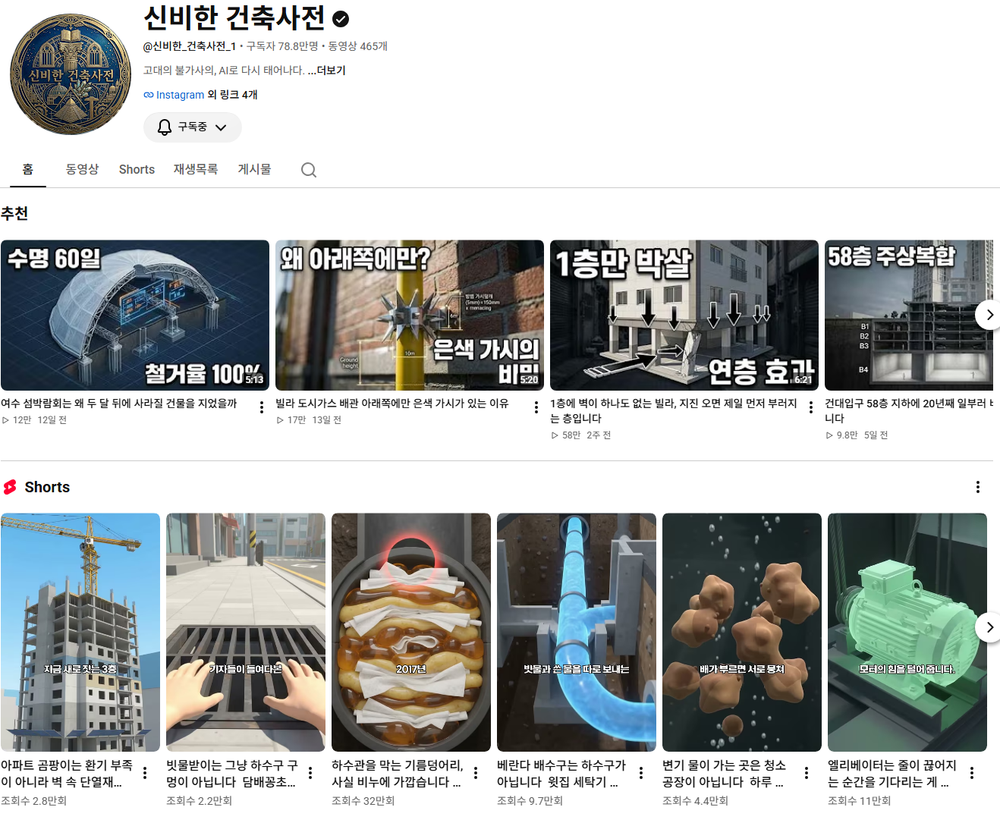
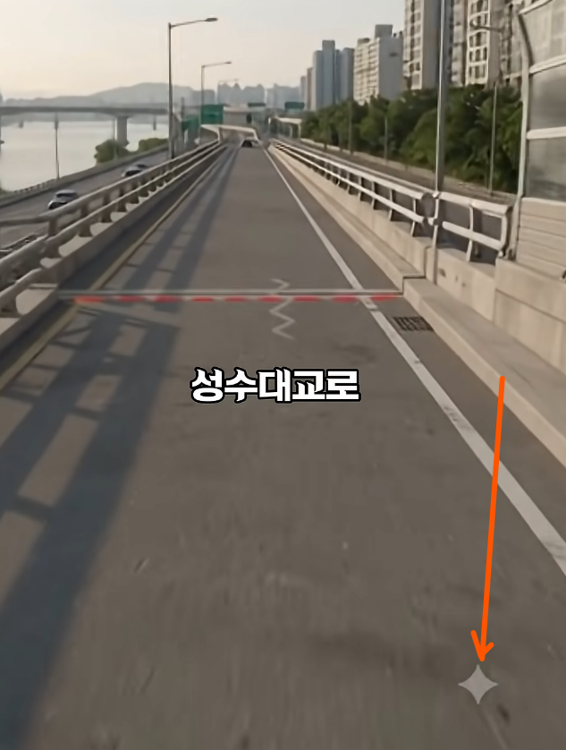
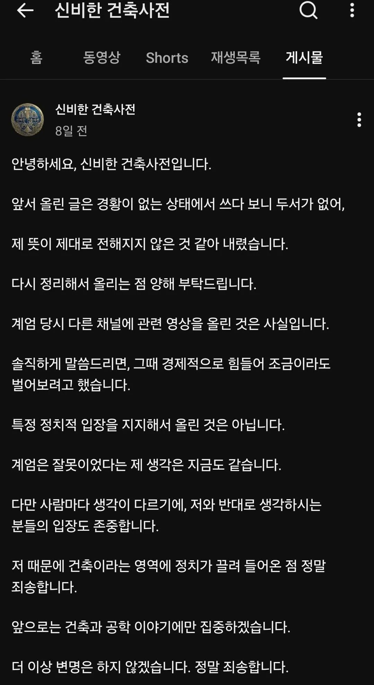

# 온라인 활동에서 꼬리를 잘 잘라야 하는 이유
**Date:** 11시간 전
**Category:** 인터넷노점상
**Original URL:** https://blog.naver.com/xpfkwh56/224423918883
---

​

1. 유튜브에서 **'대건축'** 시대를 만든 인물이 있음

​

2. 트렌디한 어떤 **'유행'** 을

선도하는 건 그게 무엇이 되든

진짜 어렵고 대단한 일인데,

​

**\* 아이큐 낮은 사람은 읽지 마세요**

**자기 객관화, 열등감 드립 등등**

**아예 밈이 되버린 것들도 한 둘 아님**

​

이 사람이 건축/건설 영상 **표준** 을 만들어서

너나 할 것 없이 파쿠리 계정이 엄청 생겼음

​

쇼츠에서 가끔 보이는,

​

**여기 정신나간 ㅇㅇㅇ가 있습니다**

그게 이 사람이 시작한 것 임

​

2. 당연히 엄청난 유명세에 네임드가 되었고,

​

제미나이 썼다는 표식

​

무려 서울시와 협업을 하는 체급에 도달,

​

근데 이메일 계정이 유출되면서 과거에

극우 채널 유튜브를 운영했단 사실이 파묘됨

​

​

당연히 음지에서 눈에 안 띄게 잘 살았으면

아무 문제가 없을 것이지만, 메이저로 가려니

​

저런 것들 하나 하나가 발목을 잡게 되었고,

B급에서 A급으로 올라가는 과정에 문제 생김

​

서울시 에서 과연 같이 일을 할 수 있을까 ,,

그럴 확률은 현저히 낮다고 판단 됨

​

**\* 광고는 잡음이 생기면 무조건 손해 라서**

​

3. 당사자는 당시에, 먹고 살 목적으로

그냥 트래픽 운영을 한 것이지

​

내 가치관이랑 관계가 없다고 얘길 함

​

**아마?** 실제 틀린 말은 아닐 것임

​

나만 해도 최근에 내 정견이랑 관계없이

한동훈 관련해서 정치/사회 블 운영중 인데

​

내가 기존에 1년 동안 운영했던 블로그

트래픽의 n배 이상의 성장세를 찍고 있음 ,,

​

근데 이거야 나는 저런 큰 일 할 생각도 없고

깜냥도 안 되니까 상관 없는 부분이지만,

​

만약 내가 어떤 하나의 단일 브랜드 로

크게크게 하고 싶다고 하면 기본적으로

​

사람들 눈에 **'덜'** 띄어야 좋은 건 맞는 것 같음

​

이도저도 진짜 잘 모르겠으면,

꼬리 라도 잘 자르고 사는 것이 좋음

​

4. 근래 저런 얼굴 없는 인플 계열이

많은 이익을 보는 현상이 나타나니까,

​

(나 포함) 사람들은 자기 자신을 최대한

가리고 운영하는 것에 큰 매력을 느낌

​

근데 기억 해야 될 지점이 있음

​

이 바닥은 **'기본적으로'** 가위바위보 고,

오늘의 정석은 내일의 변칙이 된단 것임

​

구글의 경우, **YMYL** 이라고 해서

​

Your Money or Your Life,

​

사람들의 건강, 재정, 안전,

사회적 신뢰에 직접적인 영향을 미치는

​

쉽게 말해서 **'쩐'** 이 좀 되는 콘텐츠는

저신뢰 크리에이터가 관여 할 수 없게 함

​

당연히 쓰는 것은 자유지, 대신

노출/확산이 오지게 안 될 것임

​

5. 때문에 저런 콘텐츠를 다루고 싶으면,

내 현실 약력을 공개하고 커리어를 풀고

​

내가 그럴 **'자격'** 이 있음을 표시 해야 됨

​

없이도 잘 하는 사람들이 물론 많긴 하지만,

​

1) 행운-미리 선점-과 재능-압도적-이 있거나

​

2) 오늘, 내일은 가능해도 장기적으로는

영속성이 현저하게 떨어지는 계정 일 것임

​

온갖 알고리즘 해킹 정보들이 웹을 돌지만,

결국 이 게임의 **'본질'** 자체는 정해져 있음

​

**그냥 진짜가 되면 됨**

​

되면 하지, 근데 내가 진짜가 될 수 없으면?

**어떻게든** 방법을 찾아내는 수 밖에