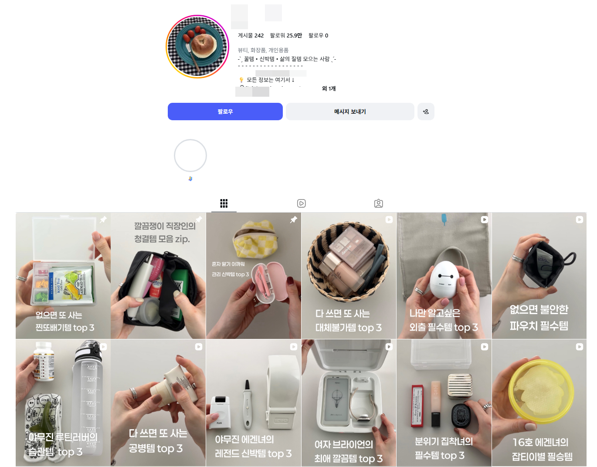
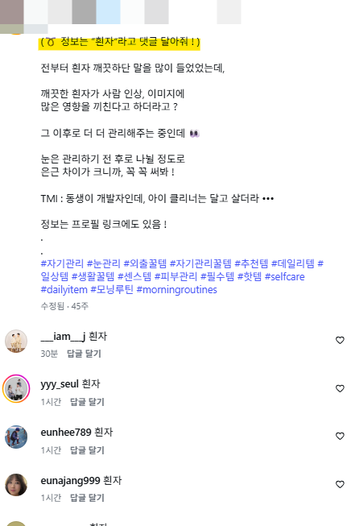
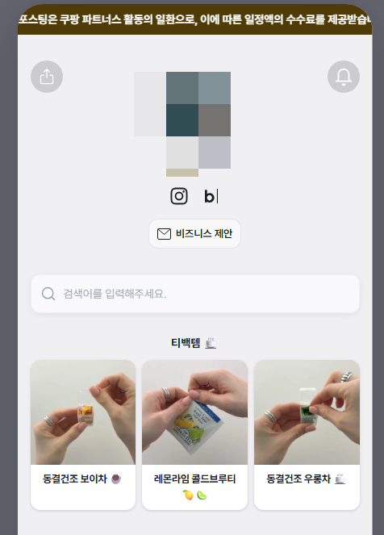
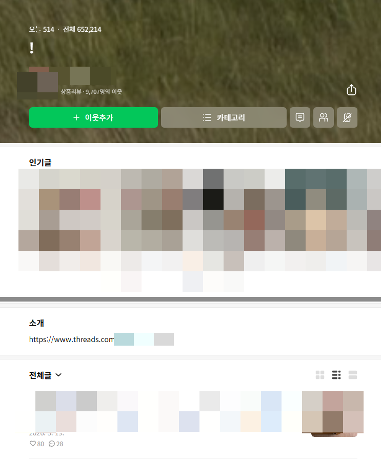

# 외부 유입으로 쿠파스 돌리는 인스타 전략
**Date:** 11시간 전
**Category:** 인터넷노점상
**Original URL:** https://blog.naver.com/xpfkwh56/224423910490
---

**1. 트래픽은 돈이 된다**

​

​

흔히 그냥 보이는 인스타 계정이 있음

​

​

영상을 들어가면 인스타 장르에서

자주 사용하는 문법이 발견 됨

​

댓글 달라는 이유는,

​

**댓글/공유/좋아요** 같은 걸

**​**

**사용자 반응, 리액션,**

**피드백 등등** 이라고 부르는데

​

저런 상호작용이 많으면 많을수록

콘텐츠에 알고리즘이 점수를 줘서 임

​

이런 약간 **'업자틱'** 한 계정의 경우,

벤치마크 대상으로 좋을 수 있음

​

2. 영상은 깔끔한 배경에 생활 잡화 등을

설명하고 사용하는 방식을 사용하고 있음

​

이런 것들을 전형적인

어필리에이트 영상 이라고 함

​

그게 뭐임? ,,

​

어려운 얘긴 아니고 개인 SNS 계정을

마치 **'홈쇼핑'** 처럼 운영하는 것임

​

중국에서 아주 주력으로 쓰는 방식이고,

의외로 판매율이 높아서 돈이 많이 됨

**​**

**3. 요 언니가 교과서적으로 한 부분은,**

​

​

제품 정보를 얻고 싶으면, 프로필 링크로 들어가서

연결된 다른 곳을 **경유** 해야 된다는 부분에 있는데,

​

이러면 시청자가 상품에 대해 관심이 생김

​

→ 프로필 링크 클릭

→ 블로그 or 쿠파스 직링크

​

→ 구매 → 수수료 지급 되는 구조 임

​

**4. 왜 이런 방식을 사용 했을까?**

​

플랫폼이 가장 좋아하는 행위가,

**'다른 플랫폼에서 유입 시키는 일'** 임

​

네이버는 구글 고객을 빼오면 가점을 주고,

인스타는 스레드 고객을 빼오면 가점을 줌

​

근데 빼오기만, 하면 불량한 채널로 간주하고

패널티를 주는데 이걸 다 서로 **'합쳐'** 버리면,

​

결국 서로서로 트래픽을 나눠 갖게 되면서

패널티는 줄고, 리턴은 커지는 구조를 갖게 됨

​

만약 불가피하게 특정 채널이 죽는다고 해도,

어차피 나는 다른 채널 있으니 옮겨가도 됨

​

**\* 주력 개념은 있겠지만, 플랜 B가 있는 셈**

​

**5. 컨셉 브랜딩**

​

본인이 실제 그래서 가능한 것이겠지만,

​

2030 직장인 녀성이 가볍게 구입해서

유용하게 쓸 수 있을 물건들을 큐레이션 함

​

친구가 카톡방에서 너 이거 써봤음?

느낌으로 전달해주는 느낌에 가까운 듯함

​

**6. AI 를 분석에 활용할 수 있는 부분**

​

1) 크롤

2) 썸네일 문구 분석

​

3) 텍스트 문구 단위로 분류

4) 캡션 분석

​

,, 내가 관심 있는 장사는 아니라서

가볍게 그냥 돌려보면 다음과 같음

​

1) 먼저 후킹 도입이 **정형적** 임

**​**

**후킹 도입이 뭐임?**

글을 쓸 때, 제일 앞부분에 들어오는 것임

​

공식은 3문단 이내, 150자 이내 구성이고

​

실제 표현 형태소가 있든, 없든 상관없이

주어, 목적어, 술어가 반드시 있어야 됨

​

철수는 가방을 들었다

영희는 라면을 먹었다

​

같이 딱 봐도 읽혀지면 합격 인 것임

​

2) 의미적으로는 거기에 반드시

**'문제'** 를 드러내는 구성이 들어감

​

1번이랑 연결해서 응용 해보겠음

​

**나는** 환절기만 되면, **피부가 뒤집어져**

→ 피부가 뒤집어지는 사람 누르란 소리임

​

회사에서 쓸 만한 텀블러 없을까?

→ 뭐 ,, 설명이 따로 필요 없음

​

시청층이 겪고 있을 고민을 담은 카피를 넣고,

​

지금 이 **'소비'** 를 통해 문제를 해결했다 라는

내용을 전달하는 구조로 풀어내는 것 임

​

**7. 잡기술**

​

if, 나라면 영상 다 다운 받은 다음에

화면에서 화면으로 전환되는 시간 체크하고,

​

반복되는 방식이랑, 해당 구간을 통해서

어떤 것이 '전달' 되는지 열심히 볼 듯함