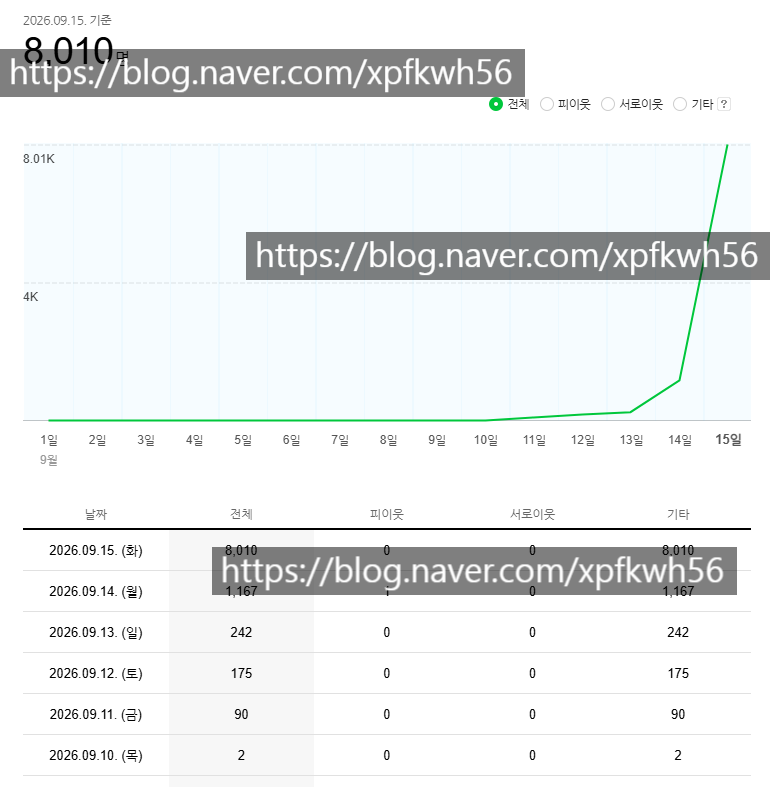

# 통념과 실제
**Date:** 11시간 전
**Category:** 스냅
**Original URL:** https://blog.naver.com/xpfkwh56/224413830291
---

​

**1. 오래 꾸준히 해야 된다? X**

​

확산되는 하드 가드는 있는 것으로 보임

​

근데 그냥 방문자 많이 늘리는 것은

알고리즘에 얼마나 잘 태워지냐 차이고,

​

이게 **'시시각각'** 상황마다 다르기 때문에,

본인이 직접 하면서 볼 수 밖에 없음

​

내 경험상, **진짜 길어야 1개월** 임

​

**2. 공식이 있다? X**

​

개소리 임

​

그냥 뚝딱뚝딱 쓸 수 있고, 품 안 들어가면

네이버에서 자기들이 직접 하지 뭐 하러?

​

입장 바꿔서, 애포든 이권이든 간에

메인에 쓸 **'기자단'** 같은 것을 모집해서

돌릴 수 있다면 그렇게 하는 것이 더 낫지

​

불특정 다수 대상으로 할 이유가 없잖음

​

또한 여기에 **디테일** 이 있는데,

​

네이버가 홈판을

일반인들한테 주는 이유는

**'내 생각에'** 는 **'총알받이'** 임

​

옛날에 노그리드 라는 사람이 했던 것 같은

콘텐츠를 이름 달고 있는 애들이 직접 하긴,

​

부담스러운데, 스레드나 트위터 같은 곳은

그런 걸로 꿀 빠니까 우리도 해볼까? 하다가

아마 하지 않았을까 하는 의심을 강하게 함

​

3. **'좋은 콘텐츠'** 를 쓰면 **'보상'** 을 한다? X

​

좋음의 기준이 무엇인진 모르겠지만,

​

소위 말하는 **'브런치'** 스타일 로는

어지간한 재능으론 택도 없음

​

**'팔리는 글'** 에 보상을 하는 것 임

​

그냥 클릭하고 사람들이 반응하고

자극적이고 도파민 터지고 이러면

​

그걸 좋다고 판단하고 계속 확산 시킴

​

**\* 심하게 선만 넘지 않으면**

​

그래서 **'키우고 싶은'** 블로그 면

본인 애정 있는 블로그 로 하지 마시고,

​

신규블 파서, ai 돌리세여

​

그래야 할 수 있음

​

**4. 네이버 블로그를 벤치마킹 하기?△**

​

**1) 도우인 ★★★★★★★★★★★★**

​

중국 미디어 플랫폼이 **최고 교과서** 라고 봄

​

차마 다 설명할 수 없는 그 특유의,

대륙 감성이 있는데 이게 상업성 좋음

​

[**SEO 기본 가이드: 기본사항 | Google 검색 센터  |  Documentation  |  Google for Developers**

검색엔진 최적화의 기본사항에 관한 지식만으로도 눈에 띄는 효과를 얻을 수 있습니다. Google SEO 기본 가이드에서 기본적인 검색엔진 최적화에 관해 간략히 알아보세요.

developers.google.com](https://developers.google.com/search/docs/fundamentals/seo-starter-guide?hl=ko)

​

**2) 구글**

​

**'콘텐츠'** 를 꾸리는 것이 아니고

내 **'출처 신뢰도'** 를 올리는 작업을 하는 것임

​

1번 2번을 선행한 다음에, 환경 조사를 해야

더 효율적이고 경제적으로 접근할 수 있음