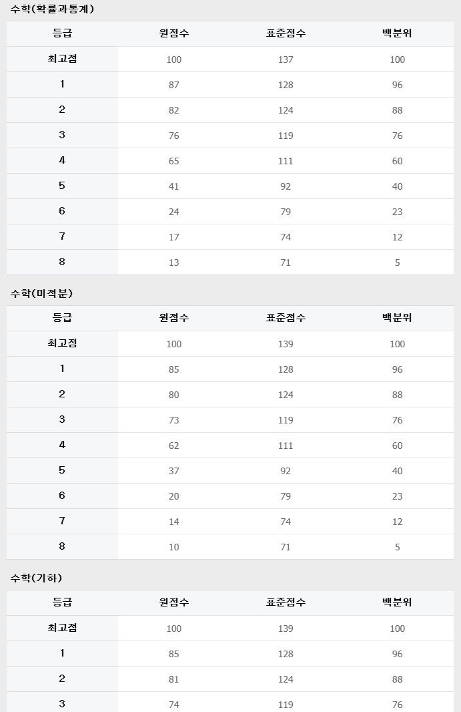

# qwen 3.6 2026 수능수학 깡성능
**Date:** 12시간 전
**Category:** 다이어리
**Original URL:** https://blog.naver.com/xpfkwh56/224256652262
---

​

1. 프롬프트 엔지니어링 없음

2. Tool calling 없음

3. Few show 없음

​

4. 그냥 다 없이 쌩짜, 순수 체급으로만

kv캐시 bf16으로 맥스토큰 4만 주고 함

​

5. 공통수학 21번 문제 파싱 에러

오답으로 치면 1개 틀렸고,

풀었다고 치면 공통수학 다 맞췄구

​

확통 다 맞췄고, 미적분 29, 30 틀렸고

기하 27, 28, 29 틀림

​

**\* 미적분은 그냥 추론을 못한 것이지만**

**기하의 경우는 dpi 이슈가 있어서 애매함**

**​**

**​**

6. 대단히 잘 푸는 것은 아니고,

**아무튼** 1등급 정도라는 뜻인가요?

​

Qwen 3.6 AIME 벤치가 **92.7** 입니다

​

**\* 아무리 벤치와 실체감이 다르다지만**

**저거면 미국수학경시대회 순위권 성적**

​

양자화 띠고, 조금만 잘 깎아서 돌려도

수학으로 사교육 보낼 필요 없을 수 있음

​

**\* 설카포 의치한약수 현역 수준의**

**수학/과학 과외선생을 365 24시간**

**언제든지 불러서 써먹을 수가 있다?**

**​**

영어, 코딩, 과학은 AI 가 전문이라서

어지간한 모델에 물려도 결과 잘 나옴요