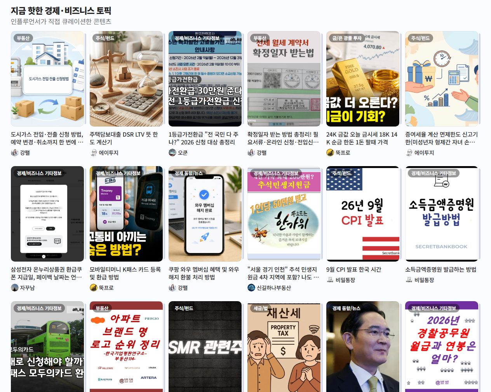
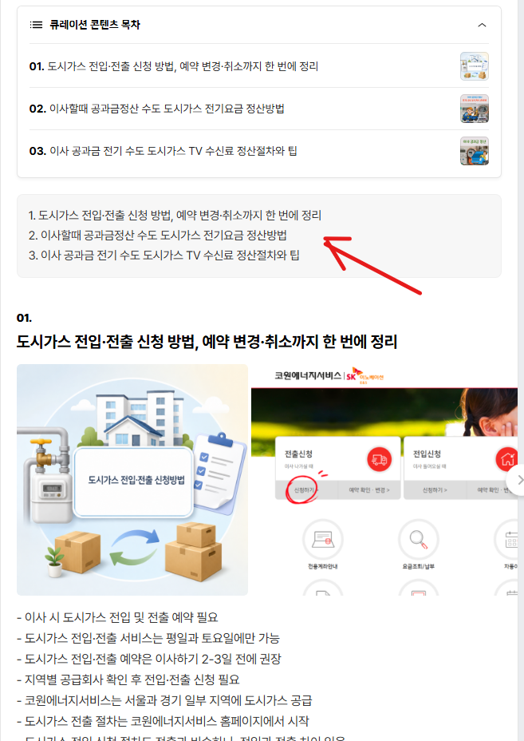
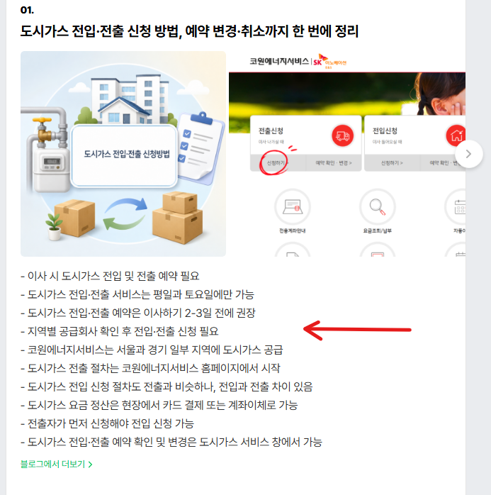

# 신규 블로그 트래픽을 빨리 올리는 방법
**Date:** 12시간 전
**Category:** 스냅
**Original URL:** https://blog.naver.com/xpfkwh56/224410127327
---

1. 아침에 문을 열었더니,

현관에 편지가 **100만 통** 와 있음

​

너무 많아서 다 읽을 수가 없는데,

저기서 **'좋은 편지'** 를 골라야 됨

​

어떻게 해야 될까?

​

2. 여기에는 두 가지 방법이 필요한데,

​

하나는 1) 압축된 정보만 보는 것 이고

또 하나는 2) 휴리스틱으로 가르는 것 임

​

**1) 압축된 정보**

​

편지 내용을 전부 읽을 수 없음

​

이름만 본다던가, 주소만 본다던가

하는 방식으로 편지를 나눌 수 있음

​

예를 들어, 편지 송신지가 자메이카 라던가,

​

중앙 아시아, 이런 지역으로 찍혔다면

어지간한 사람은 그거 볼 필요도 없음

​

만약에 주소가 우리 부모님 집이고,

이름도 우리 부모님 찍혀 있다면?

​

일단 한 번 봐야겠다, 로 좁힐 수 있음

​

**2) 휴리스틱**

​

내가 최근에 인터넷 쇼핑몰에 물건을 샀음

​

근데 그 쇼핑몰에서 온 편지 라면,

낯선 이름이라도 읽어 볼 가치가 있음

​

3. 거칠게 설명했지만, 위 방법이

**'검색 엔진이 문서를 읽는 방식'** 임

​

때문에,

​

1) 블로그 이름

2) 소개글

3) 카테고리 이름

4) 사용하는 태그

​

등등, **'홈페이지'** 자체 내에서

제공하는 정보가 일관적 이며

주제가 알기 쉽게 돼 있어야 하고,

​

특히, 소재에 따라서는

**'신뢰할 수 있어야 됨'**

​

4. 잘 모르면 그냥 블로그 일단 판 다음에,

아무 글이나 쭉쭉 써 보라고 하는 이유가 뭐냐?

​

내가 블로그에 콘텐츠를 쌓아놓고 있으면,

알고리즘이 **'알아서'** 나랑 손님을 연결함

​

이제 문제는 여기서 생김

​

> 같은 일을 해도 난 비싼 손님 받고 싶은데?

​

법률, 의료, 금융 같은 것이

대표적인 **'어려운'** 키워드 임

​

일반인이 본인 신상 노출 전혀 없이,

개인 프로필 정보가 하나도 없는데

​

죽어라 법 얘기, 의학 얘기를 써봤자

​

증명된 진짜 변호사가 딸깍 딸깍 하면서

일주일에 1개씩 올리는 블로그 **'못 이김'**

​

그래서 기본적으로 **'하면 안 되는 섹터'** 를

빨리 버리는 것이 잘 되는 방법 중 하나 임

​

**5. 해서 먹히는 섹터**

​

1) 정답이 없고, 비교할 지표가 없으며,

2) 검색 수요가 지속적으로 발생하고

3) ai가 온전히 판단할 수 없는 분야 일수록

​

**똑같은 글을 써도 노출 될 가능성이 올라감**

​

소화불량 일 때, 먹어야 되는 약 top3 (x)

전문가한테 바로 압살 당하니 절대 불가

​

근데 소화불량 일 때, **먹었더니** 좋았던 음식 (o)

​

개인의 경험담, 후기, 쿼리랑 결속 되므로

ai가 전문성 비교를 **'동질'** 하게 판단함

​

네이버는 기본적으로 **'생활정보'**​ 를 좋아하고,

​

이미 잔뜩 있는 문서가 아니라

새롭게 생성 되는 것에 가점을 잘 줌

​

즉슨,

​

미래에 대한 **전망**, **주관**에 따라 달라지는 것,

**해석이 갈릴 수 있는** 것들에 대해서

​

**명확한 프레임을 갖고** 작성하는 콘텐츠를

​

**'고유하고 개성이 있는 글'** 이라고

여겨서, 그런 것이 많이 수집될수록

​

동기화 된 사람들의 알고리즘에 올려줌

​

6. 초보자가 인공지능을 활용하는 방법

​

**ai야 seo글쓰기 구조에 맞는 글 써 줘 (x)**

​

인터넷에 널리고 널린 어필리에이트 문서의

규격을 그대로 따르기 때문에 노출 매우 안 됨

​

이래서, 중장년층이

오히려 블로그를 할 때

더 **'유리한'** 건데,

​

인터넷 문화에 어두우면 어두울수록

**'유사 문서'** 에서 벗어날 확률이 높아서,

​

그걸 **'고품질 문서'** 라고 인식을 하게 됨

​

**\* Rag 원리**

**​**

일단 편하게 블로그에 글을 50개, 100개 채우고

다 채운 다음에 그냥 html 째로 zip 파일로 묶고,

​

아무 프론티어 ai 한테 보여준 다음에,

**'읽고 이게 무엇인지 설명'** 해달라고 하면

​

ai 가 알아서 이 블로그의 **'톤'** 을 억지로 찾아냄

​

그게 **'기계가 내 블로그를 본 방식'** 임

​

좀 더 세련되게 하고 싶은 경우는,

​

<https://www.ncloud.com/product/aiService/clovaStudio>

[**NAVER CLOUD PLATFORM**

cloud computing services for corporations, IaaS, PaaS, SaaS, with Global region and Security Technology Certification

www.ncloud.com](https://www.ncloud.com/product/aiService/clovaStudio)

​

여기 들어가면 네이버 네이티브 임베딩,

클로바 api 를 사용할 수 있는데

​

이거로 내용을 **요약** 하게 하거나,

네이버 ai 가 문서를 **'이해'** 하는 방식을

​

역공학 해서 읽어내면 됨

​

<https://in.naver.com/discover>

[**네이버 인플루언서**

관심분야의 전문 창작자를 만나는 곳

in.naver.com](https://in.naver.com/discover)

​

네이버 인플 디스커버에 들어가면,

​

​

스크롤 내릴 때, 피드 토픽 나옴

​

​

이렇게 밑에 있는 카드 읽어보면,

​

검색엔진이 **'문장'** 을 어떻게 **'정보'** 로

깎아내는 것인지 볼 수 있는데

​

1) 정보를 **'정돈'** 하는 원리를 구조화 하고,

​

2) 구조화 된 정보 안에서

엔티티/클러스터/그래프 같은

​

요소를 추출하면, 내 블로그 를

**'기계가 인식한 결과'** 를 알 수 있음

​

그렇게 해서 최종적으로 한 덩어리가 나오면,

​

그게 **'신뢰할 수 있는 문서, 작성자'** 에 대한

기준으로 활용되는 것임

​

배울 필요는 없는데, 하면서

본인이 **'볼 수'** 있어야 될 것임

​

**7. 결론**

​

1) 1일 1포 하면 될까요?

​

**남들이 몇 개 올리냐에 따라 다름**

​

남들이 10개 올리면 나는 11개

남들이 20개 올리면 나는 21개

이렇게 올려야 됨

​

2) **받아쓰기** 하면 트래픽 오를까요?

​

재진술 정보는 유사성 때문에

노출 점수 에서 열위일 확률 높고,

​

신원, 권위 정보 자체가 높지 않으면

그냥 본인 취미활동 한 것과 다름 없음

​

단, 키워드에 따라 차이가 있는데

​

평범한 사람이 이걸 구분하면서

작성하는 건 **불가능** 에 가까우므로,

​

의식하지 않고 그냥 하는 것을 추천함

​

**\* 안다고 크게 다른 것도 아니라서**

​

3) 그냥 꾸준히 올리면 될 수도 있나요?

​

제목 잘 고르고, **눈치** 빠르고, 여론 읽고

분위기만 잘 따라가도 **월 200?** 정도는

아마 어렵지 않을 것이라고 추측되고,

​

일단 내 경험에 의하면 1만블이 **벽** 임

​

1만블 찍히면 그 시점에서는 이제 아예

블로그 성격이 고착화 돼버리기 때문에

​

바꿀 수도 없고, **그대로 가야 되는데**

​

상업성, 수익성, 영속성이 떨어지는

블로그로 이미 멀리 간 상태 라면

살짝 피곤할 가능성이 있을 수 있음

​

고로, 그냥 나는 부업 삼아 하고 싶다

​

그럼 최소한 다른 '**부업'** 삼아서 하는

사람들보다는 전문적 이되, 고점 자체를

그렇게 높지 않게 보는 것이 방법 같고,

​

나는 프로 레벨을 보고 있다?

그럼 시작부터 기획을 쥰내 잘해야 됨

​

하루에 5포 이상, 내가 1개월 돌렸는데

한 달 내내 블로그 방문자가 1만 안 찍혔다

​

**\* 글이 최대 50개는 쌓이기 전에 반응 옴**

**​**

그럼 방향이 뭔가 **틀린 것** 임

​

최근 2개월 기준, 동향으로 볼 때

제대로 하고 있으면 그럴 수가 없음

​

빠르면 3일에도 만블 찍히고

5천블 이상 유지됨