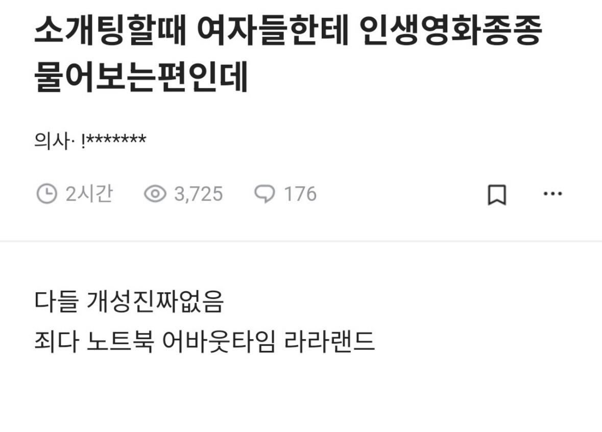

# 잡기술
**Date:** 12시간 전
**Category:** 스냅
**Original URL:** https://blog.naver.com/xpfkwh56/224426054140
---

​

1. 영화 관심은 있는데 잘 몰라서

기억에 남는 것이 없다고 한다

​

2. 추천 해달라고 한다,

알려 달라고 한다,

​

맨즈 플레인 할 수 있게 한다

​

3. **'남자가 추천했거나 언급한 거'**,

**'집에 가서 찾아본 다음에'**

​

님 덕택에 찾아 봤는데 재밌더라 ←

​

4. 저 질문 자체가 답정너 임

​

어차피 어떤 영화를 말해도 평가당하니까,

차라리 모른다고 하고 상대가 자기 얘기를

하게 판을 깔아 주는 처세로 대응하면 됨

​

**\* 내가 이 여자한테 영향력을 미쳤다**

**→ 호감 스위치**

**​**

**근데 막 어맛, 저 이런 것 처음 봤어요**

**이렇게 하면 좀 푼수처럼 보이니까**

**​**

**리액션 위주로 눈치껏 상대가 의도하는**

**반응 봐가면서 따라가면 좋을 확률 큼**

**​**

**인생 영화 뭐임?** 걍 답 정해져 있음

​

애초에 남자가 재밌게 본 영환데,

그거 너랑 봐서 좋았다고 하면 됨

**​**

5. 사족으로,대부분 **'저런 자리'** 에서는

내 개성/자아 죽이고 있으면 본전은 가는데

​

그게 피로해서 알아도 안 하는 사람 많음