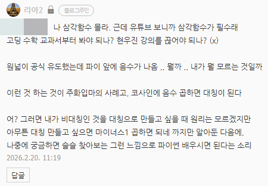

# 공부하는 방법
**Date:** 13시간 전
**Category:** 다이어리
**Original URL:** https://blog.naver.com/xpfkwh56/224189197467
---

삼각함수 알려면 중학 기하, 중학 기하 알라면 초등 도형 ,, 끝도 없음

​

주화입마 케이스일 때, 고수 찾으면

적분 범위를 바꿔봐! 같은 말 들을 것

​

맞는 말이지만, 쓸모 있는 말은 아님

​

아, 이상하다 좌우 대칭은 되는데

왜 상하 대칭은 안 되는 것이지?

​

어라? 또 이럴 때는 상하는 되고,

저럴 때는 좌우가 안 되고 이러네?

​

가 되면, **'자연스럽게'** 알게 됩니다

​

**\* 바이브 코딩만 하면 하나도 안 읽고,**

**결과만 보고 매크로 돌리기 쉬운데**

**그렇게 하면 매번 똑같은 입장에 놓임**

**​**

**이렇게 하니까 되더라, 저렇게 하니까 되더라**

**이거만 계속 반복해서 패턴만 학습하는 것임**

**​**

**만약 가짓수가 100개?**

**100개 다 넣어봐야 됨**

**​**

본인이 수학 공부 학교 다닐 때,

조금 더 열심히 했으면 **더** 빠르구요

​

**\* 만약 본인이 이과 였으면 왜**

**좌우/상하만 되나 모를 수가 없음**

**​**

파이썬도 딱 저렇게만 알면 충분했읍니다

​

예전에 리스트, 딕셔너리

물어보셨던 분 계신데

​

핸드폰 켜서, 전화번호부 보시라고 했음

​

이게 전부도 아님, 주민센터 번호표 부터

본인이 알고 있는 지식을 연결하면 간단함

​

그냥 어렵게 배우니 어려운 것임

​

우린 다 똑같은 호모 사피엔스종이구,

모두 동일한, **적응의 천재들**의 후손임

**​**

전부 엄청난 학습 두뇌를 보유하고 있음

​

**\* 불가피하게 자꾸 이래저래 치이면서,**

**자기 본래 능력을 망각하고 있었을 뿐임**

**​**

아무리 잘난 인공지능 기계를 가져와도,

보통 사람이 가진 뇌에 비하면 하잘 것 없음

​

**\* 순수 하드웨어 스펙만 비교한다면**

**성능, 효율, 모든 면에서 인간이 압도**

**​**

**덧셈/뺄셈할 때, 두개골 안에 있는 뇌 온도가**

**번개 같이 80도까지 오르고 그렇지 않잖아요**

**​**

함수 정의역, 치역, 공역 → 현학적임

​

함수는? 자판기, 엘레베이터

→ 50 page 단숨에 스킵

​

상속, 포인터 아아 머리가 아프다

붕어빵, 붕어빵틀 → 초고속 스킵