# 애플
**Date:** 13시간 전
**Category:** 다이어리
**Original URL:** https://blog.naver.com/xpfkwh56/224264597420
---

[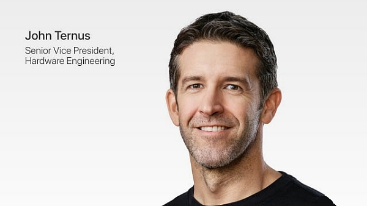](#)

​

1. 얼마 전, 따끈한 뉴스가 나왔음

​

팀쿡이 금년까지만 애플 대장을 하구,

이제부터는 존 터너스 라고 하는

새로운 사람이 CEO 가 된다는 것임

​

2. 애플 정도 되는 기업이라면,

국가권력급 사이즈이기 때문에

​

이런 회사의 수장으로 올 사람이

누구고, 어떤 DNA 를 가졌냐? 는

​

앞으로 기업의 행보나, 향방에 대해

어느 정도 짐작해 볼 수 있는 힌트가 됨

​

3. 존 터너스는 50대

**하드웨어 엔지니어** 로,

​

원래 내정자로 유력했던

제프 윌리엄스 와 비교하면

히스토리에 차이가 있음

​

팀쿡의 경우, 널리 알려진 것처럼

**운영, 효율**에 S급 랭크 찍은 양반임

​

[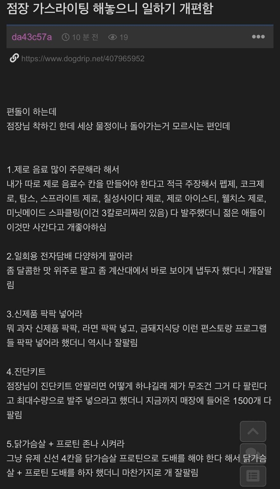](#)

[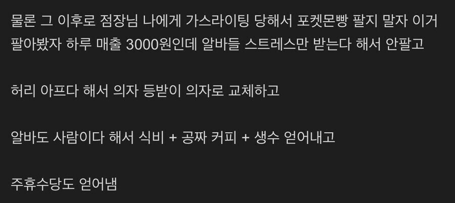](#)

[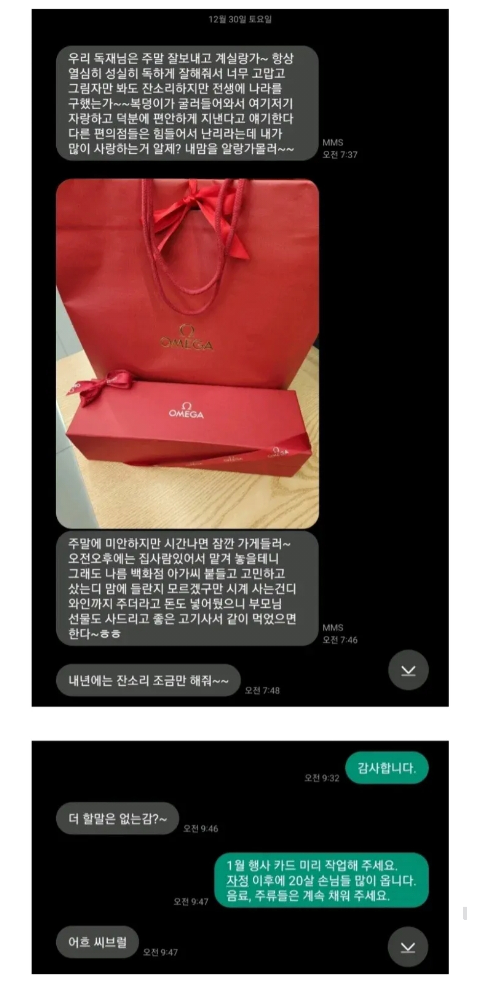](#)

​

약간 저런 알바 같은 캐릭터인 셈인데,

제프 윌리엄스가 팀쿡 MK2 였음

​

은퇴를 해서 자리를 못 준 것인지,

눈치껏 알아서 빠진 것인진 모르겠지만

​

그 큰 회사에서 운영/효율 스텟이 S랭크 인

인재가 없어서 하드웨어 엔지니어 한테

냅다 CEO 자리를 주지는 않았을 것 같고,

​

애플 이사회 측에서, AI를 깡체급

모델 싸움으로 보기보단 **디바이스** 싸움으로

보고 있다고 유추해 볼 수 있을 것 같음

​

4. 미국 빅테크가 인공지능

시장을 보는 갈래는 다음과 같음

**​**

**1) 데이터 센터를 늘리자**

​

때는, 2017년

​

<https://arxiv.org/abs/1706.03762>

[**Attention Is All You Need**

The dominant sequence transduction models are based on complex recurrent or convolutional neural networks in an encoder-decoder configuration. The best performing models also connect the encoder and decoder through an attention mechanism. We propose a new simple network architecture, the Transformer...

arxiv.org](https://arxiv.org/abs/1706.03762)

​

비틀즈 가사를 차용한 논문이 하나 나옴

​

내용을 거칠게 축약하면,

​

**'뛰어난 성능의 그래픽 카드를 병렬로**

**연결해서 연산을 시키니까 갑자기**

**컴퓨터에 사람 같은 추론 능력이 생기고,**

**많이 연결하니까 더 성능이 좋아지네?'** 임

​

왜 그렇게 되는데?

​

뭐 대충 이런 것 같은데,

정확한 이유는 모르겠어

​

**아무튼 좋은 GPU 쓰면 된단 말이지?**

**좋은 GPU 만드는 회사 없나?**

​

[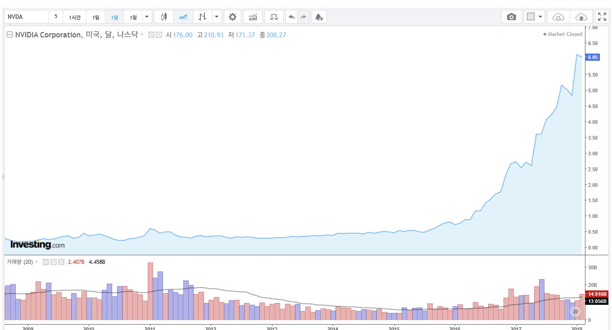](#)

​

하던 사이에, 미국에 있는

1달러도 안 하던 개잡주가

​

단기간에 6배가 넘게 뛰게 되고,

​

[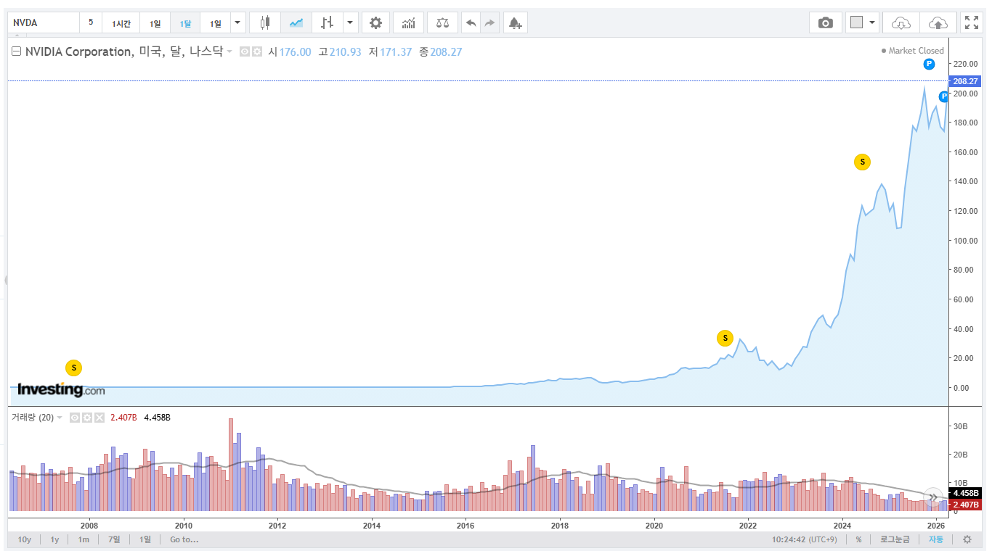](#)

​

5조 달러 기업이 됨

​

[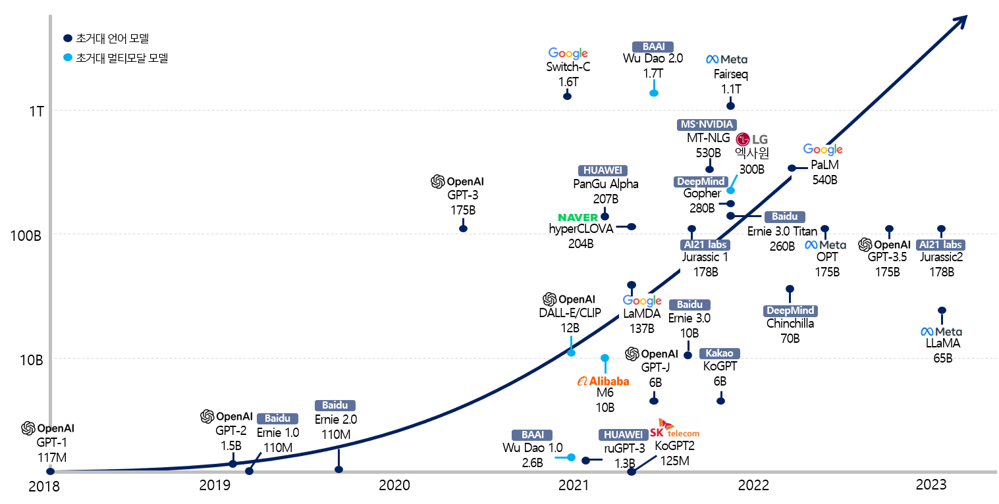](#)

​

2018년 오픈 AI에서 처음 GPT-1

모델을 만들었을 때, **117M** 이었음

​

1년 뒤에는 1.5B 모델이 나왔고,

​

**\* 1B = 1000M**

​

그 다음에는 175B 에 달하는

최첨단 모델이 나오면서

슬슬 인공지능의 대중화가 열림

​

GPT-1 까지만 해도, 잘 쳐줘야

신기한 장난감 정도에 불과했지만

​

GPT-3 부터는 확실히 누가 봐도

이건 **'다르다'** 를 체감할 수 있었고,

​

3-3.5 모델 언저리 무렵 부터는

국내에서도 **이건 심심이가 아닌데?**

라는 반응이 슬슬 나타나기 시작함

​

모델 크기를 늘린다,

학습 데이터를 늘린다,

컴퓨팅 자원을 많이 쓴다

​

를 무작정 많이 때려 넣다보니까,

​

**'분명히'** 성능이 늘어나게 되었고

100B, 300B, 500B, 1T 모델이 나옴

​

1B에서 2B로 늘릴 때보다

100B에서 200B로 늘릴 때,

​

성능 향상이 좀 더뎌지긴 했지만

​

**'그래도'** 올라간다는 것 자체가

유의미한 가능성을 시사해줬고,

​

​

아무튼 짱짱 좋은 GPU 를

계속 넣으면 마지막에는 어쩌면

​

**'신(AGI)'** 이 나올 수 있다고

다들 기대를 하고 있던 중이었음

​

**\* AGI = 초지능**

**​**

2) 근데 다른 빅테크들이

스케일링에 열 올리고 있을 때,

​

**'치사하게'** 돈을 벌던 회사가 있음

​

[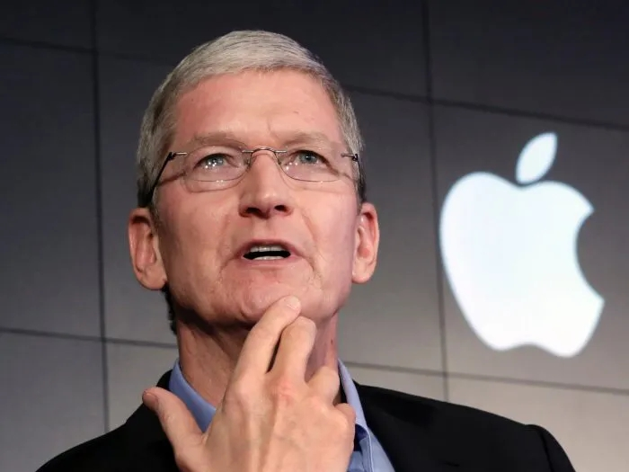](#)

​

스케일링? 오케이 이해했어

데이터센터를 늘려서 고성능 AI 를

선점하고 어쩌고 저쩌고?

​

**니들이나 많이 하렴**

​

팀쿡은 여러 의미로

**요망한 장사치** 였는데,

​

[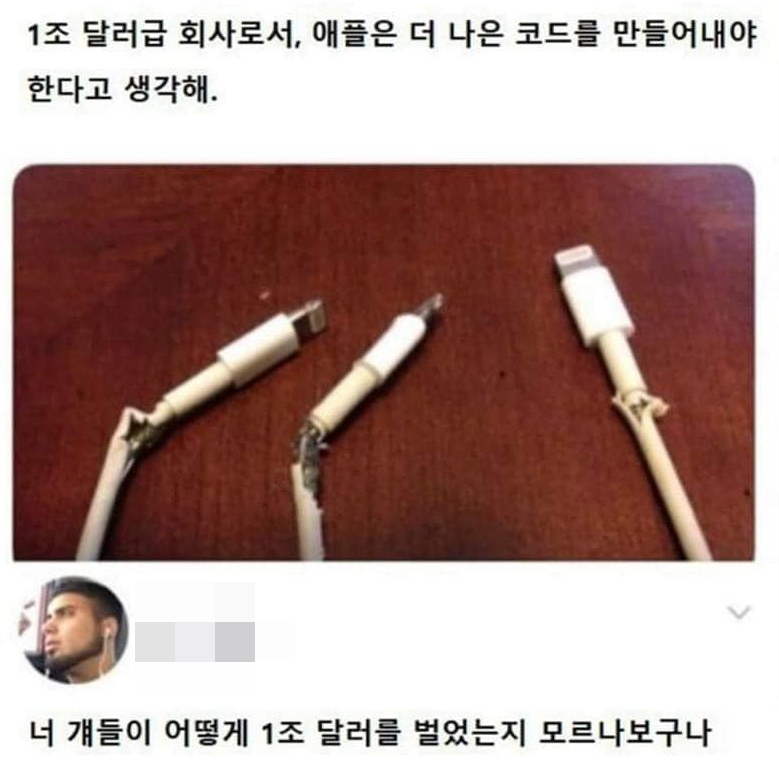](#)

​

좋은 의미로는 수익성 향상에 집중했고,

​

나쁜 의미로는 애플 끕에 맞는 비전을

명확하게 못 이끌어내는 행보를 보였음

​

**5. 재밌는 점은, 대 AI 시대가**

**약 10년 지난 지금 시점 부터임**

​

<https://huggingface.co/Qwen/Qwen3.5-0.8B>

[**Qwen/Qwen3.5-0.8B · Hugging Face**

We’re on a journey to advance and democratize artificial intelligence through open source and open science.

huggingface.co](https://huggingface.co/Qwen/Qwen3.5-0.8B)

​

2018년, 세계 최고 모델이었던

117M 보다 훨씬 거대한 모델을

​

지금은 불과 **VRAM 2GB**

정도만 있으면 돌릴 수 있음

​

롤 최고사양 정도 돌아가는 PC 면

그냥 **가뿐하게** 굴릴 수 있는 수준 임

​

[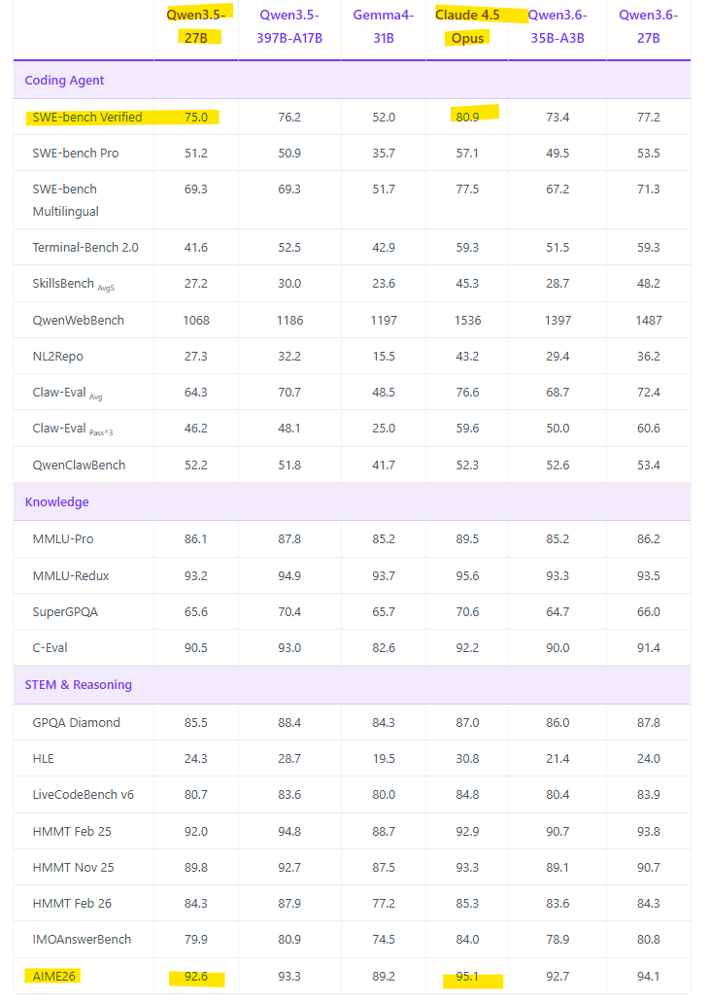](#)

벤치와 실성능 차이가 있긴 하지만

​

최근에 나온 QWEN3.5 27B 모델은

클로드 4.5 오퍼스 모델에 부분적으로

필적한다는 결과가 나오기도 했고,

​

실체감 성능으로도, 멀티 모달 기준

VLM 공간 추론은 **심지어** 잘하기도 함

​

밑에 있는 AIME26 이라는 벤치는,

​

마치 IMO 같은 상당히 어려운

수학 문제를 풀어내는 테스트인데,

​

27B 모델이 오퍼스랑 비교할 때,

벤치 성능상 **'3%'** 밖에 차이 안 남

**​**

둘 다 똑같이 문제를 풀라고 시키면,

​

100번 시켰을 때 오퍼스는 95번 정답

QWEN 은 92.6번 정답이 나온단 것임

​

엥? 뭐야 그럼 그냥 QWEN 으로

문제 2번 풀게 시키면 되는 것 아님?

​

**맞음**

​

**\* 체급 차이 때문에 추론력 자체에**

**하자가 있다면 모를까, 동 체급 내에서**

**유사한 벤치가 나오면 큰 의미가 없음**

​

?? 그럼 코딩도 라이브 벤치 코딩으로

오퍼스한테 맡길 바에 QWEN 한테 그냥

한 번 더 시키면 된다는 말인가요?

​

**맞음!**

​

**\* 에이전트 루프, 콜링, 긴 텍스트 추론,**

**이런 것들도 다양한 대안 트릭들이 있음**

**​**

QWEN 27B 모델을 집에서 돌리려면,

​

27B \* 2 = 54GB 에다가

KV 캐시 포함해서 넉넉히

60-70GB 정도 있으면 되는데

​

가격으로 따지면, **'때려 죽어도'**

저걸 세팅하는 값이 **'1억'** 을 안 함

​

[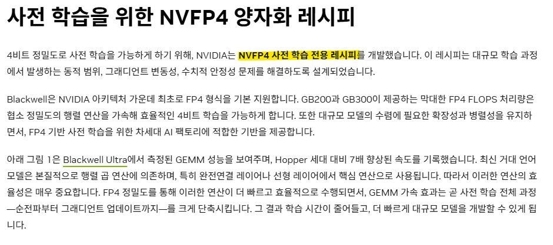](#)

​

심지어 엔비디아에서 개발한

NVFP4 양자화 기술을 사용하면

​

**'4비트 양자화'** 로 경량화 해서,

​

27B \* 0.5 = 13.5GB 면

돌아간단 이론상 계산이 나오고

​

오버헤드 감안해도,

32GB 짜리 글카 하나면

​

실제 직접 본인이 써볼 수도 있음

​

양자화로 잃는 정확도는?

벤치 실측 기준 **1% 미만** 임

​

27B 모델 기준, 92.6 나왔으면

91.6 정도로 벤치 점수를 희생하고,

VRAM 은 **4배** 덜 쓰고 쓸 수 있음

​

**QWEN 3.5 27B 모델이 최고네?**

​

[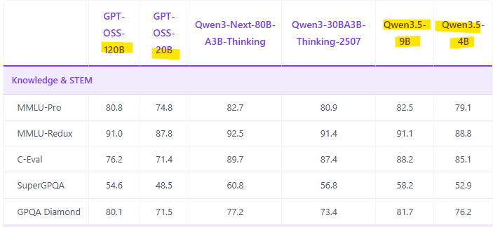](#)

​

9B, 4B 모델은 GPT-OSS 랑

비교해도 성능이 훨씬 더 뛰어남

​

어!?

​

> 스케일링이 안 통한다?

​

바로 **'그거'** 임

​

[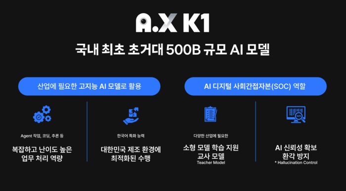](#)

500B가 무슨 의민지도 모르겠지만, 심지어 MOE 임

​

국내에서는 K-AI 라고

500B 모델을 만들었다면서

언론에 한참 떠들고 있지만,

​

깡체급 올려서 성능 끌어올리기는

이제 끝물이라는 것이 **다수설** 이고,

​

어지간히 나올 기술은

**이미** 다 나왔기 때문에,

​

이제 이걸 얼마나 누가 더 잘 깎아서,

**효율적으로** 집행하느냐 싸움이 됐음

​

**\* 알고리즘 혁신이 중요해짐**

​

6. 물론 데이터센터가 자체만으로도

추론 수요를 다 잡아먹을 수 있다던가,

​

**\* 이 경우, 매우 비관적인 시나리오 임**

**추론 토큰 가격 전망이 좋지가 않아서**

**​**

그 외 다른 용도를 충족시킬 수는 있고

​

**'진짜'** 차세대 **AGI** 가 나와버린다면,

​

CAPEX 투자를 하지 않던 기업들은

선점 효과를 잃고 **바로** **밀려남** 당함

​

근데 실컷 열심히 다 지어놨는데,

생각했던 결과가 나오지 않는다면

​

[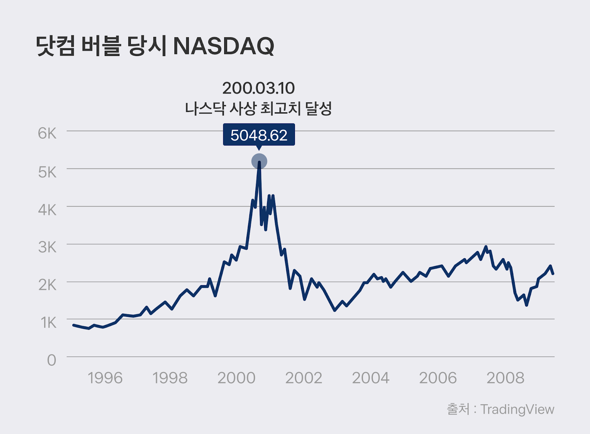](#)

​

**역대급 버블** 이 꺼질 가능성도 있긴 함

​

인공지능 기술의 장점은 전례없이

유망한 미래기술이란 점이고

​

단점은 여태껏 제대로 돈을

벌어본 적은 아무도 없단 것임

​

7. 애플의 경우, 데이터 센터가 없음

​

​

애플은 **여기서 아무나 싸워서 이겨라**,

**이기는 편이 우리편 이라는 포지션** 임

​

**\* 싸워서 1등 하는 비용 >>>>**

**이긴 사람이랑 협업하는 비용**

**​**

요망한 장사치 팀쿡은, 애초에 애플의

실권을 잡기 시작했을 때 자체 공장을

​

싹 폐쇄하고 폭스콘 등

외주 체제로 전환했으며,

​

[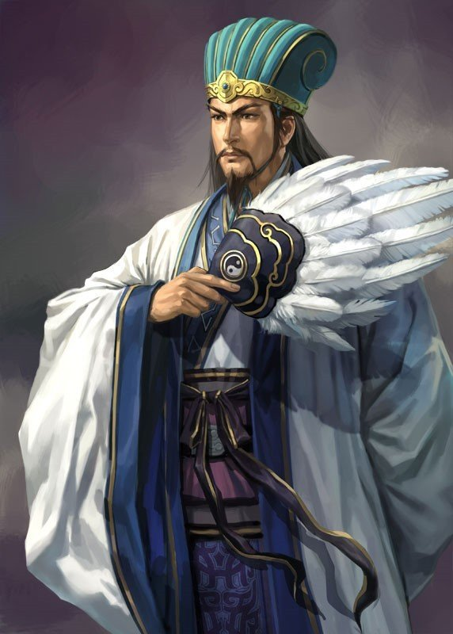](#)

​

최대 업적 또한 애플의 글로벌

공급망을 기획/형성한 것임

​

**\* 평가가 갈릴 순 있겠지만**

​

**아마**, 이사회의 뷰는 이랬을 것임

​

1) 모델 자체로는 차별화가 어렵다

오픈 AI, 앤트로픽, 구글, 중국 모델까지

성능 격차는 계속 좁아지고 있다

​

**모델로 돈을 벌기는 아주 어렵다**

​

2) 앞으로 진짜 가치는 AI 를

어디서 어떻게 쓰느냐에 있다

​

데이터 센터? CAPEX 지옥,

심지어 마진도 박하고 고생만 함

​

온디바이스? 칩 + OS + UX 수직통합

이거는 애플이 **'압도적으로'** 잘 하는 것

​

**즉, 미래를 주도하는 진짜 역량은**

**하드웨어를 정의할 수 있는 능력**

​

3) 그럼 우린 어떤 사람이 필요한가?

​

모델을 잘 만드는 사람

→ 이미 남들이 잘 함

그거 그냥 빌려쓰면 됨

​

알아서 피터지게 싸우고 있어서,

적당한 아무나 골라쓰면 그만임

**​**

**\* 반도체 그거 대만이나, 한국이나**

**걔네가 진작에 알아서 잘 하니까**

**우리는 우리가 잘 하는 것 하면 됨**

​

운영을 잘 하는 사람

→ 리즈시절, 도요타급으로 짜내고 있음

**​**

**애플의 칩과 디바이스를**

**새롭게 정의할 수 있는 사람**

​

그게 우리가 필요한 사람이다

​

애플은 이 게임에서 모델 경쟁이 아니라,

**온디바이스 비저너리** 를 봤다고 생각 함

​

**\* 그러니 애플 비전이니 뭐니,**

**온갖 희한한 것들에 관심 보인 것**

​

8. 팀쿡의 업적은 잡스가 만든 예술품을

글로벌 머신으로 변환했다는 것에 있음

​

악성 재고를 하나도 남김없이,

만들자마자 팔린다 수준으로 바꿨고

​

**\* 재고가 돈임? 팔아야 돈이지**

​

부품값을 후려치고, 환율을 헷징하고,

외주 업체들에게 협상력을 행사했으며

​

신제품을 출시 첫날부터 수천만 대 깔아놓고

최소화된 리드 타임으로 양산 램프업 했었음

​

그리고 앞으로 애플에서 **'할 것 같은'**

움직임은, 이제 여태껏 잘 만들어놓은

​

AI 를 디바이스 모델에 얹어가지고

​

**'님들아 이 물건은 이렇게 쓰는 것입니다'**

를 시장에 제안하는 형태로 갈 것 같은데,

​

**\* 구글이 젬마를 경량으로 만들어도,**

**구글은 그걸 돌릴 수 있는 폰이 남의 것**

​

<https://youtu.be/gFLsqX9fRWc?si=21CD6InCy2nSAjQd>

​

태반은 내 뇌피셜이지만,

​

만약 저대로 판을 짰다고 가정하면

애플은 장사를 잘 하는 회사 같음