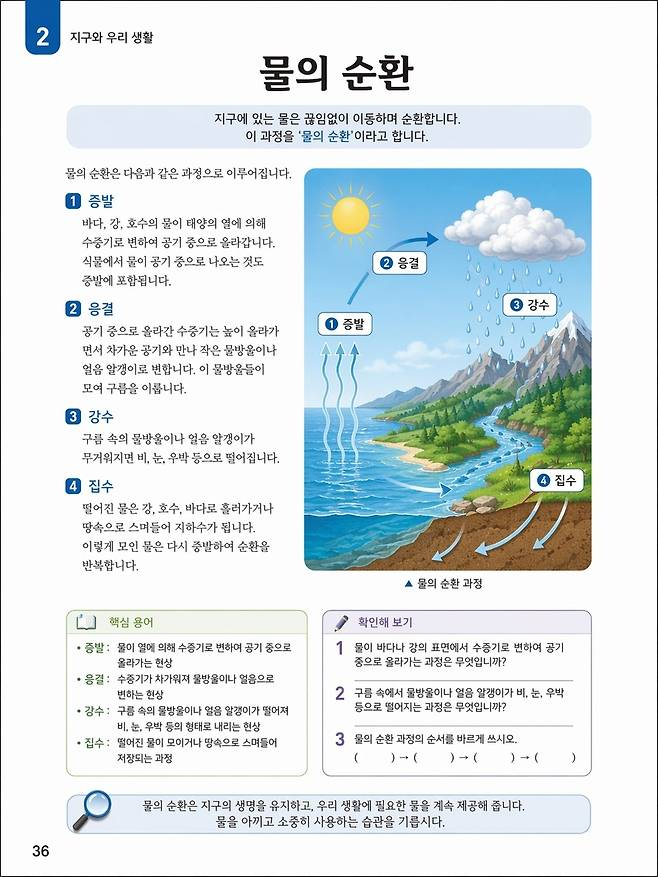

# 덕테이프가 뭔데요?
**Date:** 14시간 전
**Category:** 다이어리
**Original URL:** https://blog.naver.com/xpfkwh56/224262242880
---

<https://youtu.be/-7JSa_luc6k?si=Iga3RgrpaoZEXoci>

​

1. 실제 될진 모르겠고,

개발사 + 사람들 뇌피셜을

다 포함해서 나온 것들임

​

**\* 막상 실사용 케이스가 쌓여야,**

**진짜 였는지 구라였는지**

**제대로 증명이 될 것 같음**

**​**

**2. 다국어 이미지 렌더링 지원**

​

영어, 중국어 정도는 꽤 잘 쓰는데

**'다국어'** 를 잘 쓰는 모델은 **없음**

​

근데 그냥 깔끔하게 이미지로다가

텍스트를 다 뽑을 수 있다고 함

​

**이게 되면 뭘 할 수 있는데?**

​

망고보드 포스터 완성품 같은 것을

그냥 AI 이미지로 뽑을 수 있어짐

​

지금도 돌아가는 모델은 많은데?

​

교과서 직접 집필하기 같은 것도 가능

​

**콸리티가 다름 ;;**

​

프로 디자이너가 포토샵 굴려가지고

뽑는 수준으로 레이어 단위 에서

​

만드는 작업을 프롬프트 단계에서

해낸다는 것이 말이 안 되는 것 임

​

**3. 이미지 일관성**

​

굉-장히 어려운 기술 중 하나가

이미지 일관성인데 이게 왜 어렵냐

​

매 연산이 다 독립적이라서 그럼

​

즉, 내가 이미지를 하나 만들었음

그럼 거기에 있는 세부 정보들이

다른 이미지로 다 연결이 안 됨

​

그래서 **'얼추'** 비슷하게는 뽑아도

깎는 작업이 없으면 불가능 한데

​

덕테이프 쓰면, 뚝딱뚝딱으로도

**'웹툰'** 같은 것을 **누구나** 만들 수 있음

​

게임 캐릭터 같은 것도,

​

지금은 아주 복잡하게 해야

할 수 있는데 덕테이프에서

공개된 내용만 따라서 보면,

​

그냥 아무 이미지나 하나 갖고 두면

걔가 칼 휘두르고, 마법 쓰고,

이러는 것을 전부 다 딸 수 있음

​

4. 지금 이게 Sota 모델인지,

묶었다가 풀어준 건지 모르겠는데

​

만약에 이 **'다음'** 도

이미 있다고 가정하면,

​

아마 디자이너 라는 직업은

**길어야** 5년 안에 없어질 것임

​

개발자도 없어진다던데

결국 아니지 않음?

​

아니 이건 진짜 좀 다름 ;;

​

원래 있던 그림 모델은 심심이 였는데,

​

지금 나온 그림 모델은 챗GPT 정도로

바뀐 차원이 다른 혁신이라 보시면 됨