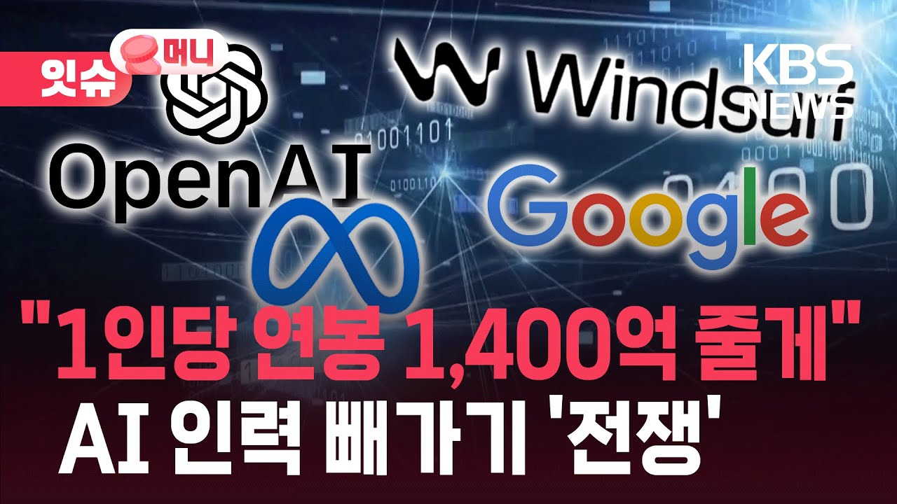

# 모두에게 AI 자비스는 가능할까?
**Date:** 14시간 전
**Category:** 스냅
**Original URL:** https://blog.naver.com/xpfkwh56/224429389428
---

<https://github.com/open-jarvis/OpenJarvis>

[**GitHub - open-jarvis/OpenJarvis: Personal AI, On Personal Devices**

Personal AI, On Personal Devices. Contribute to open-jarvis/OpenJarvis development by creating an account on GitHub.

github.com](https://github.com/open-jarvis/OpenJarvis)

<https://github.com/kishanrajput23/Jarvis-Desktop-Voice-Assistant>

[**GitHub - kishanrajput23/Jarvis-Desktop-Voice-Assistant: A python based desktop voice assistant capable of executing system-level commands, integrating speech recognition and text-to-speech, and handling asynchronous user interactions.**

A python based desktop voice assistant capable of executing system-level commands, integrating speech recognition and text-to-speech, and handling asynchronous user interactions. - kishanrajput23/J...

github.com](https://github.com/kishanrajput23/Jarvis-Desktop-Voice-Assistant)

​

1. **긴빠이** 라는 은어가 있음

​

​

아주 쉽게 말하면 표절 임

​

2. 중국의 실상 **모든** 모델들은

미국 빅테크 모델을 긴빠이 함

​

그럼 미국 빅테크는 창조적이고,

개성적으로 연구를 하고 있을까?

​

그런 경우도 없다고 할 순 없겠지만,

​

**\* 연봉 130억씩 받는, 수천억씩 받는**

**개발자들이 세상에 없는 걸 만들기도 함**

​

​

세상 돌아가는 일 이라는 것이

극소수의 천재가 길은 열 지언정,

​

현실은 **'평범한 사람들'** 에 의해 움직이듯

대부분 오픈소스 서비스를 훔쳐서 씀

​

3. 즉, 오픈 소스 플랫폼에서 나온

주목 받는 서비스 → 미국 빅테크 긴빠이

→ 미국 빅테크에서 잘 깎아놓은 서비스

→ 중국 AI 개발자들이 긴빠이

​

라는 공식을 통해서, AI 기술이 **유포** 됨

​

4. 현재 뮤즈니 닷이니, 하면서

AI 비서 얘기가 나오는데

​

물론 내가 그렇게 많이 써본 것도 아니고,

자세히 아는 것은 아니지만 아주 높은 확률로

​

**'그리 특별할 건 없는 기술'** 일 것임

​

5. 그게 무슨 소리냐? 내가 써봤는데,

물론 한국에서 쓰려면 잡기술을 요구하나

진짜로 항공권도 예매하고, 물건도 사던데

​

드디어 인공지능 기술이 개인에게 내려와,

​

모든 사람들이 혁신 제 4차 산업 무인화

기술을 영위할 수 있는 시대가 된 것 아니냐?

​

선생님이 쓰고 계신 그 기술은,

그냥 **'컴퓨터 프로그래밍'** 입니다

​

코딩을 모르니까, **'코딩된'** 것이

놀랍게 느껴질 따름인 것이지요

​

**\* 90대 할아버지가 오늘 처음 스마트폰 구입하시고**

**유튜브 영상 보면서, 와! 핸드폰으로 영상을 보다니!**

**라고 하는 상황이랑 큰 차이가 있는 상황은 아님**

**​**

6. 사람들이 기대하는 AI 기술은,

​

딸깍 하고 키보드에 채팅만 치면

자기가 알아서 실제 조사를 하고,

​

조사된 사실 근거를 바탕으로

자료를 수집해서 의사 결정을 하고

​

**알맹이만 사람에게 달랑 주는 것이나,**

​

일단 내가 유튜브나 여러 커뮤니티들을

읽어봤을 때, 사람들이 쓰는 방식을 보면

​

원래 자기가 클릭하고, 자기가 읽고,

자기가 했어야 되는 작업을 하나로 묶어

​

반복 수행하는 걸, AI 가 도와주기만 하면

**개인 인텔리전트 서비스** 라고 부르는 것 같음

​

**\* 판단이 없는데 왜 그게**

**인텔리전트 인진 잘 모르겠음**

**​**

7. 그럼 이 서비스가 **'국내'**에서 가능할까?

​

**나는 솔직히 극도로 회의적이라고 본다 ,,**

​

1) AI 브라우징 에이전트 기술이 나오면서

앞으로 기업들은 보안에 투자하게 될 것이다 X

​

사이버 기술에 기업이 투자하고,

자본이 들어간다는 소리는

​

**의대 가지 말고, 공대 가라는 말과 동일**

​

공대도 그냥 공대 아니고 기초 과학 연구해서,

노벨상 받는 공부 같은 것을 하란 소린데

​

자기가 마음이 동해서 하고 있다면 또 몰라

​

국내에서 보안 개발자가 잘 먹고

잘 살 확률은? 그냥 제로에 가까움

​

앞으로 분자생물 과학자가 피안성보다

돈 많이 벌 것 같다고 생각되면 투자하세요

​

**2) 기업의 입장에서, 외부 서비스를 사용해서**

**자사 인터넷 데이터를 갖다 쓰는 걸 허락할까?**

​

그러니까 항공권을 본인이 편하게 결제하는

AI 를 쓰게 할 것 같은지, 아니면 항공사 에서

​

자체적으로 자기들 **'이용법'** 을 간단하게

만들도록 개선할 것인지 따져보면 더 빠름 ,,

​

해외야, 이런 독과점 서비스 자체가 없고

문화가 다르니까 있을 수 있는 일인데

​

국내에서는 **'최저가'** 를 따질 이유가 없어요

쿠팡 다이나믹 프라이스가 **이미** 있기 때문이죠

​

그리고 국내 쇼핑몰이나

서비스 환경들의 경우,

​

크롤/파싱이 지옥 입니다

​

대기업 입장에서는 모든 사이트를

다 접근할 수 있게 깎을 수가 없음

​

일례로, AI 웹서칭만 하더라도

공개된 API 구글 검색에 연결해서,

​

실상 **'스니펫'** 몇 줄만 읽는 건데

그걸 어떻게 믿고 따를 수 있겠음?

​

3) 개인화 된 인공지능이 자리 잡으면,

사람들이 똑똑한 비서 도움을 받아서

​

알아서 주식으로 돈도 벌어오고

사업 전략도 짜주는 사람을 고용하듯,

​

인공지능을 결제하는 세상이 올 것이다

​

**,, 가능성이 없는 이야긴 아니겠지만**

​

정작 네이버 stat 조차도 이미 자기 블로그

데이터 읽는 정도면 API 로 지원 해줍니다

​

근데 그거 안다고 블로그로 돈 벌기 되나요?

똑같은 거죠 ,,

​

**8. 결론**

​

모르면 속습니다