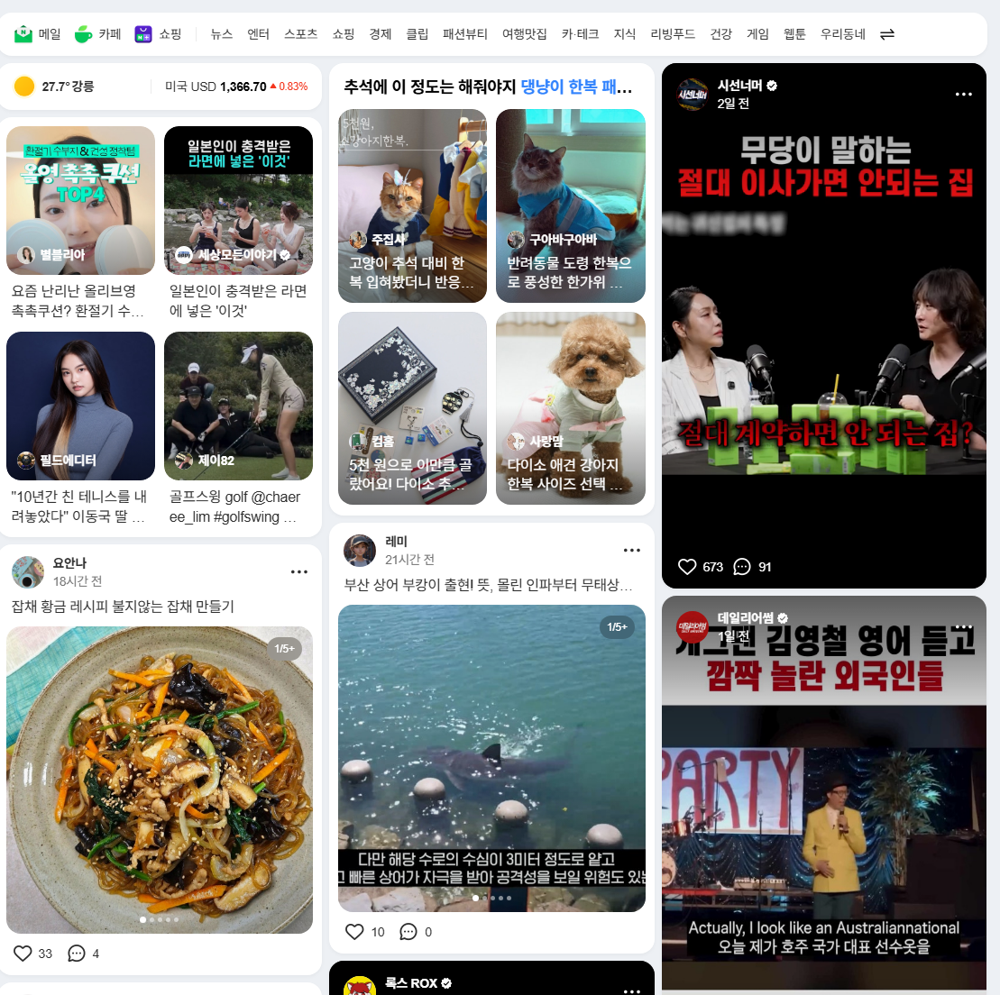

# 벤치마킹 해서 블로그 글 쓰는 방식
**Date:** 14시간 전
**Category:** 스냅
**Original URL:** https://blog.naver.com/xpfkwh56/224421744621
---

**1. 시작은 무조건 필사부터**

​

블로그 글쓰기 에는 정답이 없습니다

​

SEO 글쓰기 규칙 있잖아요?

봐서 되는 사람이 **정해져** 있습니다

​

**무조건** 남이 쓴 글 부터 읽으시고,

​

처음부터 발행 바로 찍지 마시고,

스킨 갈이 연습을 미리 충분히 하세요

​

AI 쓰기 시작하면 하루에 50개,

100개 쓰는 건 일도 아니기 때문에

​

빨리 글 써서, 성과 낼 욕심 버려도 됩니다

​

<https://mate.naver.com/#partners>

[**네이버 메이트**

네이버 AI와 함께 성장하는 콘텐츠 파트너

mate.naver.com](https://mate.naver.com/#partners)

​

2. 검색블은 네이버메이트 따라하면 됩니다

​

<https://in.naver.com/discover>

[**네이버 인플루언서**

관심분야의 전문 창작자를 만나는 곳

in.naver.com](https://in.naver.com/discover)

<https://in.naver.com/keywords>

[**네이버 인플루언서**

관심분야의 전문 창작자를 만나는 곳

in.naver.com](https://in.naver.com/keywords)

​

인플루언서는 **키워드챌린지** 를 보세요

​

수익보장이 제일 큰 것은 **'피드메이커'** 입니다

​

**피드메이커 = 공식 홈판 고인물** 이기 때문에,

대부분 트래픽 파워가 짱짱 합니다

​

이도저도 모르겠으면, 모바일로 네이버 앱 켜고

​

​

첫 화면에 나오는 블로그들 다 눌러본 다음에

**'이 블로그 트래픽 좋은 듯?'** 싶은 곳 잡아놓고

​

하나씩 늘려가면서 배워보면 됩니다