# 블로그로 AI 한테 에디터 쓰게 하기 (중급자용)
**Date:** 14시간 전
**Category:** 스냅
**Original URL:** https://blog.naver.com/xpfkwh56/224421752292
---

1. GPT, 클로드 둘 중 하나 고르고

내장 브라우저 기능 있는 구독제 결제합니다

​

크롬 확장프로그램 설치합니다

​

**\* 로컬로 하면 싸고, 프론티어로 하면 비쌉니다**

**​**

**로컬로 하면 정책 구애를 받지 않고**

**프론티어로 하면 정책 제약을 받습니다**

**​**

**→ 이건 써보시면 무슨 말인지 알게 됨**

**​**

2. [https://blog.naver.com/id?Redirect=Write&](https://blog.naver.com/xpfkwh56?Redirect=Write&categoryNo=140)

​

ai 가 볼 수 있는 브라우저에 위 링크 띄웁니다

​

[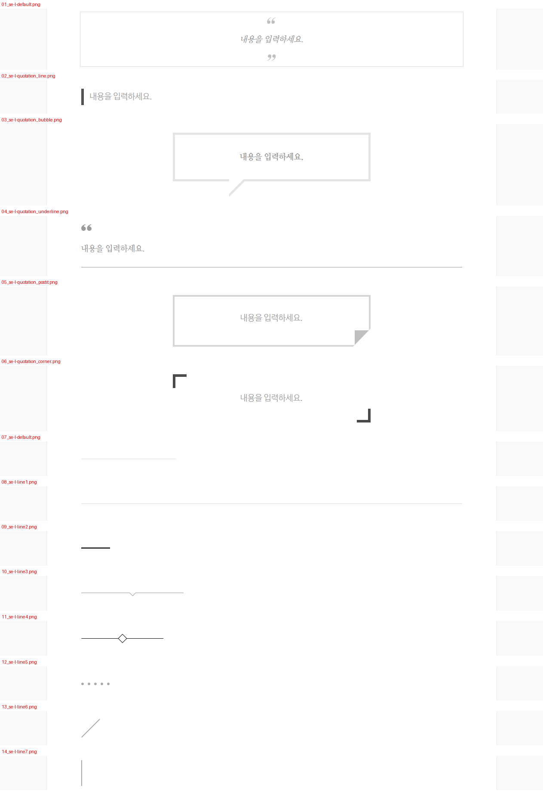](#)

[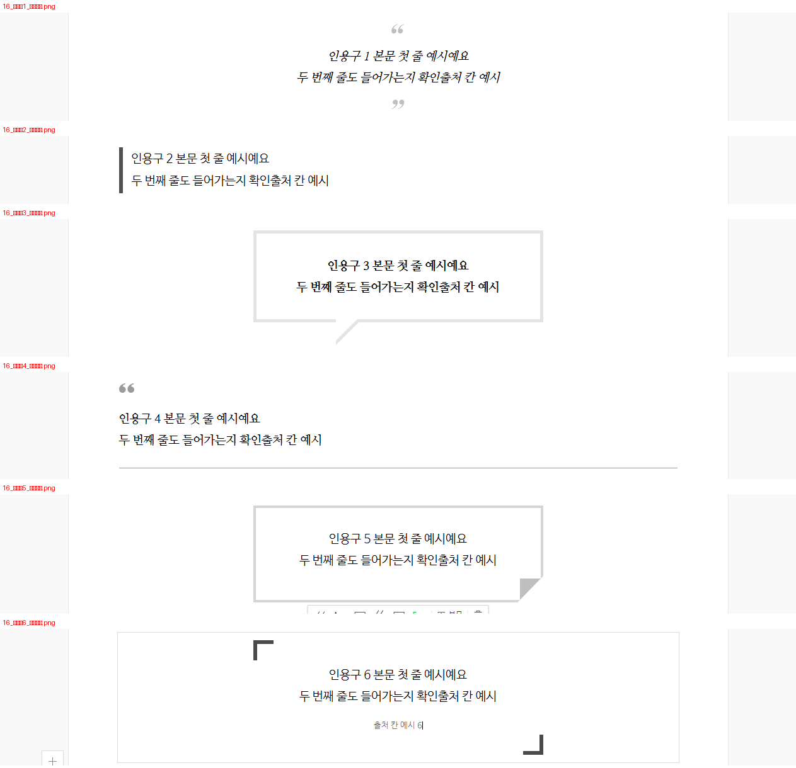](#)

[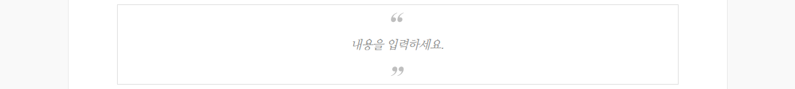](#)

[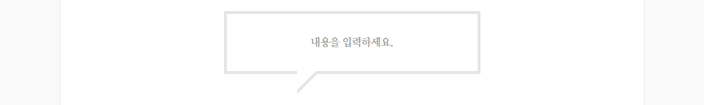](#)

[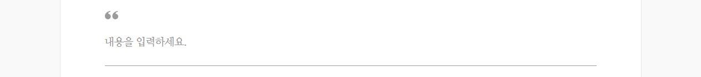](#)

[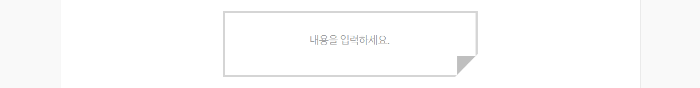](#)

[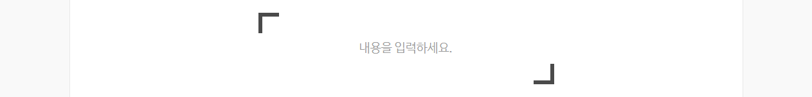](#)

[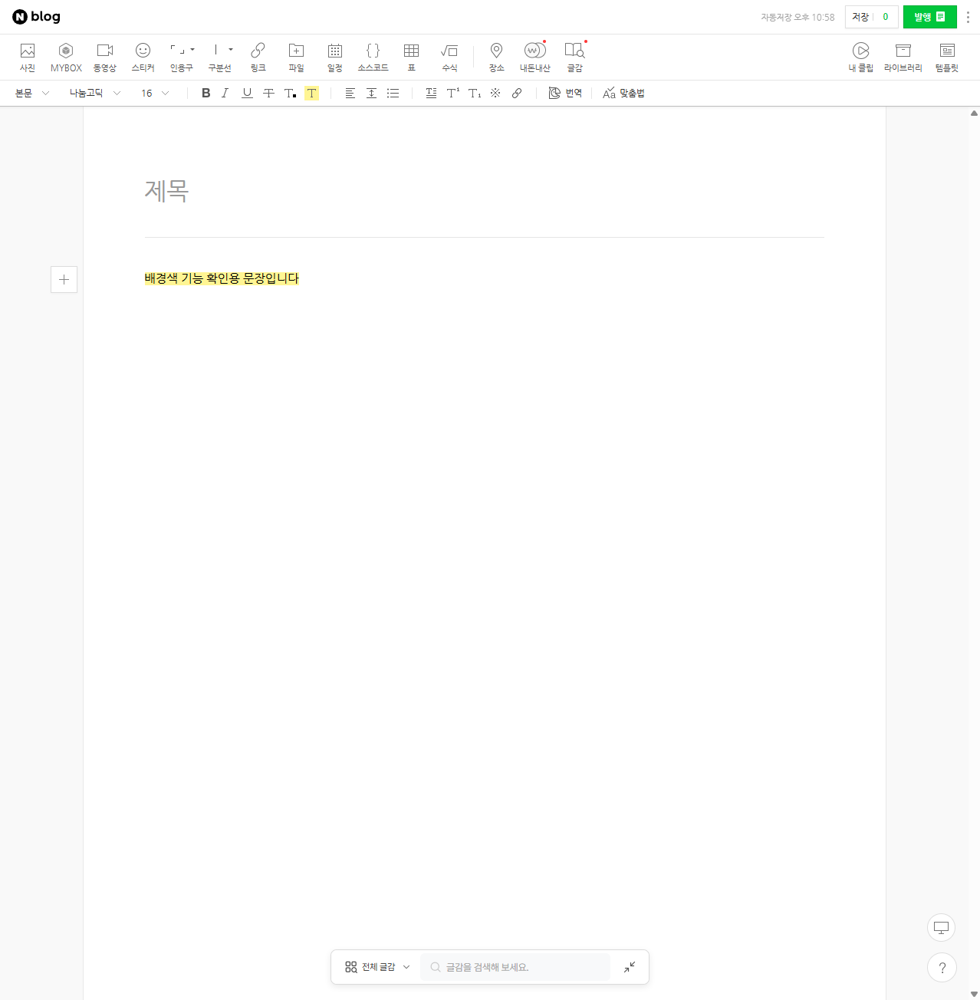](#)

[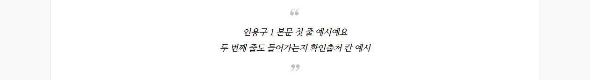](#)

[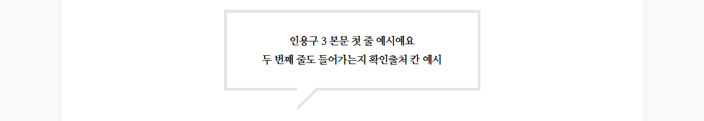](#)

[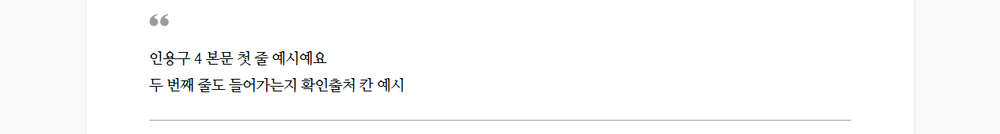](#)

[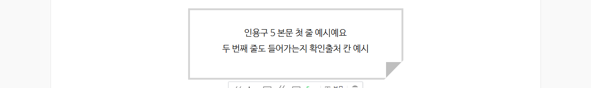](#)

[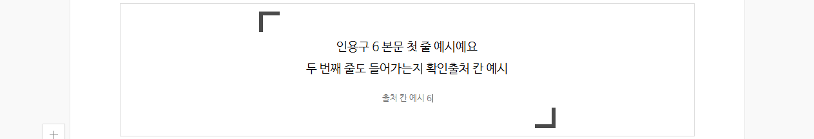](#)

​

3. 위 이미지 전체 다운 받으시고,

바탕화면에 txt, md 파일 같은 걸로

​

원고 띄운 다음에 에디터에

렌더링 해달라고 합니다

​

[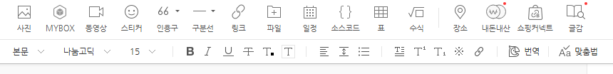](#)

​

요기 있는 기능 다 입혀진 채로

에디터에 띄우는 것 가능합니다

​

**4. 주의**

**​**

ai 자동화 동작은 네이버 약관 위반입니다

​

근데 약관 위반은 위반 이고,

​

그래서 걸리냐? 안 걸리냐? 가

우리 궁금증 이죠

​

먼저 콤퓨타가 이걸 잡는 방식은,

행동이 **'인간적이냐, 기계적이냐'** 입니다

​

사람은 똑같이 직선 마우스 이동을 해도,

기계보다 삐뚤빼뚤 하게 들어가게 될 것이고

​

무엇보다 **'스크립트'** 로

브라우저 제어를 안 합니다

​

때문에, 두 가지 방법을

사용하면 우회할 수 있는데

​

하나는 **'진짜 본인이 마우스를 움직이는 과정'** 을

매크로에 입력하고 학습 시킨 후, 난수로 뽑는 겁니다

​

저 같은 경우, 제가 실제로 하는 각 특정

클릭 행동을 계속 수집하게 시키고,

​

랜덤하게 그 중 하나를 골라

AI 가 작동하게 했었습니다

​

**\* 알려진 바에 의하면, 이런 봇탐지 옵션은**

**특정 행동을 잡는 것이 아니라 기계적이고**

**반복적인 행동을 수집해서 체크하는 방식임**

**​**

**그래서 주기적으로 바꿔줄 귀찮음이 요구됨**

**​**

또 하나는 스크립트가 아니라, **'커서 동작'** 을

있는 그대로 넣어서 수행하는 것 입니다

​

유튜브 보고 코딩 조금 배우면 할 수 있고,

몰라도 ai 한테 만들어달라고 하면 해줍니다

​

문제는, 제가 저 두 가지를 비롯해서

여러 잡기술들을 넣어서 몇 번 굴려봤는데

​

**\* 다른 이유일 수도 있겠지만**

​

블로그 2개가 최신순 누락

저품질 걸린 적 있읍니다

​

그래서 딱히 근거는 없는데

그냥 **반자동** 으로 하고 있음

​

본인이 실제 블로그를 쓰고 있다면,

​

취미블, 개인적으로 쓰는 블로그에다가

일기 쓸 때마다 행동하는 것 수집 걸고,

​

나중에 자동화 돌릴 때 알차게 쓰면 됩니다

그게 **'진짜'** 인간 동작 데이터 니까요