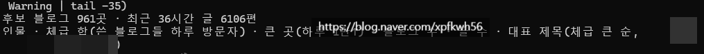
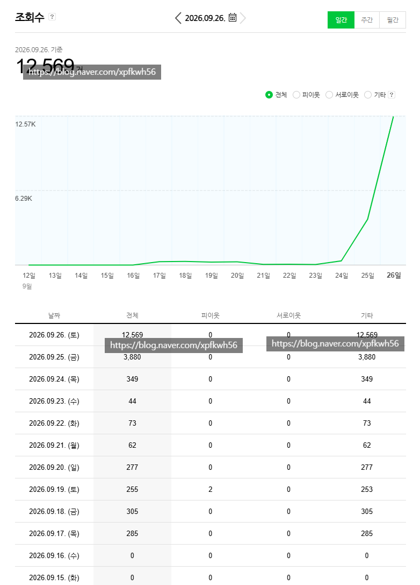

# 블로그와 잉공지능 활용
**Date:** 14시간 전
**Category:** 스냅
**Original URL:** https://blog.naver.com/xpfkwh56/224423776162
---

​

1. 글을 풀어내는 방식이 서로 다르면서,

체급 있는 블로그 961곳 확보

​

**\* 단, 기계 분석이라 아주 정밀하지 않음**

**시간 날 때마다 내가 정규화 잡곤 있는데**

**억지 빼면 실제로는 1/3? 정도만 유효함**

​

2. 최근에 해당 소재로 네이버 블로그에서

발행된 문서를 전수 검토해서, 노이즈 빼고

​

글이 6106편 발행된 상태인 것을 확인함

​

3. 거기서 1만 이상,

체급 갖고 있는 작성자 확보

​

공통 조건들 확보해서,

컴포넌트 분해하고 원고 작성

​

​

4. 이 방식이 전부는 아니지만,

​

핵심으로 쓰고 있는 뼈대 중 하난데

블로그 성장 속도 빨리 붙일 수 있음

​

5. 발행 후, 유효한 반응 나오면 가설 잡고

AI 가 제안하는 가설 내가 직접 검토한 다음,

​

실제 퍼포먼스 수집해서, 다음 작업에 피드백

​

글이 쌓이고, 운영이 쌓이면 쌓일수록

계속 점점 개선되는 결과가 나오게 됨

​

당연히 일정 함수 이상 부터는 한계 오겠지만

​

6. 자리 잡은 블로그에서만 통하는 기술 아님

​

**\* 어차피 체급 좋은 블로그는 뭘 하든 잘 성장함**

**​**

노베이스 신규 블로그 맨땅 운영

50개 이상에서 동일한 결과 재현함