# 사람들이 로컬을 해봤으면 하는데
**Date:** 14시간 전
**Category:** 다이어리
**Original URL:** https://blog.naver.com/xpfkwh56/224305572252
---

1. 문제는 학습 곡선이 **'말도 안 된다는 점'** 임

​

1) 장비

​

사실 저렴하게 사서 시작을 하거나,

코랩만 해도 4080 스펙 정도는 되니까

​

사부작 사부작 그거로 만지면 되는데

사람 마음 이라는 것이 그게 잘 안됨

​

일단 결과가 보여야 할 맛이 나기도 함

​

근데 이게 잠깐 쓰고 버리는 도구도 아니고,

덩치도 크고 가격도 비싸도 낯선 컴퓨터 에다

​

**'각'** 잡고 살 생각을 하면 돈 백은 우스워서,

​

잘 알아보고 사야겠다는 생각을 하게 되는데,

알아보려고 해도 도무지 엄두가 안 날 수 있음

​

일단 글카도 종류가 너무 많고,

같은 회사에서 나온 것도 같지 않고

​

다른 회사로 넘어가면 **'아예'** 달라짐

​

2) 환경구축

​

컴퓨터를 어떻게든, 구입을 했다 쳐도

모델이 **'돌아가게'** 만드는 것이 한 세월임

​

비유하자면 불규칙한 다각형들이 있는데

​

그걸 동그란 서랍 안에 최대한 많이 우겨넣는

퍼즐을 푸는 것과 비슷한 기분을 느끼게 됨

​

내가 A 를 하고 싶고

B 라는 모델을 돌리기 위해서,

​

10개를 설치했는데

​

마침 1개가 호환이 안 되면

9개 다 못 쓰는 일도 **'꽤'** 생김

​

국룰 호환성 이런 것 없나요?

변수가 너무 많아서 통제가 안 돼요

​

그나마 제일 쉬운 방법이 마음 가는 대로

일단 설치 막 한 다음에 문제가 생기면,

​

**밀어버리고 새로 설치하기** 이런 정도 임

​

3) 용어

​

태어나서 처음 듣는 말이 **'너무'** 많음

​

물론 당장에야 몰라도 되긴 하는데,

그게 진짜 몰라도 되니까 그렇기 보단

​

맞으면서 배우는 것이 더 빨라서 그렇고,

안다고 안 맞는 것도 아니기 때문에 그럼

​

4) **'유지보수'**

​

신모델, 신기술이 순식간에 나와버려서

내가 3번까지 열심히 깎아놓고 있어도,

​

추적하던 분야 있으면 또 따라 쫓아가야 됨

​

그 과정에서 남는 건, 내 **'경험'** 밖에 없음

​

5) 모델 자체에 대한 이해와 활용

​

오픈소스의 장점은 공짜 라는 것 이고,

단점은 알려주는 사람이 없다는 것 임

​

개발한 애들한테 가서 물어봐도

모른다는 답변 나올 때도 있고,

​

빅테크 대기업 엔지니어들 인데도

중요한 것을 빼놓고 릴리즈 하거나

​

심지어 **'없는 것'** 을 **'있다고'** 할 때도 있음

​

6) 커스텀

​

모델에 대한 이해도가 아주 좋아지면,

이제 그 모델이 **'할 수 없는 일'** 을 알게 됨

​

그 과정에서 **'깎는 작업'** 이 생기는데,

​

딱 1개의 단일 목적을 잘 수행하기 위해서

굉장히 많은 테스트를 직접 해보게 될 것 임

​

그럼 마침내, **'보임'**

​

> 이거 '진짜' 구나

​

2. 초전도체 부터 암치료제 에 이르기 까지

주식 바닥을 조금이라도 경험해 봤던 사람이든,

​

신기한 뉴스를 들어본 사람이든 간에,

**'최첨단 미래 기술'** 이라는 말을 듣게 됨

​

다만 그게 원데이, 투데이 이야기지

​

계속 들으면 양치기 소년 거짓말 처럼

무뎌지고 **그래 그러시겠지** 느껴지는데,

​

인공지능이 **'정확히'** 그 영역에 있음

​

대단하다는 사람들 얘기도 들어보고,

가끔 나오는 기술력 자랑 같은 것을 보면

​

뭐가 있기는 있는 것 같은데

그렇다고 크게 실감은 안 가는

​

그 상태에 머무르거나, 아니면 반대로

여전히 **'아직도 멀었다'** 라고 여기게 됨

​

근데 본인이 이걸 하나씩 깎아내기 시작하면

​

**'내가 만져도 이 모양인데, 그럼 나보다**

**잘나고 똑똑한 애들은 뭘 만든다는 거지?'**

​

라는 생각을 **'안할 수가 없음'**

​

그리고 미래가 보이기 시작함

​

이 기술이 지금 이렇게 저렇게 되었으니까

앞으로는 이럴 것이고, 저럴 것이다 같은 것이

​

아주 자연스럽게 본인에게 **'상식'** 으로 잡힘

​

3. 모처럼 오늘 1호기가 스테이블 하니,

쏠쏠한 **팁** 하나를 풀어보도록 하겠읍니다

​

​

1) 네이버에서 네이버 메이트를 서비스 함

​

[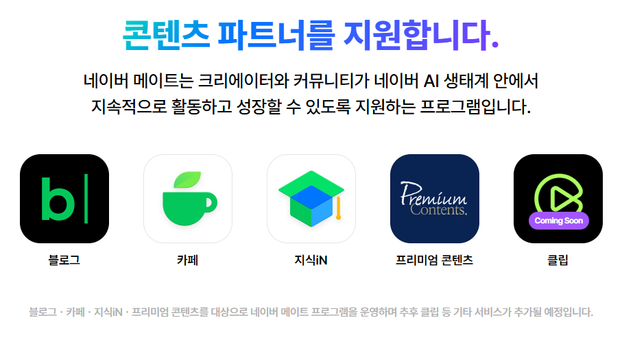](#)

​

2) 상투적인 메시지 를 잘 찾아서 읽으면,

​

[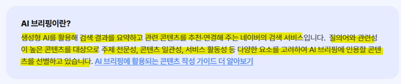](#)

​

AI 브리핑 이라는 서비스를 한다고 광고를 함

​

3) 돈도 많이 준다고 하고,

대대적으로 무언가 한다고 하고

​

이 블로그 주인장 말에 의하면,

엄청난 변화가 있을 것 이라는데

​

저 서비스가 도대체 무엇일까?

**​**

**그냥 지피티 같은 것이**

**대답 해준다 끝 아닌가?**

​

4. 당연히 크게는 맞는 말인데,

그 해석 만으로는 충분하지 않음

​

그 해석이 맞다면 네이버에서

자기들이 직접 모델로 굴리면 될 것을

​

비싼 돈 써가면서 **'왜'** 모집하냐 이거 임

​

블로그에 있는 글 긁어다가,

​

요약 부탁해 하고 아무 AI 한테

보내도 말끔하게 해주는 마당에

​

저 큰 회사가 그럴 이유가 없잖슴?

​

그 이유를 알기 위해서는 본인이 직접

AI 브리핑 이라는 기능을 사용하면 됨

​

[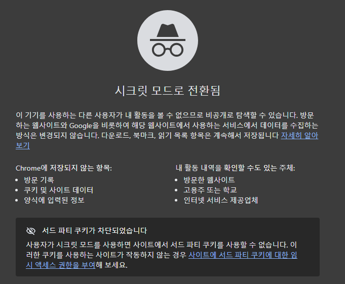](#)

​

5. 크롬 시크릿 모드를 열고,

​

[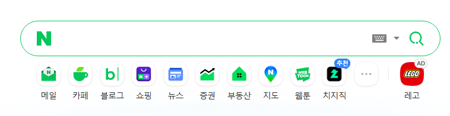](#)

​

네이버에 들어감

​

[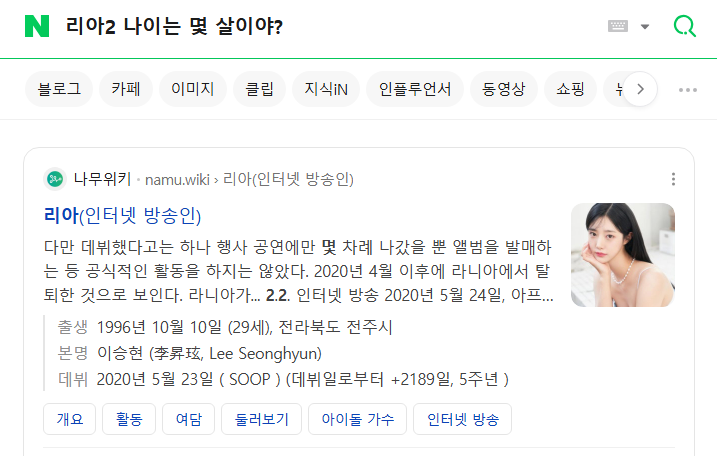](#)

​

질문을 했는데, **'답변'** 이 안 나옴

​

[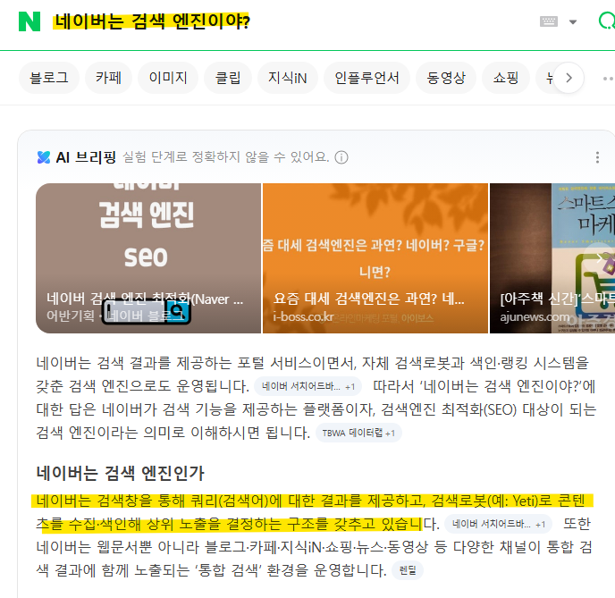](#)

​

네이버는 **'검색 엔진'** 임

​

저기에 물어보기만 하면

**'답'** 이 나와야 하는데,

​

세상 모든 대답을 해줄 수가 없음

​

[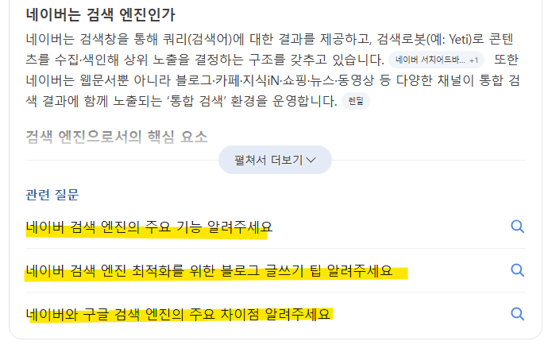](#)

​

그래서 이용자가 **'비정형'** 적인

검색어를 입력 했을 때,

​

AI 브리핑으로 답변을 하도록

하는 것이 네이버의 **'욕구'** 임

​

정리 한 번 하겠음

​

네이버는 뭐다? 검색 엔진 이다

​

검색 엔진은 뭐다?

물어보면 대답을 해주는 것

​

물어봐서 답이 안 나오면?

검색 엔진으로 기능이 안 된다

​

모든 것을 대답할 수 있다? 없다

​

그래서 AI 브리핑 이라는 것을 써서,

그걸 커버 하도록 만들고 싶어 한다

​

까지 따라 오셨으면 잘 따라오신 것 임

​

**6. 여기서 이제 역사 복습을 해야 됨**

​

남조선 포탈 1위는 야후 였음

​

미국에서 이미 자리를 잡은 회사가

국내로 들어와서 영업을 하니까,

​

노하우를 따라갈 수가 없었음

​

한국 기업은 다음이 1타 였고,

그 뒤로 줄줄 라이코스, 네이버 등등

​

작은 회사들이 경쟁 하는 체제 였는데

​

네이버는 **'후발주자'** 였기 때문에,

​

다른 챌린저들이 그런 것처럼

사파적인 방법으로 이기려고 했음

​

고스돕/포커 게임 회사랑 합병하고

전망 괜찮은 회사 합병하고 그런 식임

​

인생은? 행운과 재능

​

다음이 무려 온라인 우표제 라는

희대의 결정을 하면서 유저를 뺏겼고

​

[](#)

​

지식in + 다음 서비스 이탈 이라는

아다리가 맞으면서 네이버가 대흥함

​

​

원래 **'카페'** 하면 다음 이었음

​

근데 다음은 하기 싫으니까,

네이버로 왔는데 카페가 없었고

​

네이버는 다음에 있었던 서비스를

**'그대로'** 다 가져와서 시스템 꾸림

​

7. 다음 서비스 이탈이야 운 이고,

카페야 따라한 것이니 그렇다 치자

​

**지식in 은 그럼 어떻게 흥한 것이냐?**

​

초기 포탈 사이트들은 검색 기술이

특출나지 않아서, 콘텐츠를 **자체** 생산함

​

네이버는 창업자 이해진이

삼성 사내벤처 시절에 **'사전'** 을

만들다가 발전된 서비스인데,

​

**\* 사전에서 단어 찾는 기술**

**→ 웹에서 정보 찾는 기술**

**​**

창업 공신들은 웹문서 디렉토리

분류를 **'수동'** 으로 했음

​

그와 마찬가지로, 지식in 초기에는

네이버 임직원들이 답변을 달았었고

​

어느정도 자리를 잡고 난 다음에는

**'에디터'** 를 모집해서 자원봉사 받음

​

검색으로 안 잡히는 **'정보'** 는

사람이 **'직접'** 해결한다는 것 임

​

무릇 성공 이라는 것은 중독성이 심함

한 번 해서 되면 그 다음에도 대부분은

​

비슷한 방식을 변주하고, 또 대체로는

그 방식을 지키기만 하면 보통 잘 안 망함

​

​

8. **'아직'** 도 **'구글링'** 의 시대 임

​

단어를 검색해서, 정보를 빠르게

찾아내는 능력이 중요한 시대란 것임

​

그러나 **'미래는 자연어 검색'** 시대 임

​

[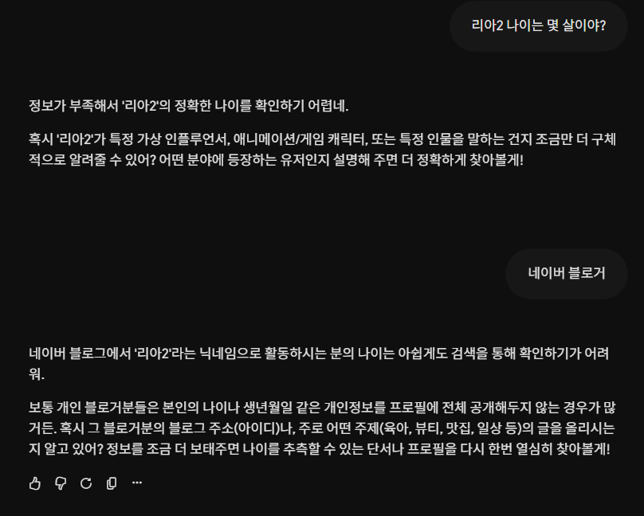](#)

​

검색엔진에 검색을 해서, 답을 얻는 것이 아니고

옆에 사람 두고 물어보듯 질문을 하게 될 것 임

​

근데 그 과정에서 **'원하는 답'** 이 나오지 않으면

사람들은 다시 구시대 기술로 갈 수 밖에 없어짐

​

그럼 선택할 수 있는 것은 하나 밖에 없음

​

**'어떻게 하면 인공지능이**

**모든 질문에 적절한 답을**

**할 수 있게 만들 수 있을까?'**

​

9. 바로 **'재료'** 가 있으면 됨

​

[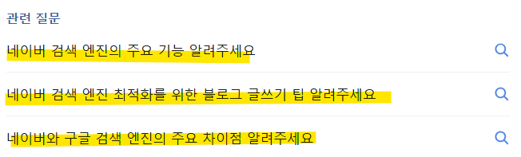](#)

​

AI 브리핑 하단에 있는 관련 질문을 누르면,

​

[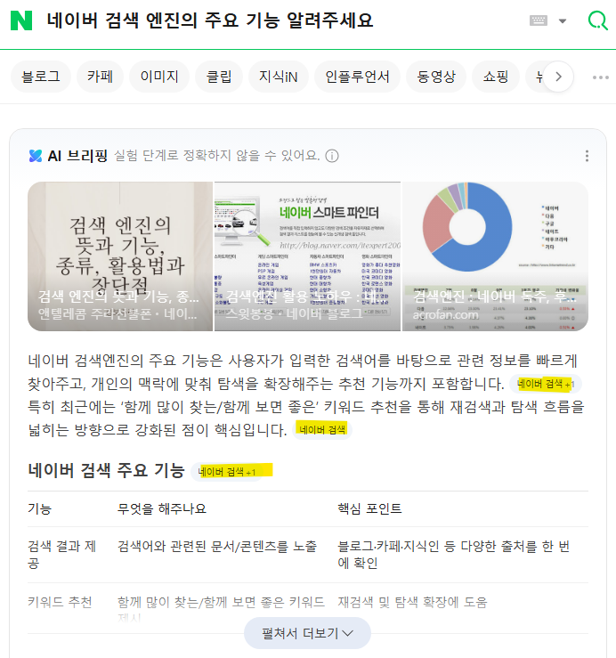](#)

​

바로 이렇게 자동 검색이 진행 되는데,

​

저기에 나오는​ **'관련 질문'** ​이

**'이용자 빅데이터'** 로 형성되는 것 임

​

​

1년 전에 했던 네이버 DAN 컨퍼런스 임

​

인공지능은 **'답'** 이라는 것을 낼 수 없음

오직 **'확률'** 에 근거해 선택만 하는 것 임

​

1+1=2 를 아는 인간이라도 물론,

무슨 천재지변이 생겨서 낮은 확률로

​

3? 0? 이런 답을 내릴 수도 있지만

AI 는 그거랑 다른 원리로 오답을 냄

​

즉, **'예측'** 밖에 할 수 없는 존재 임

​

예측은 필연적으로 **'틀림'** 을 전제 함

​

[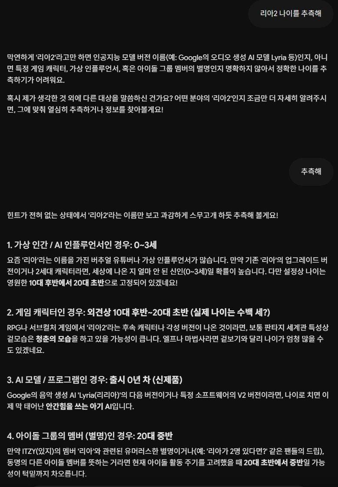](#)

​

**하지만 정확한 답이 있다면 어떨까?**

​

[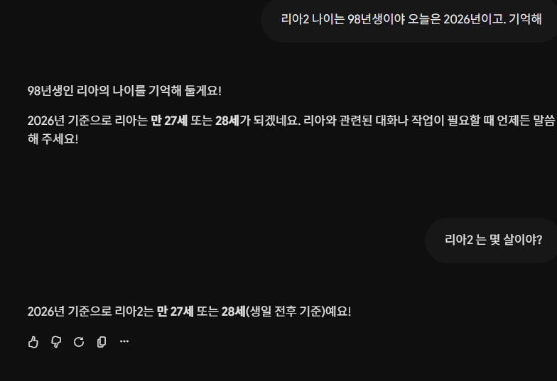](#)

​

만약 누가 무엇을 물어보든 관계 없이,

​

이미 그게 온라인 상에 **'답'** 으로 있으면

네이버의 AI 는 **틀릴 수가 없게 될 것** 임

​

그래서 비싼 돈을 주고, 자사 모델을 통해서

​

**'사람들이 궁금한 것'** 을

예측하고 맞추는 것이 아니라

​

**'이미 궁금할 것들을 깔아놓은 다음에'**

편하게 장사를 하고 싶다는 신호 라고 봄

​

AI 브리핑에 걸리는 것은,

**기존 엔진이 못 잡는 정보** 임

​

AI 인용 횟수가 아주 많다면?

네이버는 그걸 그대로 사용하면 됨

​

10. 그럼 이런 판때기 에서 우리는

어떤 결정을 하는 것이 가장 좋을까?

​

두 가지 방법이 있음

​

1) 플랫폼 공무원이 되든가

2) 생산하지 않는 쪽에 있던가

​

[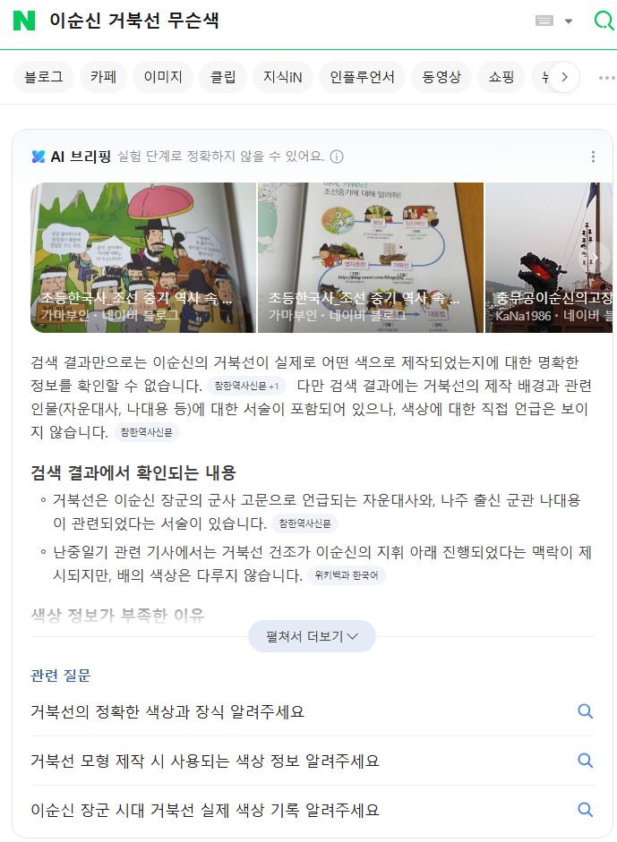](#)

​

관련 질문이 보임

​

눌러 보겠음

​

[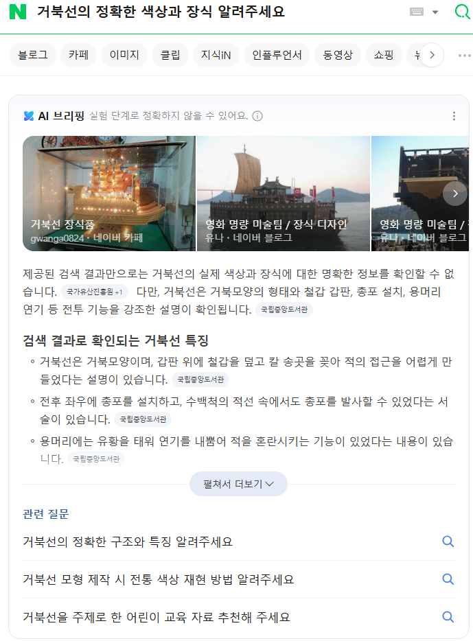](#)

​

또 눌러 보겠음

​

[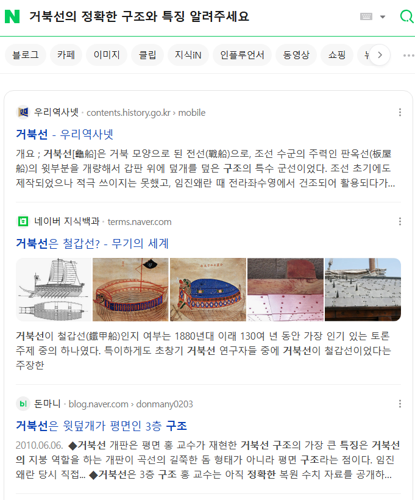](#)

​

이제 안 나오네?

​

눈치 채셨음?

​

[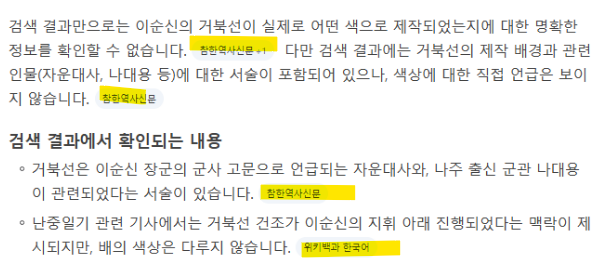](#)

[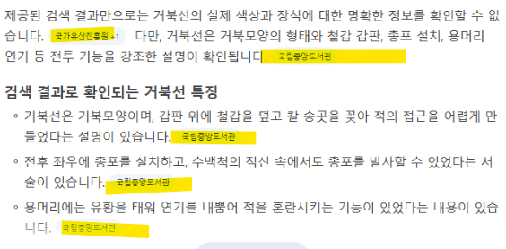](#)

​

가져올 수 있는 재료가 있으면 답 하고,

더 이상 가져올 수 있는 재료가 없다면

​

그거에 대해서는 관련 질문이 안 나옴

​

즉,

​

1) 명확한 정답이 있는가?

​

yes → 기존 엔진으로 이동

no → AI 브리핑으로 이동

​

2) 답이 나왔거나, 관련 질문 내에서

이용자의 행동이 답에 도달케 하는가?

​

yes → 답을 얻고 종료

**no → 답을 못 얻고 종료**

​

라는 패턴을 관찰할 수 있음

​

[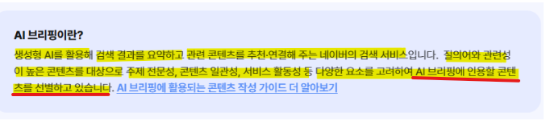](#)

​

11. 네이버가 하는 말은 자기들이 쓰게끔

편히 선별할 수 있는 재료를 만들라는 것 임

​

그럼 이걸 Auto-K 할 수 있을까?

​

**간단함**

​

답이 없다 → 내가 답을 만들면 된다

​

그러므로, **'무엇이 답이 없는 것인지'**

알아낼 수 있으면 해결 할 수 있음

​

**\* 어떤 질문이 답이 없는 줄 모르면**

**질문을 모르니까 답도 낼 수 없음**

​

컴퓨터는 무엇을 제일 잘 한다?

뇌 빼고 반복하는 것을 제일 잘 한다

​

프로그래밍을 하신 다음에,

​

특정 주제에 관해서 AI 브리핑 나오면

계속 하단 버튼을 누르게 만들고,

​

그 버튼에서 **'뱅뱅 돌거나'**,

**'더 이상'** 안 나오는 단계가 되면

​

그건 지금 **'답'** 이 없다는 것 이니까,

​

네이버 엔진으로

**'못 잡는 정보'** 란 뜻 임

​

12. **원 모아 띵쓰**,

​

인용 비율이 높다 →

그 정보를 찾는 사람들이 많다

​

인용 비율이 낮다 →

그 정보를 찾는 사람이 적다

​

정보를 찾는 사람이 많다 →

활용 가치가 높은 지식이다

​

정보를 찾는 사람이 적다 →

활용 가치가 낮은 지식이다

​

사람들이 그걸 필요로 하고 있는데,

​

아직 현실에 존재하지 않는 것을

많이 많이 만들면 네이버가 칭찬 함

​

결국 네이버 메이트에서 말하는

AI 브리핑 콘테스트 라는 것은,

​

가까운 미래에 필요할 정보를

생성하는 것이 채점판인 것임

​

네이버에서 당신의 관점을 보여주세요

당신 만의 시각으로 어쩌고 저쩌고,

​

이런 이야기는 선거철 정치인 립서비스

같은 것으로 읽으시는 것이 유익함