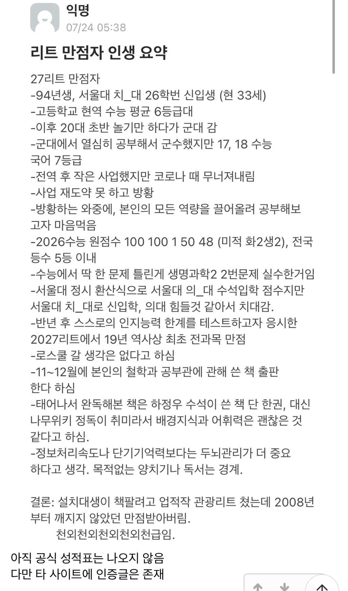
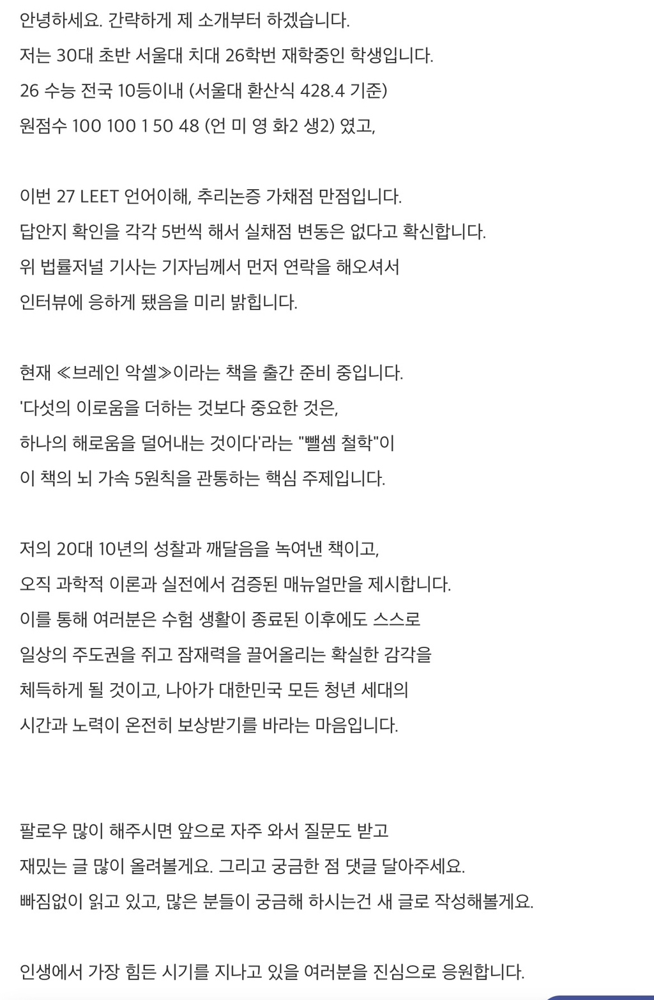
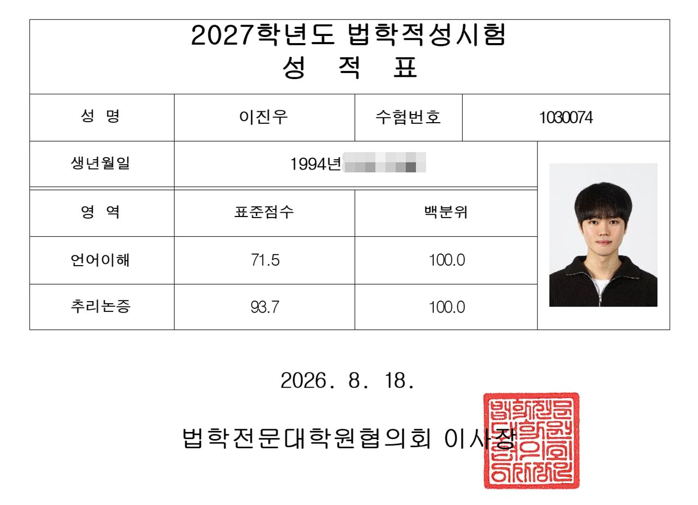
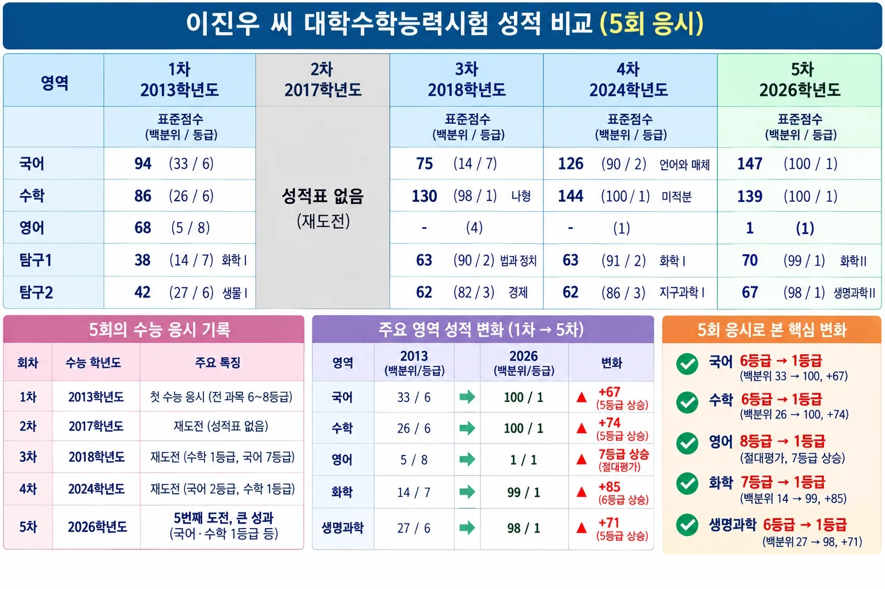
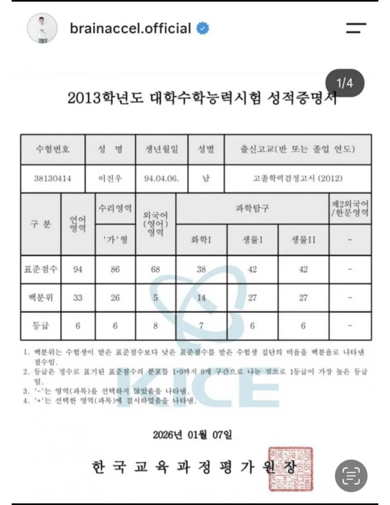
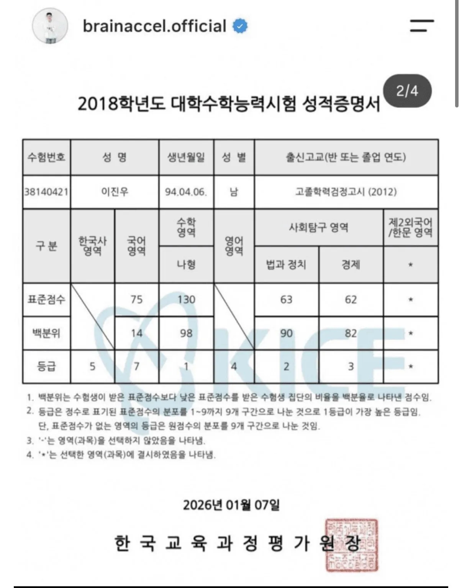
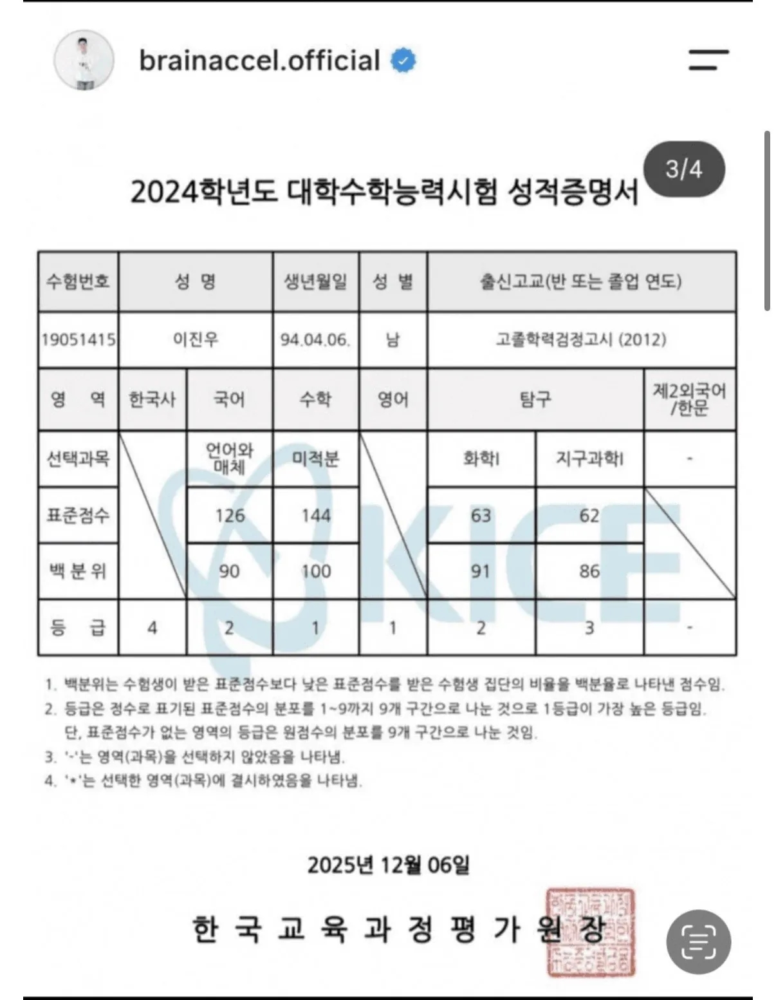
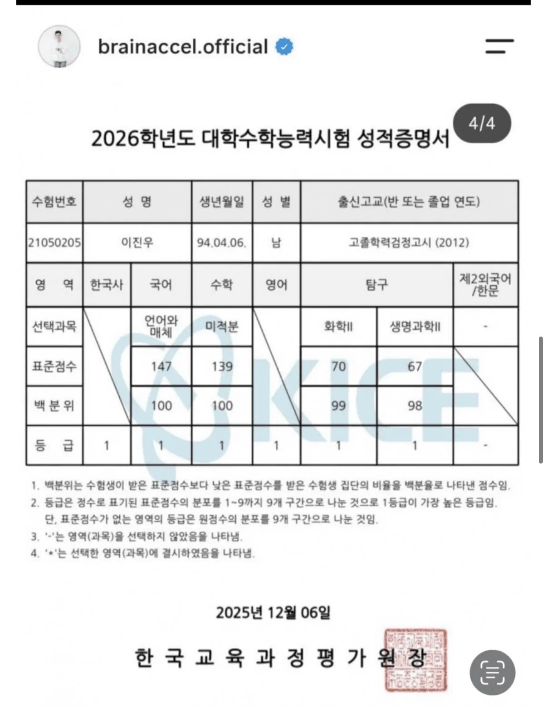

# 수능 7등급 → 역사상 최초 리트 만점
**Date:** 14시간 전
**Category:** 스냅
**Original URL:** https://blog.naver.com/xpfkwh56/224423046441
---

1. 만약 공부를 잘 하는 것이

**'머리가 좋다'** 라고 정의 한다면,

​

남조선에선 아주 오랫동안

뛰어난 두뇌를 갖고 있는 사람 임을

증명할 수 있는 시험이 있었음

​

**사법고시**임

​

정확히 무슨 문제가 나오는진 몰라도,

​

사시 합격자라고 하면

접어주는 분위기가 있었고,

​

고졸 대통령으로 유명한 사람을 포함해

사시를 패스했다, 라고 하면 대우가 달랐음

​

2. 사법고시가 폐지된 이후 부터,

그 위상은 피셋계 시험으로 바뀌었는데

​

피셋은 대놓고, 우린 열심히 한 애들 말고

그냥 똑똑한 애들 뽑으려고 시험 만든다

​

라고 기관에서 공언을 했던 시험이고,

​

그에 버금가는 리트 또한

재능이나 기초 역량이 없으면

​

좋은 성적을 얻기 어렵다는 믿음이

사람들 사이에 은근히 퍼져있기도 했음

​

애초에 만점을 목표로 하는 시험도 아니고,

이 시험은 붙으면 감사한 시험에 가까운데

​

리트 만점자가 나옴

​

​

사람들 반응은 이랬음

​

**1) 구라 마케팅 책팔이 아님?**

​

​

언론에서 인터뷰 나오고, 인증이 나옴

​

**2) 설치 잖아, 애초에 다른 유전자 아님?**

​

​

본인이 직접 인증해서 종결시킴

​

**3. 뭐 어떻게 한거임?**

​

유튜브에 나온 내용이랑 기사 찾아봤는데,

​

약간 수도승 도 닦듯이 자기관리 하란 얘기랑

다들 아는 이야기 열심히 했다가 대부분 이지만

​

패턴 파악 → 해법 발견 → 반복 숙달

과정을 겪었다는 듯한 언급을 많이 함

​

본인은 최적화 라는 뉘앙스로 말하는데,

​

전자기기 멀리 하라는 것도

딴 생각 없이 그냥 그거에만 매달려서

집중하면 거기에 담긴다는 얘기 같았음

​

결국 본인을 얼마나 원하는 목적에 맞게

잘 셋팅하냐, 잘 깎아놓느냐가 중요한 듯