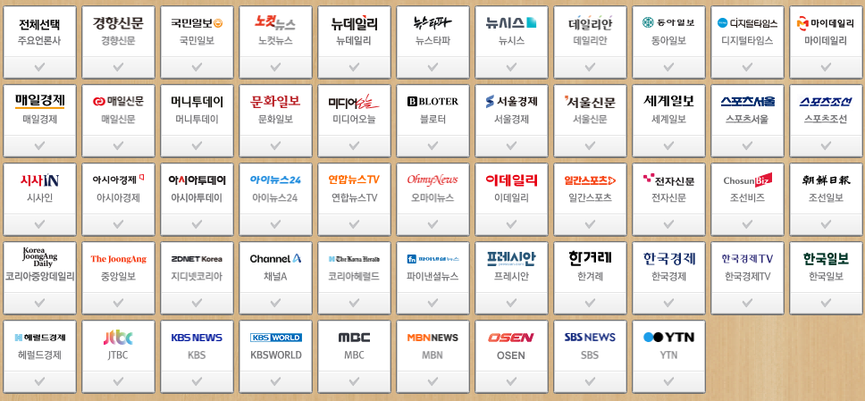

# 이슈 블로그 디테일
**Date:** 14시간 전
**Category:** 스냅
**Original URL:** https://blog.naver.com/xpfkwh56/224428265250
---

**\* 본 내용은 연구/학습 목적이지,**

**사용시 생기는 불이익 책임 안 짐**

**​**

1. 연예/방송 이슈 올리면 트래픽 나온다 X

​

남들이 안 올리면, 많이 올리는 놈이 우선

남들도 많이 올리면 타율 좋은 놈이 우선

​

그냥 언제나 남들보다 딱

**반 발자국만** 앞서면 됩니다

​

https://newsstand.naver.com/

​

2. 네이버 구독언론사 클릭

최신순 뉴스 정렬

​

3. 각 언론사 홈페이지 크롤 추출

​

4. 언론사 raw 기사에서

**네이버** 로 **'반영되는 시간'** 체크

​

**\* 기사 항목마다 다릅니다**

​

**첨부파일**

shortents\_pick\_core.py

[파일 다운로드](https://download.blog.naver.com/open/cc59d063732b28f4d9375f665bb2ccb31347bc5fe8/EFsQa7ZKxL7O9dtQLuoSggWaFwbSq_x2cV8UKD1m_gMvEIq2UX4k7f69CYMO_1tErg6PbkfmFt_hDxk2jCutYw4NAPzsgw/shortents_pick_core.py)

​

5. 위 스크립트, ai 한테

넣고 해석해달라고 하세요

​

**\* 테마별 숏텐츠 쿼리는 알아서 ,,**

**경제 관심 있는 분들 많길래 경제로 함**

**​**

6. 수집 결과 바탕으로, serp 확인 하고

통검/블탭 에 나오는 패킷 수집한 다음에

​

각자 쓰는 규격에 맞게

원고 작성하고 올리세요

​

7. 유사 문서 걸리는 거 아닌가요?

​

소재별/주제별로 라우팅 잡으시고,

어차피 나오는 기사가 **그게 그거** 라서

​

스킨만 바꿔 끼우면 됩니다

​

오늘 누구 연예인 공항 패션 어쩌고,

그럼 공항 패션에서 쓰는 장르 관습만

그대로 이식하고 토픽만 바꾸면 됨