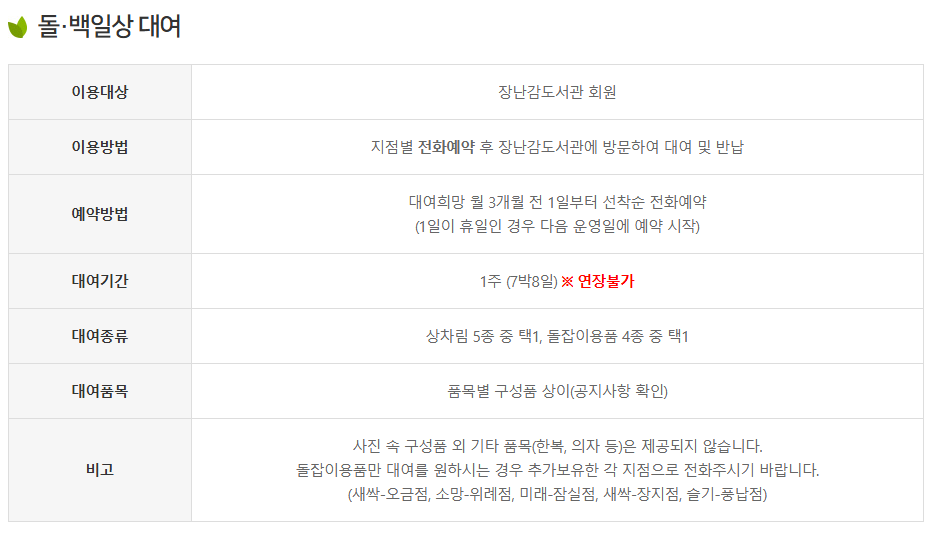
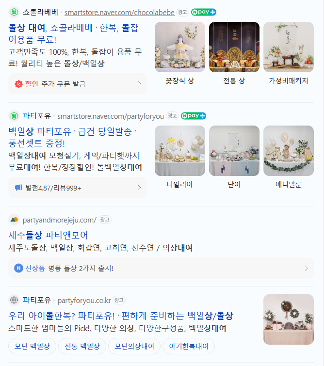

# 집에서 아기 엄마가 할 수 있는 부업
**Date:** 14시간 전
**Category:** 일기장
**Original URL:** https://blog.naver.com/xpfkwh56/224362573031
---

1. 국민 복지 아이템을 열심히 찾아보도록 한다

​

​

2. **이런 것이 있었어?** 를 발견한다

​

​

3. 나라에서 한다 → **예타가 끝났다**

​

4. 공공성 이슈가 있을 수 있으니,

개별적으로 시장 조사를 한다

​

​

5. 단가 계산을 한다

​

**\* 예를 들어, 10만원 주고 사서**

**​**

**2만원씩 받고 5바퀴 돌아가면**

**본전이고 그 다음부턴 이익이네**

**​**

6. 당근에 올려놓고 기다린다

​

7. 저 같은 경우, 집에서 개를 키우다 보니

바리깡으로 애들 빡빡이 만들 수 있는데

​

동네마다 차이는 다소 있겠지만

손/발톱 미용 대기 잡기가 은근 빡쌔서,

​

이사 가면 당근에 글 띄워놓고

소형견 데려다가 깎아주고 그럼

​

**\* 가위가 손에 좀 익으면 나중엔**

**남편 머리도 잘라줄 수 있게 됨요**

​

1) 내 일상에 관련된 무엇이든가

​

2) 세월아 네월아 기다릴 수 있는 것을

하면 제약 덜 받고 돈 버는 시도할 수 있음

​

8. 아기용품 리셀/대여 해주는 쪽이랑,

이런저런 기술 익혀서 써먹으면 쏠쏠함

​

**\* 세금은 이제 각자 알아서 해야 될 ,,**

**​**

유모차 5천원에 사서, 2만원에 팔면 4배임

​

파는 사람도 5천원에 파나, 만원에 파나

그냥 누가 집어가길 바랄 뿐이고

​

사는 사람도 2만원에 사나, 3만원에 사나,

필요할 때 팔아줄 사람 있길 바랄 뿐이라

​

유통 생리 배우기에 이만한 것도 없음

​

막 크게 돈을 벌어보겠다 이런 것 말고,

​

소일거리로 여기저기 내가 뭔가를 해서

벌어보는 경험을 쌓아가보면 눈이 트임

​

나갈 돈 줄이면서 절약하구,

짤짤이 쌓기 시작하기 시작하면

​

**이건 내가 욕심이 좀 나는데?**

같은 아이템이 얻어 걸리게 되고,

​

그걸 바탕으로 내 장사를 하심 됨