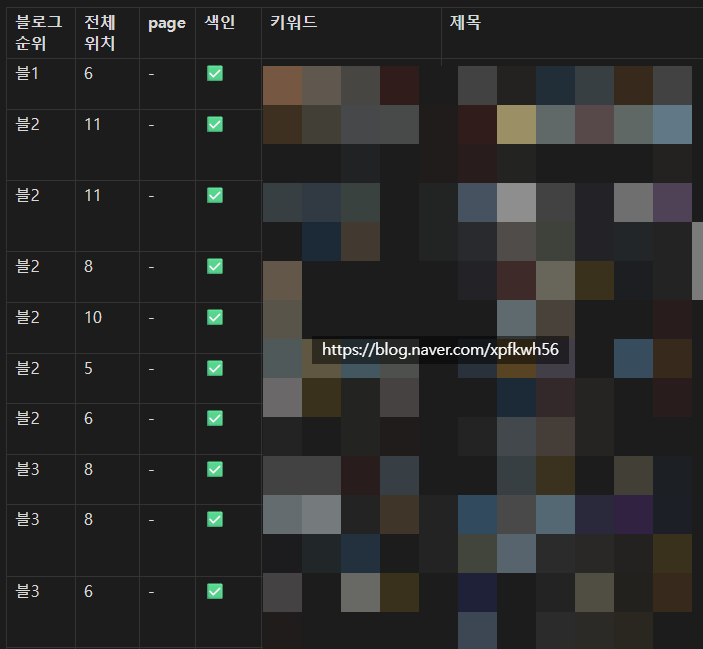
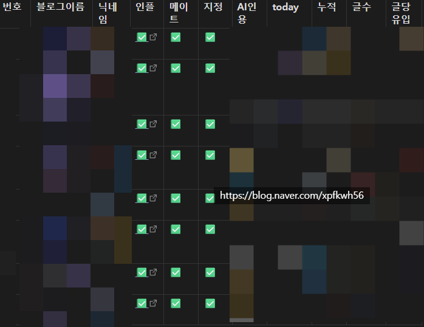

# 콘텐츠 퍼포먼스 퍼널 짰던 방식 일부
**Date:** 14시간 전
**Category:** 일기장
**Original URL:** https://blog.naver.com/xpfkwh56/224365506820
---

1. 6+1 구조

​

1) 생산

2) 유통

3) 도달

4) 오디언스

5) 품질

6) 수익

7) 경쟁/외부 환경

​

**2. 생산**

​

1) Stock 카탈로그를 만들어서,

작성되는 모든 포스팅을 올림

​

posts\content-info(제목/createdAt/viewCount) +

posts\\_postlist(logNo/제목 census/비공개 제외) 로 함

​

수명주기, h-index, 생존곡선 을 체크하고

base\rankCv + posts\content-summary

로 확보한 데이터를 사용함

​

**\* 발행일, 갱신시간, 글자수(공백포함, 파이썬 계산),**

**이미지 수, 표 수, 소모 토큰, 생산 시간, 추정 생산비,**

**에버그린 여부 등등 같은 것을 평가할 때 사용하고 있음**

**​**

2) Stock 은 한 번 정하면 리라이팅 하기 전까진

안 변하는 것이고, 변하는 원장은 Flow 로 구성함

​

발행 통계 (기간별·당일Δ·변동성·추세)

기간 발행 일평균 당일Δ Δ% 최고 최저

rawCV detCV robCV OLS/일 Theil/일 MK

​

전체 카테고리/상위 카테고리/하위 카테고리의

위상을 갖고, 점유율이랑 델타값을 측정함

​

그럼 작성된 포스팅 전체를 관리할 수 있고,

발행 리듬, 생산성을 측정할 기틀을 얻게 됨

​

**3. 유통**

​

애기 보러 가야되서 이하는 간단히 씀,

​

자세히 알고 싶은 분들은

복붙해서 ai 한테 물어보세요

​

1) 미색인, 검색 누락 체크

2) \_serp\_full / 조회경쟁력(cv share) ← channel\query-compare +a

3) 검색어&유입 ← base\referer\_total / referer\_detail / channel\referrer-query-rank/referrer-query\_\_{도메인} / posts\referrer-query

4) 운 vs 실력 ← keywords\search-trend(datalab) \* 유입

​

**4. 도달**

​

순방문/방문/조회 ← base\uv/visit/visit\_cv / channel\uv-count/visit-count/view-count

방문빈도 ← base\averageVisit / 코호트 / burn / R\_t ← posts\content-summary

cut = 기기 / 신규재방문 / 방문자관계(← relationVisitCv)

​

**5. 오디언스**

**​**

인구(성별·연령) ← base\demoCv / demoUv / posts\demo(분리수집) ※demo floor

​

관계, 결속(이웃 플라이휠)값 ← base\relationDelta(이웃 add/delete) / relationDemoAdd(신규이웃 성별연령) / relationVisitCv(관계별 조회)

​

재방문/잔존 ← base\revisit(total/friend/follow/etc 구성별)

​

**6. 품질**

​

소비깊이(체류시간/완독률) ← base\averageDuration / posts\content-summary(글별 체류) ÷ 예상읽기시간(글자수, 이미지, 표, Stock 으로 Proxy)

​

**\* 완독률 = (체류시간 / (글자수 / WPM + 이미지수×N초 + 표수×M초)**

**​**

**네이버는 스크롤 체크 정보를 추출할 수 없기 때문에,**

**위 골격을 중심으로 두시고, 케이스마다 상황에 맞게끔**

**보정할 수 있는 상수를 넣어서 계속 맞춰가면 됨**

**​**

posts\content-summary의 likeCount 체크하면 리액션 피드백 산출 가능한데, 검색 기반 블로그는 좋아요나 댓글이 유의미하게 포착되진 않아서 기록만 하고 있음

**​**

**7. 수익**

​

revenue\trend(예상수익), impression-click-trend(노출/클릭),

impression-click-ranks(글별 기여 랭킹)

​

네이버는 명확하게 특정 포스팅이 줄 수 있는 애드포스트 수익을

공개해주지 않기 때문에, 예상값으로 추론해야 됨

​

**8. 외부환경**

**​**

경쟁사 187 census 크롤링 ← collect\_citations·collect\_today·daily\_ref\_track(무인증)

인용/권위 ← AI브리핑 인용수(비가역, 정시에 체크하면 됨), C-rank는 알아서 proxy

시장수요는 datalab API 호출해서 트렌드 파악하는 용도로 사용함

​

9. 글 1개를 썼을 때, 그래서 이게

내가 얼마를 써서 얼마를 번 거고

​

무엇을, 왜, 어떻게 하면 되는 것인지를

다양한 데이터를 사용해서 뽑는 방식 임

​

Serp 카탈로그 예시는 다음과 같음

​

하드/옵시디언/백앤드 3개에 각각 전부 저장함

​

모바일, pc 에서 유입 기대 키워드를 검색했을 때,

전체 블로그에서 내가 몇 등으로 상위노출 되는지?

그리고 **'전체'** 에서는 몇 등으로 노출 되는지, 체크함

​

블로그 순위 분포를 뽑고,

​

블1-3 안에 들어가면

상위노출로 판정하고,

​

블4~ 권외는 개별로 처리함

​

​

경쟁사 크롤링은,

​

인플/메이트/지정 여부 선별하고

​

**\* 지정은 인플, 메이트랑 별개로**

**내가 봤을 때 괜찮아보이는 벤치대상**

​

매일 AI 인용, today, 누적, 글 수,

글당 today 유입을 계산해가지구

​

전체 시장 vs 나

전체 시장 vs 경쟁자

경쟁자 vs 나

​

3개로 구분해서 환경을 보고 있음