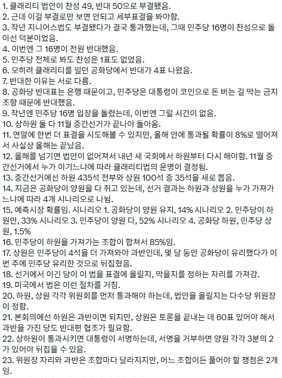
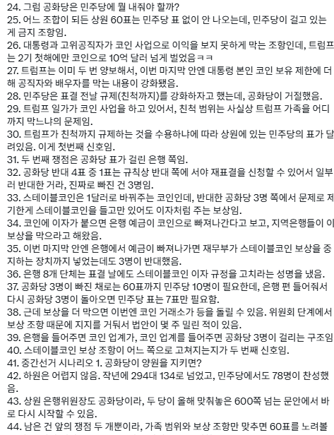
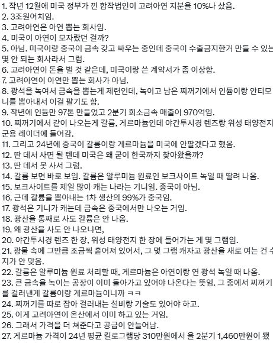
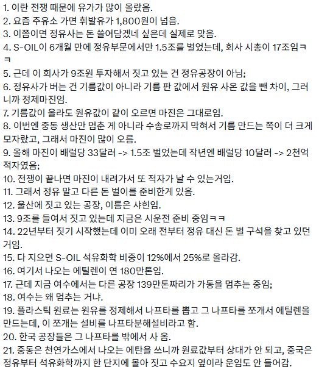

# 퍼스트 무버와 패스트 팔로워
**Date:** 14시간 전
**Category:** 스냅
**Original URL:** https://blog.naver.com/xpfkwh56/224414790698
---

1. 행운도 없고, 재능도 없으면

어떻게 해야 될까?

​

제일 좋은 접근은 열심히 찾아보는 것 임

​

행운은 주로 **'시간'** 변수에 밀접 한데,

언제 터질지 몰라도 하다보면 되긴 됨

​

**\* 노출이 되니까**

​

재능을 찾기 위해서는 내 인생을 통째로

성찰하고 나에 대한 이해를 굉-장히

끌어올리는 시간이 필요함

​

마침, 운이 좋게도 누군가 알아주거나

찾아줬다면 그걸 빌미 삼아볼 순 있음

​

2. 무재능, 무행운 보유자들이 겪는

가장 큰 고통은, 그래서 내가 무엇인가?

​

라는 것에 스스로 답을 내놓을 수 없단 점임

​

나도 해외여행을 갔든, 뭐 대단한 경험을 했든,

뭐를 샀든, 어쨌든, **'꺼리'** 가 있으면

​

그걸 가지고 뭘 하겠는데, 집에서 그냥

티비 보고 유튜브 보고 놀았는데

​

이게 대체 무슨 의미가 있냐 이거지요

​

3. 다만, 세상이 좋아져서 이렇게

**'빈'** 사람들한테도 기회가 있는데,

​

그게 바로 **'벤치마킹'** 임

​

태생적으로 골랐다 하면 다 정답이라

​

본인이 가는 길이 곧 **'길'** 이 되는

인간들이 있기 마련이고,

​

반대로 본인이 걷고 있어도 이게 길인지,

아닌지 분간이 안 되는 사람들이 있는데

​

남의 등을 보고 있으면, 어쩐지 심신의

평온이 오면서 그 자체로 만족스러움을

느끼는 부분도 분명히 있고,

​

그렇게 해서 나름대로 원하는 결과를

얻어내는 사람들도 의외로 많이 있음

​

꼭 학업에 뜻이 없더라도,

성적만 잘 받고 싶은 사람이

​

**'평범'** 한 것 이지

**'잘못된'**것은 아니기 때문

​

​

4. 이건 다른 SNS 에서, 최근

꽤 많은 화제가 되고 있는 사람 얘긴데

​

3줄만 읽어봐도, 어디서

참 많이 본 **'템플릿'** 임

​

아마 그 선을 어디까지 잡냐 문제겠지만,

꼭 본인이 다 해낼 필요까진 없을 수도 있음

​

잘 **'하는 것'** 이 재주 이듯,

잘 **'보는 것'** 도 재주 임