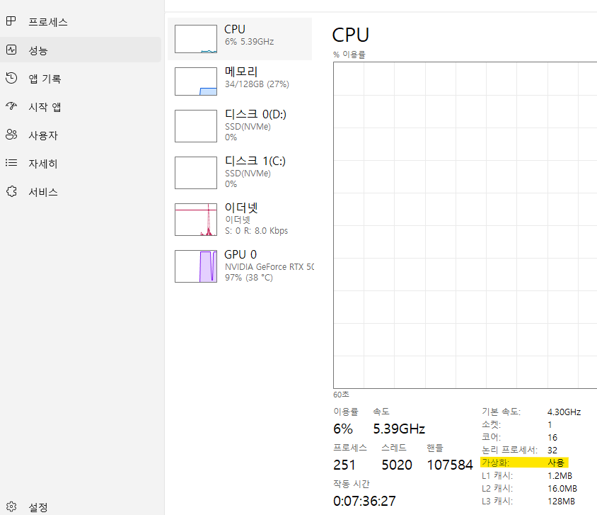
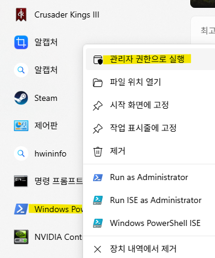
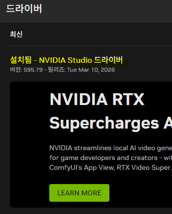
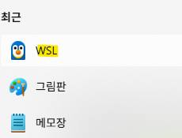
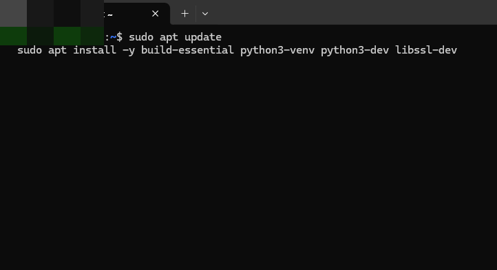
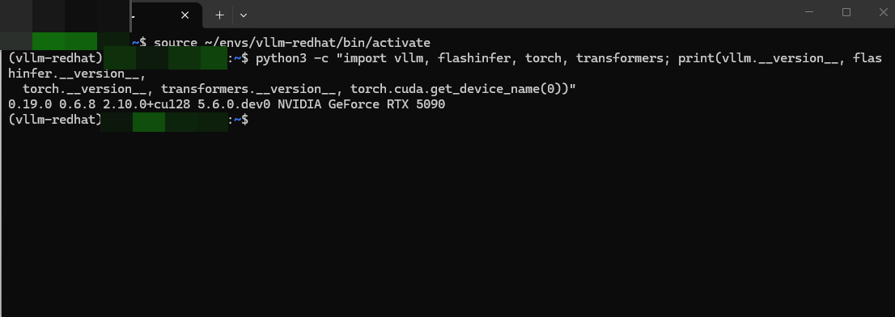
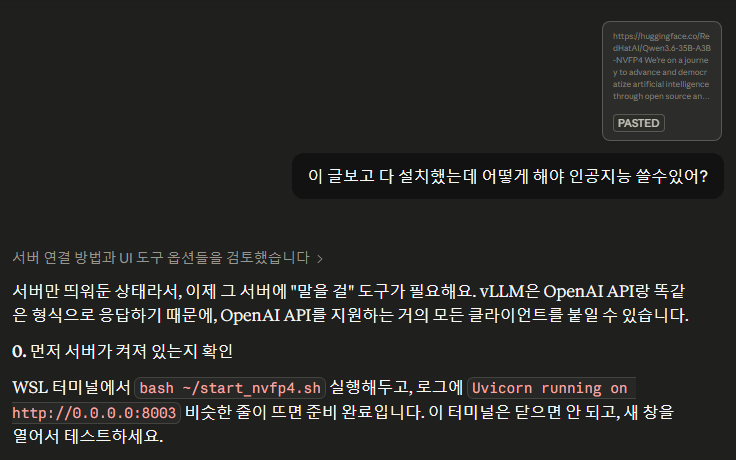
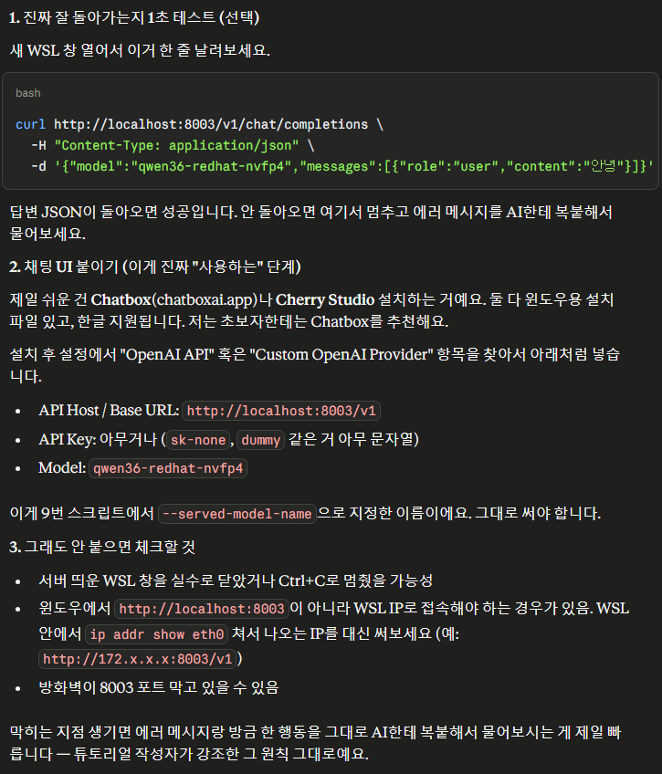
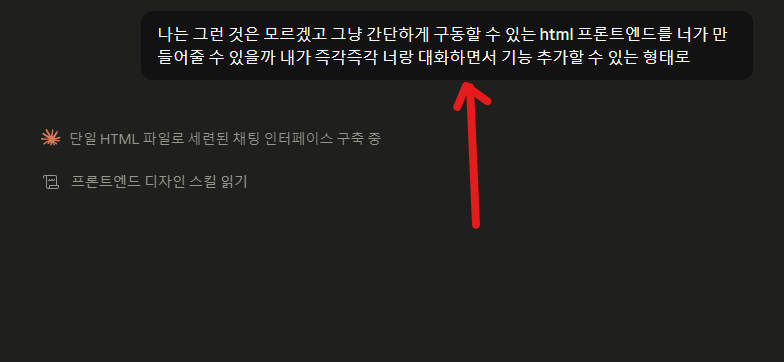

# Qwen3.6 로컬에서 돌리는 법
**Date:** 15시간 전
**Category:** 다이어리
**Original URL:** https://blog.naver.com/xpfkwh56/224256507453
---

<https://huggingface.co/RedHatAI/Qwen3.6-35B-A3B-NVFP4>

[**RedHatAI/Qwen3.6-35B-A3B-NVFP4 · Hugging Face**

We’re on a journey to advance and democratize artificial intelligence through open source and open science.

huggingface.co](https://huggingface.co/RedHatAI/Qwen3.6-35B-A3B-NVFP4)

​

1. 잉공지능은 매일 바뀌기 때문에,

내일 당장 **전부** 달라져도 안 이상함

​

2. 일단 그냥 그대로 따라해보시고,

모르겠으면 인공지능한테 물어보시구

​

그래도 안 되면 수명이 다 한 정보구나,

라고 생각하시는 것이 제일 빠릅니다

​

**3. 권장사항**

​

GPU RTX 5090

RAM 128GB

여유 디스크 30GB 이상

OS windows 11

​

**4. 가상화**

​

​

작업 관리자 → 성능

→ CPU → 가상화 (사용)

이라고 켜져 있는지 확인

​

꺼져 있으면, 바이오스 진입 해서

활성화 해야 하고, 바이오스 진입을

어떻게 해야 되는지랑, 뭘 바꿔야

되는 것인지는 AI 도움 받아서 해결

​

​

5. 윈도우파워쉘 최신 업데이트 하고,

오른쪽 버튼 눌러서 관리자 권한 실행

​

wsl --install -d Ubuntu-24.04

wsl --set-default-version 2

wsl --update --pre-release

​

이렇게 하면, 뭔가 설치가 될 것임

​

Ubuntu 실행하면 username/password

설정 화면 뜨는데, 어디 잘 써놓고 있으면 됨

​

wsl? 우분투? 그게 뭐지?

​

싶으면, 인공지능한테

물어보면 자세히 알려줌

​

​

6. 드라이버 최신 업데이트

​

​

7. wsl 실행

​

​

sudo apt update

sudo apt install -y build-essential python3-venv python3-dev libssl-dev

​

을 하면, 뭔가 설치가 될 것임

​

다 되면,

​

python3 -m venv ~/envs/vllm-redhat

source ~/envs/vllm-redhat/bin/activate

pip install -U pip wheel setuptools

​

pip install vllm==0.19.0

​

pip install --force-reinstall --no-deps \

git+<https://github.com/huggingface/transformers.git@main>

pip install --force-reinstall --no-deps \

git+<https://github.com/huggingface/huggingface_hub.git@main>

​

pip install --upgrade flashinfer-python==0.6.8 flashinfer-cubin==0.6.8

​

이걸 순서대로 복사해서 붙여넣기 하면 됨

**​**

​

source ~/envs/vllm-redhat/bin/activate

를 친 다음에,

​

python3 -c "import vllm, flashinfer, torch, transformers; print(vllm.\_\_version\_\_, flashinfer.\_\_version\_\_, torch.\_\_version\_\_, transformers.\_\_version\_\_, torch.cuda.get\_device\_name(0))"

​

를 치면,

​

vllm 0.19.0 / flashinfer 0.6.8 / torch 2.10.0+cu128 / transformers 5.6.0.dev0 / RTX 5090.

​

이렇게 나오실 것임

​

만약 저렇게 안 나오면, 인공지능에게

본문 내용을 그대로 복사한 다음에

어떻게 해야 되는지 물어보면 알려줌

​

8. 설치

​

mkdir -p ~/models/NVFP4\_Redhat/Qwen3.6-35B-A3B-NVFP4 hf download RedHatAI/Qwen3.6-35B-A3B-NVFP4 \ --local-dir ~/models/NVFP4\_Redhat/Qwen3.6-35B-A3B-NVFP4

​

를 그대로 복사 붙여넣기 하면,

제일 위에 있던 모델을 받을 수 있음

​

모델 파일을 wsl 네이티브에 둬야 하고,

​

.wslconfig 을 만들어서,

​

[wsl2]

memory=96GB

swap=32GB

processors=16

# kernelCommandLine = "cgroup\_no\_v1=all"

# 아래 참고. Docker 쓸 때만 필요

[experimental] sparseVhd=true

​

이렇게 설정하시면 되는데, 무작정 하려면

답답할 확률이 높으니 해당 문단 내용을

인공지능한테 복붙해서 보여주시면 빠름

**​**

**\* Ryzen 9950X3D 의 경우, 16 인데**

**본인 cpu 따라서 차이가 있을 수도 있음**

​

9. 모델 다운로드가 끝나면,

​

~/start\_nvfp4.sh 를 만들고

거기에 아래 있는 내용을 저장하면 됨

​

source ~/envs/vllm-redhat/bin/activate

export VLLM\_MEMORY\_PROFILER\_ESTIMATE\_CUDAGRAPHS=1

​

vllm serve ~/models/NVFP4\_Redhat/Qwen3.6-35B-A3B-NVFP4 \

--served-model-name qwen36-redhat-nvfp4 \

--host 0.0.0.0 --port 8003 \

--trust-remote-code \

--enable-auto-tool-choice \

--reasoning-parser qwen3 \

--tool-call-parser qwen3\_coder \

--moe-backend flashinfer\_cutlass \

--max-model-len 65536 \

--max-num-seqs 1 \

--gpu-memory-utilization 0.948 \

--kv-cache-dtype fp8 \

2>&1 | tee /tmp/redhat\_nvfp4\_server.log

​

실행 방법은 이렇게 하면 됨

​

chmod +x ~/start\_nvfp4.sh

bash ~/start\_nvfp4.sh

​

첫 기동 때, 5-10분 정도 걸릴 수 있는데

로그에 nvcc 돌고 있으면 기다리시면 됨

​

9번 내용은 그대로 복사 한 다음에,

인공지능한테 물어보시는 것이 좋음

​

**1) 저게 대체 무슨 소리인가?**

**2) 왜 해야 되는가?**

**3) 내가 지금 잘 하고 있는가?**

**4) 지금 내 상황에도 유효한가?**

​

라는 답변들을 들어보시고, 들었을 때

납득이 가면 일단 잘 되고 있는 것임

​

**\* --max-model-len 65536 \**

**--max-num-seqs 1 \**

**--gpu-memory-utilization 0.948 \**

**--kv-cache-dtype fp8 \**

**​**

**4개는 바꾸셔도 되고, 나머지는**

**어지간하면 그냥 두시는 것이 낫습니다**

​

10. 다 된 것 같으면,

​

인공지능한테 전체 내용 싹 복붙 시키고,

​

스모크 테스트, 헬스 체크 하고 싶어 라고 하면

어떻게 하는지 알려주는데 그대로 하면 됨

​

일단 문제없이 가동이 되는 것 같으면,

​

~/models/NVFP4\_Redhat/Qwen3.6-35B-A3B-NVFP4/generation\_config.json

에다가 temp 1.0 / top\_p 0.95 / top\_k 20 / min\_p 0 / presence\_penalty 1.5 넣으시고,

​

인공지능한테 샘플링 파라미터를

설명해달라고 한 다음에,

​

각각 뭐고, 바꾸면 어떤 효과나 기능을

기대할 수 있나 물어보고 조정하면 됨

​

**\* presence\_penalty 낮으면,**

**답변에 한자 섞여 나올 수 있음**

**​**

11. 여기까지 했으면,

​

​

지피티든, 클로드든, 제미나이든,

그록이든, 뭐든 써서 저리 물어보시구

​

​

이렇게 말하면 뭔가 만들어줄 것임

​

그렇게 해서 쓰셔도 되고, 아니면

클로드가 위에서 말한대로 따로 내가

적당히 쓰기 좋은 것을 찾아 쓰면 됨

​

12. 제가 구구절절 이렇게 나름대로

어쨌거나 방법을 적은 이유는 뭐냐면,

​

qwen 3.6 moe 모델을 돌려보니까

딱히 크게 손 가는 것 없이 집에서

​

**\* 일단 글카가 있어야 겠지만**

**​**

엄마들이 애기수학, 과학, 영어쪽은

거진 커버할 수 있을 것 같아 보여서 임

​

**너무 복잡해요**

​

<https://huggingface.co/noctrex/Qwen3.6-35B-A3B-MXFP4_MOE-GGUF>

[**noctrex/Qwen3.6-35B-A3B-MXFP4\_MOE-GGUF · Hugging Face**

We’re on a journey to advance and democratize artificial intelligence through open source and open science.

huggingface.co](https://huggingface.co/noctrex/Qwen3.6-35B-A3B-MXFP4_MOE-GGUF)

​

올라마 설치 후, 딸깍 하시면 됨

​

**13. 알면 좋지만 몰라도 그만인 것**

​

1) flashinfer-python 0.6.6은

SM120 CUTLASS MoE 타일 누락됨

​

그래서 flashinfer-cubin 이랑

쌍으로 일치 필수고, 불일치 시

does not match 에러 발생함

​

2) torch 2.10.0+cu128 는

vllm 0.19.0 에 그나마 안정적

​

transformers 5.6.0.dev0 (main branch) 4.x는

TokenizersBackend 없음 → vllm 0.19 실행 불가

​

vllm 0.19.0 는 현재 기준,

바꿀 수 없는 고정값 상태임

​

3) Windows 파일 → WSL 복사 시,

CRLF → LF 변환 필수임

​

wsl -d Ubuntu -- bash -c "cp /mnt/c/Users/start\_nvfp4\_fair.sh /tmp/start\_nvfp4\_fair.sh \ && sed -i 's/\r$//' /tmp/start\_nvfp4\_fair.sh \ && chmod +x /tmp/start\_nvfp4\_fair.sh"

​

inner bash로 감싸야 WSL interop

경로 변환 회피할 수 있음

​

wsl -d Ubuntu -- bash -c 'bash /tmp/start\_nvfp4\_fair.sh'

​

4) 플래그 근거

​

--served-model-name qwen36-redhat-nvfp4 API alias

--host 0.0.0.0 WSL 외부(Windows) 접근 허용 필수 (127.0.0.1이면 Windows에서 도달 불가)

--port 8003 SGLang(8000), MXFP4(8080)와 충돌 회피

--trust-remote-code Qwen3\_5MoeForConditionalGeneration 커스텀 클래스 로딩

--enable-auto-tool-choice tool\_choice:"auto" API 허용

--reasoning-parser qwen3 chat\_template이 prompt에 <think> 자동 삽입, 모델은 </think>부터 출력 — Qwen3.5+ 스타일

--tool-call-parser qwen3\_coder chat\_template의 <tool\_call><function=><parameter=> XML 포맷과 vLLM qwen3coder\_tool\_parser.py 정확히 일치 (hermes는 JSON 기대 — 불일치)

--moe-backend flashinfer\_cutlass RedHat HF README 공식 권장. vLLM nvfp4.py에서 sm\_120 지원하는 최상위 백엔드 (TRTLLM/CUTEDSL은 sm\_100 전용)

--max-model-len 65536 요청당 상한. 실측 KV pool과 근접 (KV pool 자체가 실질 상한)

--max-num-seqs 1 단일 요청 워크로드. KV pool과는 독립 (vLLM 소스 확인)

--gpu-memory-utilization 0.948 이진 탐색: 0.950 fail, 0.948 pass. vLLM 로그 권장 0.9606은 WSL CUDA baseline 1.64 GB 때문에 fail

--kv-cache-dtype fp8 auto 기본값 = 모델 dtype(bf16) → pool 33K. fp8 명시로 pool 67K (+2배)

​

딥시크 파서 써도 일부 호환되긴 하는데,

오래 돌릴 생각하면 해당 조건이 무난함

​

5) 환경변수

​

export VLLM\_MEMORY\_PROFILER\_ESTIMATE\_CUDAGRAPHS=1

vLLM 0.19에서 CUDA graph 메모리를 정확히 예산에서 차감하게 함

없으면, KV pool 계산에 ~0.4 GiB 누락됨

​

필요시에는, export VLLM\_LOGGING\_LEVEL=DEBUG

# 메모리 profile 상세 디버그

export PYTORCH\_CUDA\_ALLOC\_CONF="expandable\_segments:True"

# fragmentation 감소 (실측 필요)

같은 것도 있으면 좋을 수는 있음

​

6) 32gb Vram 영끌

​

Total VRAM (usable): 31.84 GiB

CUDA driver baseline: 1.64 GiB

​

**\* vLLM 시작 전부터 WSL CUDA가 점유 (불가피)**

​

vLLM 예산 (0.948): 30.19 GiB

모델 weights: 21.88 GiB

non-torch forward: 3.45 GiB ← CUTLASS/flashinfer MoE workspace

torch peak: 1.89 GiB ← PyTorch activation peak

CUDA graph: 0.44 GiB

KV cache (fp8): 0.65 GiB = 64,976~67,072 tokens

(여유): 1.88 GiB

​

네이티브 Linux 로 굴리면,

약 1.5gb 절약 가능함

​

7) model\_mtp.safetensors (1.69 GB) 는

--speculative-config 없이는 로드 안 됨

​

**\* 실측 확인 했는데, speculative 없을 때**

**모델 로딩 21.88 GiB 나오고**

**speculative 있을 때 23.45 GiB**

​

8) MTP speculative 는 공식 기술 문서에서는

있으면 좋다고 하지만 5090 단일 GPU에 부적합함

​

KV pool -62%, 속도 -6% 실측으로 검증함

drafter가 unquantized + flashinfer\_cutlass

필요 조건 미충족 → triton backend override 해도 손해

​

9) 제외된 대안

​

--attention-backend flashinfer

→ default 와 속도 동등, 명시 불필요

​

--enable-prefix-caching

→ Mamba-hybrid에 experimental, 단일 요청엔 무의미

​

--enable-chunked-prefill (명시)

→ vLLM 0.19 기본값 True, 명시 불필요

​

--load-format fastsafetensors

→ 로드 시간만 영향, 런타임 무관

​

--tool-call-parser hermes

→ chat\_template 포맷 불일치 (JSON vs XML)

​

10) 왜 vllm로 돌려요?

​

tool-calling 8스텝 안정, 최대 12스텝 가능에

TPS 제일 높고, 상세 출력값이 더 풍부하게 나옴

​

MXFP4\_MOE 가 단일 수행에서는

경우에 따라 더 빠르게 나올 때도 있는데,

​

배치 돌리거나, 루프 들어가는 작업들은

vllm NVFP4 서빙이 통계가 제일 좋음

​

**\* T6 연쇄작업시, 동일 조건 일 때**

**​**

**llama.cpp 10분 15초**

**SGLang 11분 24초**

**vLLM 0.19 4분 49초**

​

프리필은 작업마다 다르겠지만,

​

tok/s 150 전후로 나오니까

비교적 쾌적하게 사용할 수 있음

​

11) 양자화 많은데 왜 하필 레드헷?

원본 대비 리커버리가 정량상, 제일 좋음

​

칼리브레이션 데이터셋은 아쉽지만,

​

그만큼 더 보수적이기 때문에

일단 가볍게 굴리기도 좋음