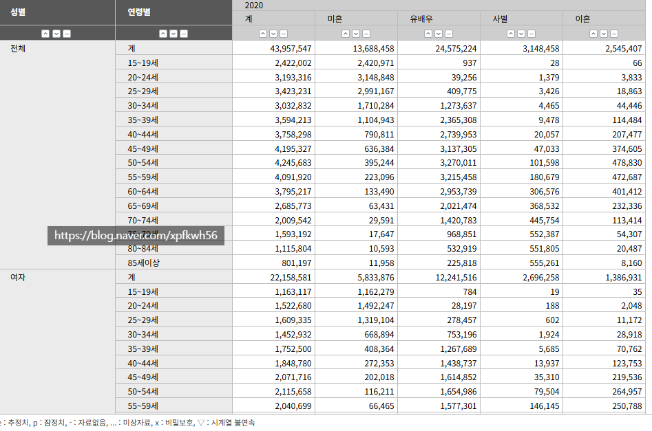
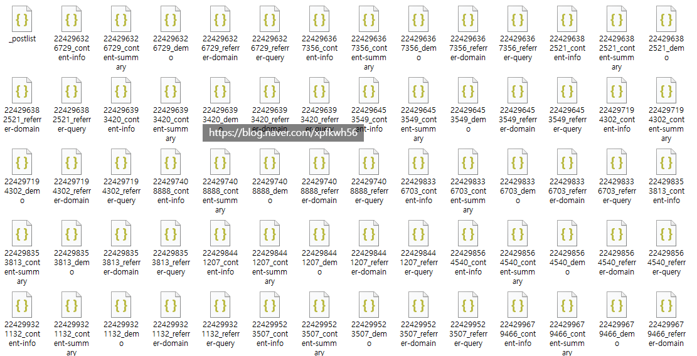

# 블로그 자동화 글쓰기 할 때, 로컬 아이디어
**Date:** 15시간 전
**Category:** 일기장
**Original URL:** https://blog.naver.com/xpfkwh56/224365487371
---

1. 30대 아줌마고, 아이를 키우고 있음

​

이 아줌마한테 2개의 상품을 보여준다고 할 때,

어떤 것이 더 구매할 가능성이 높을까?

​

1) 분유, 아기용품

2) 담배, 위스키

​

일반 **'상식'** 에 비추어 보면, 전자 임

​

근데 알고 보니까, 이 아줌마가

사연이 복잡한 사람이었거나 혹은

​

이미 아기용품이 충분하고, 특정 기념일에

위스키/담배를 사야 될 일이 있어서

알아보고 있었다면 **'통념'** 에 반하게 됨

​

2. 이걸 해결할 수 있는 방법은,

보다 **다양한 case** 를 확보하는 것 임

​

이 사람은 이럴 때 이렇게 행동한다,

저럴 때 저렇게 행동한다 라는 일종의

기출 정보를 많이 갖고 있으면 있을수록

​

**'근거 중심'** 으로 판단할 수 있기 때문

​

3. 문제는 가내 수공업 찍는 일반인 수준에서

시도할 수 있는 범위나, 얻을 수 있는 정보가

명확한 한계를 가질 수 밖에 없다는 점에 있음

​

특히 콘텐츠 작성에 있어서는,

**타깃 독자군** 을 짜는 것이 중요한데

​

현실에서 실무적으로 매트릭스 몇 개만

딸깍 만든다고 그 안에 들어오지도 않음

​

4. 여기에 쓸 수 있는

프록시 아이디어가 있음

​

바로 **캐릭터 바이블 개념** 임

​

시나리오 극작가들은 인물의 일관성이나

예상 반응을 유지하기 위해서

​

일종의 설정집 역할을 하는 사전을

만들어 관리한다고 함,

​

이 방식은 콘텐츠 비즈니스 사업자 또는,

사업자들에게 있어서 자신이 타깃하는

​

고객군을 커버리지 할 때,

유용하게 쓸 수 있음

​

**\* 고객 프로토콜을 설계할 수 있으니까**

**​**

​

최초에는 이 글을 읽으러 들어오는 사람이

내게 아무런 정보도 없는 익명 1인으로 침

​

근데 **아무튼** 확실히 사람일 것이고,

사람 중에서 한국인일 가능성이 높고,

​

한국인 중에 남자 또는 여자일 것이고,

​

둘 중, 남자일 확률은?

여자일 확률은? 같은 것을 유추해서

​

최종적으로 이 사람이 가질 법한

페르소나 요소들은 무엇인지 확보함

​

​

그리고 페르소나 기반으로 추측된

가상 독자를 상정하고 작성한 콘텐츠의

실질적인 반응 데이터를 뽑아낸 다음에,

​

**\* 네이버 api 호출하면, 자기가 직접**

**운용하는 블로그 정보는 추출 가능함**

**​**

그걸 바탕으로 유효성을 2차로 검증함

​

검증을 통과하면, 특정 글의

특정 소재의 특정 방식에서는

​

이런 결과가 **나온 적** 이 있었다

라고 체크하고, 단서로 사용하구

​

그 블로그에 방문하는 사람들의 동선을

유추하는 식으로 하면서 지속적으로

불확실성 영역을 해소하는 구조를 짜면 됨

​

5. 불확실한 영역이 적으면 적을수록,

나중에 연산해야 될 정보가 더 적어짐

​

예를 들어, 나 같은 경우

​

해본 적이 없으니까 특정 직군에서

특정 고객군이 어떻게 일반화 되는지

전혀 하나도 알 수가 없음

​

근데 내가 **'잘'** 아는 분야의 경우라면

​

정확하진 않지만 **대체로 이렇더라** 하면서

즉각적으로 **'가설'** 을 만들어낼 수 있음

​

AI 가 만드는 가설은 대부분 조악한 반면,

​

특정한 가설이 나오는 경우 그거를

증명하게 하는 것은 비교적 더 쉬움

​

이 방식을 쓰면 같은 콘텐츠를 작성해도,

더 타율이 높게 구성하는 것이 가능함