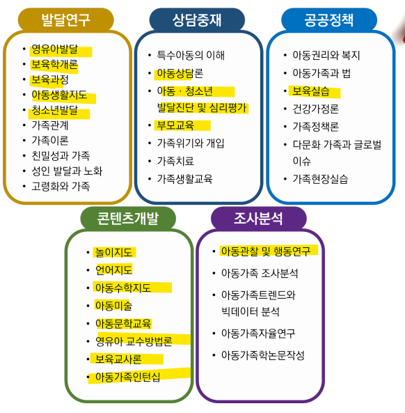
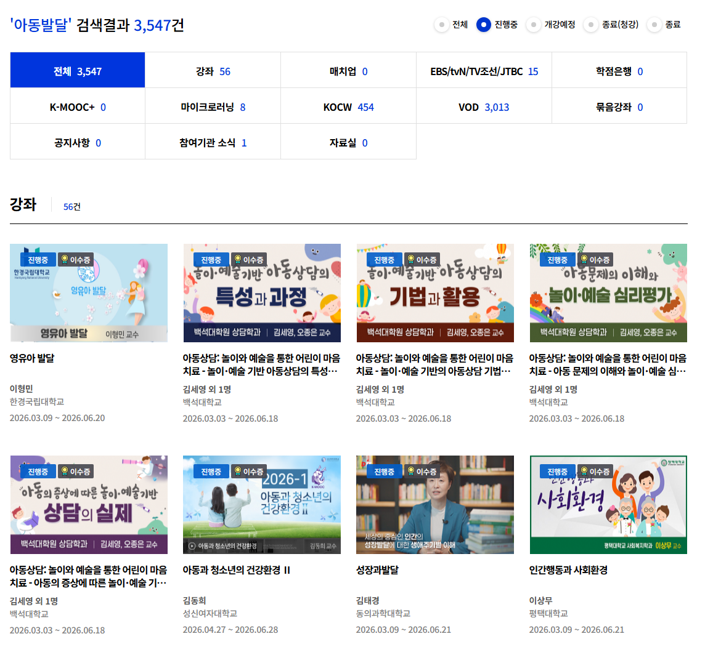

# 아기 누드로 키우는 이유
**Date:** 15시간 전
**Category:** 일기장
**Original URL:** https://blog.naver.com/xpfkwh56/224318576252
---

**\* 해도 그만, 안 해도 그만 에다가**

**영아 특성상 연구가 도깨비 놀음이라**

**믿거나 말거나 레벨인 것도 많습니다**

​

1. 엄마가 되면 겪게 되는 필연이 있음

​

어떻게 해야 애를 **'잘'** 키우는 것 일까?

​

학령기면 학원 뺑뺑이 잘 굴리면 되고,

​

유치원생만 된들 영유를 보내든 무언가

답이 나오는 반면, 영유아 시기 무렵에는

​

**사람인지, 짐승인지도** 모르겠을 뿐 더러

​

주변에 선배맘들한테 물어봐도

육아는 맞으면서 배우는 것이다,

​

라는 취지의 답변만 나오게 될 뿐이고

​

어찌어찌 비슷한 입장끼리 있어봤자,

​

​

심신의 안녕은 구할 수 있을지언정

문제 해결에 도움을 얻기는 쉽지 않음

​

모쏠 열댓명이 서로 연애 상담 해주는

그런 상황이 나오면 현타가 올 수 있음

​

**2. 그런 순간에 빛이 존재함**

​

바로 **'아동학'** 이라는 고등학문 임

​

서울대학교 아동가족학과 커리큘럼

​

우리 아기가 이거 언제 눈을 뜨는 건지,

언제 말을 하고 사람 구실을 하는 것인지,

​

그런 것을 **'발달'** 이라고 함

​

무엇을, 어떻게, 왜, 가르쳐야 하는지,

같은 것을 **'지도'** 라고 함

​

엄마가 된다는 것은, 아니 어쩌면

아내가 된다는 그 자체 만으로도

​

이미 **큰 아들** 을 하나 두는 일인데,

​

가족 이라는 것은 도대체 개념이 뭔지,

정의가 뭐고, 어떤 것이 **'가정'** 인지 등 을

​

많은 사람들이 이미 연구해서

최선의 **'정답'** 을 진작 찾아둠

​

선배맘들이 저 만치 먼저 경험한 다음에

나중에 이런 일도 있더라, 저런 일도 있더라

​

하는 이야기들이 **'이론적으로 정립'** 됨

​

물론, 안다고 크게 다르지는 않겠지만

모르는 것보단 나은 것들이 있긴 있었음

​

**3. 수능 봐야 되나요?**

​

https://www.kmooc.kr/view/search/%EC%95%84%EB%8F%99%EB%B0%9C%EB%8B%AC

​

지금 이 시간에도 열심히 납세자들이

내고 있는 돈으로 이미 다 만들어놨음

​

<https://www.edx.org/learn/child-development>

[**Learn child development | edX**

Understanding child development can help professionals in mental health, social services, and education fields better support clients. Learn child development with online courses, certificates, and degree programs delivered through edX to advance your career.

www.edx.org](https://www.edx.org/learn/child-development)

​

해외로 나가면 하버드 교수 직강도 들을 수 있고,

​

<https://youtu.be/VKA8OXXOfJw?si=8dgGIoA4TusczVbH>

​

내가 듣고 싶은 강의가 개설되지 않았다면

유튜브 같은 곳만 찾아도 상당히 많이 있음

**​**

**영어가 안 되는디요?**

​

자막 스크립트를 다운 받구,

디플이나 파파고 돌린 다음에

​

개화파가 영어 배우듯 하면 됨

​

**\* 그리고 듣다 보면 들림**

**​**

설거지 하거나, 집에서 한가한 시간에

백그라운드로 그냥 뭐든 틀어놓고 있으면

​

**'안'** 틀어놓을 때보다는 나을 때가 많고,

​

저 같은 경우, 컴퓨터 할 때 작은 화면이나

태블릿으로 옆에 강의 하나 **암거나** 켜놓음

​

단어 1자 라도 들어오면 남는다고 생각함

​

책가방만 들고 도시락만 까먹어도

집에서 있을 바에, 학원을 다니든

학교를 가든, 노는 것 보단 낫다 이거임

​

돈 드는 것도 아니고

​

4. 여튼, 귓동냥 하면서 말을 들어보니

​

인간이란 것이 외부 정보를 수용할 때,

감각과 비감각 2개로 나눌 수가 있는데

​

비감각은 우리가 익히 아는 추상 차원이고,

감각은 눈, 코, 입, 피부, 귀로 듣는 오감 임

​

현학적인 이야기 같은데 간단함

​

행복은 무엇으로 느낄 수 있느냐?

그냥 느끼는 것임

​

추상임

​

시각, 촉각, 후각, 미각, 청각,

5가지 감각으로 행복을 못 느낌

​

행복은 = 비감각

빨간색 = 감각

​

이렇게 나눠서 이해하면 빠름

​

5. 인간이 **'추상 사고'** 를 하려면

하드웨어가 충분히 발달 해야 됨

​

1살, 2살이 음마 음마 하기 시작하면서

사람 흉내 낸다고 해서 패러다임, 메커니즘

같은 단어 가르치려고 하면 잘 안될 것임

​

**\* 이산, 피드백, 아날로그, 디지털, 등등**

​

그럼 뭐를 할 수 있냐?

감각적인 정보를 다룰 수 있음

​

그게 무엇인지는 아직 모름

​

근데 어른의 단어를 빌려서 쓰면

어, 대충 뭐 어둑어둑 하다

​

그럼 그게 어둑어둑 한 것이다

정도는 배우지 않아도 알 수 있음

​

**\* 안 보이니, 안 보인다고 하고**

**홍시맛이 나니 홍시맛이 난다 하는**

​

이 수순이, 촉각부터 차근히 발달함

​

갓 태어난 아기 데리고 집에 와봤자

걔는 내가 어찌 생겼나도 알 수 없음

​

생긴 꼴을 모르는 것이 아니고,

그냥 앞이 안 보여서 모름

​

6. 추상 사고는 어떻게 발달을 시키냐?

​

그노무 메타인지 타령 주절주절 하고,

여러 어려운 이야기들이 많이 나오는데

​

어떻게 해야 그걸 해낼 수 있느냐?

​

**답이 없음**

**​**

많이, 오래, 자주 하면 됨

​

마찬가지로 감각 역시

쓰면 쓸수록 촉진됨

​

**\* 무한정 하진 않지만**

​

그래서 바바리안

누드로 키우고 있음

​

**7. 실용적 차원**

**​**

아기는 침을 흘릴 수도 있고,

다양하게 암튼 금방 지저분해짐

​

근데 옷을 계속 입히고 갈아주면

내 노동량이 답이 없을 것 같아서

​

기저귀 하나 달랑 입히고,

오염되면 봐서 전신을 세척함

​

빤스만 벗겨놓고 닦아놓은 다음에

잘 말려서 또 기저귀 채우면 되니까

​

효율적으로 육아를 할 수 있음

​

**8. 세상에는 두 가지 일이 있음**

​

하면 할수록 늘어나는 일이 있고,

하면 할수록 줄어드는 일이 있음

​

공부랑 식도락은 하면 할수록 늘어남

​

아는 것이 많아지면 더 알아야 되고,

먹어본 것이 많으면 먹고 싶은 것이

더 많아지게 되는 구조를 가져 그러함

​

반면에 **'시험'** 공부와

**'밥 한 공기 먹기'** 는

하면 할수록 줄어드는 것임

​

아기 옷, 아기 살림이 많아진다는 것은

그에 수반 되는 인프라를 요구하게 됨

​

**\* 당근도 조상님이 대신 해주는 것 아님**

**​**

내가 하는 것이 무엇인지 알면

일을 늘릴 수도, 줄일 수도 있음