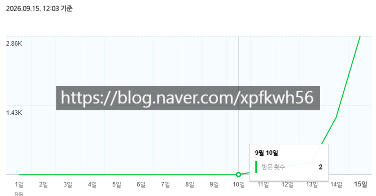

# 야생 학습의 핵심은 관찰
**Date:** 15시간 전
**Category:** 스냅
**Original URL:** https://blog.naver.com/xpfkwh56/224412316739
---

1. 방법을 찾는 사람이 있고

**'툴'** 을 찾는 사람이 있는데,

​

이를테면 이런 것 임

​

[https://blog.naver.com/h000607](https://m.blog.naver.com/h000607)

[https://blog.naver.com/artistkkk](https://m.blog.naver.com/artistkkk)

[https://blog.naver.com/browneyeshot](https://m.blog.naver.com/browneyeshot)

[https://blog.naver.com/rubi1105](https://m.blog.naver.com/rubi1105)

[https://blog.naver.com/rose2370](https://m.blog.naver.com/rose2370)

[https://blog.naver.com/hereissues](https://m.blog.naver.com/hereissues)

[https://blog.naver.com/jjh490403](https://m.blog.naver.com/jjh490403)

[https://blog.naver.com/fnb00001](https://m.blog.naver.com/fnb00001)

[https://blog.naver.com/ijandak](https://m.blog.naver.com/ijandak)

[https://blog.naver.com/ura0625](https://m.blog.naver.com/ura0625)

[https://blog.naver.com/hkhan001](https://m.blog.naver.com/hkhan001)

[https://blog.naver.com/mini9219](https://m.blog.naver.com/mini9219)

[https://blog.naver.com/lussi77](https://m.blog.naver.com/lussi77)

[https://blog.naver.com/tgdosa](https://m.blog.naver.com/tgdosa)

[https://blog.naver.com/luvayumi](https://m.blog.naver.com/luvayumi)

[https://blog.naver.com/jhh3555](https://m.blog.naver.com/jhh3555)

[https://blog.naver.com/yd0189816](https://m.blog.naver.com/yd0189816)

[https://blog.naver.com/ijandakm](https://m.blog.naver.com/ijandakm)

[https://blog.naver.com/vm0508](https://m.blog.naver.com/vm0508)

[https://blog.naver.com/yd0189816](https://m.blog.naver.com/yd0189816)

[https://blog.naver.com/lmj7710](https://m.blog.naver.com/lmj7710)

<https://blog.naver.com/ijandak>

[https://blog.naver.com/junghwa1000](https://m.blog.naver.com/junghwa1000)

[https://blog.naver.com/jongbell84](https://m.blog.naver.com/jongbell84)

​

나는 위 블로그를 운영하는 사람이

1명인지, 아니면 저게 **'템플릿'** 인지 모름

​

2. 하지만 흔히, **'이슈 블로그'** 라고 말하는

다소 양산화 된 계정으로 보임은 **분명** 하고,

​

찍히는 트래픽도 적지 않음

​

20개가 넘는 계정(3\*7)인데,

계정 1개당 하루 조회수 5천씩만 찍혀도

​

물론 노출은 알 수 없지만

일 3만 5천, 월 100만 트래픽 임

​

**\* 최소**

​

> 사람이 쓰는 걸까?

​

내용을 찾아보면, **프롬프트가 새는** 경우도 있고

서장훈을 축구선수 라고 묘사하기도 함

​

99% 확률로 나는 로컬 모델 운영자라고 보고,

프롬프트가 새는 것을 볼 때, 아마 후처리 정규식을

따로 파이프라인에 추가한 것은 아닌 것 같음

​

**\* 집에서 혼자 충분히 써본 다음에,**

**상용화를 하라고 권하는 이유임 이게**

**​**

초기 계정은 부스팅 시점에, 100개씩 올리고

업로드 중앙값은 4분 정도임

​

약 2천자 내외의 게시물을 4분 단위로

3구간으로 나눠서 올리는데

​

**'아직 정지를 안 당했다는 것'** 은,

네이버 단기 필터에서 해당 수준 만큼은

​

따로 잡지 않는다는 실증적 증거 이기도 함

**​**

**3. 투데이 보는 방법**

**​**

**​**

정해진 시간마다 찍힌

today 를 보면 됨

​

가설을 세워 본다면,

​

투데이는 하루에 찍히는 방문자 숫자고

매일 오후 11시~11시 59분 사이에

​

계속 today 를 수집한다면, 해당 블로그의

방문자를 노출하고 있지 않더라도

외부에서 확인하는 것이 가능할 것 임

​

**\* 당연**

​

문제는 이걸 사람이 하기 버겁단 건데,

​

이 작업은 **'기계적인'** 작업 이고,

프로그래밍으로 외주화 할 수 있음

​

|  |  |  |  |  |  |  |  |  |  |  |
| --- | --- | --- | --- | --- | --- | --- | --- | --- | --- | --- |
| **블로그이름** | **닉네임** | **인플** | **메이트** | **지정** | **AI인용** | **인용측정일** | **today** | **누적** | **글수** | **글당유입** |
|  |  | [✅](https://in.naver.com/bloom) | - | ✅ | 61만 | 2026-07-23 | 15,883 | 7,077.8만 | ​ | ​ |
|  |  | [✅](https://in.naver.com/meaning87) | ✅ | ✅ | 1,863만 | 2026-07-23 | 28,074 | 6,521.4만 | ​ | ​ |
|  |  | [✅](https://in.naver.com/healthandmoneytarget) | ✅ | ✅ | 1,290만 | 2026-07-23 | 22,991 | 1,573.5만 | ​ | ​ |

|  |  |  |  |  |  |  |  |  |  |  |
| --- | --- | --- | --- | --- | --- | --- | --- | --- | --- | --- |
| **블로그이름** | **닉네임** | **인플** | **메이트** | **지정** | **AI인용** | **인용측정일** | **today** | **누적** | **글수** | **글당유입** |
|  |  | [✅](https://in.naver.com/bloom) | - | ✅ | 67.7만 | 2026-07-30 | 27,572 | 7,100.2만 | ​ | ​ |
|  |  | [✅](https://in.naver.com/meaning87) | ✅ | ✅ | 1,897만 | 2026-07-30 | 27,441 | 6,541.1만 | ​ | ​ |
|  |  | [✅](https://in.naver.com/healthandmoneytarget) | ✅ | ✅ | 1,343만 | 2026-07-30 | 33,412 | 1,592.9만 | ​ | ​ |

​

3개의 블로그를 트래킹 한 것 임

​

이런 방식을 통해, 해당 블로거 가

하루에 글은 몇 개를 작성하는지,

​

그리고 특정 기간 단위로 나눴을 때,

글 1개당 유입되는 **'자산'** 은 얼만지

​

**'어떤 블로그와 경쟁하고 있는지'**

같은 것들을 데이터로 확보할 수 있음

​

만약 A 블로그가 x 라는 소재를 다뤘는데,

B 블로그 또한 얼마 뒤 x 소재를 다뤘고

​

둘 다 대기업 블로그 라면?

​

대체로 **'대기업'** 들은 이런 정보를 다루네?

라고 **'직관'** 적으로 이해할 수 있을 것 임

​

AI 에 관심이 많은 분들은, 이 타이밍 에

감이 오셨을 가능성이 굉장히 높은데

**​**

**Pointwise mutual information** 를

쓸 수 있는 **'데이터'** 가 확보되는 것임

​

PMI(vj,vk)=logP(vj)P(vk)P(vj,vk)

​

분모 P(vj)P(vk)P(v\_j)P(v\_k) P(vj)P(vk)는

두 사건이 서로 독립이라면 함께 일어날 확률이고,

​

분자 P(vj,vk)P(v\_j, v\_k) P(vj,vk)는

실제로 함께 일어난 확률임

​

복잡하게 보이지만 결국

​

실제 동시 발생/우연히 기대되는

동시 발생의 비율에 로그를 씌운 것이고,

​

세부 계산은 사람이 할 필요가 없어서

인공지능한테 맡기면 됨

​

**\* 데이터를 어디에 어떻게 넣느냐,**

**무한 전처리 지옥을 어떻게 돌파하냐**

**이거만 사람이 붙들고 있어주면 끝**

**​**

PMI가 0보다 크면 자주 함께

나타나서 서로 연관이 있다는 뜻이고

​

0이면 서로 독립이라

아무 관계가 없다는 뜻이며,

​

0보다 작으면 우연보다 오히려

덜 함께 나타나서 피하는 경향이 있다는 뜻

​

예시로, 문장 10,000개짜리 데이터에서

단어들을 세어 봤다고 해볼겠음

​

'용혜인' 이 100번, '논란' 이 50번 나오고,

둘이 같은 문장에 함께 나온 게 40번이라면 P(용혜인)=0.01P(\text{용혜인})=0.01 P(용혜인)=0.01, P(논란)=0.005P(\text{논란})=0.005 P(논란)=0.005, P(용혜인, 논란)=0.004P(\text{용혜인, 논란})=0.004 P(용혜인, 논란)=0.004

​

독립이라면 기대값은 0.01×0.005=0.000050.01

\times 0.005 = 0.00005 0.01×0.005=0.00005인데

​

실제는 0.004로 80배나 많으니, log⁡280≈6.3\log\_2 80

\approx 6.3 log280≈6.3으로 강한 연관이 나옴

​

반면 용혜인 과 '그리고'(3,000번 등장)가

30번 함께 나왔다면 실제 확률 0.003과

기대 확률 0.01×0.3=0.0030.01

​

\times 0.3 = 0.003

0.01×0.3=0.003 이 같아서

PMI는 0, 그 말이 무슨 말이냐?

​

'그리고' 는 어디에나 붙는 토큰이라

특별한 관계가 없다는 뜻 임

​

**\* 학벌 막론하고 컴공과 대학생**

**2-3학년 정도면 배우는 기초임**

**​**

4. 이를 통해, 현재 이슈가 되고 있는

화제나, 주제, 사람들이 주목하는 것,

​

그리고 네이버가 **'신뢰하는 것'** 으로

추측되는 문장의 문구들을 뽑을 수 있음

​

물론 **항상** 맞아 떨어지는 것은 아님

​

**\* 통계 자체가 미래를 다루는 학문이므로**

**​**

그러나 잘 **관찰** 하고, 여러 툴을 잘 활용하면

​

​

보시다시피 블로그 트래픽을

**'굉장히 단기간에 터트릴 수 있음'**

​

1) 본인이 센스가 좋으면 더 빠르고

​

2) 여러 기술을 접목해서,

**'내 직관'** 을 **'객관화'** 할 수 있으면

짧은 시행착오로 더 효율화 가능함

​

**5. 결론**

​

쌩으로 야생에 있는 사람들은

대부분 제대로 공부를 안 한다

​

**\* 고등지식을 거의 안 쓴다**

**​**

제도권에 있는 사람들은 야생에 관심이 없거나,

불편해서 아예 진입조차 하지 않는다

​

**\* 있어도 활용을 안 한다**

​

즉, 야생에서 **'조금만'** 노력해도

높은 포지셔닝을 가져갈 수 있다