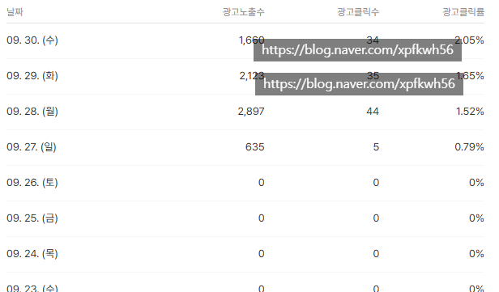

# 깨달음이 왔음
**Date:** 16시간 전
**Category:** 스냅
**Original URL:** https://blog.naver.com/xpfkwh56/224428140964
---

​

1. 이 포스팅을 읽는 사람은

그래서 어떤 사람이고,

​

2. 무슨 문제를 겪고 있고,

3. 무엇을 해결 하고 싶은가?

​

**4. 원래 내가 알던 지식**

​

1) 여튼 조회수가 높으면 애포 수익이 높다

2) 홈판에 올라가면 단가 배수가 다르다

​

**어!?**

**​**

**\* 관찰된 반례 들을 중심으로 다시 조사함**

**​**

3) 핵심은 광고를 얼마나

광고처럼 보이지 않게 하느냐,

​

**'광고'** 가 아니라 도움되는

**필요한 콘텐츠** 로 바꾸느냐

​

타겟을 좁히면 좁힐수록, 더 낮은

트래픽으로 더 효율적인 수익처가 된다

​

5. 대강 보니까 매일 1천명 정도의

문제만 해결해줄 수 있는 사람이면

평생 먹고 사는데 지장 없을 것 같다