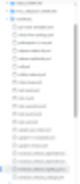
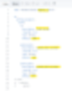
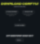

# 두 가지 접근
**Date:** 16시간 전
**Category:** 다이어리
**Original URL:** https://blog.naver.com/xpfkwh56/224187008814
---

1. 유튜브, 구글, 네이버 검색

​

**[ComfyUI 설치하는 법]**

​

그럼 온갖 정보가 쏟아져 나옴

​

문제는 이렇게 하면,

**'왜?'** 를 알 수가 없음

​

2. 정보를 볼 땐, 뭐를 봐야 된다?

**Raw Data** 기반으로 봐야 된다

​

유재석이 롤모델이면,

​

유재석을 롤모델로

삼을 것이 아니라

​

유재석이 뭐를 롤모델로

했었나부터 봐야 된다는 소리

​

<https://github.com/Comfy-Org/ComfyUI>

[**GitHub - Comfy-Org/ComfyUI: The most powerful and modular diffusion model GUI, api and backend with a graph/nodes interface.**

The most powerful and modular diffusion model GUI, api and backend with a graph/nodes interface. - Comfy-Org/ComfyUI

github.com](https://github.com/Comfy-Org/ComfyUI)

​

Comfy 를 만든 천재 개발자는

지금 딴 길로 넘어가서, 다른 팀이

공식적으로 그 권한을 갖고 있음

​

**\* 벌써 예사롭지 않은 프로필 사진**

**멀쩡한 여자 귀를 왜 동물로 했는지**

​

​

들어가서 해당 파일들을 보면,

​

오피셜 그 자체

​

얘네가 앞으로 몇 버전을 중심으로,

업데이트를 시도할 것인지 나오고

​

가장 기능 최적화가 이루어진 상태가

어떤 상태인지, 얘네가 의도했던

​

설계와 목적에 맞는 것이 뭔지를

찾아서 내가 이용하는 것이 가능함

​

​

버튼 있다고 그냥 누르면

​

오늘은 쉬워도 내일이 어렵게

모가지 돌아갈 일 생길 수 있고,

​

다운로드 모델을 왜 구분했을까?

포터블이랑 그냥은 차이가 뭐지?

​

어떤 트레이드 오프 관계가 있지?

같은 것을 알면, 오늘은 어려워도

​

본인의 **근본**이 될 가능성이 올라감