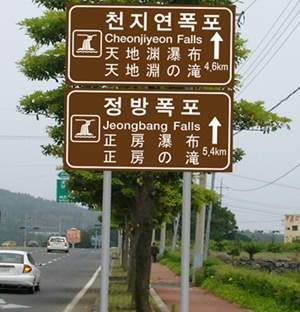

# 인공지능의 수학/과학 업적에 관하여
**Date:** 16시간 전
**Category:** 스냅
**Original URL:** https://blog.naver.com/xpfkwh56/224414657106
---

**1. 과학 업적**

​

물론 끕을 나누는 것이 별 의미야 없겠지만,

​

인공지능으로 만든 대표적 성과 중 하나가

알파폴드로 노벨상을 받았던 것 임

​

**도대체 어떻게 한 것 일까?**

​

이게 일반적인 직관이랑 다른 부분인데,

​

**'화학'** 분야의 경우, **'복잡하면 복잡할수록'**

문제를 해결하기 더 쉽다는 특징이 있음

​

그게 무슨 말?

​

우리가 고대 문자를 해독한다고 가정함

​

​

한자, 영어를 하나도 모르는 사람도

한국어만 할 줄 알면 저 밑에 있는

​

**'형태'** 를 가진 문자가 어떤 뜻 인지

대충 통밥으로 뚜들겨 맞춰볼 수 있음

​

**\* falls 가 폭포인가 본데?**

**​**

한자로 된 것은 앞에 천지연, 처럼 보이는

3개가 유지되고 있다 아마도 한자에서

​

천/지/연 이라는 글자가

저 한자랑 일치하는 것 같다

​

그리고 중간에 있는 건 **'다'** 한자 고,

아마 제일 끝은 일본어 인 것 같다

​

그리고 일본어처럼 된 문자 안에서

제일 끝에 폭포를 의미하는 것 같은

기호가 계속 반복되는데,

​

일본어에선 저렇게 부르나보다

그리고 그 앞에 있는 히라가나 글자가

어떤 의미를 지니고 있는 것 같다

​

만약 **'글자 쌍'** 이 더 많다면 어떨까?

​

​

の = **'의'** 아닐까?

​

진격**'의'** 거인,

바람**'의'** 상처,

​

3개가 아니라, 30개,

300개, 3000개 라면?

​

점점 **더 정확하고 견고해질 것** 임

​

화학에서도 마찬가지로 분자 구조가

복잡하면 복잡할수록 더 맞출 수 있고,

​

단순하면 단순할수록 풀 수 없는데

​

예전에는 **'못 했던'** 이유가

**'가성비'** 가 안 나와서 못 한 건데

​

인공지능으로 **값싸고** 메가 데이터를

**쉽게** 다룰 수 있으면서 할 수 있게 됨

​

즉, **'통찰의 툴'** 이 생긴 것이 아니고

​

손으로 계산하던 사람들한테

**'주판'** 이 생긴 것에 가까운 것 임

​

**2. 수학 업적**

​

1) 인공지능을 쓰는 사람들은 대부분,

​

유명한 모델을 쓰거나 그냥 무작정

좋다고 하면 그대로 쓰는 경향이 많음

​

허깅 페이스 다운로드 숫자로 추측하면

국내에서 로컬 인프라 시스템을 가용해서

직접 다운받아 운용하는 하드 유저는

​

거의 **1만 명 당 1명 꼴** 정도 인데,

​

이렇게 파는 사람들도 모델에 대한 이해를

동시에 가져가면서 하는 사람은 **거의** 없음

​

모델의 성능은 크게 둘로 구분할 수 있음

​

깡모델 성능과 추론 수준임

​

예를 들어, 페이블이나 아스트라가 있고

그 밑에 오퍼스, 솔 모델 같은 것이 있다면

​

저 모델명 자체가 **깡모델** 의 성능임

그 밑에 달린 추론 수준은 무엇이냐?

​

**'얼마나'** 사고에 자원을 쓸 것이냐? 임

​

비유하자면, 인턴/주니어/시니어 일 때

5분 만에 대답하기, 5일 안에 대답하기

​

같은 것이 깡모델 과 추론 의 기능 설정 임

그렇다면, 1+1 을 푼다고 가정 함

​

강박증 하버드 수학과 교수에게 1년의 시간 주기

vs 초등학생 한테 10분 안에 맞추라고 하기

​

어떤 출력이 더 **'경제적'** 일까?

대부분의 경우는 후자일 가능성이 높음

​

왜냐,

​

강박증 걸린 하버드 수학과 교수한테

1년 동안 풀라고 주면, 얘는 **그냥** 1년을 씀

​

이 문제의 의도가 뭐지? 숨겨진 가정은?

내가 본 것이 진짜 **'1'** 맞나? 더하기란 뭐지?

​

같은 것에 매몰 된다는 것 임

​

그래서 **'무작정'** 좋은 모델에, 고추론 이라고

다 좋은 결과를 보장하는 것이 아니라

​

이 **'확률적 인터프리터'** 를

적재적소에 쓰는 것이 중요함

​

**\* 대표적이고, 이미 많은 용례가 나온**

**경우는 어떤 상황에 어떤 모델을 써야 된다**

**라는 것이 규격화 된 반면, 대부분의 활용은**

**본인이 깨져보기 전까진 알 수 없음이 킥 임**

​

인공지능이 **'수학'** 분야 에서

업적을 내는 것은,

​

동시다발적으로 엄청나게 다양한

**경우의 수** 를 뽑아낸 다음에,

​

그 케이스를 **'끝까지'**

모두 밀어내는 것 임

​

그래서 **'소수의 규칙을 찾아내라'**

같은 지시로는 죽어도 답을 못 알아냄

​

다만 100억 까지 소수를 구하고,

나온 모든 숫자가 소수인지 체크하고

​

모든 가설을 반증해라 라고 하면,

​

**'그게 맞는지 틀린지는 모르지만'**

아무튼 계속 대가리를 박을 수 있음

​

내가 아는 한, 지금 풀린 수학 난제들도 다 그럼

​

오픈AI 에서 올린 논문 보면,

​

기존 도구를 전혀 다른 분야에

끝까지 밀어붙이면 풀리는 **유형** 이었고,

​

그마저도 최대 연산량에서

**절반 정도 성공하는 확률적 결과** 였음

​

방대한 메가 데이터를 집어 넣었을 때,

​

그걸 어마어마하게 조합하기만 하면

답이 나오는데 사람이 차마 할 수 없던 것

​

현재 까지 AI 는 **'그런'**

난제들만 풀 수 있는 것 임

​

비선형 편미분 방정식 에서

모든 조건을 아우르는 보편적인 일반해에

대한 규칙은 아직도 나오지 않았음

​

근데 우리가 그걸 모른다고, 비행기가 못 뜨고

게임 만들 때, 물/바람/연기 못 만드는 것 아님

​

**'이런 것도 되네'** 를 언론이 부풀리는 것 뿐임

​

2) 엄청 똑똑한 인공지능 이라고 하는데,

​

**막상 집에서 수학 문제 같은 것만 물어봐도**

**똑바로 대답을 하는 법이 없던데 그건 뭐임?**

​

**'테스트'** 를 하려고 해서 그럼

​

일전에 말했던 것처럼 **'지능'** 이 아님

​

모델에 새겨진 가중치에 따라서

가장 높은 확률로 나타날 수 있는

​

**'패턴'** 을 **'비결정적'** 으로

출력하는 **'스크립트'** 일 뿐 임

​

명시된 구조와 규칙을

코드로 옮기게 만들어주면,

​

그러니까 **'수식화'** 시키거나

**'수식을 풀게'** 시키면 인간보다

​

당연히 무조건 정확할 수 밖에 없음

​

**\* 컴퓨터의 본질이 계산기 니까**

​

근데 입력 자체를 자연어로 넣어주거나,

​

수식화 단계에서 온전하게

**'라우팅'** 되지 않으면

​

토큰과 시간만 처먹고 산으로 가는 것 임

​

수학 특화 모델의 경우,

​

**'풀이법'** 과 **'유형'** 을

엄청나게 많이 집어넣음

​

그리고 자연어 입력에 따라서,

마치 toolcall 이 묶이는 것처럼

​

일정 패턴의 방향값으로 수렴 시키는데,

​

그게 내가 푸는 수학 문제랑 일치하면

풀어낼 수 있는 것이고 아님 못 푸는 것임

​

그래서 국제 올림피아드

수학 문제 푸는 모델이

​

**이걸 몰라?** 싶은 걸 못 풀 수도 있는 거고,

​

엄청 대단한 기능을 갖고 있는 것 같은데

의외로 당연하고 일상적인 작업들의 경우,

​

**\* 특히 사람이 손쉽게 할 수 있는 것들**

​

뜬금 없는 접근을 하거나 못 하는 것 임