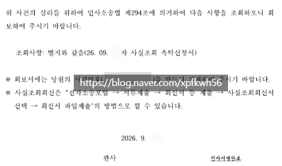

# 자존심 배틀 5만원짜리 내 민사소송 근황
**Date:** 16시간 전
**Category:** 스냅
**Original URL:** https://blog.naver.com/xpfkwh56/224424724548
---

​

1. 지급명령 송달 → 폐문부재 → 특별송달 →

이사 불명 → 주민센터 가보니 검찰에서

사건 결과 통지서 받은 주소에 전입신고

한 적이 여태 한 번도 없는 것 같다고 말씀 ,,

​

2. 주민 뒷자리 알아 오셔야 된다 →

민사로 전환 → 사실 조회촉탁 → 주민 뒷자리 받고

동사무소 다시 가보니 공무원 피셜,

​

어디에도 전입 신고가

안 된 사람인 것 같다

​

**????????**

​

3. 재산 명시라도 시켜서

법원 한 번 나오게 만들려고 하는데

​

**\* 쌩까면 감치 당함**

​

소송 비용이 전부 내가 직접

했는데도 30만원 넘어가는 중

​

그럼 이런 것 굳이, 왜 하나요?

​

한 번 처음부터 끝까지 해보고,

안 하고 차이가 **분명히** 있음

​

**4. 결론**

​

세상은 절대 내 기준으로 보면 안 된다