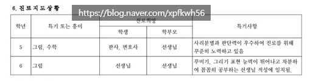
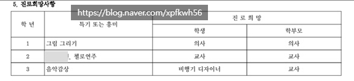
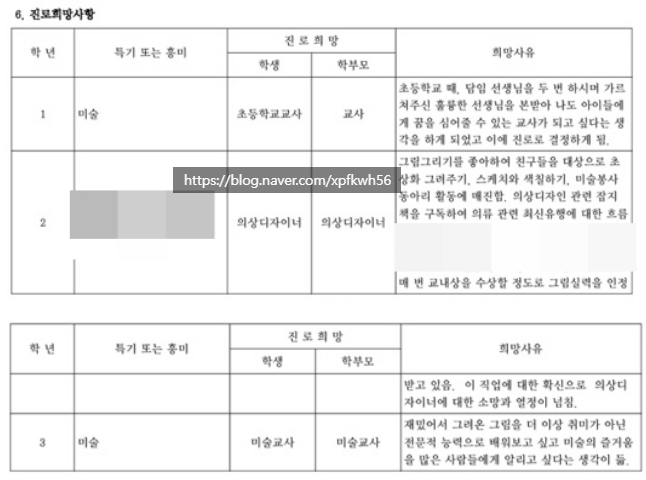
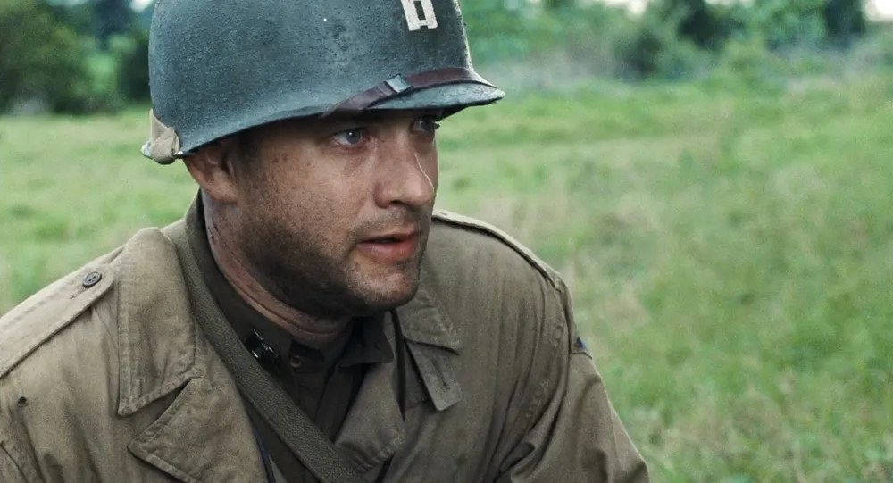
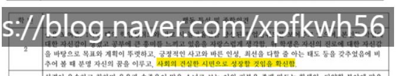
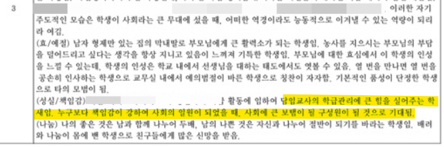
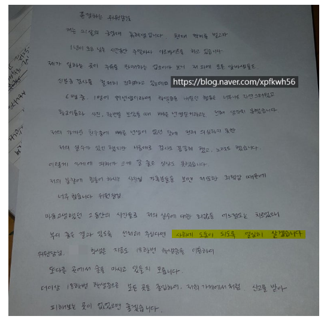

# 인간을 빚는 일
**Date:** 17분 전
**Category:** 다이어리
**Original URL:** https://blog.naver.com/xpfkwh56/224284776975
---

​

1. 제 학생부에 있는 진로희망 임

​

의사, 판사, 변호사야 **당연한 픽** 이고,

​

비행기 디자이너, 의상 디자이너 는

당시 **'낭만픽'** 으로 골랐던 걸로 기억함

​

그러니 아무래도 내가 변하긴 한 모양이야

​

저도 다른 고쓰리들이 그렇듯,

급하긴 했는데 구라는 안 쳤음

​

제 꿈은 깨나 오랜 시간 미술 선생님 이었고,

​

지금은 내가 **'더'** 잘할 수 있을 것 같은

일을 찾았기 때문에, 행여 바뀔 수도 있지만

​

일단 지금 기준으로는, 아이들을 다 키우면

사회복지 영역으로 말년을 보낼 계획에 있음

​

**\* 그 날의 전까진, 제 직업을**

**아이(들)의 엄마이자 아내이자,**

**며느리이자, 딸로 살고 싶구요**

​

2. 시골에서 학교 다니면 노인이 많음

​

시골이기 때문에 노인이 많기도 하지만,

보호자 역할을 하는 노인들이 많이 있음

​

그럼 왜 노인들이 보호자 역할을 할까?

**​**

**엄마, 아빠는 어디가고?**

​

전적으로 내가 봤던 것들에 의하면,

그 이유는 다음과 같음

​

1) 먹고 살기가 바쁘거나,

2) 사연이 있어서 외주 줬거나

​

나도 어른의 세상을 살다 보니까,

​

아이의 세상보다는 넓게 되었고

갖고 있는 해상도가 더 높아졌는데

​

살아보겠다고 맡기는 경우도 있겠고,

​

니 새낀지, 내 새낀진 몰라도

받았으니 아무튼 누가 키워라

​

같은 느낌도 없진 않았던 것 같음

​

3. 농사는 대표적인 노동집약 산업으로,

빌릴 손 하나가 그리 귀할 수가 없는데

​

사정이 이리 되면, 부모가 온전하게

아이의 학교 생활에 투자하기 **'버거움'**

​

꼬질꼬질한 시골 여자애 하나가

좋은 어른 한 번 운 좋게 잘 만나서,

​

나는 이런 사람이구나, 를 경험하구

그걸 자기 정체성으로 부여할 수도 있음

​

​

이런저런 핑계를 대는 것이긴 하지만,

​

저는 학교 다닐 때 좋은 선생님들,

그리고 좋은 어른들을 매우 많이 접함

​

어렴풋한 내 기억에 의하면,

작은 관심이나 칭찬, 이런 것들이

​

한 인간을 빚어낼 기회가 될 수도 있는데

댓글로 **여러 또 사정들을 듣긴 했지만서도**,

​

그 한 명 한 명에게 불어넣는 가능성이

완전히 무가치한 일은 아니실 수도 있음

​

​

최소한 나중에 그 아이가

학부모가 된 시점에서,

**​**

공교육에 대한 신뢰감이 높은

부모가 될 수도 있고,

​

나중에 나도 저런 어른이 되어야 겠다,

나는 꼭 이 은혜를 세상에 갚고 살겠다,

​

나는 내가 받은 호의와 기대를

배신하지 않겠다, 좋은 인간이 되겠다

​

라고 생각하며 살아갈 수도 있음

​

세상에 나 혼자 잘나서

크는 사람이 어디 있겠습니까

​

여기서, 저기서 빚지고 사는 것이고

자신이 어떤 경험을 했느냐에 따라서

​

세상을 보는 세계관,

가치관 이란 것이

​

한 해, 두 해, 갈수록

잡히는 것에 가까울 것임

​

저야, 현장에 있는 사람은 아니기 때문에

느긋한 소리를 하는 것일 수돈 있겠지만,

​

**\* 처우 개선이 있어야 된다고도 생각**

​

한 명의 아이를 길러내는 과정에 있어서,

​

계시는 한 분 한 분이 모두들 상당히

가치 있는 일들을 하신다고 생각함