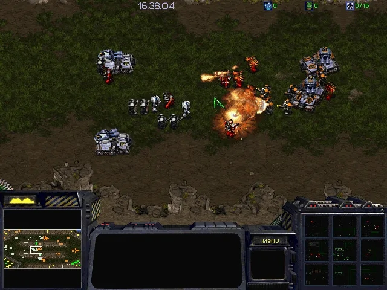
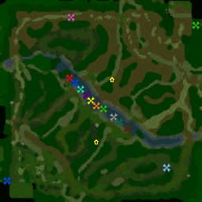
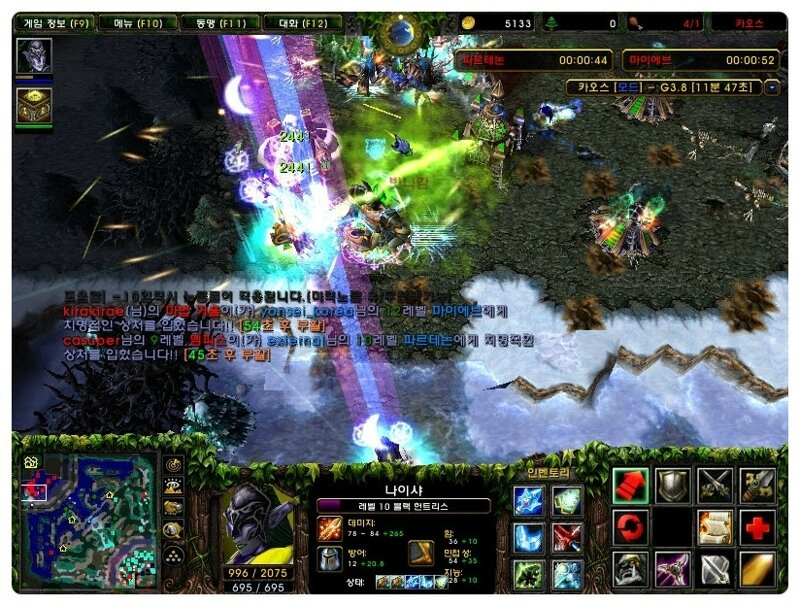
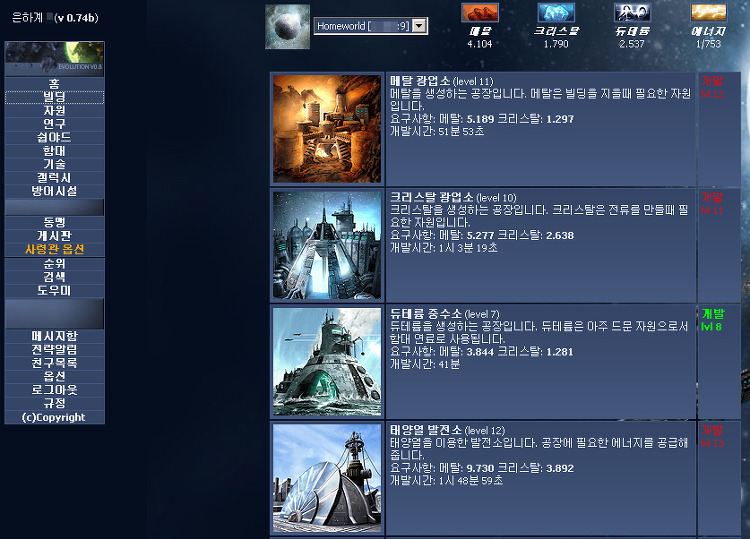
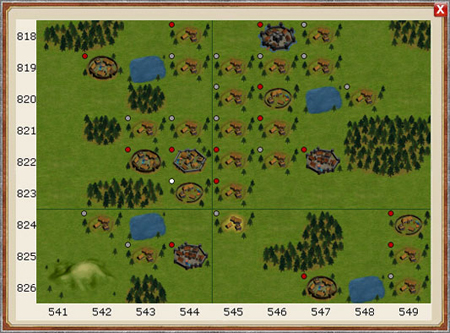
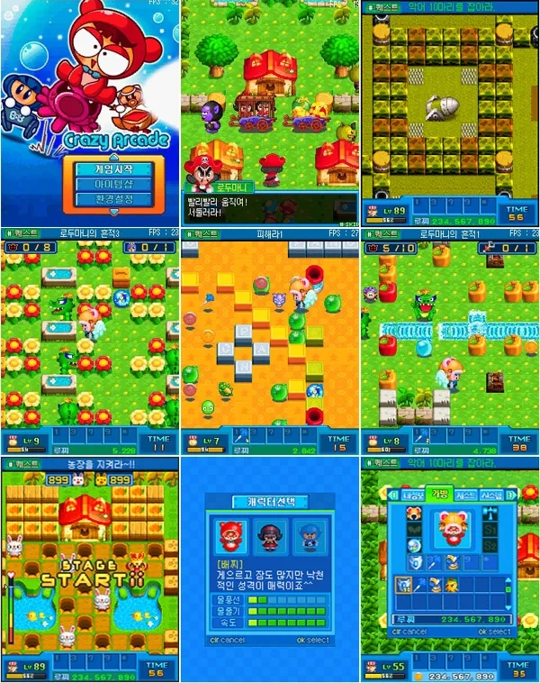
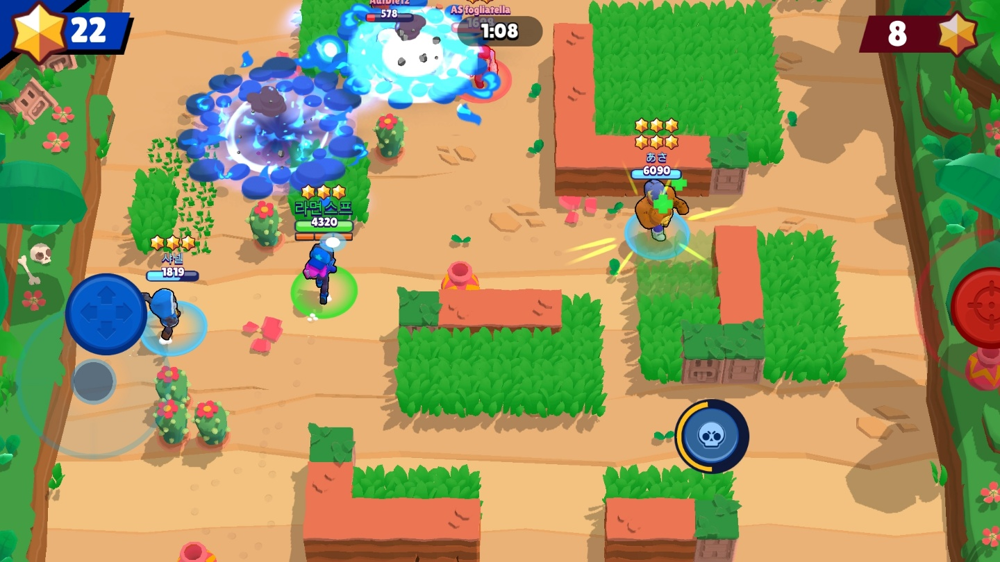
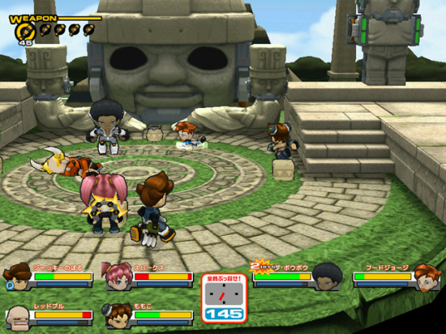

# 내가 재밌는 경험을 많이 해야 하는 이유
**Date:** 17시간 전
**Category:** 다이어리
**Original URL:** https://blog.naver.com/xpfkwh56/224262030760
---

**1. 롤은 왜 5:5 로 게임을 할까?**

​

​

Aos 게임의 기원은,

스타크래프트 유즈맵

​

Aeon of Strife 가 시작임

​

스타크래프트 자체가 최대

8명이 동시에 할 수 있는데,

​

P7, P8 은 컴퓨터 진영이고,

​

P123 vs P456 으로 나눠서

싸우게 하니까 3:3이 되었음

​

​

스타크래프트에서 태동된 AOS 장르가

장르를 뛰어넘어 워크래프트로 갔고,

​

도타 라는 유즈맵이 탄생하게 됨

​

스타크래프트 유즈맵을 깎았을 때,

실용적인 현실 한계가 3:3 이던 것처럼

​

워크 유즈맵은 5:5 플레이가 한계였고,

그렇게 나온 이 인원 숫자가 표준이 됨

​

**\* 스타 8 플레이 = 3:3 +2**

**워크 12 플레이 = 5:5 +2**

​

​

그리고 도타를 따라한

카오스가 나왔고,

​

마침내 롤이 나와서

게임 체인저가 됨

​

하늘에서 뚝딱, 롤 이라고 나왔으면

**'아마'** 지금처럼 흥하진 않았을 것임

​

기존에 뭔가 재밌게 느꼈던 애들이 있고

​

1명의 팬이 있던 게임이

2명, 3명 차차 늘려나가면서

대중성을 확장하는 식으로 큼

​

2. 최근에 SLG 장르가 흥하고 있음

​

그 악명 높은 리니지 보다

수익성이 높을 정도인데,

​

그 앞단에는,

​

​

오게임 이나,

​

​

부족전쟁 같은 게임이 있음

​

​

얼음땡 이라는 놀이가, 컴퓨터 시대에

크레이지 아케이드로 바뀐 것에 불과하듯,

​

**'그 시절'** 에 놀던 어른들의 놀이를

​

**'요즘 시절'** 의 어린이들이나 어른들에게

로컬라이징 시킨 것이 전부 라는 것임

​

부족전쟁 같은 SLG 게임 대흥기가,

10년 전후 무렵이라는 점을 감안하면

​

당시 10대 였던 사람들이 잊고 살다가

10-20년 뒤에 경제적 여유가 생겼을 때

​

소비 수요로 전환되었음을

쉬이 유추해볼 수 있는데,

​

같은 논리로 바라본다면 지금부터,

20년 30년 지난 뒤에는

​

**\* 2040-50년**

**​**

또는 그보다 더 이른 시점에서

​

마크, 로블록스 에서 새로 파생된

뭔가가 나올 것임을 예측해볼 수 있음

​

​

브롤이나 겟앰이나 적어도

​

​

내 눈에는 그게 그거처럼 보임

**​**

3. 싸이월드 를 **'재밌게'** 해봤던 사람이면

페이스북도 당연히 재밌었을 것이고,

​

인스타그램 문화로 이어지는 SNS 를

자연스럽게 적응했을 가능성이 아주 큼

​

때문에,

​

금융 교육, 창업 교육이라고 해서

대단하게 뭔가 시켜볼 것이 아니고

​

본인이 재밌는 경험 많이 해보고,

즐거운 경험을 많이 축적해서

​

**'이거 좋던데? 이거 재밌던데?'**

​

라고 기억할 수 있는 단서와 재료를

최대한 많이 주는 것이 좋을 것 같음

​

맛있는 것 많이 먹어본 애가

요리를 잘 할 가능성이 크고,

​

예쁘고 좋은 것 많이 본 애가

디자인을 잘 할 확률이 높은데

​

그 당연한 것을 우린 가끔 까먹음