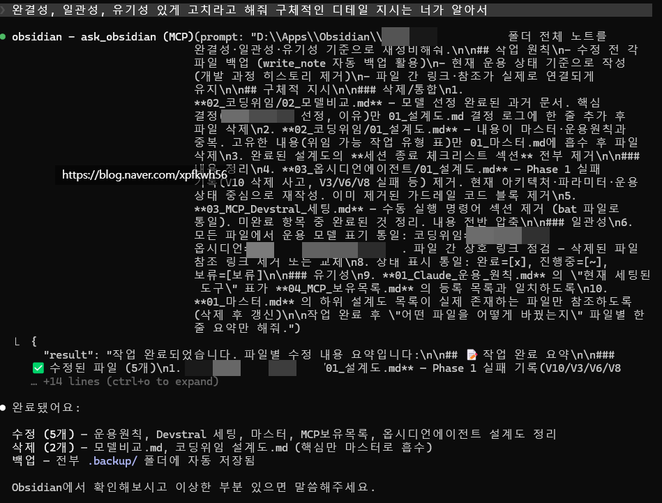
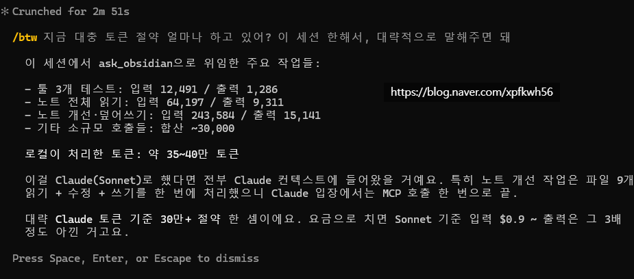
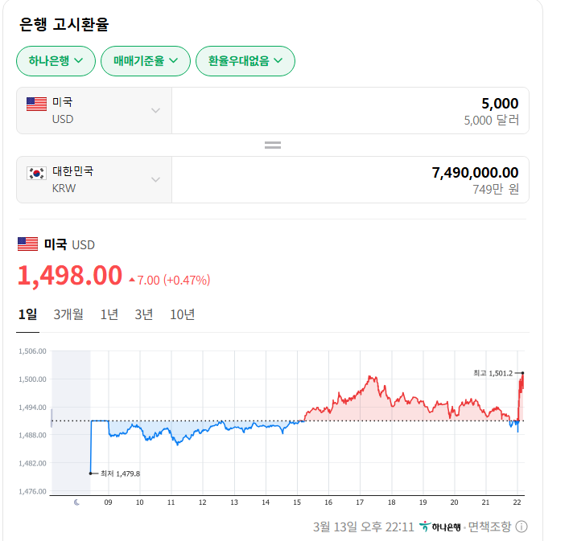

# 로컬이 왜 정답인가?
**Date:** 17시간 전
**Category:** 다이어리
**Original URL:** https://blog.naver.com/xpfkwh56/224215895037
---

​

1. 개떡같이 지시해도,

찰떡같이 알아듣기

​

프롬프트 디벨롭은 덤이고,

​

​

**2. 토큰 절약**

**​**

소넷 API 기준, 그냥 3달러 나간다 치고

하루에 50회 세션 호출 한다고 가정하면?

​

​

**3.3 \* 50 \* 30 = 5000 달러**

​

100회 호출이면 1만 달러고,

1000회 호출이면 10만 달러

​

**\* 빅테크도 돈으로 해결이 안 되는데,**

**일반인이 돈으로 해결할 궁리를 하면 X**

**​**

현실적으로 보조모델 달아서 API 쓰면

아무리 많이 써야 월 300 정도가 한계인데,

​

로컬로 굴리면 전기세만 내도 그게 가능함

​

이거도 지금 그냥 클로드 써서 그렇지,

​

**\* 월 구독 모델이 일반 api 모델보다**

**최소 20배에서 30배 가량 더 싸니까**

​

파인튜닝 입힌 최적화 모델로 굴리면

외부 조력 하나도 없이 돌릴 수도 있구

​

같은 돈을 쓴다고 해도, 월 5만원? 내외에

300b, 700b 모델 마음껏 써볼 수 있음