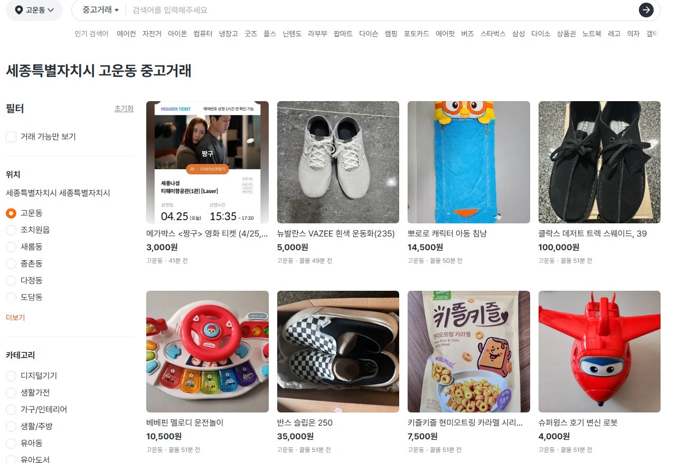
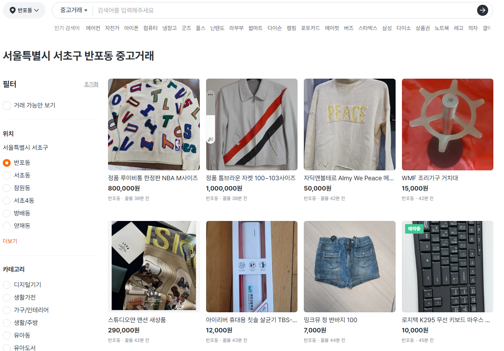
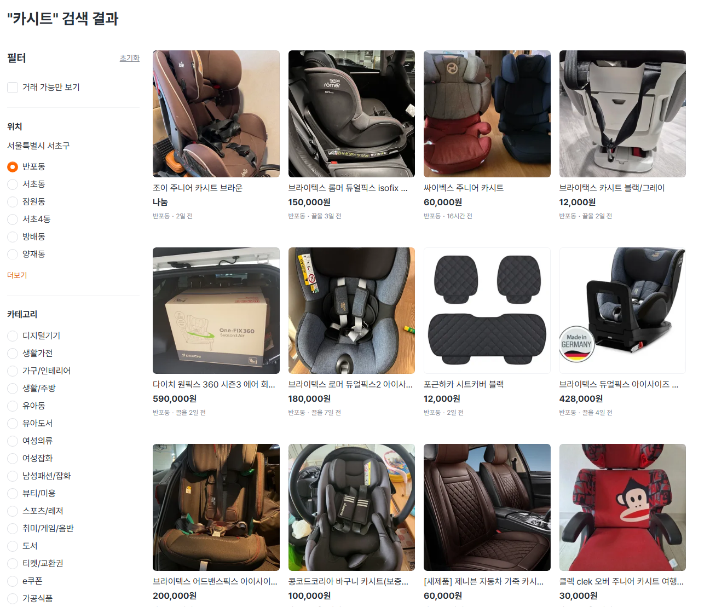

# 잉공지능 강의에 대한 생각 외
**Date:** 17시간 전
**Category:** 다이어리
**Original URL:** https://blog.naver.com/xpfkwh56/224264452583
---

1. 진짜 난 도저히 여력이 안 된다

​

유튜브에 보면, 어떻게 사용하라고

있는 강의들이 있지만 너무 정보가

산발적이라 찾기도 어렵고 복잡하다

​

누군가 발이라도 띠게 해주길 원한다

라면, 프론티어 모델 사용법에 한해서

​

도움 받는다는 느낌으로 저렴하게

듣는 것은 조심스럽게는 가능할 듯함

​

2. 실제로 즈이 시어머니 같은 경우,

​

며느리가 알려드린다고 하긴 했는데

문화센터에서 **GPT 사용하는 법** 하면서

​

실버 세대, 스마트폰 사용법 배우기

컴맹, 키보드/마우스 움직이기 같은

느낌으로 배우고 오신 적도 있었음

**​**

**\* 원데이 클라스 느낌으로 3만원**

​

커리큘럼은 구글 계정 만든 다음에,

앱 깔고 인터넷 들어가서 GPT 에다가

내가 궁금한 것 있으면 타자 쳐서

물어보고 아주 간단하게 설정 바꾸기

​

그리고 좀 유용한 템플릿 같은 것,

**​**

**\* ~한 것이 궁금한데,**

**~를 통해서 찾아봐줘 같은**

​

을 리스트로 만들어서 주는 것들임

​

3. 아마? 중장년 세대에서 이런 강의를

수강하게 되는 이유는 인터넷/컴퓨터 가

애초에 별로 익숙한 도구/수단이 아니고,

​

하나하나 물어보기도 약간 입장이

애매할 수 있는 요소도 있다 보니까,

​

밖에서 배우는 것이 낫다고

생각할 수도 있는 것 같긴 했음

​

지금 2030 기준으로 안드로이드에서

어플 다운 받는 법을 누가 밖에서

돈 주고 배운다고 하면 **그걸 왜?**싶지만,

​

곰곰2 입장을 바꿔 생각하면

뭐 그럴 수도 있겠다 싶기도 함

​

애초에 목표가, **'능숙하게 잘 쓴다'**

라기보다는 일단 뭐가 새로 나왔다는데

**'써보기라도 하자'** 에 가깝기도 하니까

​

**\* 중장년 대상으로는 키오스크 사용법**

**같은 것도 구청, 문센에서 알려주기도 함**

**​**

4. 2030 은 저건 들으라고 해도,

아마 안 들을 가능성이 높다고 보고

크게 두 갈래로 나눠서 볼 순 있을 듯

​

1) 프론티어 모델 **'고급'** 사용법

​

제미나이로 치면, 딥리서치 사용법

클로드로 치면, 웹클로드 세팅 방법

​

지피티로 치면 API 연동 방법 같은 것은

사실 찾으면 못 찾을 정도 지식은 아닌데,

​

이게 약간 **컴퓨터 조립** 같은 느낌이라서

알면 아무 것도 아니지만 모르는 상태에선

​

검은 것은 글자요, 흰 것은 종이로다

같이 느껴질 가능성도 있긴 있는 듯함

​

세팅까지 감안하면 발 띠게 해주는 값이

10만원 언더라면 내봄직하지 않을까?

​

**\* 프론티어 세팅이 사실 그리**

**거창한 작업은 아니긴 하지만**

**답답한 입장에선 캄캄할 것 같기도**

​

라는 생각도 그래서 들긴 하는 것 같음

​

보통 업계 돌아가는 것을 보니까,

​

레퍼럴 연동해서 유명 도메인 모델을

써본 경험을 공유하는 시장이 있는 듯한데,

​

그거 한다고 **'대단히'** 뭔가 나오진 않지만,

​

**\* gpt image 2.0 정도 제외하면,**

**모델 하나만 갖고 의미 있을 정도로**

**결과물이 걍 바로 나오는 것은 없음**

**​**

**기대치를 내리고 봤을 때는**, 사실 그거도

꽤 귀찮은 영역들이 있는 것은 맞는 말이라

**너무 비싸지만 않으면** 들어볼 순 있을 듯함

​

**\* 일단 최소한으로 쓰는 법 익히고,**

**그 다음은 본인이 해야 될 문제로 감**

**​**

프론티어 모델 사용법 알려주면서,

​

최첨단 인공지능 기술을 습득해서

어쩌고 하면 사기꾼이니 걍 거르시고

​

유튜브 볼 시간도 없고, 봐도 복잡해서

눈에 잘 안 들어오면 해볼 순 있을 것 같음

**​**

**2) 로컬 구동 및 세팅 방법**

​

굳이 돈을 내고 들어야 된다면 제 생각엔

이거는 **만약 누가 해준다는** 사람이 있으면

​

유즈 케이스 컨설팅 → 실사용 세팅

→ 트러블 슈팅 올인원 까지 준다고 칠 때,

​

**'30'** 정도까지는 내도 아깝진 않다고 생각

​

그 이상은 추천하기 몹시 어려운 이유는

돈을 더 낸다고 해봤자, **'바뀌기'** 때문

​

계속 장기적으로 내 세팅을 도와준다?

그건 **있을 수가 없는 일이라고** 보시면 됨

​

**왜 why?**

​

그냥 LLM 한정 이라고 가정했을 때

​

벌써 서빙 모델만 해도 10개는 넘고,

양자화 종류도 20개는 가뿐히 넘고,

​

가상환경 구축에 패키지 충돌하는 것,

CUDA, 파이토치, 파이썬 세팅만 해도

​

무조건 **'하루는'** 꼬박 박아야 된단 말임

​

**\* 휠 없어? 그럼 직접 빌드 해야 됨**

**​**

암드, 엔비디아, 애플 셋만 해도

한 영역만 아는 사람은 다른 영역을

그냥 **'아예'** 모르는 것이 정상인데

​

**\* 한국어, 중국어, 일본어 만큼 다름**

​

최소 30개는 그냥 넘는 매개변수 들을

​

다 매칭 시켜서 유의미한 형태로

작업물이 나올 때까지 파이프 라인을

설계 해준다고 생각하면 답도 안 나옴

​

이 대표적인 장르가 ComfyUI 인데,

​

노드로 파이프라인 구성하는 원리를

알려주는 사람은 **저는 일단** 본 적 없고,

​

**\* 엔지니어링 영역**

**​**

열에 아홉 정도는 워크플로우 만들어서

간단하게 수정해서 할 수 있게 해서

구독제로 파시는 분들만 있는 편인데,

​

그게 그럴 수 밖에 없는 점이

오늘 돌아가도 길어야 한 달 있으면

다시 처음부터 새로 쌓아야 되서 그럼

​

<https://youtu.be/NP91sTGdRpU?si=sdkVH0W3wICNOG_X>

​

나 사진관 안 가고, 아기 사진 있으면

내 마음대로 집에서 혼자 try-on 써서

옷 갈아입히기 하고 싶습니다 라던가,

​

**\* 아기 사진은 검열 걸려서 잘 안 해줌**

**​**

<https://youtu.be/ZMjOnw4pF0s?si=nI3AMNwa7oH0Opuh>

​

우리 애가 엘사를 좋아하는데,

​

애기랑 찍은 사진 옆에다가

엘사를 계속 넣어주고 싶습니다

​

같은 작업은, 부지런히 구글링하고

유튜브 찾아서 찾으면 혼자서도

할 수 있긴 있는데 번거롭긴 함

​

**\* 애들 사진 왕창 많이 찍어두시고,**

**다 LORA 로 만들어두면 꽤 좋음**

**​**

**저는 부모님 사진도 많이 찍어다가**

**다 LORA 모델로 만들어 놓은 상태**

**데이터셋 전처리 분류도 다 끝냈고**

**​**

다만 이거도 단일 워크플로우 하나로

딱 그 케이스만 하는 값으로 치면,

​

강습료 내봤자 **차라리** 그 금액으로

프론티어 모델 돌려보는 것이 낫고,

​

로칼 ai 사용 컨설팅 + 세팅 포함해서

내가 발 떼는 금액이라면 정당화 될 듯

​

5. 파인튜닝 같은 경우도, 옛날에는

정-말 굉장한 고급 기술이었는데

​

26년 4월 기준으론 기술이 좋아져서

경량 모델에 경량 데이터 씌우는 정도는

​

조금 본인이 찾아봐도 할 수 있을 정도고,

qwen 3.5 9b 정도 모델만 갖고 있어두

​

**\* 모델이 크면 클수록, 학습이 어려움**

​

<https://data.seoul.go.kr/dataVisual/seoul/guide.do>

[data.seoul.go.kr](https://data.seoul.go.kr/dataVisual/seoul/guide.do)

​

서울 열린데이터 광장에 있는 자료들로

데이터셋 칼리브레이션 을 하든,

​

그 외 뭐든 학습을 시켜가지고

부동산 의사결정 에 쓸 수 있음요

​

<https://www.daangn.com/kr/>

[**당신 근처의 당근**

중고 거래부터 동네 정보까지, 이웃과 함께해요. 가깝고 따뜻한 당신의 근처를 만들어요.

www.daangn.com](https://www.daangn.com/kr/)

​

6. 이건 제 생각에 아마?

조만간 막힐 것 같은데,

​

트릭 안 쓰고, 정공법 썼을 때

당근 웹 사이트 들어가면

​

특정 지역 거래 정보를

가져오는 것이 가능한데요

​

​

육아용품 같은 것 바로 사지 마시고,

​

**'애 키우기 좋은 동네'** 라고 사람들이

흔히 생각하는 그런 동네들 있잖음?

​

거기 들어가서 **중고로** 나온 매물들 보면,

​

​

그 동네 사는 아지매들이 저 물건을

**'샀었던 적이 있다'** 라는 간접 정보를

구할 수도 있는데 그거 바탕으로,

​

아, 저 동네 여자들은 저런 것을 사서

저렇게 파는구나 하고 역추적 가능함

**​**

**\* 세종, 동탄, 강남/강동권 같은 경우로**

**실데이터 구해서 표본 만들고 처리하는**

​

맘카페에서 인기 1위,

네이버에서 시장점유율 1위,

​

이렇게 단일 키워드로 찾는 것 말고도,

다른 방법으로 접근할 수 있는 것임

​

유즈 케이스라고 해서, 막 너무

거창하고 어렵게 생각할 것 없이

​

**'아, 나는 이게 지금 불편해'**

​

라는 것에서 시작하면 또 막상

그렇게 막막하지도 않읍니다

​

일전에 말했던 것처럼,

​

**'교육'** 파트는 적어도 제 경험상

거의 90% 이상은 대체되니까

​

전업 엄마면 시간 있을 때, 틈틈히

LLM 갖고 놀아보는 것 쯤은 권장함