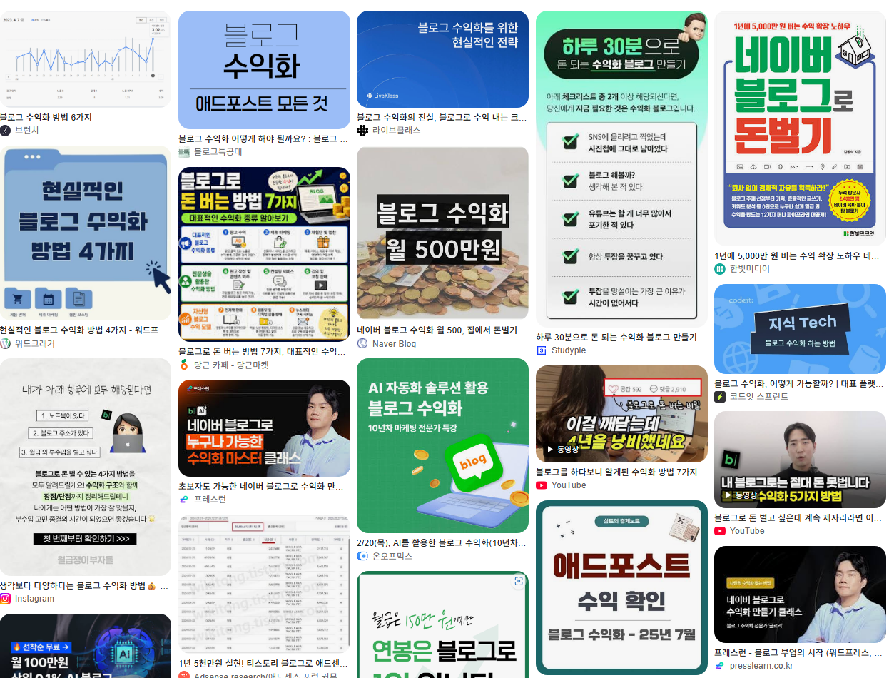

# 전자책 없이 네이버 블로그 수익화 개념 잡기
**Date:** 17시간 전
**Category:** 일기장
**Original URL:** https://blog.naver.com/xpfkwh56/224393283422
---

​

**1. 네이버 블로그 수익화가 뭐임?**

​

인간의 뇌는 기본적으로 게으르고,

​

우리는 우리 스스로가 생각하는 것보다

훨씬 비합리적이며 감정적인 존재 임

​

자기 자신이 얼마나 우둔하고, 어리석은지는

투자나, 사업 같은 것을 해보면 알 수 있는데

​

누구나 한 번 정도는 겪어봤을 법한,

나 자신의 **'비합리'** 를 떠올려보면 됨

​

독립시행 이라는 개념이 있음

​

먼저 일어난 사건이 뒤에 있는 사건과

전혀 인과성이 없다는 것을 의미 하는데,

​

수포자든, 수잘알이든 100만원 걸고

사다리 타기 5판만 시키면 **패턴** 을 읽음

​

주식 아무 것도 모르는 사람도

누가 시키지도 않았지만 차트만 보면,

​

여기서 사서, 저기에 팔면 되겠네?

라는 것을 직관적으로 알 수 있음

​

이게 인간이 갖고 있는 **'본능'** 임

​

시장에 머무르는 공급자들은 기본적으로

사람이 갖고 있는 이런 특성을 **활용** 하곤 함

​

누군가에게 개인 SNS 는 **일기장** 이지만,

다른 누군가에게는 하나의 **'광고판'**임

​

내가 어떤 상품이나 서비스를

판촉 해야 되는 상황이 있다 치겠음

​

이걸 잘 팔아 먹으려면 어찌 해야 좋을까?

​

답은, 내가 손님을 찾으러 다니는 것이 아니고

손님이 알아서 내게 도움을 요청하는 그림 임

​

이런 일이 가능하려면 결국 수요자 가

내 테이블 앞에 **앉아있어 줘야만** 하고,

​

나를 알거나, 관심이 있거나,

어떤 접점을 갖고 접촉해야만 함

​

조회수, 방문자수 같은 것을

**트래픽** 이라고 함

​

플랫폼 사업자들은 개별적인 유저들이

갖고 있는 콘텐츠 를 바탕으로

​

그 광고판을 하나로 **모아서**,

사람들에게 붙여주고

​

중개해서 수익을 얻는 집단인 것임

​

블로그는 불특정 다수, 또는 특정한

관심사를 갖고 있는 사람들을 대상으로

자신의 존재를 보여줄 수 있는 공간 임

​

누군가 살면서 도움을 필요로 할 때,

​

주변에 있는 가까운 사람에게

손쉽게 정보를 얻고, 자신이 겪는

문제를 위탁했던 접근 방법 들이

​

이제 **'온라인'** 세상에서 일어나고 있고,

​

그렇게 트래픽을 돈으로 바꾸는 작업을

**블로그 수익화, SNS 수익화** 라고 함

​

2. 그래서, 그거를 하면 돈이 되긴 됨?

​

**먼저 얼마나 낙관적이게 보냐에 따라 다름**

​

기본적으로 살면서 돈을 팔려면

남이 가진 돈과 자신이 갖고 있는

​

**그게 무엇이든, 바꿀 것이 있어야 됨**

​

즉, 돈을 얼마나 벌 수 있습니까? 라는 질문은

​

들어오는 **'트래픽 1'** 의 경제적 가치가

얼마입니까? 라는 질문과 똑같은 것 임

​

내가 다계정도 돌려보고, 손품도 팔아보니까

다음과 같은 방식의 구분이 선명한 것 같았음

​

**1) 네이버를 경유해서 얻는 트래픽**

**​**

채널의 테마나, 소재 성격에 따라서

광고 단가가 다르다는 것은 익히 알려짐

​

그런데 한 발 더 나아가면,

​

검색해서 들어오는 트래픽의 가치와

메인에 올라가서 들어오는 가치가 다름

​

검색 블로그는 적으면 .4 많은 경우는

1.7 정도 까지 **통상적으로** 단가 나오고,

​

**\* 제일 쉽게는 조회수 1당, 1원**

**부정확하지만 바로미터로 쓰기 좋음**

​

홈판형 이라고 부르는 메인의 경우에는,

**3 에서 심하면 7, 그 이상** 까지도 나옴

​

트래픽 전환 가치가 높다는 것은,

더 적은 조회수로 더 큰 돈을 번단 뜻이고

​

더 효율적으로 돈을 번다는 말과 같음

​

순수 검색형 블로그로 월

300만 조회수 정도가 나오면,

​

**적으면 100만원, 많으면 500 정도 범**

​

근데 홈판으로 조회수

15만 정도 찍히면,

​

**적어도 20만 이상 많으면**

**100만원 가깝게 벌 수 있음**

​

2) 네이버를 경유하지 않는 트래픽

​

앞서 말한 조건은, 네이버에서 규정한

가격에 맞게 내 트래픽을 **'파는'** 행위고,

​

이 경우는 내가 내 트래픽을 **'쓰는'** 것 임

​

사람 5명이 들어왔는데, 거기에 대고,

내가 전자책을 팔든 무엇을 팔든 간에

​

1명 에게라도 고객을 발굴해서

10만원 벌었으면 내 수익은 10만 임

​

아주 효과적인 접근이지만, 이런 경우는

플랫폼이 별로 **'선호하지 않는'** 형태고,

​

개인 사업자에 가까운 접근이기 때문에

흔히 생각하는 그림과는 거리가 있음

​

**3. 그럼 어떻게 해야 됩니까?**

​

먼저 플랫폼에 대한 **이해** 가 필요함

​

네이버 에서 개인 콘텐츠 크리에이터를

노출해줄 수 있는 페이지가 여럿 있음

​

일단 **블로그** 라고 한정을 한다면,

크게 **검색** 과 **메인** 으로 구분할 수 있음

​

1) 검색

​

블로거 입장에서 제일 좋은 것은,

​

검색엔진에 치면 내 글이 최상단에 나와

사람들이 쉽게 접근할 수 있는 형태 임

​

하지만 **'일반'** 블로거가 이렇게 한다는 것은

구조적으로 아예 불가능한 일 임

​

그 이유는 다음과 같음

​

블로그 노출에는 두 지표가 필요함

​

하나는 **권위, 신뢰 지표** 고,

하나는 **만족 지표** 임

​

부르는 명칭만 다를 뿐,

​

모든 검색 엔진은 이런

**'교과서적인 원리'** 를 따름

​

네이버가 구글을 따라하는 것이 아니고,

세계 최고 1위 구글이 **'교과서'** 를 만들고,

​

그걸 분석해서 IR 이론이 된 다음에,

전 세계에 뻗어나가는 그림 이라서

​

개별 플랫폼에 대한 이해를 얻기 위해선

**Information Retrieval** 이란 장르를

찾아서 정보를 얻으면 아주 경제적 임

**​**

**동사무소 위치를 찾는 사람이 있다고 침**

​

그걸 가장 정확히 말해줄 **'확률'** 이

높은 사람은 동사무소 당사자 임

​

그래서, 공식적이거나 1차 지표를

갖고 있는 것을 상위 노출에 먼저 띄움

​

이런 것이 **권위 지표** 임

​

**\* C-Rank 개념과 Directory**

**Authority는 근본부터가 다름**

​

플랫폼은 유저를 보증할 수 없기 때문에,

여러가지 방식을 통해서 신뢰를 확보 함

​

네이버의 경우에는, 네이버 메이트,

피드 메이커, 인플루언서 등과 같은

​

일종의 **'자사 공무원 시스템'** 을 쓰는데,

여기에 속한 사람들**'만'** 블로거인 것 임

​

**그게 무슨 말임?**

​

롤 이라는 게임은 패치를 할 때,

극상위 랭커들을 대상으로 업뎃함

​

프로게이머들이 하는 것이 **'메타'** 가 되고,

그걸 **'배경'** 으로 게임의 규칙을 정하는 것

​

나라에서도 교육정책을 도입함에 있어서,

어중이떠중이 다 데려가는 정책을 쓸 건지

​

아니면 최고 엘리트만 육성할 건지,

같은 경향에 따라 룰이 다른 것처럼

​

네이버는 기본적으로 인플루언서 기반의

유저가 아니면 **'노출 기회'** 를 잘 안 줌

​

그래서 본인이 글을 얼마나 잘 썼고,

말고를 떠나서 **'노출 위치'** 가 결정 됨

​

하물며, 인플루언서 시스템이 **길어지면서**

정말 여간한 키워드는 다 **선점된 상태** 라,

​

**상위 노출에 대한 원리와 구조**,

​

방식을 이해하기 위해서는 아무리

짧아도 최소 3개월 심하면 몇 년씩

​

시간을 투자해도 그 존재 자체를

알 수 없는 것이 네이버의 지금 현실 임

​

**2) 메인**

​

금년에 네이버 메이트 들어오면서,

검색형 블로그를 아예 **'죽여버렸음'**

​

> **대신에 어떻게 하고 있냐?**

​

**그 사람들을 메인에 띄워주고 있음**

​

이걸 더 구체적으로 풀어보겠음,

​

AI 가 검색엔진 차원에 있어서

텍스트와 정보를 인식할 때,

​

사용하는 세 가지 개념이 있음

​

SEO, GEO, AEO 임

​

SEO 는 검색 노출 최적화,

GEO 는 생성형 엔진 최적화,

AEO 는 답변 엔진 최적화 임

​

SEO 는 이용자가 검색을 했을 때,

어떤 정보를 먼저 **노출** 시키고,

​

어떤 정보를 누락 시키느냐 를 가름

​

GEO 는 AI 가 정보를 **'인용'** 할 때,

어떤 원리로 근거 삼을 것인지의 규칙임

​

AEO 는 AI 가 질문에 **'답변'** 을 할 때,

어떻게 해야 잘 할 수 있냐의 규칙 임

​

사람들이 정보를 찾기 위해서

쓰는 검색어를 **'쿼리'** 라고 부름

​

검색엔진은 구조적으로 세상에 있는

존재하는 모든 쿼리를 통제할 수 없음

​

이자, 이율, 금리, 3개의 어휘는

​

비슷한 의미를 갖고 있는데

**'표현값'** 이 전부 다르잖음?

​

접미사, 접두사가 어떻게 붙느냐,

언어적으로 어떤 형태소가 합쳐지냐,

​

같은 것들이 섞이면 고려해야 되는

경우의 수가 너무 많아지고

​

결과적으로 **'검색자가 원하는 정보를**

**의도에 맞게 정렬해서 노출 시킨다'** 라는

문제를 SEO 로는 풀 수 없다는 것 임

​

26년 8월 28일 기준으로,

​

리아2 라는 사람이 자기 블로그에

블로그 수익화 에 대한 글을 썼다

​

라는 정보는,

​

AI 가 **학습할 수 없는** 정보고,

​

**'생성된 정보'** 가 사람들이 실제로

찾는 것인지를 알 수가 없으니까

​

앞서, **권위 지표가 높은** 사람들을

상위 노출에 띄웠던 것과 마찬가지로,

​

**'사용자의 관심사'** 에 정렬된 블로그를

**'지금'** 여러번 띄워보면서 테스트 하는 것이

​

네이버가 하고 있는 일이라고 할 수 있음

​

그렇게 해서, 특정 블로그들의 **'관련값'** 이

**'이용자 관심사, 선호도'** 와 일치하면 할수록

​

이 데이터를 바탕으로, ​**'재정렬'**할 것이고

​

이게 지금 네이버 해봐라, 라고

사람들이 떠들고 있는 이유 임

​

**\* 각 활성 블로그마다 관심사, 선호도가**

**데이터 바탕으로 새겨지면 또 고여지니까**

​

4. 한계

​

읽으면서 느낌이 오셨을 수도 있는데,

​

이렇게 되면 블로그 1개만 운영해서는

제대로 수익을 얻는 것이 **'거의'** 불가함

​

**왜 why?**

​

물 에 관심이 있는 사람과

h2o 에 관심이 있는 사람은

​

아예 다른 사람 임

​

또 물에 관심이 있다고 해도,

​

수영에 관심이 있는지,

마시는 일에 관심이 있는지,

​

건강에 관심이 있는지 다른데,

**​**

**단일 블로그에서 커버리지를**

**전부 다 덮을 수가 없음**

​

즉,

​

네이버 를 빌려서 돈을 벌고 싶으면

그게 특히, **'콘텐츠'** 바탕 이라면

​

**쉬지 않고, 지속적으로 오랫동안**

**우리에게 트래픽을 제공해서**

​

콘텐츠를 매일매일 작성해야 된다,

라는 것이 네이버가 정한 룰이므로

​

**'사용자'** 입장에서는 AI 나 프로그램으로

기계로 **'찍어내듯'** 글을 쏟을 수 밖에 없음

​

**5. 결론**

​

블로그로 돈을 벌고 싶다?

​

1) 고충성 구독층을 대상으로 파는 것이 으뜸

​

2) 커뮤니티 망령처럼 온 종일 컴퓨터 앞에서

콘텐츠 찍어내는 기계가 되는 것이 현실적 최선

​

3) 상위노출을 중심으로 에버그린 콘텐츠를

어떻게든 찾아내서 자산화 시키는 것이 차선

​

셋 밖에 없는데,

​

이 셋 모두 사람들이 흔히

생각하는 그런 형태 는 아님