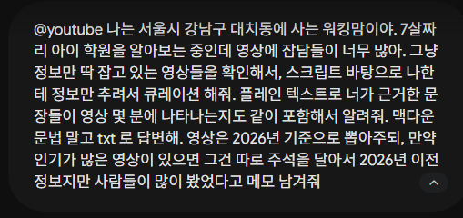
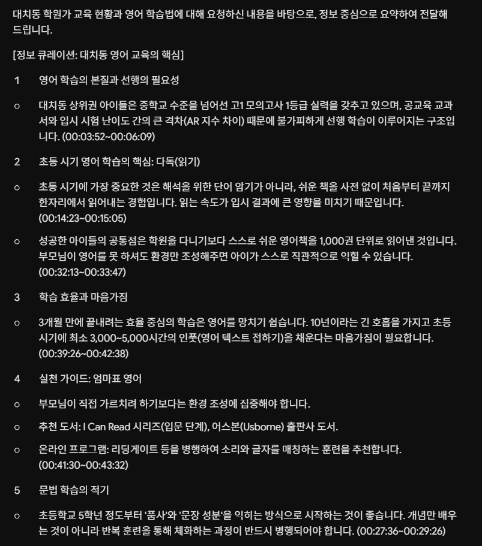
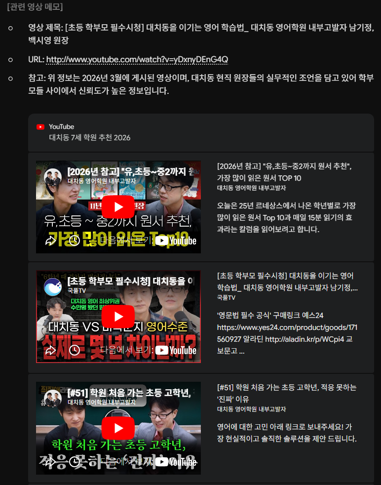
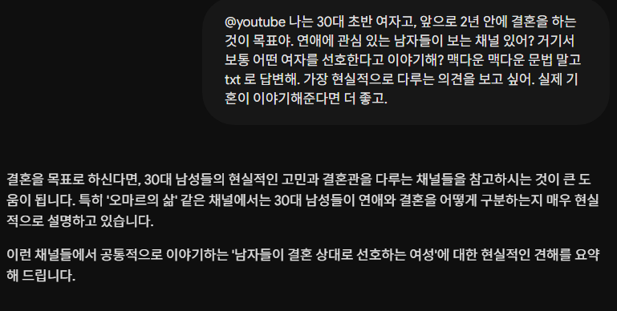
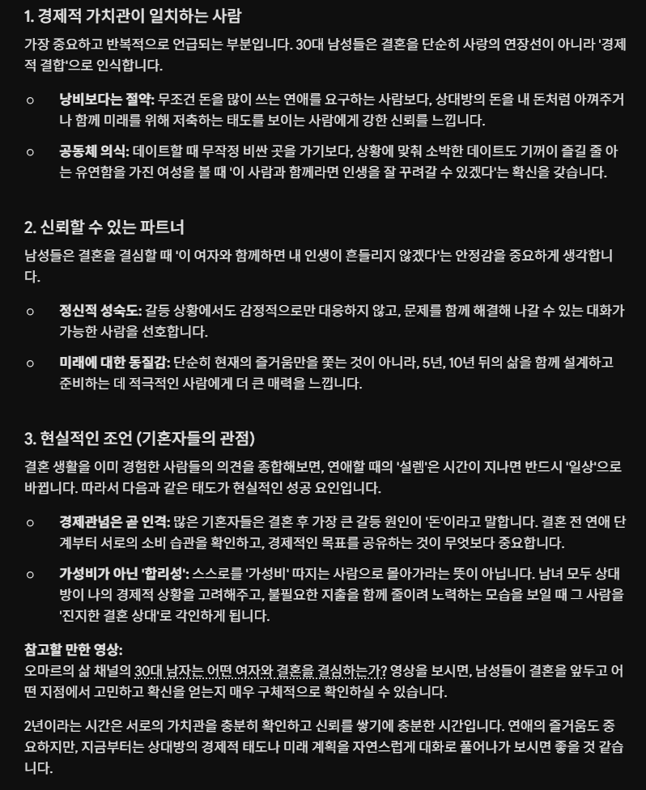
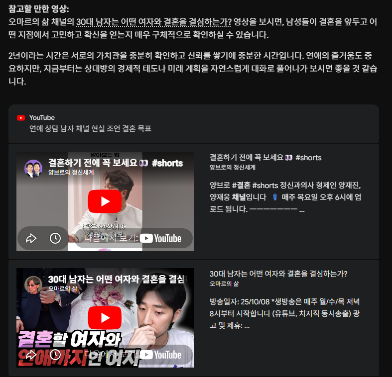
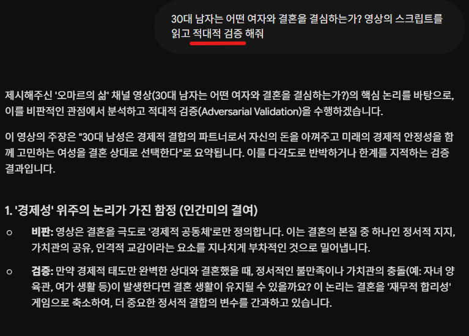
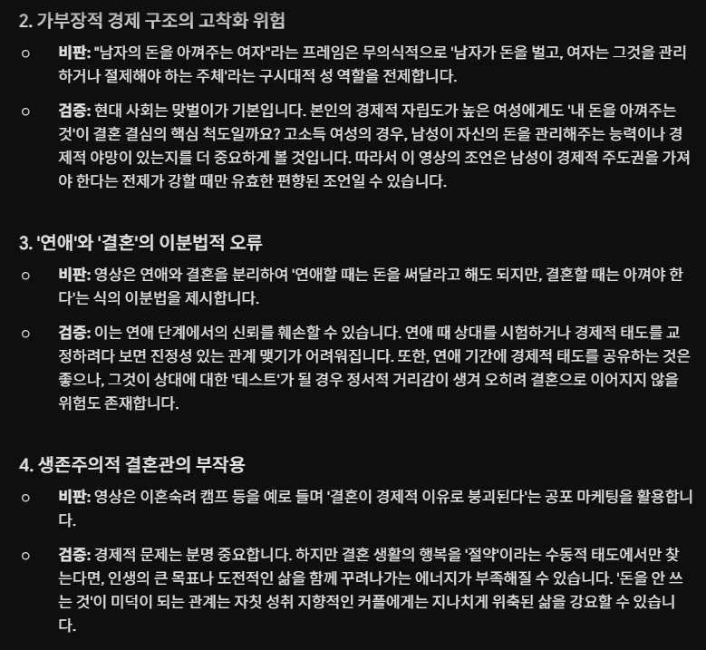
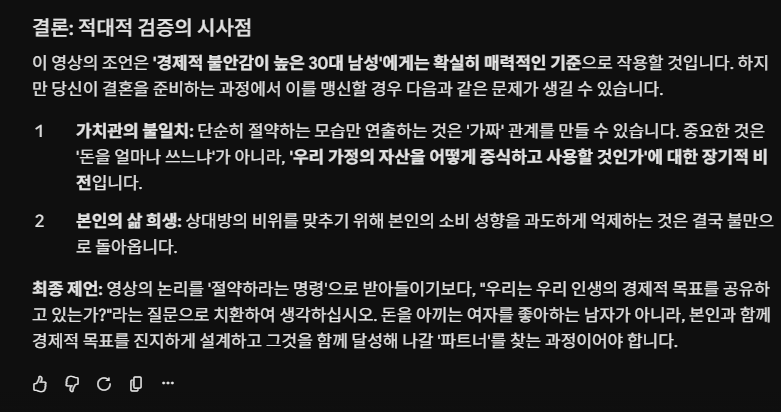

# 제미나이를 유튜브 검색엔진으로 쓰는 예시
**Date:** 17시간 전
**Category:** AI 활용
**Original URL:** https://blog.naver.com/xpfkwh56/224312507978
---

​

**1. 교육**

​

​

맥다운 문법 말고, **'txt'** 로 답변하라고 한 이유

이유는 잘 모르겠는데 타임 스탬프 출력이 안 됨

​

저렇게 하면 그냥 글자로 나옵니다

**​**

**\* 타임스탬프를 한글로 써달라고 요청해도 무관**

**​**

**​**

**2. 결혼**

**​**

​

3. **'적대적 검증'**

​

​

인공지능이 쓰는 언어로

사람 말로 바꾸면

​

**'팩트체크'** 라는

의미와 **유사**합니다

​

현재 주장하고 있는 내용에 대해서

대척점에 서서, 악마의 변호사 처럼

​

하나 하나 반대 의견을 말을 해달라,

라는 의미를 전달하고 싶으면 씁니다

​

**'알고리즘'** 에 뜨는 것과

**'AI 답변'** 에 뜨는 것은

​

딱 보기에도 차이가 커 보이죠?

저 분들이 **'유튜브 공무원'** 입니다

​

4. 낯선 분야는 저렇게 찾으시면 되고,

​

제가 실제 예시로 삼을 수는 없었지만

​

**'내 최근 시청기록을 바탕으로'**

**'내가 최근 본 유튜브 영상을 보고'**

​

같은 문구를 넣으면,

​

그걸 단서 삼아서 답변 받을 수 있음